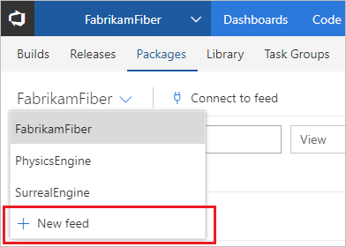

A feed is a container for packages.
You consume and publish packages through a particular feed.

::: moniker range=">= azure-devops-2019"

1. Go to **Azure Artifacts**:

   > [!div class="mx-imgBorder"] 
   >
   > 

2. Select **+ New feed**:

   > [!div class="mx-imgBorder"] 
   >
   > 

3. In the dialog box:

   - Give the feed a name.
   - Choose who can read and contribute (or update) packages in your feed.
   - Choose the upstream sources for your feed.
   - When you're done, select **Create**.

   Most of the default settings work great for most feed users. Making your feed organization visible means you can share a single source of packages across your entire team. Enabling upstream sources to public sources makes it easy to use your favorite OSS packages. Enabling upstream sources can also give you more protection against outages and corrupted or compromised packages.
   > [!NOTE]   
   > There are some important things to consider when publishing packages that involve upstream sources. Check out the documentation on [overriding a package from an upstream source](../concepts/upstream-sources.md#overriding-a-package-from-an-upstream-source) for more information.

   > [!div class="mx-imgBorder"] 
   >
   > 

::: moniker-end

::: moniker range="< azure-devops-2019"

1. Go to the **Packages** page:

    

2. Select **+ New feed**:

    

3. In the dialog box:

   - Give the feed a name.
   - Choose who can read and contribute (or update) packages in your feed.
   - Choose the upstream sources for your feed.
   - When you're done, select **Create**.

   Most of the default settings work great for most feed users. Making your feed organization visible means you can share a single source of packages across your entire team. Enabling upstream sources to public sources makes it easy to use your favorite OSS packages. Enabling upstream sources can also give you more protection against outages and corrupted or compromised packages.
   > [!NOTE]   
   > There are some important things to consider when publishing packages that involve upstream sources. Check out the documentation on [overriding a package from an upstream source](../concepts/upstream-sources.md#overriding-a-package-from-an-upstream-source) for more information.

   

::: moniker-end

You can change these settings later by [editing the feed](../feeds/edit-feed.md).
