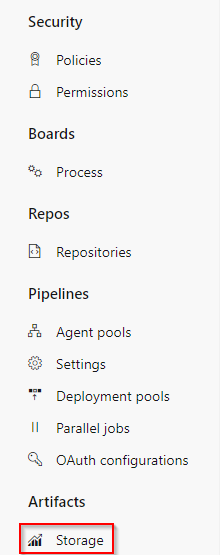

# Artifact storage

[!INCLUDE [temp](../includes/version-tfs-2017-through-vsts.md)]

Azure Artifacts offers a free-tier plan that includes 2 gibibytes (GiB) of free storage for different types of packages. When you reach your maximum storage limit, you can either upgrade to a paid subscription or delete some of your existing artifacts.

On November 1, 2020, Azure Artifacts switched to consumption-based billing for all package types (NuGet, npm, Python, Maven, and Universal packages). Symbol storage is free for now, and billing will be deferred to a later time. For more information on the billing changes, see the [Billing changes](https://devblogs.microsoft.com/devops/azure-artifacts-billing-changes-coming-october-2020/) blog post.

> [!NOTE]
> Organizations created before to May 6, 2019, remained on per-subscription billing until November 1, 2020. At that time, they switched over to per-storage usage billing.

To give you a better view of your storage consumption, Azure Artifacts has introduced a new user interface for artifact storage. You can now view your consumption at both the organization level and the project level. Storage is also grouped by type and/or by projects. We'll develop more levels of granularity in the near future.

## Organization-level storage

The organization-level view shows your total storage summary and your storage consumption by artifact type and by project.

1. From within your organization, select  **Organization settings**.

1. Under **Artifacts**, select **Storage** on the left pane.

    > [!div class="mx-imgBorder"]
    > 

1. View your storage consumption for each section.

    > [!div class="mx-imgBorder"]
    > 

For the current release, you can view the storage breakdown for **Packages** and for projects listed in the **Storage by projects** section. We'll add more levels of granularity in future releases.

The **Packages** storage breakdown lists packages in organization-scoped feeds.

> [!div class="mx-imgBorder"]
> 

> [!NOTE]
> The **Storage by projects** section shows only projects with the largest storage consumption and not the full list of projects in your organization.

## Project-level storage

The project-level view shows your total storage summary and your storage consumption by artifact type.

1. From within your project, select  **Project settings**.

1. Under **Artifacts**, select **Storage** on the left pane.

    > [!div class="mx-imgBorder"]
    > 

1. View your total storage summary and your storage by artifact type.

    > [!div class="mx-imgBorder"]
    > 

The total storage summary shows your total billable stored artifacts. The **Storage by type** section lists your storage consumption by artifact type. For the current release, you can view your storage breakdown for the **Packages** section only. We'll add the other sections in future releases.

## What's next?

- [What are feeds?](concepts/feeds.md)
- [What are feed views?](concepts/views.md)
- [Get started with NuGet packages](get-started-nuget.md)
- [Publish to NuGet feeds (YAML/classic)](../pipelines/artifacts/nuget.md)