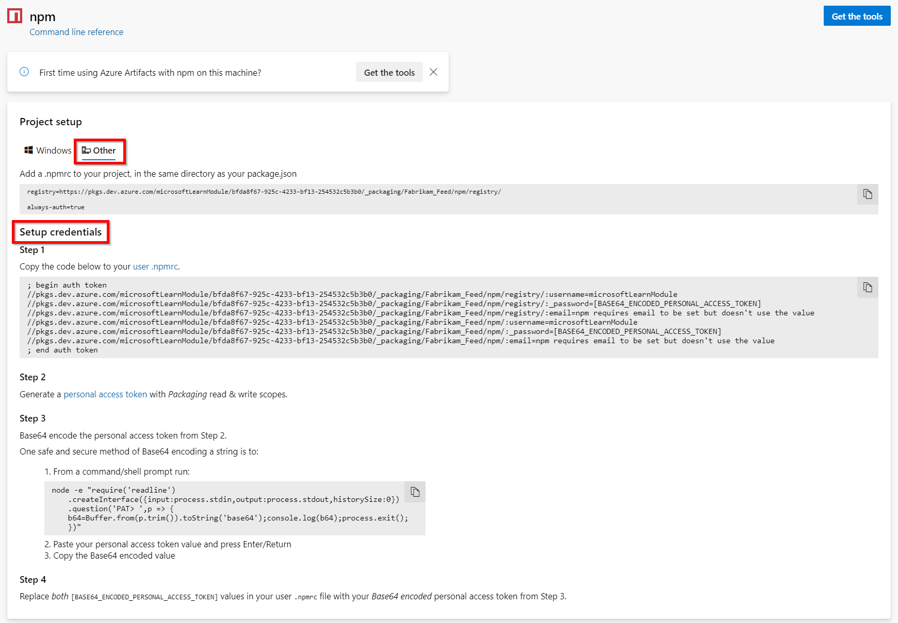
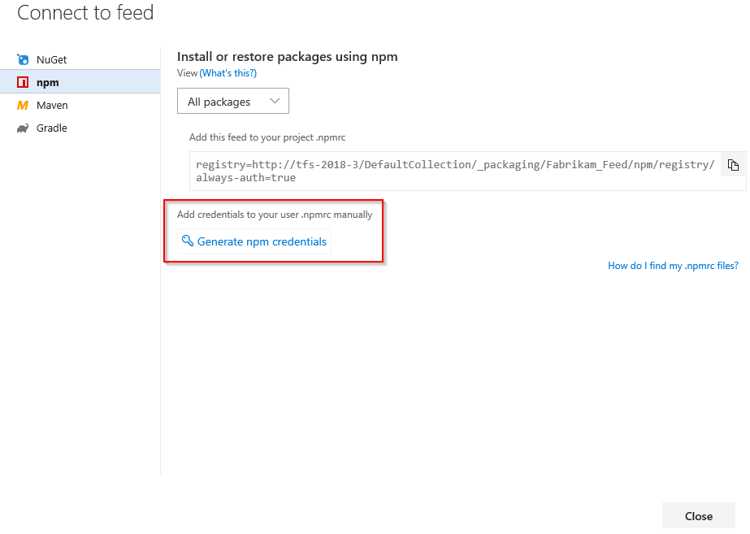

The **Connect to feed** dialog box generates an appropriately formatted token that you can place into your .npmrc file with a lifespan of 90 days.

> [!TIP]
> If you want to create a token that lasts longer than 90 days, skip to the [second method](#tokenpast90).

**90-day token:**

::: moniker range=">= azure-devops-2019"

1. From **Azure Artifacts**, select **Connect to feed**.

2. Select **npm**.

3. Select **Other** in the **Project setup** section.

   > [!div class="mx-imgBorder"] 
   >

4. Add a .npmrc to your project, in the same directory as your package.json

```JSON
registry=https://pkgs.dev.azure.com/microsoftLearnModule/_packaging/microsoftLearnModule/npm/registry/

always-auth=true
```

5. Set up credentials by following these four steps:

    - **Step 1**:
    Copy the code below to your user `.npmrc` file.

    ```
    ; begin auth token
    //pkgs.dev.azure.com/microsoftLearnModule/_packaging/microsoftLearnModule/npm/registry/:username=microsoftLearnModule
    //pkgs.dev.azure.com/microsoftLearnModule/_packaging/microsoftLearnModule/npm/registry/:_password=[BASE64_ENCODED_PERSONAL_ACCESS_TOKEN]
    //pkgs.dev.azure.com/microsoftLearnModule/_packaging/microsoftLearnModule/npm/registry/:email=npm requires email to be set but doesn't use the value
    //pkgs.dev.azure.com/microsoftLearnModule/_packaging/microsoftLearnModule/npm/:username=microsoftLearnModule
    //pkgs.dev.azure.com/microsoftLearnModule/_packaging/microsoftLearnModule/npm/:_password=[BASE64_ENCODED_PERSONAL_ACCESS_TOKEN]
    //pkgs.dev.azure.com/microsoftLearnModule/_packaging/microsoftLearnModule/npm/:email=npm requires email to be set but doesn't use the value
    ; end auth token
    ```

    - **Step 2**:
    Generate a [personal access token](/azure/devops/organizations/accounts/use-personal-access-tokens-to-authenticate) with Packaging read & write scopes.

    - **Step 3**:
    Base64 encode the personal access token from Step 2.

    One safe and secure method of Base64 encoding a string is to:

        1. From a command/shell prompt run the following:
        ```
        node -e "require('readline') .createInterface({input:process.stdin,output:process.stdout,historySize:0}) .question('PAT> ',p => { b64=Buffer.from(p.trim()).toString('base64');console.log(b64);process.exit(); })"
        ```
        2. Paste your personal access token value and press Enter/Return.
        3. Copy the Base64 encoded value.

    - **Step 4**:
    Replace both `[BASE64_ENCODED_PERSONAL_ACCESS_TOKEN]` values in your user `.npmrc` file with your Base64 encoded _personal access token_ from Step 3.

::: moniker-end

::: moniker range=">=tfs-2017 < azure-devops-2019"

1. From the **Packages** page, select **Connect to feed**.

2. Select **npm**.

3. Select **Generate npm credentials**. Copy the credentials to add them to your user .npmrc file manually:

    

::: moniker-end

<a id="tokenpast90"></a>

**Create a token that lasts longer than 90 days:**

1. Browse to security and generate a [PAT](../../../organizations/accounts/use-personal-access-tokens-to-authenticate.md) with a narrow scope of "Packaging (read and write)."

2. Base64 encode the PAT.

    # [Windows](#tab/windows)
    ```powershell
    [Convert]::ToBase64String([system.Text.Encoding]::UTF8.GetBytes("YOUR_PAT_GOES_HERE"))
    ```

    # [Mac](#tab/mac)
    ```
    echo -n "YOUR_PAT_GOES_HERE" | base64
    ```

3. In your $home/.npmrc file, add the following lines. Replace `yourorganization` and `yourfeed`, and add your username (can be anything except empty), PAT, and email.

    ```ini
    ; begin auth token
    //pkgs.dev.azure.com/<yourorganization>/_packaging/<yourfeed>/npm/registry/:username=[ANY_VALUE_BUT_NOT_EMPTY_STRING]
    //pkgs.dev.azure.com/<yourorganization>/_packaging/<yourfeed>/npm/registry/:_password=[BASE64_ENCODED_PERSONAL_ACCESS_TOKEN]
    //pkgs.dev.azure.com/<yourorganization>/_packaging/<yourfeed>/npm/registry/:email=[NPM REQUIRES EMAIL TO BE SET BUT DOES NOT USE THE VALUE]
    //pkgs.dev.azure.com/<yourorganization>/_packaging/<yourfeed>/npm/:username=[ANY_VALUE_BUT_NOT_EMPTY_STRING]
    //pkgs.dev.azure.com/<yourorganization>/_packaging/<yourfeed>/npm/:_password=[BASE64_ENCODED_PERSONAL_ACCESS_TOKEN]
    //pkgs.dev.azure.com/<yourorganization>/_packaging/<yourfeed>/npm/:email=[NPM REQUIRES EMAIL TO BE SET BUT DOES NOT USE THE VALUE]
    ; end auth token
    ```
