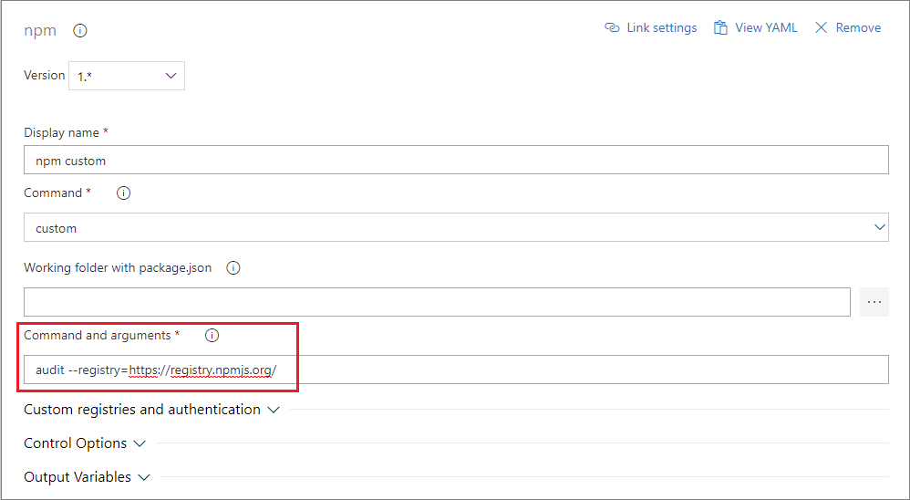

# Use npm audit

The *npm audit* command scans your project for security vulnerabilities and provides a detailed report of any identified anomaly. Performing security audits is an essential part in identifying and fixing vulnerabilities in the project's dependencies. Fixing these vulnerabilities could prevent things like data loss, service outages, and unauthorized access to sensitive information.

Azure DevOps does not support *npm audit*, if you try to run the default *npm audit* command from your pipeline, the task will fail with the following message: *Unexpected end of JSON input while parsing...*.

As a workaround, you can run *npm audit* with the `--registry=https://registry.npmjs.org/` set. This will route the *npm audit* command directly to the public registry.

>[!WARNING]
> Running *npm audit* will forward all the packages' names from your *package.json* to the public registry.

## Run npm audit from your pipeline

Select the YAML or the classic tab to learn how to run npm audit from you Pipeline.

# [YAML](#tab/yaml)

Add the following task to your yaml pipeline to scan for security vulnerabilities.

```yaml
steps:
- task: Npm@1
  displayName: 'npm audit'
  inputs:
    command: custom
    customCommand: 'audit --registry=https://registry.npmjs.org/'
```

- **command**: the npm command to run.
- **customCommand**: Required when command == custom.

# [Classic](#tab/classic)

Adding the **npm** task and select _custom_ as the Command:



---

## Run 'npm audit' on your developer machine

To run `npm audit` from your developer machine, add the `--registry=https://registry.npmjs.org/` flag to your command. The full command will look like:

```
npm audit --registry=https://registry.npmjs.org/
```
