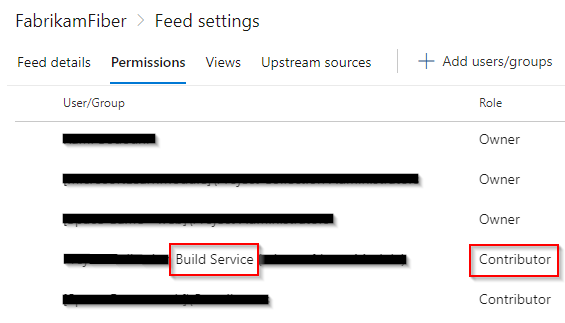
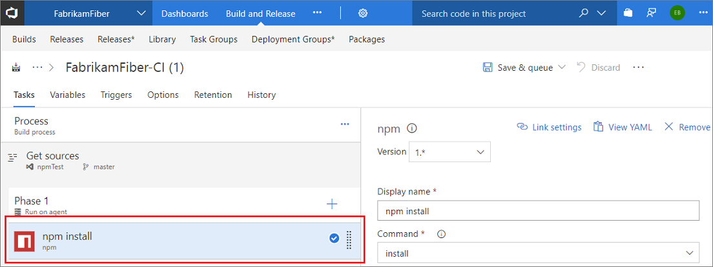
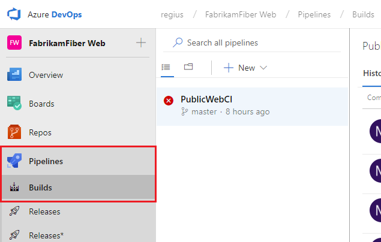
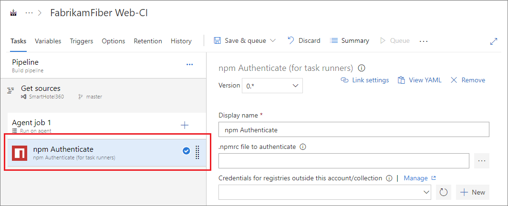

# Set up your project and connect to Azure Artifacts

**Azure DevOps Services | Azure DevOps Server 2020 | Azure DevOps Server 2019 | TFS 2018 | TFS 2017**

With Azure Artifacts, you can publish different types of packages to your feeds such as npm, NuGet, Python, Maven, and Universal packages. You can also install packages from feeds and public registries such as npmjs.com.

To authenticate with Azure Artifacts, we must first set up our config file. npm uses [.npmrc configuration files](https://docs.npmjs.com/files/npmrc) to store feed URLs and credentials.

## Project setup

We recommend using two **.npmrc_** files, the first one we will use to authenticate to Azure Artifacts, and the second one should be kept locally to store our credentials. This enables you to share your project's **.npmrc** while keeping your credentials secure.

1. Select **Artifacts**, and then select **Connect to feed**.

   ::: moniker range=">= azure-devops-2019"
   
       :::image type="content" source="../media/connect-to-feed-azure-devops-newnav.png" alt-text="Screenshot showing how to connect to a feed.":::

   ::: moniker-end

   ::: moniker range=">= tfs-2017 < azure-devops-2019"

      :::image type="content" source="../media/connect-to-feed.png" alt-text="Screenshot showing how to connect to a feed in TFS.":::

   ::: moniker-end

2. Select **npm** from the list of package types.

3. If this is the first time using Azure Artifacts with npm, select **Get the tools** button and follow the instructions to install the prerequisites. 

::: moniker range=">= azure-devops"   

4. Follow the instructions under the **Project setup** section to set up your project.

    :::image type="content" source="../media/npm-azure-devops-newnav.png" alt-text="Screenshot showing the steps to set up the project and publish and restore packages.":::

::: moniker-end

::: moniker range="> tfs-2018 < azure-devops"

4. Follow the instructions in the **Project setup** section to set up your project.

   :::image type="content" source="../media/connect-to-feed-devops-server.png" alt-text="Screenshot showing the steps to set up the project and restore packages.":::

::: moniker-end

::: moniker range=">= tfs-2017 < azure-devops-2019"

4. Follow the instructions under the **Project setup** section to set up your project.

    :::image type="content" source="../media/connect-to-feed-npm-registry.png" alt-text="Screenshot showing the steps to set up the project in TFS.":::

::: moniker-end
        
2. On your development machine, place the second *.npmrc* file in your *$HOME* for Linux/Mac or *$env.HOME* for Windows. This *.npmrc* file should contain all your registries' credentials. 

## Credentials setup

> [!TIP]
> Multiple registries in .npmrc files are supported with [upstream sources](../concepts/upstream-sources.md) and [scopes](..//npm/scopes.md).

### [Windows](#tab/windows/)

If you are developing on Windows, we recommend that you use `vsts-npm-auth` to fetch the credentials and inject them into your *%USERPROFILE%\\.npmrc*.  The easiest way to set this up is to install `vsts-npm-auth` globally and then add a run script to your *package.json*.

- Install vsts-npm-auth globally:

    ```Command
    npm install -g vsts-npm-auth
    ```

- Add script to package.json:

    ```json
    "scripts": {
        "refreshVSToken" : "vsts-npm-auth -config .npmrc"
    }
    ```

### [Linux/Mac](#tab/linux/)

`vsts-npm-auth` is not supported in Linux/Mac. Follow the steps below to set up your credentials:

1. Copy the following snippet into your .npmrc file.

    - **Organization-scoped feed**:

        ```Command
        ; begin auth token
        //pkgs.dev.azure.com/<ORGANIZATION_NAME>/_packaging/<FEED_NAME>/npm/registry/:username=[ENTER_ANY_VALUE_BUT_NOT_AN_EMPTY_STRING]
        //pkgs.dev.azure.com/<ORGANIZATION_NAME>/_packaging/<FEED_NAME>/npm/registry/:_password=[BASE64_ENCODED_PERSONAL_ACCESS_TOKEN]
        //pkgs.dev.azure.com/<ORGANIZATION_NAME>/_packaging/<FEED_NAME>/npm/registry/:email=npm requires email to be set but doesn't use the value
        //pkgs.dev.azure.com/<ORGANIZATION_NAME>/_packaging/<FEED_NAME>/npm/:username=[ANY_VALUE_BUT_NOT_AN_EMPTY_STRING]
        //pkgs.dev.azure.com/<ORGANIZATION_NAME>/_packaging/<FEED_NAME>/npm/:_password=[BASE64_ENCODED_PERSONAL_ACCESS_TOKEN]
        //pkgs.dev.azure.com/<ORGANIZATION_NAME>/_packaging/<FEED_NAME>/npm/:email=npm requires email to be set but doesn't use the value
        ; end auth token
        ```
    
    - **Project-scoped feed**:

        ```Command
        ; begin auth token
        //pkgs.dev.azure.com/<ORGANIZATION_NAME>/<PROJECT_NAME>/_packaging/<FEED_NAME>/npm/registry/:username=[ENTER_ANY_VALUE_BUT_NOT_AN_EMPTY_STRING]
        //pkgs.dev.azure.com/<ORGANIZATION_NAME>/<PROJECT_NAME>/_packaging/<FEED_NAME>/npm/registry/:_password=[BASE64_ENCODED_PERSONAL_ACCESS_TOKEN]
        //pkgs.dev.azure.com/<ORGANIZATION_NAME>/<PROJECT_NAME>/_packaging/<FEED_NAME>/npm/registry/:email=npm requires email to be set but doesn't use the value
        //pkgs.dev.azure.com/<ORGANIZATION_NAME>/<PROJECT_NAME>/_packaging/<FEED_NAME>/npm/:username=[ENTER_ANY_VALUE_BUT_NOT_AN_EMPTY_STRING]
        //pkgs.dev.azure.com/<ORGANIZATION_NAME>/<PROJECT_NAME>/_packaging/<FEED_NAME>/npm/:_password=[BASE64_ENCODED_PERSONAL_ACCESS_TOKEN]
        //pkgs.dev.azure.com/<ORGANIZATION_NAME>/<PROJECT_NAME>/_packaging/<FEED_NAME>/npm/:email=npm requires email to be set but doesn't use the value
        ; end auth token
        ```

1. Generate a [personal access token](../../organizations/accounts/use-personal-access-tokens-to-authenticate.md) with **packaging read and write** scopes.

1. Encode your newly generated personal access token as follows:

    1. Run the following command in an elevated command prompt window, and then paste your personal access token when prompted:
        
        ```Command
        node -e "require('readline') .createInterface({input:process.stdin,output:process.stdout,historySize:0}) .question('PAT> ',p => { b64=Buffer.from(p.trim()).toString('base64');console.log(b64);process.exit(); })"
        ```

        You can also use the following command to convert your personal access token to Base64:

        - **LinuxMac**:
            ```Command
            echo -n "YOUR_PERSONAL_ACCESS-TOKEN" | base64
            ```
    1. Copy the Base64 encoded value.

1. Open your .npmrc file and replace the placeholder *[BASE64_ENCODED_PERSONAL_ACCESS_TOKEN]* with your encoded personal access token that you created in the previous step.

* * *

> [!NOTE]
> `vsts-npm-auth` is not supported in TFS and Azure DevOps Server.

## Set up authentication in your pipeline

There are two options for setting up authentication in your pipeline:

- [Without a task runner](#without-a-task-runner).
- [With a task runner](#with-a-task-runner-eg-make-gulp-work) (e.g. gulp).

### Without a Task Runner

To authenticate with Azure Artifacts from your pipeline without a task runner, follow the steps below: 

::: moniker range=">= azure-devops-2019"

1. Select **Azure Pipelines**, and then select your pipeline definition.

1. Select **Edit** to modify your pipeline.

1. Select `+` to add a task to your pipeline.

   > [!div class="mx-imgBorder"] 
   > 

1. Search for the **npm** task, and then select **Add** to add it to your pipeline.

1. Select the folder that contains your package.json.

   > [!div class="mx-imgBorder"] 
   > 

1. Expand the **Custom registries and authentication** section, and then select **Registry I select here**. Select your feed from the dropdown menu.

    > [!div class="mx-imgBorder"] 
    > 

      > [!NOTE]
      > When you select this option, the task will create a temporary *.npmrc* for the feed you selected here and override the project's *.npmrc*.
   
1. Select **Save & queue** when you are done.

> [!TIP]
> If your NPM Install build task is failing with Error 403, then make sure you set your build service as a contributor. To do so, go to Azure Artifacts -> Select your feed -> Settings -> Permissions -> set your build service role to contributor.

> [!div class="mx-imgBorder"]
> 


::: moniker-end

::: moniker range=">= tfs-2017 < azure-devops-2019"

1. Select **Build and Release**, and then choose **Builds**.

   > [!div class="mx-imgBorder"]
   > 

1. Create a new pipeline.

   > [!div class="mx-imgBorder"]
   > 

1. Choose your source **Project**, **Repository**, and **Default branch** and select _Continue_.

1. Start with an **Empty job**.

1. On the left side, select the plus sign **( + )** to add a task to **Job 1**. On the right side, select the **Package** category, select the **npm** task from the list, and then choose **Add**.

   > [!div class="mx-imgBorder"]
   > 

1. Select the **npm install** task, then browse to and select your **Working folder with package.json**:

   > [!div class="mx-imgBorder"]
   > 

1. Expand **Custom registries and authentication**, here you have a few options: 

   * Registries in my **_.npmrc_**

      > [!div class="mx-imgBorder"]
      > 

      > [!TIP]
      > You can choose credentials to authenticate to services outside of your current organization/collection by setting up [service connections.](../../pipelines/library/service-endpoints.md#npm-service-connection)

   * Registry I select here

      > [!div class="mx-imgBorder"]
      > 

      When you choose this option, the task will create a temporary **_.npmrc_** with credentials for the registry you've selected and it will override the project's **_.npmrc_**. This is useful when you want to publish to a specific feed. 
   
1. Select **Save & queue**, and then select **Save**.

::: moniker-end

### With a Task Runner (e.g. make gulp work)

When using a task runner, you'll need to add the **npm Authenticate** build task at the beginning of your build pipeline. This will inject credentials into your project's **_.npmrc_** and persist them for the lifespan of the build. This allows subsequent build steps to use the credentials in the **_.npmrc_**.

::: moniker range=">= azure-devops-2019"

1. Select **Azure Pipelines**, it should automatically take you to the **Builds** page.

   > [!div class="mx-imgBorder"] 
   > 

1. Create a new pipeline.

   > [!div class="mx-imgBorder"] 
   > 

1. Choose your source **Project**, **Repository**, and **Default branch** and select _Continue_.

1. Start with an **Empty job**.

1. On the left side, select the plus sign **( + )** to add a task to **Job 1**. On the right side, select the **Package** category, select the **npm Authenticate** task from the list, and then choose **Add**.

   > [!div class="mx-imgBorder"] 
   > 

1. Select the **npm Authenticate** task underneath **Phase 1**:

   > [!div class="mx-imgBorder"] 
   > 

1. Browse to and select your **.npmrc file to authenticate**:

   > [!div class="mx-imgBorder"]
   > 

   > [!TIP]
   > You can choose credentials to authenticate to services outside of your current organization/collection by setting up [service connections.](../../pipelines/library/service-endpoints.md#npm-service-connection)

1. After setting up your **npm Authenticate** task, you can add other build task(s) for your task runner like **Gulp**.

::: moniker-end

::: moniker range=">= tfs-2017 < azure-devops-2019"

1. Select **Build and Release**, and then choose **Builds**.

   > [!div class="mx-imgBorder"]
   > 

1. Create a new pipeline.

   > [!div class="mx-imgBorder"]
   > 

1. Choose your source **Project**, **Repository**, and **Default branch** and select _Continue_.

1. Start with an **Empty job**.

1. On the left side, select the plus sign **( + )** to add a task to **Job 1**. On the right side, select the **Package** category, select the **npm Authenticate** task from the list, and then choose **Add**.

   > [!div class="mx-imgBorder"]
   > 

1. Select the **npm Authenticate** task underneath **Phase 1**:

   > [!div class="mx-imgBorder"]
   > 

1. Browse to and select your **npmrc file to authenticate**:

   > [!div class="mx-imgBorder"]
   > 

   > [!TIP]
   > You can choose credentials to authenticate to services outside of your current organization/collection by setting up [service connections.](../../pipelines/library/service-endpoints.md#npm-service-connection)

1. After setting up your **npm Authenticate** task, you can add other build task(s) for your task runner like **Gulp**.

::: moniker-end

::: moniker range="= tfs-2017 || = tfs-2018 || = azure-devops"

> [!NOTE]
> If you are using Yarn, run the following command to set the yarn registry:
> `yarn config set registry "https://pkgs.dev.azure.com/<yourOrganization>/_packaging/<yourFeed>/npm/registry/"`

## Troubleshooting `vsts-npm-auth`

- If you receive an error like:

    - Command Prompt: `'vsts-npm-auth' is not recognized as an internal or external command, operable program or batch file.`
    - PowerShell: `vsts-npm-auth : The term 'vsts-npm-auth' is not recognized as the name of a cmdlet, function, script file, or operable program.`
    
    then it's likely that the npm modules folder is not in your path. 
    
    To fix this issue, rerun Node.js setup and ensure the `Add to PATH` option and its child options are selected for installation.
    
    > [!div class="mx-imgBorder"]
    > 
    
    Alternatively, you can edit the PATH variable to add `%APPDATA%\npm` (Command Prompt) or `$env:APPDATA\npm` (PowerShell).

- If you are running into a E401 error: `code E401 npm ERR! Unable to authenticate`

    run the `vsts-npm-auth` command with the -F argument to re-authenticate.

    ```
    vsts-npm-auth -config .npmrc -F
    ```

::: moniker-end

## Related articles

- [npm scopes](./scopes.md)
- [npm audit](./npm-audit.md)
- [Publish npm packages](../../pipelines/artifacts/npm.md)
