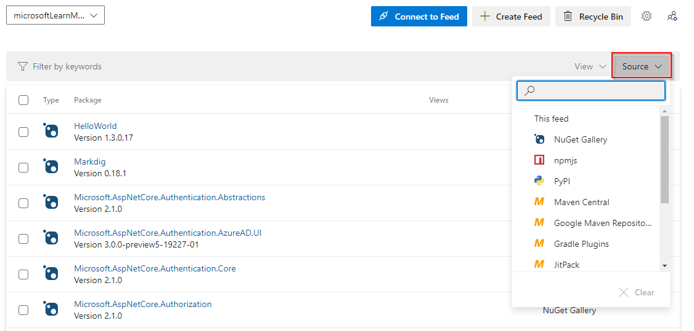

 

# Use packages from nuget.org

**Azure DevOps Services** | **TFS 2018**

> [!NOTE]
> NuGet upstream sources are only available for **Azure DevOps Services and TFS 2018 Update 2 and newer**.

The NuGet client natively supports multiple package sources, so you can use packages from both nuget.org and private feeds (like your Azure Artifacts feed). However, there are some limitations (outlined on the [upstream sources concepts page](../concepts/upstream-sources.md)) with that configuration, and we recommend instead managing package sources server-side using a single feed and upstream sources.

The nuget.org upstream source allows you to merge the contents of nuget.org into your feed such that the nuget client can install packages from both locations without making multiple search queries. Enabling upstream sources also automatically enables saving of packages you use from the upstream source.

To learn more about the concept of upstream sources, please see the [concepts page](../concepts/upstream-sources.md).

## Enable the upstream on a new feed

1. [Create a new feed](../index.yml). Ensure you leave the "Use packages from public sources through this feed" radio button selected.
1. [Update your NuGet configuration](#update-nuget-configuration).

## Enable the upstream on an existing feed

> [!IMPORTANT]
> Enabling the nuget.org upstream source on a widely-used feed can result in unexpected packages being saved into that feed. [Learn more](#adding-upstreams-to-a-popular-feed)

1. Edit your feed. Select the **gear icon** in the top right of the page to open feed settings.
1. Select the **Upstream sources** pivot.
1. Select **Add upstream source** in the CommandBar.
1. Select **Select a feed URL** and select **nuget.org (https://api.nuget.org/v3/index.json)**. If you like, customize the upstream name.
1. Select **Add**.
1. [Update your NuGet configuration](#update-nuget-configuration).

### Adding upstreams to a popular feed

Once you enable the nuget.org upstream source, any `Owner` or `Contributor` that runs a package request against your feed can save packages from nuget.org into your feed. If you've distributed your feed URL to a large set of consumers, this means that users outside your team could save packages you weren't expecting into your feed.

If you're concerned about this, consider creating a new feed then adding nuget.org and your current feed as upstream sources to that feed.

## Update your NuGet configuration

To use your feed and upstream source, follow the instructions to [consume NuGet packages](consume.md). If you've previously set up this feed, still take a quick pass through those instructions and ensure you've disabled NuGet.org as a source. This ensures that all package requests are sent to your Azure DevOps Services feed, which is required to take advantage of the [guaranteed save](../concepts/upstream-sources.md#offline-upstreams) functionality of the nuget.org upstream source.

## Filter to saved packages

You can see the packages you have saved in your feed by selecting the appropriate Source filter.

::: moniker range=">= azure-devops-2019"

::: moniker-end

::: moniker range="<= tfs-2018"

::: moniker-end

::: moniker range=">=tfs-2017 < azure-devops"

::: moniker-end