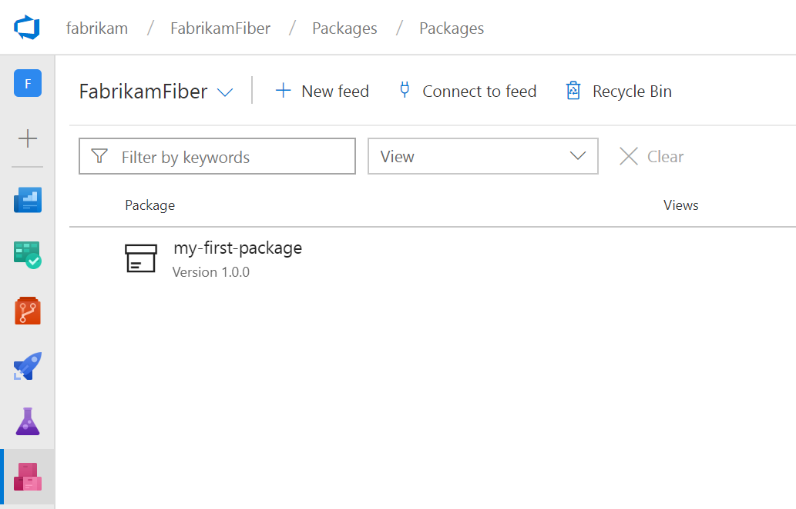

# Quickstart: Publish and then download a Universal Package

> [!NOTE]
> Universal Packages are currently in public preview.

Universal Packages store one or more files together in a single unit that has a name and version. Universal Packages can be published from the command line using the [VSTS CLI](/cli/vsts/overview?view=vsts-cli-latest). This quickstart shows you how to publish your first Universal Package using the CLI and how to download it using the CLI. To see your package, you can navigate to your feed in Azure Artifacts.

## Prerequisites

1. Download and install the latest [build](/cli/vsts/overview?view=vsts-cli-latest) of the VSTS CLI.
2. If you're using Linux, ensure you've installed the [.NET Core Linux prerequisites](/dotnet/core/linux-prerequisites).

> [!NOTE]
> The VSTS CLI is named after the previous name of Azure DevOps, Visual Studio Team Services. In the coming months, Universal Packages (and the rest of the VSTS CLI) will become part of the Azure CLI.

## Prepare files for publishing

Create a new directory and copy the files you want to publish as a package into that directory.

## Create a feed

If you don't already have a Azure Artifacts feed, [create one now](../feeds/create-feed.md) and note its name. If you already have a feed, just note the name.

## Log into Azure DevOps

The following sections vary based on whether you've opted into the new [Azure DevOps Services URLs](/azure/devops/extend/develop/work-with-urls).

# [New URLs](#tab/azuredevops)

After you've installed the CLI, open your shell of choice (e.g. PowerShell, cmd, etc.) and navigate to the directory you just created. Then, log into Azure DevOps using the command below, replacing the items in square brackets (`[]`) with appropriate values:

```vstscli-interactive
vsts login --instance https://dev.azure.com/[your-organization] --token [your personal access token]
```

Next, set the organization you just logged into as the CLI's default (again, replace the items in square brackets):

```vstscli-interactive
vsts configure -d instance=https://dev.azure.com/[your-organization]
```

#  [Legacy URLs](#tab/vsts)

After you've installed the CLI, open your shell of choice (e.g. PowerShell, cmd, etc.) and navigate to the directory you just created. Then, log into Azure DevOps using the command below, replacing the items in square brackets (`[]`) with appropriate values:

```vstscli-interactive
vsts login --instance https://[your-organization].visualstudio.com --token [your personal access token]
```

Next, set the organization you just logged into as the CLI's default (again, replace the items in square brackets):

```vstscli-interactive
vsts configure -d instance=https://[your-organization].visualstudio.com
```

---

## Publish a Universal Package

Publish a package with vsts package universal publish. The following example publishes a package named *my-first-package* with version *1.0.0* to the *FabrikamFiber* feed in the *fabrikam* Azure DevOps organization with a placeholder description.

Update these values as desired and use the feed name you noted earlier. You must use a [Semantic Version (SemVer)](https://semver.org) for the version. Package names must be lower case and can only use letters, numbers, and dashes (`-`).

# [New URLs](#tab/azuredevops)

```vstscli-interactive
vsts package universal publish --instance https://dev.azure.com/fabrikam --feed FabrikamFiber --name my-first-package --version 1.0.0 --description "Your description" --path .
```

#  [Legacy URLs](#tab/vsts)

```vstscli-interactive
vsts package universal publish --instance https://fabrikam.visualstudio.com --feed FabrikamFiber --name my-first-package --version 1.0.0 --description "Your description" --path .
```

---

## View the package in your feed

To see the package you just published, navigate to the organization you specified in the publish command, select any project, then select the **Packages** page under the **Build & Release** page group. Or, if you've enabled the [new navigation preview](https://blogs.msdn.microsoft.com/devops/2018/06/19/new-navigation/), just select Packages on the left side.



## Download a Universal Package

Now that you've published a package, you can download it to a different directory on your machine. To do that, make a new directory and switch to it. Then, download your package.

The following example downloads a package with the same metadata as the publish example. Update these values to match the values you selected when you published your package.

# [New URLs](#tab/azuredevops)

```vstscli-interactive
vsts package universal download --instance https://dev.azure.com/fabrikam --feed FabrikamFiber --name my-first-package --version 1.0.0 --path .
```

#  [Legacy URLs](#tab/vsts)

```vstscli-interactive
vsts package universal download --instance https://fabrikam.visualstudio.com --feed FabrikamFiber --name my-first-package --version 1.0.0 --path .
```

---

## Next steps

In this quickstart, you published your first Universal Package and then downloaded back to your machine. To learn more about the Universal Package CLI, append `-h` to any CLI command. To use Universal Packages in build, see the [Pipelines doc for Universal Packages](../../pipelines/targets/universal-packages.md)