# Link user stories, issues, bugs, and other work items  

[!INCLUDE [temp](../includes/version-all.md)]

::: moniker range="azure-devops"

You link work items to other work items to manage dependencies and see relationships within work. You can link work items within your project or to work items within another project in your organization. You use different link types to support different business objectives. You can also link work items to other objects such as builds, commits, versioned items, or network resources. 

::: moniker-end

::: moniker range="< azure-devops"

You link work items to other work items to manage dependencies and see relationships within work. You can link work items within your project or to work items within another project in your collection. You use different link types to support different business objectives. You can also link work items to other objects such as builds, commits, versioned items, or network resources. 

::: moniker-end

In general, you use the following link types when linking work items to one another: 

- Use **Parent/Child** links to link work items that you want to group within a hierarchy 
- Use **Predecessor/Successor** or **Affects/Affected by** links to link work items that have dependencies 
- Use **Duplicate/Duplicate of** links to link work items that track the same code defect or work 
- Use **Related** to link work items with some level of relationship, but not that strong 

You can add a link to a work item from within the work item form or from a backlog or query results list. From a backlog or query results list, you can select multiple work items and then link them to a new or existing work item. In general, use the bulk edit to update several work items to link to the same work item, either new or existing. 

Use this article to learn how to:  

::: moniker range="azure-devops"  
>[!div class="checklist"]      
> * Link one or more work items to an existing work item   
> * Link one or more work items to a new work item that you add when linking
> * Add a link to a remote work item 
> * Link several work items to a new git branch 
> * Link work items to a build artifact
> * Find work items that you want to link to  
> * Bulk modify link relationships   
::: moniker-end    

::: moniker range="< azure-devops"  
>[!div class="checklist"]      
> * Link one or more work items to an existing work item   
> * Link one or more work items to a new work item that you add when linking
> * Link several work items to a new git branch
> * Link work items to a build artifact
> * Find work items that you want to link to  
> * Bulk modify link relationships     
::: moniker-end    

For a list of all link types and supported link relationships, see [Linking, traceability, and managing dependencies](../queries/link-work-items-support-traceability.md). 

> [!NOTE]
> The following link relationships are restricted: 
> - You can't assign a work item more than one parent using a parent/child or other tree topology link type. 
> - You can't add links in such a way as to create a circular relationship. 
> - You can't link more than 1,000 work item to a single work item. 

[!INCLUDE [temp](../includes/prerequisites.md)] 

&nbsp;

## Link several work items 

::: moniker range=">= tfs-2018"

1. From the web portal, open a [backlog](create-your-backlog.md) or [query results page](../queries/view-run-query.md), and [multi-select the work items](bulk-modify-work-items.md#multi-select) you want to add a link to.

2. Open the **&hellip;** context menu of one of the selected work items, choose **Add link**, and then choose **Existing item&hellip;** or **New item &hellip;**. 

    Here we multi-select from the product backlog and choose **Existing item**&hellip;.

    > [!div class="mx-imgBorder"]  
    >    

::: moniker-end
::: moniker range="tfs-2017"
1. From the web portal, open a query results page, and [multi-select the work items](bulk-modify-work-items.md#multi-select) you want to add a link to. 

2. Open the &hellip; context menu of one of the selected work items, and then choose **Link to a new item**&hellip; or **Link to an existing item**&hellip;.  

    Here we multi-select from the Queries page and choose <b>Link to a new item&hellip;</b>.

    > [!div class="mx-imgBorder"]  
    > 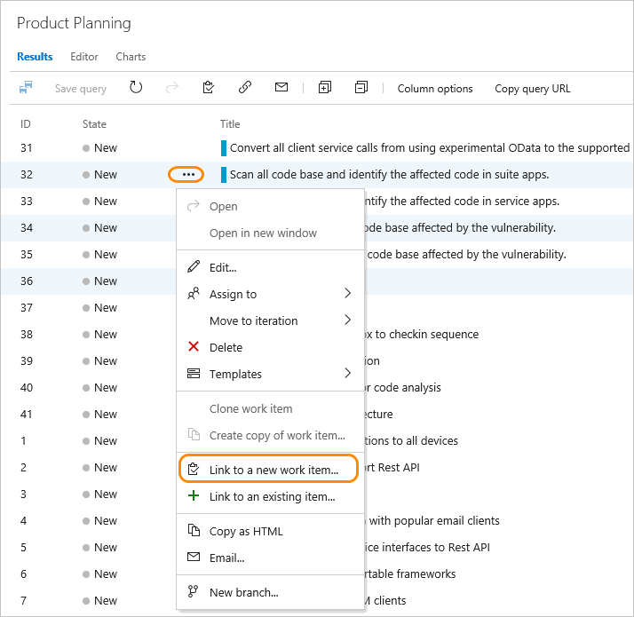 

::: moniker-end
::: moniker range=">= tfs-2013 <= tfs-2015"
1. From the web portal, open a query results page, and [multi-select the work items](bulk-modify-work-items.md#multi-select) you want to add a link to.

2. Open the context menu of one of the selected work items, and then choose **Link selected item(s) to a new work item**&hellip; or **Link to an existing item**&hellip;.

    Here we multi-select from the Queries page and choose **Link selected item(s) to a new work item**&hellip;.  

    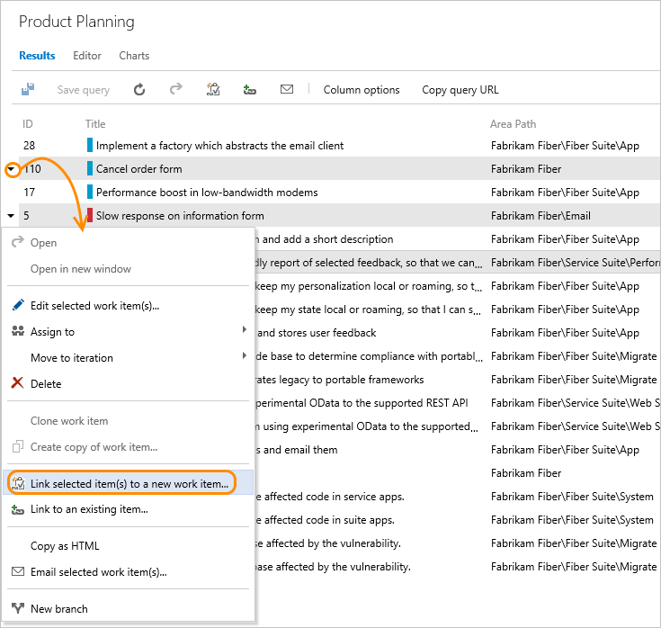  
   ::: moniker-end

  

## Link to an existing work item  

When you link work items, you select a link type. In general, use the following link types as indicated. To learn more about each link type, see [Link type reference](../queries/link-type-reference.md). 

- Use the **Duplicate** link type when two work items have been created that essentially capture the same information; close one of the work items and keep the other one active  
- Use the **Parent/Child** link types when you want to break down work items into smaller items&mdash;for example, break down features into stories, or stories into tasks
- Use  **Predecessor-Successor** link types when you want to track tasks that must be completed before others can be started; this link type is most often used when you plan work using Project 
- Use the **Related** link type when the work items being linked are at the same level&mdash;such as two user stories that define features that overlap one another&mdash;or to link work items that are defined in different projects or managed by different teams.

#### [Browser](#tab/browser/)

From the **Add link** dialog, select the link type, enter a work item ID, and then choose OK. 

For example, here we use the **Related** link type to link three items to the bug with ID of *400*. 

::: moniker range="azure-devops"
> [!div class="mx-imgBorder"]  
>   

To link to multiple work items, you can use inline add which finds work items based on your recent activity or keyword searches. Simply select one or more of the work items displayed automatically based on your recent activity, or enter a keyword. Keyword searches will display work items based on work items that include that keyword in their title. 

> [!NOTE]   
> You need to add each link one at a time. (You can no longer enter their IDs separated by commas or spaces.) To quickly find work items of interest, you can also use [work item search](../../project/search/functional-work-item-search.md).

::: moniker-end 

::: moniker range=">= tfs-2018"
To view the work items selected for linking, you can choose the  :::image type="icon" source="../media/icons/info.png" border="false"::: .   
> [!div class="mx-imgBorder"]  
>  
::: moniker-end   

::: moniker range=">= tfs-2013 <= tfs-2018"
> [!div class="mx-imgBorder"]  
> 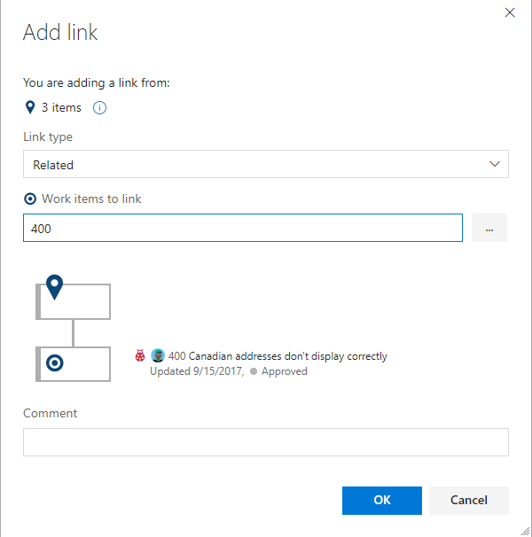   

To link to multiple work items, enter their IDs separated by commas or spaces. If you don't know the IDs or you want to link to an item in a different project, you can choose the &hellip; context menu to open a dialogue that will support you in [choosing work items based on IDs, a query, or title keyword](#find-items). 
::: moniker-end 
  

If you are working from the Query Results page, you'll need to bulk save the work items you've modified. When you work from a backlog, work items are automatically saved.

::: moniker range=">= azure-devops-2019"
> [!div class="mx-imgBorder"]  
> 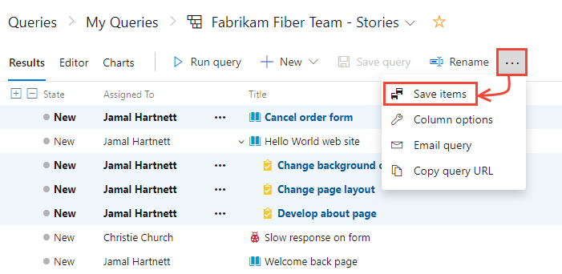 
::: moniker-end 

::: moniker range=">= tfs-2013 <= tfs-2018"
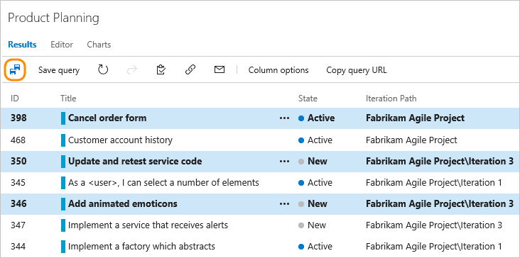 
::: moniker-end 

#### [Visual Studio](#tab/visual-studio/)

From the Add link to Multiple Items dialog, select the link type, enter a work item ID, and then choose **OK**. 

For example, here we use the **Related** link type to link several items to the user story with ID of *4654*. 

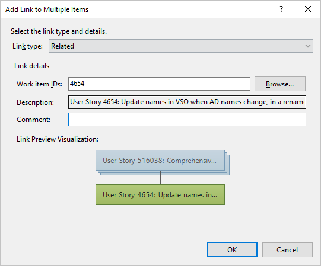         

To link to multiple work items, enter their IDs separated by commas or spaces. If you don't know the IDs or you want to link to an item in a different project, you can click the Browse button to open a dialogue that will support you in [choosing work items based on IDs, a query, or title keyword](#find-items). 

You'll need to bulk save the work items you've modified. 

* * *

## Link to a new work item   

Here, we have selected to add a link to the selected work items.  

1. Specify the link type, work item type, and title of the new work item. Choose **OK**.  
    ::: moniker range=">= tfs-2018"
    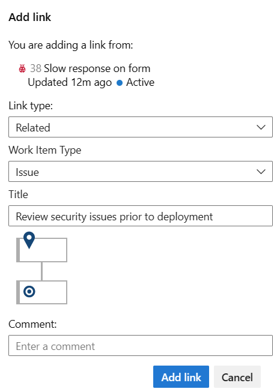  
    ::: moniker-end
    ::: moniker range=">= tfs-2013 <=tfs-2017"
    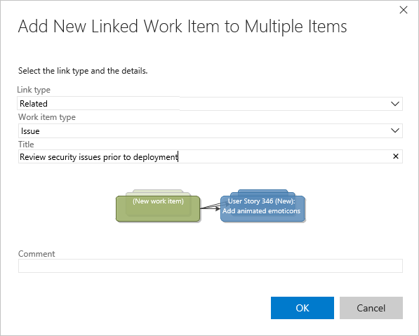  
    ::: moniker-end

2. A work item of the type selected opens. Enter additional information and save the work item.
    ::: moniker range=">= tfs-2017"
    > [!div class="mx-imgBorder"]  
    >    
    ::: moniker-end
3. If you are working from the Query Results page, you'll need to bulk save the work items you've modified as shown in the previous procedure.  

::: moniker range="azure-devops"

  

## Link to a remote work item 

You can link work items to objects defined in other Azure DevOps organizations as long as both organizations use the same Azure Active Directory to manage users. 

Choose from one of the following two remote link types supported. 

- Use the **Consumes From/Produces For** link types when you want to track dependencies of work items that are defined in different organizations and managed by different teams. 
- Use the **Remote Related** link type when the work items being linked are defined in different organizations and managed by different teams, but don't have strong inter-dependencies.

From the Add link dialog, select the link type, enter the URL of the remote work item, and then choose OK. 

For example, here we use the **Remote Related** link type to link to  work item ID *350* that exists in the *remotelinkingtest2* organization, *RemoteLinking* project. 

> [!div class="mx-imgBorder"]  
> 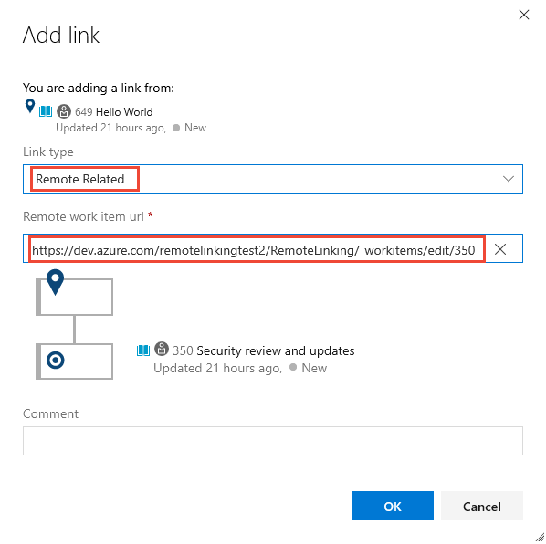  

The link tab maintains a count of all links to the work item.  The [*Remote Link Count* field](../queries/linking-attachments.md) maintains a count of the number of links added to a work item that link to a work item defined in another project or organization. 

The following image shows an example of two remote links, indicated by the  :::image type="icon" source="../../media/icons/cloud-link.png" border="false":::  cloud icon, added to a user story. 

> [!div class="mx-imgBorder"]  
>   

::: moniker-end 

::: moniker range=">= tfs-2017"

## Link several work items to a new git branch 

You can add a new git branch and link them to existing work items at the same time. 

From a backlog or query results page, [multi-select the work items](bulk-modify-work-items.md#multi-select) you want to link to a new git branch, choose the  :::image type="icon" source="../../media/icons/actions-icon.png" border="false"::: actions icon, and then **New branch...**. To learn more, see [Link work items to Git development objects](connect-work-items-to-git-dev-ops.md).  
::: moniker-end

::: moniker range=">= tfs-2018"
> [!div class="mx-imgBorder"]  
> 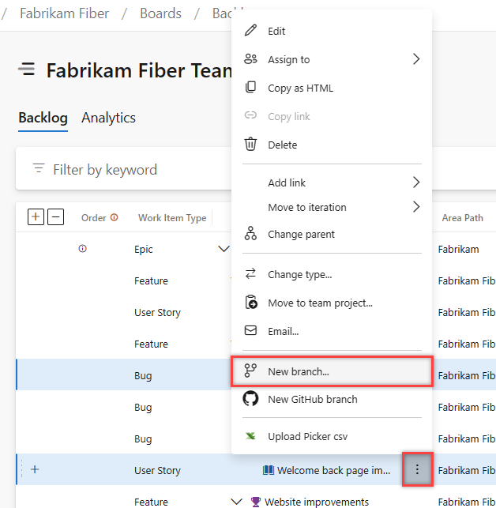   

::: moniker-end

::: moniker range="tfs-2017"

> [!div class="mx-imgBorder"]  
> 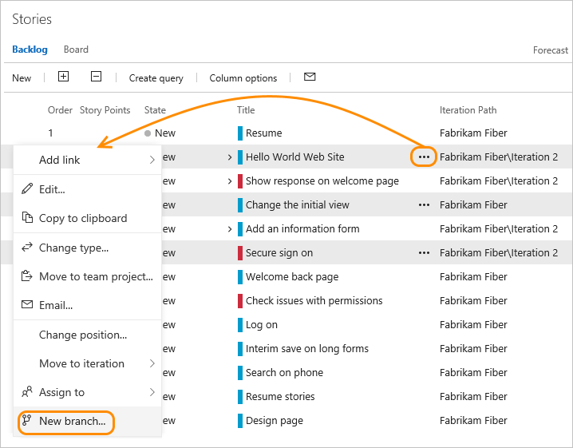   

::: moniker-end

::: moniker range=">= azure-devops-2019"

## Link work items to a build  

You can link work items to existing builds from the **Add link** dialog. 

::: moniker-end

::: moniker range="azure-devops"

1. From the Add link dialog, choose one of the build link types&mdash;**Build**, **Found in build**, **Integrated in build**&mdash; and specify the build number. 

	> [!div class="mx-imgBorder"]  
	>    

1. If you don't know the build number&mdash;a combination of the pipeline and build name&mdash;you can search for it choosing the **...** button and using the **Find builds** dialog.  

	Note you can choose a different project within your organization to link to a build. With **All** selected, choose **Find** and then apply additional filters to narrow your search.
 
	> [!div class="mx-imgBorder"]  
	> 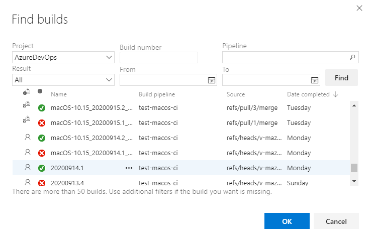   

1. Once you select a build, choose **OK** and then **OK** to save your changes and dismiss the dialogs. 

::: moniker-end

::: moniker range="< azure-devops"

1. From the Add link dialog, choose one of the build link types&mdash;**Build**, **Found in build**, **Integrated in build**&mdash; and specify the build number. 

	> [!div class="mx-imgBorder"]  
	>    

1. If you don't know the build number&mdash;a combination of the pipeline and build name&mdash;you can search for it choosing the **...** button and using the **Find builds** dialog.  

	With **All** selected, choose **Find** and then apply additional filters to narrow your search.

	> [!div class="mx-imgBorder"]  
	> 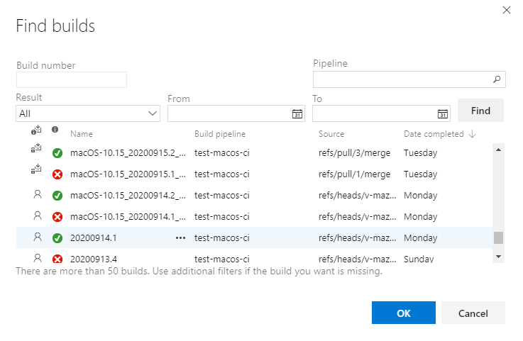   

1. Once you select a build, choose **OK** and then **OK** to save your changes and dismiss the dialogs. 
 
::: moniker-end

::: moniker range=">= tfs-2013 <= tfs-2018"

  

## Find work items to link to   

From the Add link dialog you can open a secondary dialog to help you choose one or more work items to link to. If you are going to find and list work items to link to by using a saved query, first [define the query](../queries/using-queries.md) that you want to use. 

1.  From the Add link dialog, choose the &hellip; context menu or **Browse** button (Visual Studio) to open the following dialog. 

    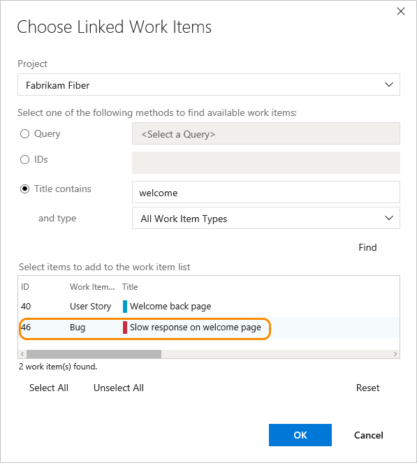  

    If the work items are defined in another project, then first select the Project. Then, make your selections: 

    -   **Query**. Use this method when you have defined a query that you know contains the set or superset of the work items that you want.   
    -   **IDs**. Use this method when you know the IDs of the work items that you want to link to. 
          In the **IDs** box, type the IDs of the work items that you want to find, separated by commas or spaces. 
    -   **Title contains**. Use this method to find work items that have a common word or phrase in the title field. In the **and type** list, click the type of work item that you want to retrieve.   

        > [!NOTE]
        > To minimize the time required to run the query, narrow the filter criteria of the search.  

1.  Click the **Find** button.

     Only those work items defined for the selected project and specified work item type are listed. To sort on a column field, choose the column title. 

    <!-- You can change the display of the work items that are listed by using one of the following user interface controls:  
      To expand or collapse a tree view list, choose the + or signs.    
      To resize a column, point your cursor at the edge of a column header and drag it to a new location.    
      To sort on a column field, choose the column title.    
      To move a column field, choose the column title and drag to another location. -->  

1.  In the list of returned work items, select one or more work items.   

    - From the web portal: To select several items in a sequence, hold down the shift key. To select several non-sequential items, use the Ctrl key.   

    - For Visual Studio, select each work item that should link to the current work item. You can also press the SHIFT key while clicking to select a range of work items, or press the CTRL key while clicking to select multiple work items.  

::: moniker-end

## Additional bulk-modify link options

Additional features you can use to quickly link or change links that use the parent-child link type (some features are version dependent, see the linked topic for details):

- To quickly link backlog items to portfolio backlog items with parent-child links, [use the mapping pane to organize your backlog](organize-backlog.md#mapping). Or, you can choose to Show Parents and [drag-and-drop items within the tree hierarchy](organize-backlog.md).  
- To create and link tasks to backlog items, [use the sprint backlog page](../sprints/assign-work-sprint.md).  
- To indent (), outdent (), and change the tree hierarchy, use a tree query in Visual Studio.  
- To add or delete work items or change the link structure, you can use Excel or Project. See [Bulk add or modify work items with Excel](../backlogs/office/bulk-add-modify-work-items-excel.md) and [Create your backlog and tasks using Project](../backlogs/office/create-your-backlog-tasks-using-project.md).  

## Related articles

::: moniker range=">= azure-devops-2020"

- [Map backlog items to portfolio backlog items](organize-backlog.md)
- [Link work items to Git development objects](connect-work-items-to-git-dev-ops.md)
- [Link GitHub commits and pull requests to work items](../github/link-to-from-github.md)
- [Use Excel to edit tree-topology links](../backlogs/office/bulk-add-modify-work-items-excel.md)
- [Use Project to edit parent-child and predecessor-successor links](../backlogs/office/create-your-backlog-tasks-using-project.md)
- [Linking, traceability, and managing dependencies](../queries/link-work-items-support-traceability.md)

::: moniker-end

::: moniker range="<= azure-devops-2019"

- [Map backlog items to portfolio backlog items](organize-backlog.md)
- [Link work items to Git development objects](connect-work-items-to-git-dev-ops.md)
- [Use Excel to edit parent-child links](../backlogs/office/bulk-add-modify-work-items-excel.md)
- [Use Project to edit parent-child and predecessor-successor links](../backlogs/office/create-your-backlog-tasks-using-project.md)
- [Linking, traceability, and managing dependencies](../queries/link-work-items-support-traceability.md)

::: moniker-end

