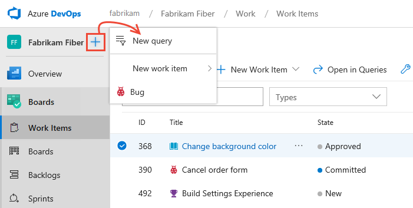
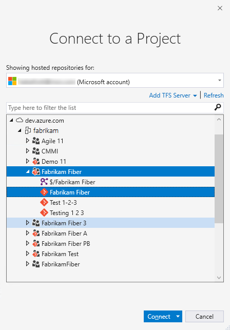
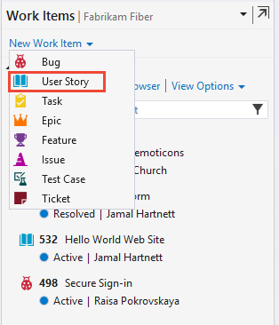

# Add and update a work item

[!INCLUDE [version-lt-eq-azure-devops](../../includes/version-lt-eq-azure-devops.md)]

You add work items to plan and manage your project. Different types of work items track different types of work&mdash;such as user stories or product backlog items, tasks, bugs, or issues. Use work items to describe the work to be done, assign work, track status, and coordinate efforts within your team.  


> [!NOTE]  
> This article shows how to add any type of work item. However, the recommended tool for adding backlog or portfolio items&mdash;such as, user stories, product backlog items, features, or epics&mdash; is to use the backlog or Kanban board to add new items. For more information, see [Create your backlog](create-your-backlog.md), [Define features and epics](define-features-epics.md) and [Start using your Kanban board](../boards/kanban-quickstart.md). To create test cases and link them to user stories, see [Add, run, and update inline tests](../boards/add-run-update-tests.md) and [Create test plans and test suites](../../test/create-a-test-plan.md).

[!INCLUDE [temp](../includes/prerequisites-work-items.md)]

<a id="define-new-work">  </a>

## Add a work item 

You can start adding work items once you connect to a project. 


### [Browser](#tab/browser/)

::: moniker range=">= azure-devops-2019"

Choose a **Boards** page&mdash;such as **Work Items**, **Boards**, or **Backlogs**. Then choose the :::image type="icon" source="../../media/icons/blue-add.png" border="false"::: plus icon and select from the menu of options. 

> [!div class="mx-imgBorder"]
> 


> [!NOTE]
> Depending on the process chosen when the project was created&mdash;[Agile](../work-items/guidance/agile-process.md), [Basic](../get-started/plan-track-work.md), [Scrum](../work-items/guidance/scrum-process.md),
or [CMMI](../work-items/guidance/cmmi-process.md)&mdash;the types of work items you can create are different. For example, backlog items may be called user stories (Agile), issues (Basic) product backlog items (Scrum), or requirements (CMMI). All four are similar: they describe the customer value to deliver and the work to be performed.
>
> For more information, see [About processes and process templates](../work-items/guidance/choose-process.md). The Basic process requires Azure DevOps Server 2019.1 or later version.

Enter a title and then save the work item. Before you can change the State from its initial default, you must save it.  

  

You can [add tags to any work item to filter backlogs and queries](../queries/add-tags-to-work-items.md).

Work items you add are automatically scoped to your team's default area path and iteration path. To change the team context, see [Switch project or team focus](../../project/navigation/go-to-project-repo.md).

That's it! 

Create as many work items as you need of the type you need to track the work you want to manage.  

::: moniker-end


::: moniker range="tfs-2018"

1.  From **Work**, choose the work item type from the New Work Item list of options. Here, we choose to create a User Story. 

     

    > [!NOTE]  
    >Depending on the process chosen when the project was created&mdash;[Agile](../work-items/guidance/agile-process.md), [Scrum](../work-items/guidance/scrum-process.md), 
    or [CMMI](../work-items/guidance/cmmi-process.md)&mdash;the types of work items you can create are different. For example, backlog items may be called user stories (Agile), product backlog items (Scrum), or requirements (CMMI). All three are similar: they describe the customer value to deliver and the work to be performed.
    >
    > For more information, see [About processes and process templates](../work-items/guidance/choose-process.md). 

    Choose the  :::image type="icon" source="../media/icons/pin-icon.png" border="false":::  pin icon to have it show up within **Work** drop down menu. 

3. Enter a title and then save the work item. Before you can change the State from its initial default, you must save it.  

      

    You can [add tags to any work item to filter backlogs and queries](../queries/add-tags-to-work-items.md).

    Work items you add are automatically scoped to your team's default area path and iteration path. To change the team context, see [Switch project or team focus](../../project/navigation/go-to-project-repo.md?toc=/azure/devops/boards/work-items/toc.json).

::: moniker-end


### [Visual Studio 2019](#tab/visual-studio/)

1. Open Visual Studio 2019, Team Explorer, and then choose **Work Items**. 

    > [!div class="mx-imgBorder"]  
    >  

    If you don't see the **Work Items** option, you need to connect to a project and not just a repository. From the Connect to a Project dialog. Use **CTRL-Shift** to select your options and then choose **Connect**.

    > [!div class="mx-imgBorder"]  
    > 

1. Choose **New Work Item** and select the work item type you want. 

    > [!div class="mx-imgBorder"]  
    > 

    When you work within Visual Studio 2017 or later version, a browser window opens with the work item form to complete. If you work within Visual Studio 2015 or earlier version, a work item form opens within Visual Studio. 

### [Azure DevOps CLI](#tab/azure-devops-cli/)

[!INCLUDE [temp](../includes/add-work-items-cli.md)]

[!INCLUDE [temp](../../includes/note-cli-not-supported.md)]

* * *

## Update work items as work progresses

As work progresses, team members can update the state and reassign it as needed. While the workflow states differ for different work item types, they usually follow a progression from New or Active to Completed or Done. 

#### [Browser](#tab/browser/)

> [!div class="mx-imgBorder"]  
>    

::: moniker range=">= azure-devops-2019"

The following image shows the workflow states for a user story. If you want to discard a work item, change the state to Removed, or you can delete it. For more information, see [Move, change, or remove a work item](remove-delete-work-items.md).  

::: moniker-end

::: moniker range="tfs-2018"

The following image shows the work flow states for a user story. If you want to discard a work item, change the state to Removed, or you can delete it. For more information, see [Remove or delete a work item](remove-delete-work-items.md).    

::: moniker-end

:::row:::
   :::column span="2":::
      **Typical workflow progression:**
      - The product owner creates a user story in the **New** state with the default reason, **New user story**   
      - The team updates the status to **Active** when they decide to complete the work during the sprint  
      - A user story is moved to **Resolved** when the team has completed all its associated tasks and unit tests for the story pass.  
      - A user story is moved to the **Closed** state when the product owner agrees that the story has been implemented according to the Acceptance Criteria and acceptance tests pass.  
    
**Atypical transitions**: 
      - Change the State from **Active** to **New**.  
      - Change the State from **Resolved** to **Active**.  
      - Change the State from **Resolved** to **New**.  
      - Change the State from **Closed** to **Active**.  
      - Change the State from **New** to **Removed**.  
      - Change the State from **Removed** to **New**.  
   :::column-end:::
   :::column span="2":::
        
   :::column-end:::
:::row-end:::

Removed work items remain in the data store and can be reactivated by changing the State.   

With each update, changes are recorded in the History field, which you can view through the **History** tab.  

  

To find work items based on their history, see [History & auditing](../queries/history-and-auditing.md).  

[!INCLUDE [temp](../includes/discussion-tip.md)] 


### [Visual Studio 2019](#tab/visual-studio/)

There's no way to use Visual Studio 2019 to update a work item at this time. 

### [Azure DevOps CLI](#tab/azure-devops-cli) 

::: moniker range="azure-devops"

[Update work item](#update-work-item) | [Show work item details](#show-work-item) 

<a id="update-work-item"></a>  

### Update a work item

You can make updates to your work items with the [az boards work-item update](/cli/azure/boards/work-item#az-boards-work-item-update) command. To get started, see [Get started with Azure DevOps CLI](../../cli/index.md).

```azurecli 
az boards work-item update --id
                           [--area]
                           [--assigned-to]
                           [--description]
                           [--discussion]
                           [--fields]
                           [--iteration]
                           [--open]
                           [--org]
                           [--reason]
                           [--state]
                           [--title] 
``` 

### Parameters 

- **id**: Required. The ID of the work item.

### Optional parameters
- **area**: Area the work item is assigned to (for example, **Demos**). 
- **assigned-to**: Name of the person the work item is assigned-to (for example, **fabrikam**). 
- **description**: Description of the work item. 
- **discussion**: Comment to add to a discussion in a work item. 
- **fields**: Space separated "field=value" pairs for custom fields you would like to set. 
- **iteration**: Iteration path of the work item (for example, **DemosIteration 1**). 
- **open**: Open the work item in the default web browser.
- **org**: Azure DevOps organization URL. You can configure the default organization using `az devops configure -d organization=ORG_URL`. Required if not configured as default or picked up using `git config`. Example: `--org https://dev.azure.com/MyOrganizationName/`.
- **reason**: Reason for the state of the work item. Must be a valid workflow Reason for the work item type.
- **state**: State of the work item (for example, **Active**). Must be a valid workflow State for the work item type.
- **title**: Title of the work item. 


### Example 

The following command updates the title of the bug with the ID 864 and displays the results in the Azure DevOps CLI in table format.

```azurecli 
az boards work-item update --id 864  --title "Fix security issues" --output table

ID    Type    Title                Assigned To          State
----  ------  -------------------  -------------------  -------
864   Bug     Fix security issues  contoso@contoso.com  New
```

<a id="show-work-item"></a>  

#### Add comments to a discussion

Use the **discussion** parameter to add comments to the **Discussion** control of a work item. The following command adds the specified comment to the bug with the ID 864 and opens the bug in your default web browser, where you can view the comment.

```azurecli 
az boards work-item update --id 864  --discussion  "This work item is about 50% complete" --open
```

### Show details for a work item

You can show the details for a work item with the [az boards work-item show](/cli/azure/boards/work-item#az-boards-work-item-show) command. To get started, see [Get started with Azure DevOps CLI](../../cli/index.md).

```azurecli 
az boards work-item show --id
                         [--open]
                         [--org] 
``` 

### Parameters 

- **id**: Required. The ID of the work item.
- **open**: Open the work item in the default web browser.
- **org**: Azure DevOps organization URL. You can configure the default organization using `az devops configure -d organization=ORG_URL`. Required if not configured as default or picked up using `git config`. Example: `--org https://dev.azure.com/MyOrganizationName/`.

### Example 

The following command shows details for the bug with the ID 864. It opens in your default web browser and also displays the results in the Azure DevOps CLI in table format.

```azurecli 
az boards work-item show --id 864  --open --output table

ID    Type    Title       Assigned To          State
----  ------  ----------  -------------------  -------
864   Bug     fix-issues  contoso@contoso.com  New 
``` 

::: moniker-end

[!INCLUDE [temp](../../includes/note-cli-not-supported.md)] 

* * *

## Follow a work item

When you want to track the progress of a single work item, choose the :::image type="icon" source="../media/icons/follow-icon.png" border="false"::: follow icon. This action signals the system to notify you when changes are made to the work item.   

> [!div class="mx-imgBorder"]  
>  

You'll only receive notifications when other project members modify the work item, such as adding to the discussion, changing a field value, or adding an attachment. 

Notifications are sent to your preferred email address, which [you can change from your user profile](../../organizations/notifications/change-email-address.md).  

To stop following changes, choose the  :::image type="icon" source="../media/icons/following-icon.png" border="false":::  following icon.

::: moniker range="< azure-devops"

> [!IMPORTANT]
> To support the follow feature, [you must configure an SMTP server](/azure/devops/server/admin/setup-customize-alerts) for team members to receive notifications.  

::: moniker-end

## Next steps  

> [!div class="nextstepaction"]
> [Create your backlog](create-your-backlog.md) or 
> [Kanban quickstart](../boards/kanban-quickstart.md) 


For descriptions of each field and work item form control, see [Work item field index](../work-items/guidance/work-item-field.md?toc=/azure/devops/boards/work-items/toc.json ) and [Work item form controls](../work-items/about-work-items.md#work-item-form-controls).  


Once you've added several work items, you can use additional features to get [notified of changes](../../organizations/notifications/manage-your-personal-notifications.md), [create queries](../queries/using-queries.md), [define status and trend charts](../../report/dashboards/charts.md), plus more.  

For more clients that you can use to add work items, see [Clients that support tracking work items](../../user-guide/tools.md?toc=/azure/devops/boards/work-items/toc.json).
