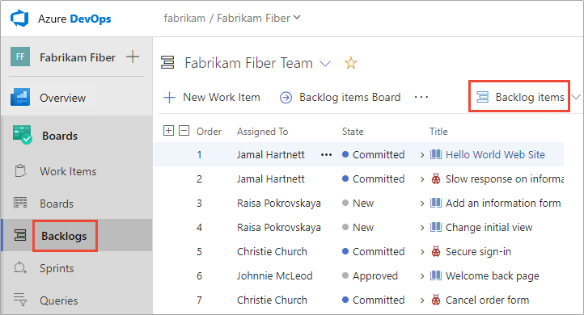
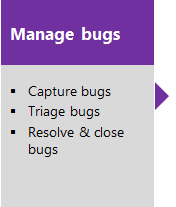
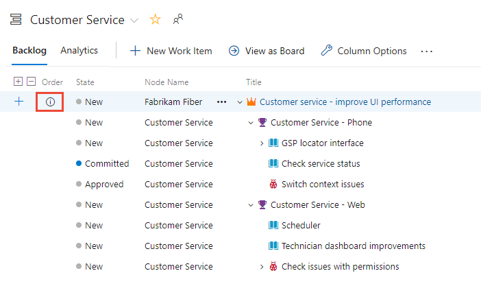

# Use backlogs to manage projects

[!INCLUDE [version-lt-eq-azure-devops](../../includes/version-lt-eq-azure-devops.md)]

With **backlogs**, you can quickly plan your project by adding user stories or requirements to your product backlog. Once you have your plan in place, you can start driving code development efforts. 

If you're a project administrator, see [Configure and customize Azure Boards](../configure-customize.md), which shows you how to define area and iteration paths and customize your work item types. When you create a project or add a team, your backlog automatically gets created. Each team has access to their own product, portfolio, and sprint backlogs as described in [About teams and Agile tools](../../organizations/settings/about-teams-and-settings.md#each-team-gets-their-own-set-of-tools). 

## About backlogs

An Azure Boards backlog is a prioritized list of work items that guides your developments team's effort, helps manage project scope, and facilitates effective communication and collaboration through the software development lifecycle.

Use backlogs to do the following tasks: 

::: moniker range=">= azure-devops-2020"  

- [Define user stories, product backlog items, or requirements](create-your-backlog.md)
- [Reorder your backlog](create-your-backlog.md#move-items-priority-order)
- [Add details and estimates to your backlog items](create-your-backlog.md#estimates)  
- [Bulk update](bulk-modify-work-items.md)
- [Drag items to a sprint](../sprints/assign-work-sprint.md)
- [Map backlog items within a hierarchy](organize-backlog.md)  
- [Review the hierarchy or portfolio of work assigned to multiple teams](#multi-team)
- [Forecast work](../sprints/forecast.md)
- [Display rollup progress, counts, or totals](display-rollup.md)

::: moniker-end 

::: moniker range="< azure-devops-2020"  

- [Define user stories, product backlog items, or requirements](create-your-backlog.md)
- [Reorder your backlog](create-your-backlog.md#move-items-priority-order)
- [Add details and estimates to your backlog items](create-your-backlog.md#estimates)
- [Bulk update](bulk-modify-work-items.md)
- [Drag items to a sprint](../sprints/assign-work-sprint.md)
- [Map backlog items within a hierarchy](organize-backlog.md)  
- [Review the hierarchy or portfolio of work assigned to multiple teams](#multi-team)
- [Forecast work](../sprints/forecast.md)
::: moniker-end 

[!INCLUDE [temp](../includes/setup-backlogs-boards.md)]

## Product and portfolio backlogs 

Backlogs present work items as lists. A **product backlog** represents your project plan, the roadmap for what your team plans to deliver. It also provides a repository of all the information you need to track and share with your team. 

In [Agile methodologies](/devops/plan/what-is-agile), a **portfolio backlog** allows you to group and organize your backlog into a hierarchy and displays high-level initiatives, epics, or projects that your organization plans to work on over a longer period of time. These initiatives are often too large or complex to fit within the scope of a single team's backlog, and they require coordination and planning at a higher organizational level.

::: moniker range=">= azure-devops-2019"

  

::: moniker-end

## Backlog configuration 

[!INCLUDE [temp](../includes/note-add-backlog-board.md)]

Each backlog is associated with a team and the team configuration settings determine the work items that appear on the team backlog. The team administrator does the following tasks for their team: 

- Select the Area Paths that are active for the team, only work items assigned to these area paths appear on the team's backlog  
- Set the default Area Path and Iteration Path used when defining work items from the team backlog 
- Select the Iteration Paths that are active for the team
- Determine which backlog levels are active for the team 
- Define how bugs get treated, as requirements or as tasks

For more information, see the following articles: 
- [Define iteration (sprint) paths and configure team iterations](../../organizations/settings/set-iteration-paths-sprints.md)
- [Define area paths and assign to a team](../../organizations/settings/set-area-paths.md)
- [Select backlog levels](../../organizations/settings/select-backlog-navigation-levels.md)
- [Show bugs on backlogs or boards](../../organizations/settings/show-bugs-on-backlog.md)

::: moniker range=">= azure-devops-2019"
[!INCLUDE [temp](../includes/tip-configure-backlog-view.md)]
::: moniker-end

### Common backlog configurations for multiple teams 

**Question**: *Can you define a backlog configuration that multiple teams can subscribe to?*
**Answer**: *No. Each team controls their own team settings and backlog configurations.*

::: moniker range="azure-devops"
Because each user can configure their own **Column Options** and **View Options**, there's no way to configure a common backlog view for all teams. Also, there's no default column options that can be set for each team.  
::: moniker-end

::: moniker range="< azure-devops"
Because each user can configure their own **Column Options** and **View Options**, there's no way to configure a common backlog view for all teams. You can, however, define the default column options for all team members by editing the process configuration. To learn how, see [Process configuration XML element reference, Set default columns](../../reference/xml/process-configuration-xml-element.md#columns). 
::: moniker-end
 
## Define work items and create your backlog  

You build your project plan by creating a backlog of work items. These items represent the features, requirements, user stories, or other work to complete. Portfolio backlogs provide support for organizing work in a hierarchical fashion. They help track major product initiatives or scenarios that rely on many stories or requirements.  Different types of work items help you track different types of work, such as user stories, tasks, bugs, issues, and more.  

## Backlog priority or stack rank order

 

The sequence of items on each backlog is determined according to where you've [added the items or moved the items on the page](create-your-backlog.md#move-items-priority-order). As you drag items within the backlog list, a background process updates the [**Stack Rank** (Agile and CMMI processes)](../queries/planning-ranking-priorities.md) or [**Backlog Priority** (Scrum process)](../queries/planning-ranking-priorities.md) fields. These fields are used by the system to track the relative ranking of items on the product, feature, epic, or other portfolio backlog. By default, these fields don't appear on the work item form. 

  

Don't use the bulk modify function to change the value of the backlog priority field. While you can assign a value to these fields, you assign the same value to all items you've selected for bulk edit.  

The preferred method for bulk edit is to use multi-select to move items to the top, bottom, or specific position within the page. If you must edit one of the backlog order fields in bulk to get a large number of work items in the priority order you want, use [Excel](../backlogs/office/bulk-add-modify-work-items-excel.md). You can export a query containing the backlog items, update either the Backlog Priority or Stack Rank fields, and then publish your changes. 

## In Progress items and work listed on the backlog 

Backlogs are designed to display work that corresponds to a Proposed, In Progress, or Resolved category state. Once you've completed work and its state enters a *Done*, or *Closed* state, then it falls off the backlog view. You can always [create a query](../queries/using-queries.md) to view completed work, or view the [**Recently completed** pivot from the **Work Items** page](../work-items/view-add-work-items.md). 

In general, you display all items that are in the **In Progress** category state, which corresponds to the *Active* and *Committed* states. To focus on work that is proposed but not in progress, you can toggle the backlog view to turn off [**In Progress**](create-your-backlog.md#convert-ideas). This toggle is useful when [forecasting your product backlog](../sprints/forecast.md). 

If your backlog is missing items, check whether the **In Progress** view is turned off. For more information, see [Workflow states and state categories](../work-items/workflow-and-state-categories.md). 

## Organize your backlog by mapping and reparenting backlog items 

When you have many initiatives your teams are working on, you may want to group the work according to these initiatives. By defining features and epics, you can group your work into a three-tiered hierarchy consisting of epics, features, and backlog items. 

For example, here the Customer Service team has organized several backlog items under two features and one epic. 

::: moniker range=">= azure-devops-2020"  

> [!div class="mx-imgBorder"]  
>   

::: moniker-end 

::: moniker range="=azure-devops-2019"

> [!div class="mx-imgBorder"]  
>   

::: moniker-end 

[!INCLUDE [temp](../includes/velocity-section.md)]

[!INCLUDE [temp](../includes/display-rollup-section.md)]

## Work with multi-team ownership of backlog items  

When you have several teams, your hierarchical views may show items that belong to other teams. 

### View backlog items and parent items owned by other teams

Your team's product backlog lists only those items whose area path matches items assigned to your team. But, if you show parents, you see the parent epic of the features and backlog items, even if another team owns the epic or feature. 

::: moniker range=">= azure-devops-2020"  

Other team-owned items appear with an information icon :::image type="icon" source="../../media/icons/info.png" border="false":::.  

> [!div class="mx-imgBorder"]  
>    

> [!TIP]    
> Add the **Node Name** field as a column to identify the area path/team associated with the work items. 

::: moniker-end 

::: moniker range="azure-devops-2019"

Other team-owned items appear with an information icon :::image type="icon" source="../../media/icons/info.png" border="false":::.  

> [!div class="mx-imgBorder"]  
>    

> [!TIP]    
> Add the **Node Name** field as a column to identify the area path/team associated with the work items. 

::: moniker-end 

   

For more information, see [Define area paths and assign to a team](../../organizations/settings/set-area-paths.md). 

### View epics and child items owned by other teams

Here's another example that shows the **Epics** backlog for the **Management** team. 
Drilling down, you can see all the backlog items and features, even though they 
belong to one of three different teams: Customer Service, Phone, and Web.  

::: moniker range=">= azure-devops-2020"  

> [!div class="mx-imgBorder"]  
>    

::: moniker-end 

::: moniker range="azure-devops-2019"

> [!div class="mx-imgBorder"]  
>    

::: moniker-end 

 

From these views, you can reparent items that you own and items other teams own. 
But, you can't reorder items that another team owns.  

This organization enables management teams to focus on high-level features and epics, and development teams to focus on just the backlog items they're responsible to deliver. [Add teams and set their area paths](../../organizations/settings/add-teams.md). For example, you can create a team structure similar to this one with two management and three development teams.

For more information about hierarchical team and backlog structures, see [Portfolio management](../plans/portfolio-management.md).

> [!IMPORTANT]
> You have the flexibility to establish child links with work items from different projects. However, if the processes differ between projects, the hierarchy won't be visible on the backlog for those child items residing in the separate projects. Nonetheless, you can view all of the associated child items directly on the work item form.

### Reordering and reparenting work items 

All backlogs and boards support dragging to reorder and reparent work items. Updates made to one team's backlogs and boards are reflected in other team backlogs and boards that share the same area path. You may need to refresh the page to view the changes. 

You can only use dragging to reorder or reparent work items assigned to area paths selected for your team. When the **Parents** view option is enabled, work items may appear on your backlog that your team doesn't own. Anything that appears with the :::image type="icon" source="../../media/icons/info.png" border="false"::: information icon can't be reordered nor reparented as another team owns it.  
 
:::image type="content" source="../plans/media/config-teams/information-message-owned-by-other-team.png" alt-text="Screenshot of information message on team ownership.":::

## Display leaf node work items  

For TFS 2018 and earlier versions, the Kanban board only shows the leaf node with nested items of a same-category hierarchy. For all versions, sprint backlogs and Taskboards only show the last node in a same-category hierarchy, called the leaf node. 

[!INCLUDE [temp](../includes/display-leaf-nodes.md)]  

## Product backlog controls

You can use the following controls to change or filter your product backlog view. 

> [!IMPORTANT]  
> If you turn the **In Progress** control off, then items that are in the *Active*, *Committed*, or *Resolved* states or in the In Progress category workflow state won't appear in the backlog. To learn more about category workflow states, see [How to use workflow states and state categories](../work-items/workflow-and-state-categories.md).

::: moniker range=">= azure-devops-2019"
For more information about using each of these controls, see [Configure your backlog view](configure-your-backlog-view.md).
::: moniker-end

:::row:::
   :::column span="":::
      **Icon or Link**
   :::column-end:::
   :::column span="":::
      **Control**
   :::column-end:::
   :::column span="2":::
      **Function**
   :::column-end:::
:::row-end:::
---
:::row:::
   :::column span="":::
      **Backlog**   
   :::column-end:::
   :::column span="":::
         
   :::column-end:::
   :::column span="2":::
      [Switch to backlog view](create-your-backlog.md) 
   :::column-end:::
:::row-end:::
::: moniker range=">= azure-devops-2020"
:::row:::
   :::column span="":::
      **Analytics**  
   :::column-end:::
   :::column span="":::
         
   :::column-end:::
   :::column span="2":::
      [Switch to Analytics in-context reports](../../report/dashboards/overview.md#work-tracking-analytics) 
   :::column-end:::
:::row-end:::
::: moniker-end

::: moniker range=">= azure-devops-2019"
:::row:::
   :::column span="":::
      :::image type="icon" source="../../media/icons/backlogs.png" border="false":::
   :::column-end:::
   :::column span="":::
      Backlog selector
   :::column-end:::
   :::column span="2":::
      [Switch backlog view](create-your-backlog.md)
:::row-end:::
::: moniker-end
::: moniker range=">= azure-devops-2020"
:::row:::
   :::column span="":::
      :::image type="icon" source="../../media/icons/view-options-icon.png" border="false":::  
   :::column-end:::
   :::column span="":::
      View options
   :::column-end:::
   :::column span="2":::
      - [Turn Parents on/off](organize-backlog.md) (not available for top-level portfolio backlog) 
      - [Turn Forecasting on/off](../sprints/forecast.md) (Only available on product backlog) 
      - [Turn In Progress items on/off](create-your-backlog.md#show-hide-in-progress)  
      - [Turn Completed child items on/off](create-your-backlog.md#show-hide-completed)  
      - [Show Mapping](organize-backlog.md) (not available for top-level portfolio backlog) 
      - [Show Planning](../sprints/assign-work-sprint.md)
   :::column-end:::
:::row-end:::
::: moniker-end
::: moniker range="azure-devops-2019"
:::row:::
   :::column span="":::
      :::image type="icon" source="../../media/icons/view-options-icon.png" border="false"::: 
   :::column-end:::
   :::column span="":::
      View options
   :::column-end:::
   :::column span="2":::
      - [Turn Parents on/off](organize-backlog.md) (not available for top-level portfolio backlog) 
      - [Turn Forecasting on/off](../sprints/forecast.md) (Only available on product backlog)  
      - [Turn In Progress items on/off](create-your-backlog.md#show-hide-in-progress)   
      - [Show Mapping](organize-backlog.md) (not available for top-level portfolio backlog) 
      - [Show Planning](../sprints/assign-work-sprint.md)  
   :::column-end:::
:::row-end:::
::: moniker-end
::: moniker range=">= azure-devops-2019"
:::row:::
   :::column span="":::
        
   :::column-end:::
   :::column span="":::
      Filter
   :::column-end:::
   :::column span="2":::
      [Turn filtering On/Off](filter-backlogs-boards-plans.md)
   :::column-end:::
:::row-end:::
:::row:::
   :::column span="":::
       :::image type="icon" source="../../media/icons/blue-gear.png" border="false":::    
   :::column-end:::
   :::column span="":::
      Settings
   :::column-end:::
   :::column span="2":::
      [Manage teams and configure team tools](../../organizations/settings/manage-teams.md) 
   :::column-end:::
:::row-end:::
:::row:::
   :::column span="":::
       /   
   :::column-end:::
   :::column span="":::
      Full screen  
   :::column-end:::
   :::column span="2":::
      Enter or exit full screen mode
   :::column-end:::
:::row-end:::
::: moniker-end

:::row:::
   :::column span="":::
       /  
   :::column-end:::
   :::column span="":::
      Expand/Collapse
   :::column-end:::
   :::column span="2":::
      Expand or collapse one level of the tree hierarchy
   :::column-end:::
:::row-end:::
::: moniker range=">= azure-devops-2019"
:::row:::
   :::column span="":::
       
   :::column-end:::
   :::column span="":::
      More commands
   :::column-end:::
   :::column span="2":::
      - [Set column options](set-column-options.md)  
      - [Create Query](../queries/organize-queries.md)  
      - [Send email](../work-items/email-work-items.md)   
   :::column-end:::
:::row-end:::
::: moniker-end
---

> [!NOTE]   
> Even if you have show parents turned on, the **Create Query** and **Email**  controls only list items at the currently selected level.

## Permissions and access

As a member added to the Contributors group of a project, you can use most features provided under **Boards** or **Work**. Users with Basic access have full access to all features. Users with Stakeholder access are limited to certain features. For more information, see [Stakeholder access quick reference](../../organizations/security/stakeholder-access.md). 

For more information about permissions and access, see [Permissions and access for work tracking](../../organizations/security/permissions-access-work-tracking.md) and [Stakeholder access quick reference](../../organizations/security/stakeholder-access.md).   

To add users to a project, see [Add users to a project or team](../../organizations/security/add-users-team-project.md).

[!INCLUDE [temp](../includes/add-portfolio-backlogs.md)]

## Next steps  

If you're just getting started, see [Start using Azure Boards](../get-started/index.md). 

## Related articles 

- [Web portal navigation](../../project/navigation/index.md) 
- [About Kanban and Agile project management](../boards/kanban-overview.md)  
- [About work items](../work-items/about-work-items.md)  
- [What is Agile?](/devops/plan/what-is-agile)   
- [What is Agile development?](/devops/plan/what-is-agile-development)  
- [Agile culture](/devops/plan/adopting-agile) 
