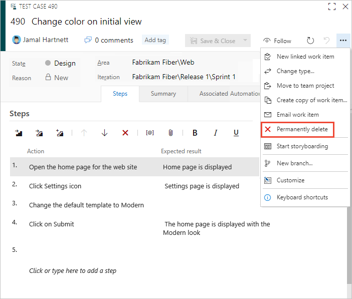
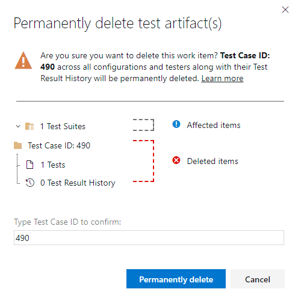
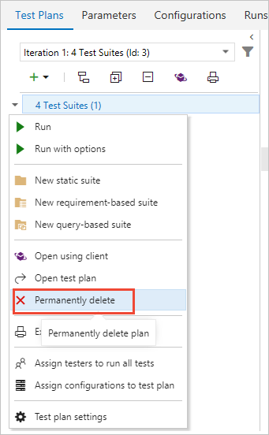
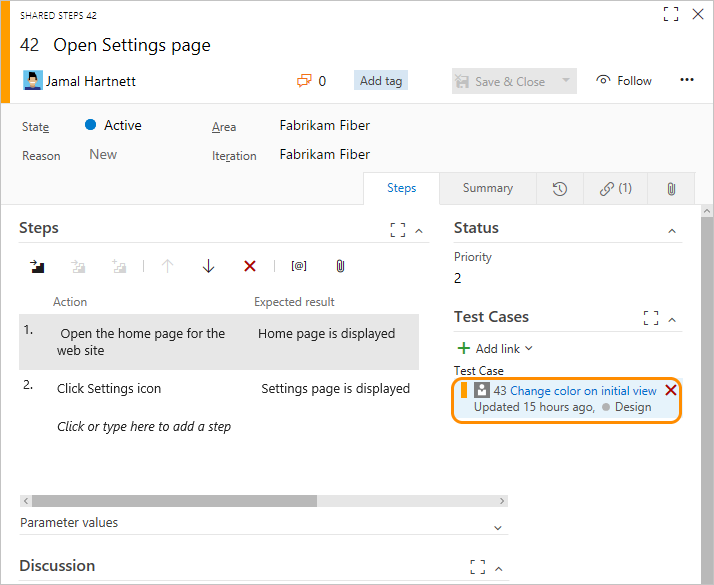

# Delete test artifacts in Azure Boards

[!INCLUDE [temp](../includes/version-vsts-tfs-2017-on.md)]

 

While test artifacts such as test plans, test suites, test cases, and so on, are all types of work items, the method for deleting them differs from deleting non-test work items. 

> [!IMPORTANT]  
> We only support permanent deletion of test artifacts such as test plans, test suites, test cases, shared steps and shared parameters. Deleted test artifacts won't appear in the recycle bin and cannot be restored. Deletion of test artifacts not only deletes the selected test artifact but also all its associated child items such as child test suites, test points across all configurations, testers (the underlying test case work item doesn't get deleted), test results history, and other associated history.

When you delete test artifacts, the following actions occur:

1.	Removes the deleted test artifact from the test case management (TCM) data store and deletes the underlying work item
2.	Runs a job to delete all the child items both from the TCM side and the underlying work items. This action may take time (up to a few minutes) depending on the number of artifacts to be deleted. 
3.	Causes all information in the work item tracking data store and TCM data store to be deleted and cannot be reactivated nor restored. 

## Prerequisites

::: moniker range=">= azure-devops-2019"

- To delete test runs, you must be a member of the Project Administrators group or have the project-level [**Delete test runs**](../../organizations/security/set-project-collection-level-permissions.md#project-level) permission set to **Allow**. 
- To delete test plans and test suites, you must be a member of the Project Administrators group or have the Area Path node-level [**Manage test plans** or **Manage test suites**](../../organizations/security/set-permissions-access-work-tracking.md#manage-test-artifacts) permission set to **Allow**. 
- To manage or delete test artifacts, you must also have your [access level](../../organizations/security/access-levels.md) set to **Basic + Test Plans** or **Visual Studio Enterprise**. This level provides access to the full Test Plans feature set. Users with Basic access and with permissions to permanently delete work items and manage test artifacts can only delete orphaned test cases. That is, they can delete test cases created from **Work** that aren't linked to any test plans or test suites. 

::: moniker-end

::: moniker range="< azure-devops-2019"

- To delete test runs, you must be a member of the Project Administrators group or have the project-level [**Delete test runs**](../../organizations/security/set-project-collection-level-permissions.md#project-level) permission set to **Allow**. 
- To delete test plans and test suites, you must be a member of the Project Administrators group or have the Area Path node-level [**Manage test plans** or **Manage test suites**](../../organizations/security/set-permissions-access-work-tracking.md#manage-test-artifacts) permission set to **Allow**. 
- You must also have your [access level set to Basic+Test Plans or Advanced](../../organizations/security/change-access-levels.md), which provides access to the full Test feature set. Users with Basic access and with permissions to permanently delete work items and manage test artifacts can only delete orphaned test cases. That is, they can delete test cases created from **Work** that aren't linked to any test plans or test suites. 

::: moniker-end

To delete test artifacts, the following restrictions and operations apply:  
- Users with Basic access and with permissions to permanently delete work items and manage test artifacts can only delete orphaned test cases. That is, they can delete test cases created from **Work** that aren't linked to any test plans or test suites.  
- When you delete a test plan, test suite, test case, shared steps, or shared parameters, you not only permanently delete them, you also delete all associated test artifacts such as test results.  
- You can't bulk delete test artifacts. If test artifacts are part of a bulk selection to be deleted, all other work items except the test artifact(s) will get deleted.

::: moniker range="tfs-2017" 

> [!NOTE]   
> The permanently delete feature of test artifacts is available for TFS 2017.1 and later versions. 

::: moniker-end

## Work item types that support the test experience  

The following image illustrates the set of work item types that support the test experience and work with Microsoft Test Manager. These work item types are linked together using the link types shown. 

  

From the web portal or Microsoft Test Manager, you can view which test cases are defined for a test suite, 
and which test suites are defined for a test plan. 
However, these objects aren't connected to each other through link types. For definitions of each field used in these work item types, see [Query based on build and test integration fields](../queries/build-test-integration.md).

## Delete a test case

1. To delete a test case, open it from the web portal and choose the **Permanently delete** option from the actions menu. (Bulk deletion isn't supported from a query results page.)     
 
	  

	> [!NOTE] 
	>You'll only see the **Permanently delete** option if you have the necessary permissions and access. 

2. Confirm you want to actually delete the item.  
  
	  
 
3. You can also delete test plans and test suites directly from **Test**. 

	  

4.	To delete shared steps and shared parameters, you need to first manually remove all references to them before you can delete them. 
	
	  

## Related articles   

- [Create a test plan](../../test/create-a-test-plan.md)
- [Control how long to keep test results](../../test/how-long-to-keep-test-results.md) 
- [Set permissions and access for work tracking, Manage test artifacts](../../organizations/security/set-permissions-access-work-tracking.md#manage-test-artifacts)

