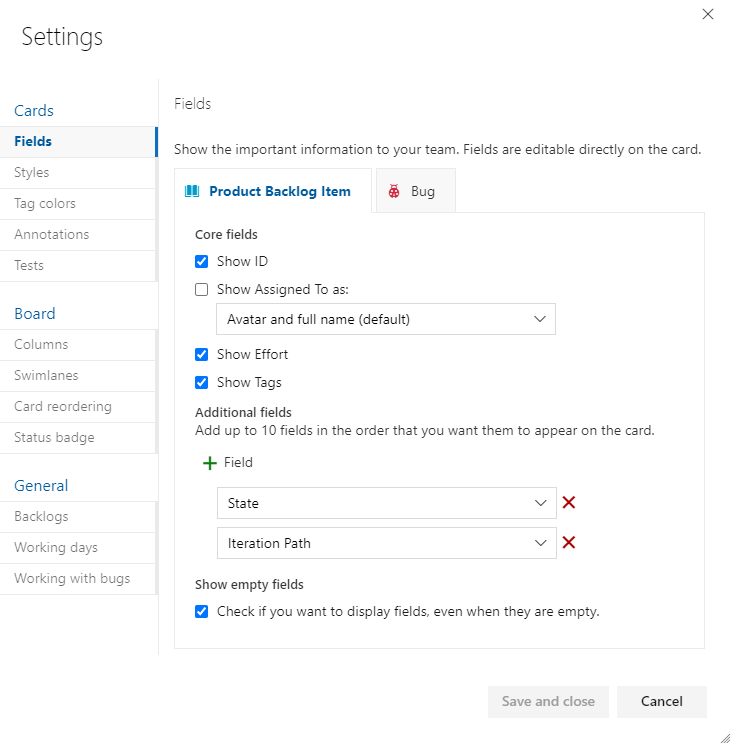
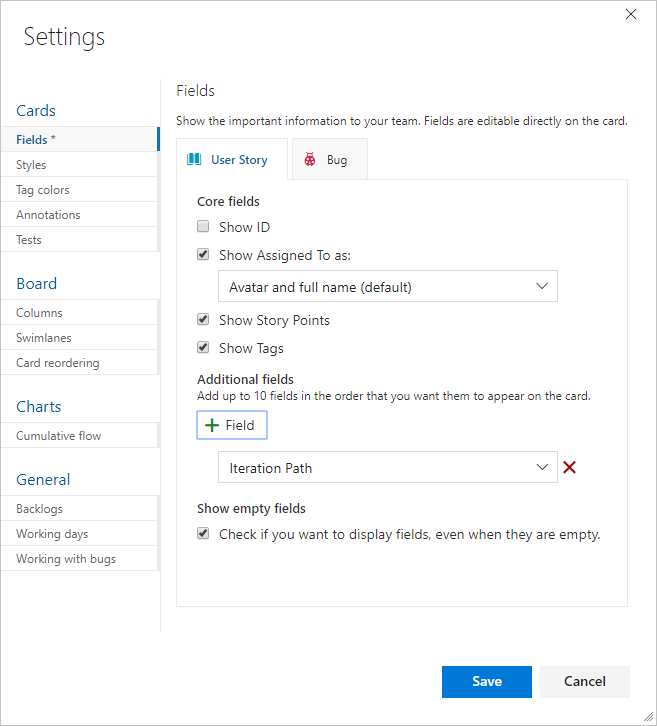
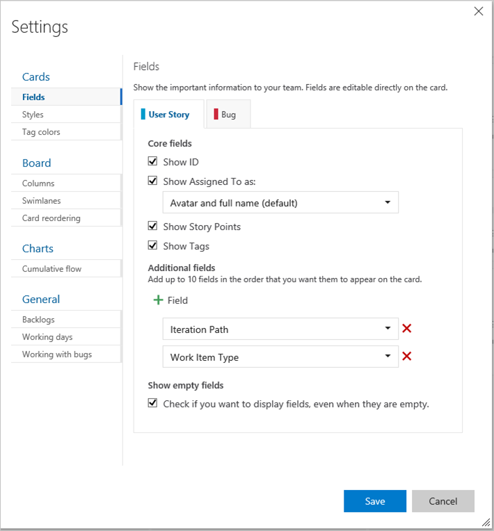
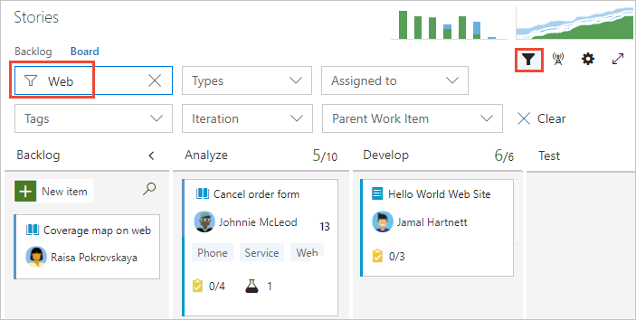
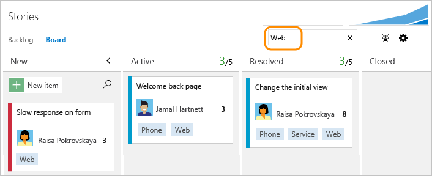
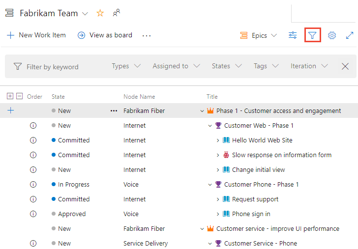
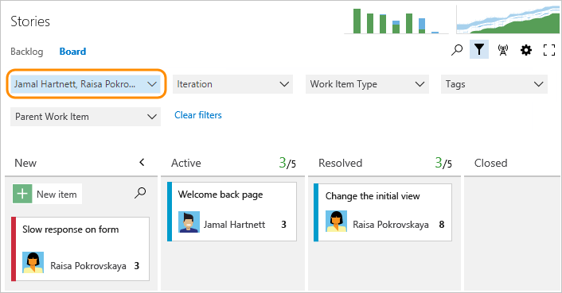
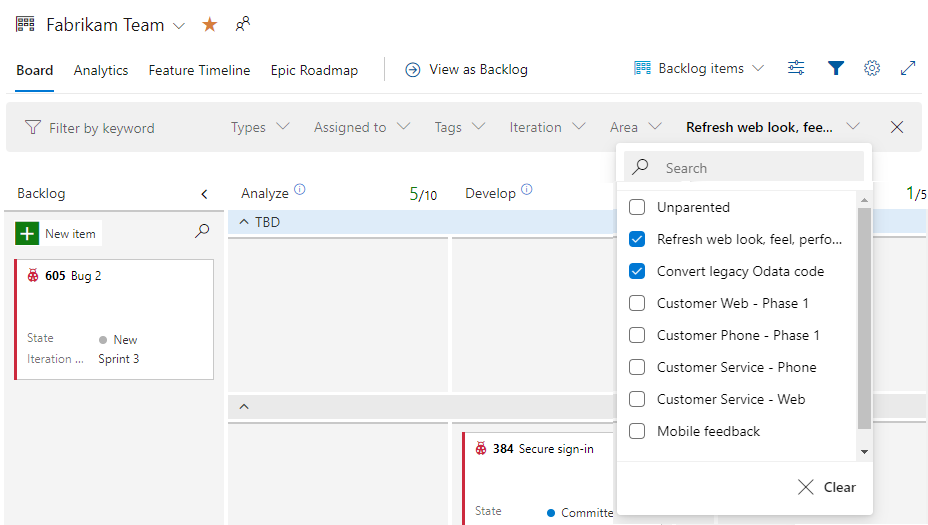
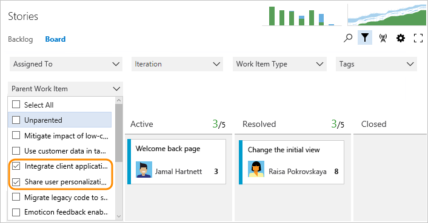

 
# Filter backlogs, boards, queries, and plans 

[!INCLUDE [temp](../includes/version-all.md)] 

<a id="filter"></a>

When you have a large number of work items listed or displayed, filtering can support your ability to focus on a subset of them. With filtering, you can selectively choose what work items are listed or displayed. 

::: moniker range=">= azure-devops-2020"

Use filters to perform these tasks:  
- In daily scrum meetings, filter the Kanban board to focus on assigned work for a specific sprint. 
- Or, if your team uses the Taskboard, filter for a team member's completed assigned work. 
- To focus on a group of work items, filter based on the Parent Work Item, by Area Path, or Tags.  
- Triage work items, create a query and filter to focus on similar work grouped by Area Path or Tags. 

::: moniker-end 


::: moniker range=">= tfs-2017 < azure-devops-2020"

Use filters to perform these tasks:  
- In daily scrum meetings, filter the Kanban board to focus on assigned work for a specific sprint. 
- Or, if your team uses the Taskboard, filter for a team member's completed assigned work. 
- To focus on a group of work items, filter based on Area Path, or Tags.  
- Triage work items, create a query and filter to focus on similar work grouped by Area Path or Tags. 

::: moniker-end 


::: moniker range=">= tfs-2017"

## Supported filter functions 

::: moniker-end 

::: moniker range=">= azure-devops-2019"

Filter functions are available from all Azure Boards tools: Work items, Boards, Backlogs, Sprint Backlogs and Taskboards, Queries, and Delivery Plans. The set of features supported depends on the tool and Azure DevOps version. *(Use the content selector to view the filters available for your version.)* 


Supported options are indicated with a ✔️ or listed. 

::: moniker-end 


::: moniker range=">= tfs-2017 <= tfs-2018"

Filter functions are available from all Azure Boards tools: Boards, Backlogs, Sprint Backlogs, Taskboards, and Queries. The set of features supported depends on the tool and Azure DevOps version. *(Use the content selector to view the filters available for your version.)* 

Supported options are indicated with a ✔️ or listed. 

::: moniker-end 

<br/>

::: moniker range=">= tfs-2017"
---
:::row:::
   :::column span="1.5":::
      **Page** 
   :::column-end:::
   :::column span="1":::
      **Keywords** or **ID**
   :::column-end:::
   :::column span="2":::
      **Fields**
   :::column-end:::
   :::column span="1.5":::
      **Parent Work Item**
   :::column-end:::
   :::column span="1":::
      **Tags**
   :::column-end:::
:::row-end:::
---
::: moniker-end 
::: moniker range=">= azure-devops-2019"
:::row:::
   :::column span="1.5":::
      **Work items** 
   :::column-end:::
   :::column span="1":::
      ✔️   
   :::column-end:::
   :::column span="2":::
      - Assigned To
      - Work Item Type
      - States
      - Area Path
   :::column-end:::
   :::column span="1.5":::
          
   :::column-end:::
   :::column span="1":::
      ✔️   
   :::column-end:::
:::row-end:::
---
::: moniker-end 
::: moniker range=">= tfs-2017"
:::row:::
   :::column span="1.5":::
      **Boards** 
   :::column-end:::
   :::column span="1":::
      ✔️   
   :::column-end:::
   :::column span="2":::
      - Assigned To
      - Work Item Type
      - States
      - Area Path
   :::column-end:::
   :::column span="1.5":::
      ✔️   
   :::column-end:::
   :::column span="1":::
      ✔️   
   :::column-end:::
:::row-end:::
---
::: moniker-end 
::: moniker range=">= tfs-2017"
:::row:::
   :::column span="1.5":::
      **Backlogs** 
   :::column-end:::
   :::column span="1":::
      ✔️   
   :::column-end:::
   :::column span="2":::
      - Assigned To  
      - Work Item Type  
      - States  
      - Area Path  
   :::column-end:::
   :::column span="1.5":::
          
   :::column-end:::
   :::column span="1":::
      ✔️   
   :::column-end:::
:::row-end:::
---
::: moniker-end 
::: moniker range=">= tfs-2017"
:::row:::
   :::column span="1.5":::
     **Sprints** (Backlogs  
     & Taskboards)
   :::column-end:::
   :::column span="1":::
      ✔️   
   :::column-end:::
   :::column span="2":::
      - Assigned To
      - Work Item Type
      - States  
      - Area Path  
   :::column-end:::
   :::column span="1.5":::
      ✔️    
   :::column-end:::
   :::column span="1":::
      ✔️   
   :::column-end:::
:::row-end:::
---
::: moniker-end 
::: moniker range=">= tfs-2017"
:::row:::
   :::column span="1.5":::
     **Queries**
   :::column-end:::
   :::column span="1":::
      ✔️   
   :::column-end:::
   :::column span="2":::
      - Work Item Types
      - Assigned To
      - States
   :::column-end:::
   :::column span="1.5":::
        
   :::column-end:::
   :::column span="1":::
      ✔️   
   :::column-end:::
:::row-end:::
---
::: moniker-end 
::: moniker range="azure-devops"
:::row:::
   :::column span="1.5":::
     **Plans (Preview)**
   :::column-end:::
   :::column span="1":::
      ✔️   
   :::column-end:::
   :::column span="2":::
      - Assigned To
      - Work Item Types
      - States
      - Area Path
      - Iteration Path
   :::column-end:::
   :::column span="1.5":::
      ✔️   
   :::column-end:::
   :::column span="1":::
      ✔️   
   :::column-end:::
:::row-end:::
---
::: moniker-end 
::: moniker range=">= azure-devops-2019"
:::row:::
   :::column span="1.5":::
     **Plans**
   :::column-end:::
   :::column span="1":::
      ✔️   
   :::column-end:::
   :::column span="2":::
      - Work Item Types
      - Assigned To
      - States 
   :::column-end:::
   :::column span="1.5":::
        
   :::column-end:::
   :::column span="1":::
      ✔️   
   :::column-end:::
:::row-end:::
---
::: moniker-end 

::: moniker range="<= tfs-2015"

You can use the keyword, ID, and tag filter functions with Boards, Backlogs, Sprint Backlogs, and Queries.   

::: moniker-end 

::: moniker range=">= tfs-2017"

### Characters ignored by keyword filter criteria

::: moniker-end 


::: moniker range=">= azure-devops-2019"

The filter criteria ignores the following characters: `,` (comma), `.` (period), `/` (forward slash), and `\` (back slash). 

::: moniker-end

::: moniker range=">= tfs-2017 <= tfs-2018"

The filter criteria ignores the following characters when the field value starts with the character: ```{, (, [, !, @, #, $, %, ^, &, *, ~, `, ', "```.  

::: moniker-end


::: moniker range=">= tfs-2017"

### Parent field and Parent Work Item filter

The **Parent** field was added to Azure Boards in July of 2019 and then made available with the release of Azure DevOps Server 2020.  You can add the **Parent** field to a list through the **Column Options** dialog, except for the **Work items** tool. While the Parent field was added, the ability to filter based on the **Parent Work Item** was added in July 2016.  

::: moniker-end

::: moniker range="azure-devops"
You can also add the **Parent** field to cards on the Kanban Boards and Taskboards. 
::: moniker-end


::: moniker range=">= tfs-2017"

The **Parent Work Item** filter enables you to focus on one or more select features or epics. This filter option is supported for Azure Boards and Azure DevOps Server 2020 and later versions.   

::: moniker-end 


## Open and clear filter functions 

::: moniker range=">= tfs-2017"
To show the filter toolbar, choose the :::image type="icon" source="../../media/icons/filter-icon.png" border="false"::: filter icon, or enter the **Ctrl+Shift+f** keyboard shortcut.  

::: moniker-end

::: moniker range="< tfs-2017"
To start filtering, choose the :::image type="icon" source="../media/icons/kanban-filter-icon.png" border="false"::: **Filter** icon. If you want to filter for a specific work item ID, you must choose to show IDs on the cards.

::: moniker-end

::: moniker range=">= azure-devops-2020"

> [!div class="mx-imgBorder"]  
> 

::: moniker-end

::: moniker range=">= tfs-2017"

> [!TIP]
> Type **Ctrl** + **Shift** + **f** to move your cursor to the filter box. To move the focus up or down within a column, use the **Tab** key.
> For more tips, see [Keyboard shortcuts](../../project/navigation/keyboard-shortcuts.md).

 <!--- not true anymore -->

::: moniker-end


To clear and dismiss filtering, choose the :::image type="icon" source="../../media/icons/close-filter.png" border="false"::: close filter icon.


## Apply keyword and ID filters

The keyword filter function filters lists or cards based on the text of **Column Options** or the fields displayed on cards. Therefore, when filtering, consider what fields contain the keyword text you want to filter on and make sure it is displayed. 

::: moniker range="<= tfs-2015"

The filter criteria ignores the following characters when the field value starts with the character: ```{, (, [, !, @, #, $, %, ^, &, *, ~, `, ', "```.  

::: moniker-end

 
<a id="text-filter"></a>

<!--- 
::: moniker range=">= azure-devops-2020"

> [!div class="mx-imgBorder"]  
> 

::: moniker-end

::: moniker range=">= tfs-2018 <= azure-devops-2019"



::: moniker-end

::: moniker range=">= tfs-2015 <= tfs-2017"



::: moniker-end

-->

The filter function displays work items based on any visible/displayed column or field, including tags, based on the keyword that you enter.

For example, here we filter the backlog to only show items that include 'Web' in any one of the displayed column fields.

::: moniker range=">= azure-devops-2020"

> [!div class="mx-imgBorder"]  
> 

::: moniker-end

::: moniker range=">= tfs-2017 < azure-devops-2020"



::: moniker-end

::: moniker range="tfs-2015"


::: moniker-end


### Filter backlogs and lists based on keywords  

You can use keywords to filter your backlogs or queries. The filter function lists those work items based on any visible/displayed column or field, including tags, based on the keyword that you enter. Also, you can enter a value for an ID, whether or not the ID field is visible.  

::: moniker range="tfs-2018"


> [!div class="mx-imgBorder"]  
>   


::: moniker-end


  

The filtered set is always a flat list, even if you've selected to show parents. 


::: moniker range="<= tfs-2017"


Here, we filter the backlog to only show items that include 'Web' in any one of the displayed column fields. 

  

The filtered set is always a flat list, even if you've selected to show parents.  

::: moniker-end


::: moniker range=">= tfs-2017"

<a id="field-filter" />


## Filter based on a field  


For example, to filter by Assign To, Iteration Path, or Work Item Type&mdash;or the contents of any other field&mdash;you add those fields to show on the cards. For details, see [Customize cards](../boards/customize-cards.md) for Kanban Boards and [Customize a sprint Taskboard](../sprints/customize-taskboard.md) for the Taskboard.


To add columns or fields, see the following articles: 
- For Backlogs and Queries, see [Change column options](set-column-options.md)
- For Boards, see [Customize cards](../boards/customize-cards.md)
- For Taskboards, see [Customize a sprint Taskboard](../sprints/customize-taskboard.md)
- For Plans, see [Review team delivery plans]( ../plans/review-team-plans.md). 

Choose one or more values from the multi-select drop-down menu for each field. The values for these fields are populated as follows:

- **Assigned To**: All users who are currently assigned to work items on the board plus Unassigned
- **Iteration**: All Iteration Paths [selected for the current team](../sprints/define-sprints.md) and for which there are work items assigned to that iteration 
- **Work item type**: Work item types defined for the Requirements Category (product backlog) or Features or Epic categories (feature or epic portfolio backlogs), subject to work items being assigned to the work item types
- **Tags**: All tags assigned to work items on the board
- **Parent Work Items**: All features defined for the team, or all epics defined for the team when viewing the Features board  

> [!NOTE]   
> Filter options are dependent on the work items that meet the filter criteria. For example, if you don't have any work items assigned to Sprint 4, then the Sprint 4 option won't appear in the filter options for the Iteration Path.  

Here we show a filtered backlog based on the keyword "issues". Filtered pages show the :::image type="icon" source="../../media/icons/filtered.png" border="false"::: filtered icon. The filtered set is always a flat list, even if you've selected to show a hierarchical backlog view. 

> [!div class="mx-imgBorder"]  
>    

::: moniker-end 

::: moniker range=">= tfs-2017"

### Filter boards using select field values

You can filter by select field values using the Kanban board for your product backlog (Stories, Product Backlog Items, or Requirements) or a portfolio backlog (Features or Epics).

::: moniker-end

::: moniker range=">= tfs-2017 <= azure-devops-2019"


::: moniker-end

::: moniker range=">= tfs-2017"

For example, here we filter for all items assigned to Jamal and Raisa.

::: moniker-end

::: moniker range=">= azure-devops-2020"

> [!div class="mx-imgBorder"]  
> 


::: moniker-end

::: moniker range=">= tfs-2017 <= azure-devops-2019"



::: moniker-end

::: moniker range=">= tfs-2017"

Filters remain in place until you explicitly clear them by clicking **Clear filters**. When you refresh your Kanban board or sign in from another browser, filters remain set to your previous values.

Once the board is filtered, you can click the filter icon to hide the drop downs and view the applied filters on the board. The filter icon also turns opaque to signify a filtered board.

::: moniker-end


::: moniker range=">= tfs-2017"

<a id="filter-logic"></a>

### Kanban board filter logic

Cards are filtered based on the assignments made in the following order and logic:

1. **Assigned to**:  Show all cards that are assigned to user 1 ```OR``` user 2
	```AND```
2. **Iteration**: Show all cards that are assigned to Iteration 1 ```OR```  Iteration 2
	```AND```
3. **Work Item type**: Show all cards that are work item type 1 ```OR``` work item type 2
	```AND```
4.	**Tags**: Show all cards that have tag 1 ```AND``` or ```OR``` tags 2, based on your selection of ```AND | OR```.
	```AND```
5.	**Parent Work Items**: Show all cards that have Parent Work Item 1 ```OR``` Parent Work Item 2.


::: moniker-end


::: moniker range=">= tfs-2017"

<a id="parent-filter"></a>

## Filter based on the Parent Work Item 

You can use the **Filter by parent** feature to filter by select parent work items using the Kanban board for your product backlog (Stories, Product Backlog Items, or Requirements) or a portfolio backlog (Features).

You can use this feature only when you've created features or epics and linked them to user stories or features, respectively. A quick and easy way to create the links is to [map them using drag-and-drop](organize-backlog.md). Mapping creates parent-child links between the work items.

> [!NOTE]
> The **Filter by parent**  feature doesn't support filtering of parent work items of the same work item type. For example, you can't filter the Stories backlog by specifying user stories that are parents of nested user stories.

To start filtering, choose **Filter** :::image type="icon" source="../media/icons/kanban-filter-icon.png" border="false":::. Choose one or more values from the multi-select drop-down menu for the Parent Work Item. These values are derived from the [Features](../boards/kanban-epics-features-stories.md) you've defined.

Here, we choose two features on which to filter the board.

::: moniker-end

::: moniker range=">= azure-devops-2020"

> [!div class="mx-imgBorder"]  
> 


::: moniker-end

::: moniker range=">= tfs-2017 <= azure-devops-2019"



::: moniker-end

::: moniker range=">= tfs-2017"


The final board displays just those stories linked as child work items to the selected features.

::: moniker-end 


## Filter based on tags

If you've added tags to your work items, you can filter your work using one or more tags. For backlogs and query results, add **Tags** as a column option prior to filtering on tags.  

 
::: moniker range=">= tfs-2017"

Check the boxes of those tags that you want to filter on. Keep the **OR** selection to perform a logical OR for all the  you selected. Or, choose the **AND** option to perform a logical AND on all the selected tags. 

> [!div class="mx-imgBorder"]
>  


::: moniker-end

::: moniker range="<= tfs-2015"

1. Turn on filtering and choose a tag.  

	  

	The list refreshes. Only those work items with the selected tag are displayed. Filtering the list disables add-a-backlog-item panel, stack ranking, and forecasting.  

	  

2. To apply a sub-filter, choose another tag. You filter successively by choosing from the set of tags that appear in the filter tag bar. To start your filter process over, choose All to show all tags.  

3. To show all items, choose All or choose the Tag filter image on backlog and queries pages filter icon to turn filtering off.   

::: moniker-end

To learn more about tags, see [Add tags to work items to categorize and filter lists and boards](../queries/add-tags-to-work-items.md).


## Related articles  

- [Set column options](set-column-options.md)   
- [Change column options](set-column-options.md)
- [Customize cards](../boards/customize-cards.md)
- [Customize a sprint Taskboard](../sprints/customize-taskboard.md)
- [Review team delivery plans]( ../plans/review-team-plans.md). 
- [Tags](../queries/add-tags-to-work-items.md) 


<!--- Other filter features cross-service  such as FIlter pipelines -->