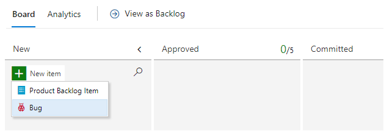
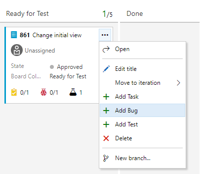
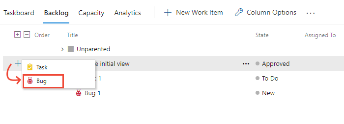
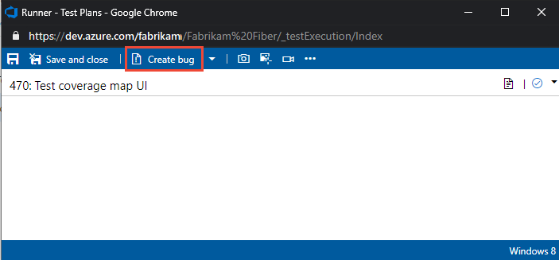
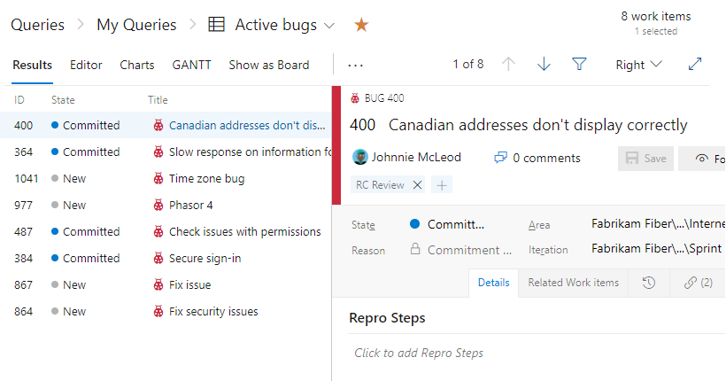
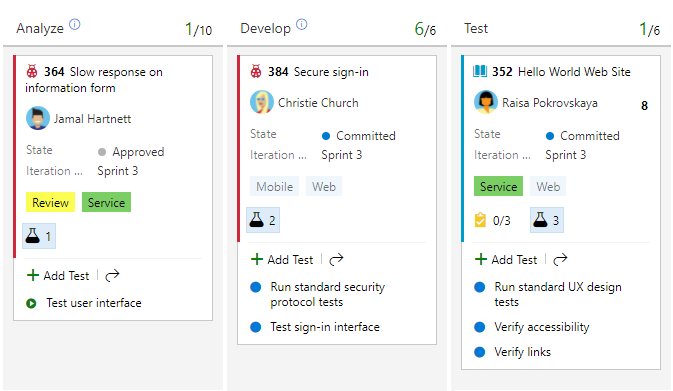
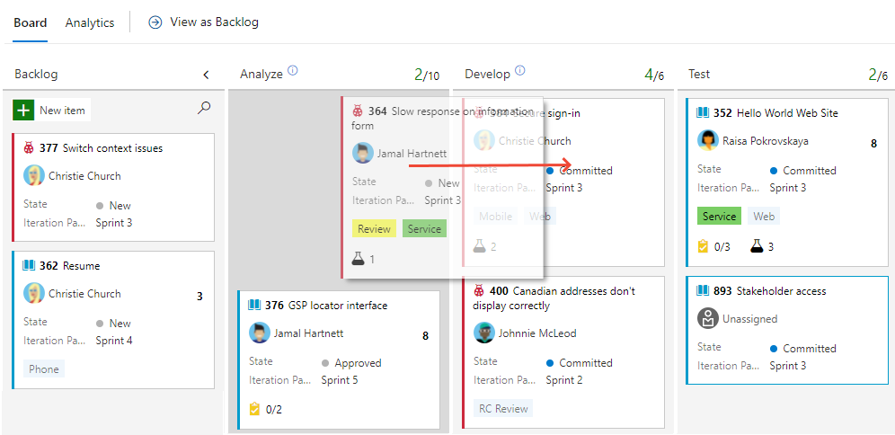
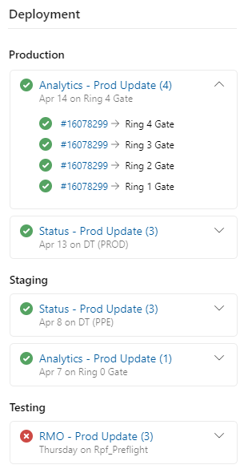
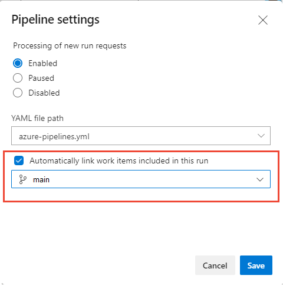
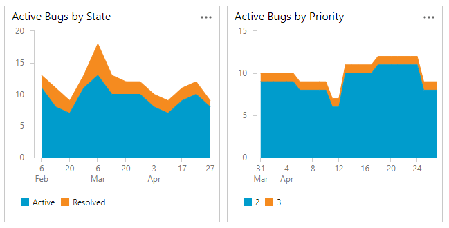

# Define, capture, triage, and manage software bugs in Azure Boards

[!INCLUDE [version-lt-eq-azure-devops](../../includes/version-lt-eq-azure-devops.md)]

How do you track and manage defects in your code? How do you make sure software problems and customer feedback get addressed quickly to support high-quality software deployments? And, how do you make good progress on new features and address your technical debt? 

At a minimum, you need a way to capture your software issues, prioritize them, assign them to a team member, and track progress. And, you want to manage your code defects in ways that align with your Agile practices. 

To support these scenarios, Azure Boards provides a specific work item type to track code defects named Bug. Bug work items share all the standard features of other work item types with a few more. For an overview of standard features, see [Track work with user stories, issues, bugs, features, and epics](../work-items/about-work-items.md).

Bugs also provide the following additional features:

- Options for each team to choose how they want to track bugs 
- Test tools to capture bugs 
- Built-in integration across Azure DevOps to track bugs linked to builds, releases, and tests


[!INCLUDE [temp](../includes/basic-process-bug-note.md)]  


[!INCLUDE [temp](../includes/prerequisites-work-items.md)]  

> [!TIP]
> To report a bug, a user must have at a minimum, **Stakeholder** access and **Edit work items in this node** permission set to **Allow** for the **Area Path** where they add the bug. For more information, see [Set permissions and access for work tracking](../../organizations/security/set-permissions-access-work-tracking.md)

## Bug work item type 

The following image shows the Bug work item type for the Scrum process. The Bug work item type for Agile and CMMI processes tracks similar information. It's designed to appear on the product backlog along with requirements or on the Taskboard along with tasks.  
 
[!INCLUDE [temp](../includes/image-differences-with-wits.md)] 

::: moniker range=">= azure-devops-2020"
> [!div class="mx-imgBorder"]  
> 
::: moniker-end

::: moniker range="< azure-devops-2020"

::: moniker-end


## Fields specific to bugs  

The Bug work item type uses some bug-specific fields. To capture both the initial issue and ongoing discoveries, use the fields described in the following table. For information about fields specific to the Bug defined for the Capability Maturity Model Integration (CMMI) process, see [Bugs, issues, and risks field reference](../work-items/guidance/cmmi/guidance-bugs-issues-risks-field-reference-cmmi.md). For information about all other fields, see [Work item field index](../work-items/guidance/work-item-field.md). 

---
:::row:::
   :::column span="1":::
      **Field, Group, or Tab** 
   :::column-end:::
   :::column span="3":::
      **Usage**
   :::column-end:::
:::row-end:::
---
:::row:::
   :::column span="1":::
      [Steps to Reproduce](../queries/titles-ids-descriptions.md)  
      (friendly name=Repro Steps)
   :::column-end:::
   :::column span="3":::
      Use to capture enough information so that other team members can fully understand the code defect. Include actions taken to find or reproduce the bug and expected behavior.   
   :::column-end:::
:::row-end:::
---
:::row:::
   :::column span="1":::
      [System Info](../queries/titles-ids-descriptions.md)  
      [Found In Build](../queries/build-test-integration.md) 
   :::column-end:::
   :::column span="3":::
       Information about the software and system configuration that is relevant to the bug and tests to apply.  The **System Info** and **Found in Build** fields are automatically filled in when you create a bug through a testing tool. These fields specify information about the software environment and build where the bug occurred. For more information, see [Test different configurations](../../test/test-different-configurations.md). 
   :::column-end:::
:::row-end:::
---
:::row:::
   :::column span="1":::
      [Acceptance Criteria](../queries/titles-ids-descriptions.md)
   :::column-end:::
   :::column span="3":::
      Provide the criteria to meet before the bug can be closed. Before work begins, describe the customer acceptance criteria as clearly as possible. Teams should use this criteria as the basis for acceptance tests, and to evaluate whether an item has been satisfactorily completed.
   :::column-end:::
:::row-end:::
---
:::row:::
   :::column span="1":::
      [Integrated in Build](../queries/build-test-integration.md) 
   :::column-end:::
   :::column span="3":::
      Specifies the name of the build that incorporates the code that fixes the bug. This field should be specified when you resolve the bug. 
      For on-premises Azure DevOps, to access a drop-down menu of all builds that have been run, you can update the `FIELD` definitions for **Found in Build** and **Integrated in Build** to reference a global list. The global list is automatically updated with each build that is run. For more information, see [Query based on build and test integration fields](../queries/build-test-integration.md).  
      For information about how to define build numbers, see [build number format options](../../pipelines/build/options.md). 
   :::column-end:::
:::row-end:::
---
:::row:::
   :::column span="1":::
      [Priority](../queries/planning-ranking-priorities.md)<sup>1</sup>
   :::column-end:::
   :::column span="3":::
      - **1**: Product requires successful resolution of the work item before it ships and addressed soon.
      - **2**: Product requires successful resolution of the work item before it ships, but doesn't need to be addressed immediately.
      - **3**: Resolution of the work item is optional based on resources, time, and risk.
   :::column-end:::
:::row-end:::
---
:::row:::
   :::column span="1":::
      [Severity](../queries/planning-ranking-priorities.md)<sup>1</sup>
   :::column-end:::
   :::column span="3":::
      A subjective rating of the impact of a bug or work item on the project or software system. For example: If a remote link within the user interface&mdash;a rare event&mdash;causes an application or web page to crash&mdash;a severe customer experience, you might specify **Severity = 2 - High** and **Priority = 3**.  Allowed values and suggested guidelines are: 
      - **1 - Critical**: Must fix. A defect that causes termination of one or more system components or the complete system, or causes extensive data corruption. And, there are no acceptable alternative methods to achieve required results.
      - **2 - High**: Consider fix. A defect that causes termination of one or more system components or the complete system, or causes extensive data corruption. However, an acceptable alternative method exists to achieve required results.
      - **3 - Medium**: (Default) A defect that causes the system to produce incorrect, incomplete, or inconsistent results.
      - **4 - Low**: A minor or cosmetic defect that has acceptable workarounds to achieve required results. 
   :::column-end:::
:::row-end:::
---
::: moniker range=">= azure-devops-2019"
:::row:::
   :::column span="1":::
      [Deployment](#deployment-control)
   :::column-end:::
   :::column span="3":::
      The **Deployment** control supports links to and display of releases that contain work items. To use the control, you must enable settings for the release. For more information, see [Link work items to releases](#deployment-control) later in this article.  
   :::column-end:::
:::row-end:::
---
::: moniker-end
:::row:::
   :::column span="1":::
      [Development](#development-control) 
   :::column-end:::
   :::column span="3":::
      The **Development** control supports links to and display of links made to development objects. These objects include Git commits and pull requests, or TFVC changesets and versioned items. You can define links from the work item or from the commits, pull requests, or other development objects. For more information, see [Link work items to development](#development-control) later in this article. 
   :::column-end:::
:::row-end:::
---


### Notes: 

<sup>1</sup> To change the menu selection or picklist, see [Customize the work tracking experience](../../reference/customize-work.md). The customization method depends on the process model used by your project. 


## Choose how your team tracks bugs

Your team can track bugs as requirements or as tasks. To support the team choice, consider the following factors.

- Size of your team. Smaller teams can maintain a lightweight footprint by tracking bugs as requirements.
- Organization requirements to track work. If your team is required to track hours, then choose to track bugs as tasks.
- How your team organizes work. If your team relies on the product backlog to prioritize work and add bugs, track bugs as requirements.
- Tools your team wants to use such as the Planning pane, velocity chart, forecast, rollup, and delivery plans. Tracking bugs as tasks prevents use of several of these tools.  

The following table summarizes the three options teams have to track bugs. To learn more and to set the option for your team, see [Show bugs on backlogs and boards](../../organizations/settings/show-bugs-on-backlog.md). 

[!INCLUDE [temp](../includes/show-bugs-matrix-options.md)] 

<a id="customize"> </a>

## Customize work item type 

You can customize the Bug and other work item types. Or, create custom types to track software issues or customer feedback. With all work item types, you can customize the following elements: 

- Add or remove custom fields 
- Add custom controls or custom tabs within the work item form
- Customize the workflow states 
- Add conditional rules 
- Choose the backlog level in which work items appear 
  
Before you customize your process, we recommend you review [Configure and customize Azure Boards](../configure-customize.md). 

::: moniker range="azure-devops"
To customize your particular process, see [Customize an inheritance process](../../organizations/settings/work/inheritance-process-model.md).  
::: moniker-end

::: moniker range=">= azure-devops-2019 < azure-devops"
To customize your particular process, see [Customize an inheritance process](../../organizations/settings/work/inheritance-process-model.md) or [Customize the On-premises XML process model](../../reference/on-premises-xml-process-model.md). 
::: moniker-end


 

## Add or capture bugs 

You can define bugs from several different Azure DevOps tools. These include backlogs and boards and testing tools.  

> [!TIP]   
> By default, the **Title** field is the only required field when creating a bug. You can quickly add bugs in the same way you add user stories or product backlog items using Azure Boards. If you want to make some fields required, do that by adding conditional rules based on a state change. For more information, see [Add a rule to a work item type (Inheritance process)](../../organizations/settings/work/custom-rules.md). 

### Add a bug from your backlog or board 

If your team chose to *manage bugs with requirements*, you can define bugs from your product backlog or board. For more information, see [Create your product backlog](create-your-backlog.md) or [Start using your board](../boards/kanban-quickstart.md). 

- **Add a bug from the product backlog**  
	> [!div class="mx-imgBorder"]  
	>   

- **Add a bug from the product backlog**  
	> [!div class="mx-imgBorder"]  
	>   

> [!TIP]    
> When you add a bug from your product backlog or board, the bug is automatically assigned the default Area Path and Iteration Path defined for the team. For more information, see [Team defaults referenced by backlogs and boards](../../organizations/settings/about-teams-and-settings.md#team-defaults-referenced-by-backlogs-and-boards).


### Add a bug from your sprint backlog or Taskboard 

If your team chose to *manage bugs with tasks*, you can define bugs from your board, product backlog, Sprint backlog, or Sprint Taskboard. You add a bug as a child to a product backlog work item.  

- **Add a linked child bug from the board**  
    You add a bug in the same way you add a task to a backlog item. For more information, see [Add tasks or child items as checklists](../boards/add-task-checklists.md). 
	> [!div class="mx-imgBorder"]  
	>   

- **Add a linked child bug from the Sprint Backlog**  
	You add a bug in the same way you add a task to a Sprint backlog. For more information, see [Add tasks to backlog items](../sprints/add-tasks.md). 
	> [!div class="mx-imgBorder"]  
	>  

### Create a bug from a testing tool 

The two testing tools you can use to add bugs while testing include the web portal Test Runner and the Test & Feedback extension.  

- **Test Runner**: When running manual tests, you can choose to **Create bug**. For more information, see [Run manual tests](../../test/run-manual-tests.md).  
	> [!div class="mx-imgBorder"]  
	> 

- **Test & Feedback extension**: When running exploratory tests, you can choose to **Create bug** or **Create task**. For more information, see [Exploratory testing with the Test & Feedback extension](../../test/connected-mode-exploratory-testing.md) 
	  


<a id="fix-resolve-close">  </a>

## Bug lifecycle and workflow states

As with all other work item types, the Bug work item type has a well-defined workflow. Each workflow consists of three or more **States** and a **Reason**. Reasons specify why the item transitioned from one State to another. The following images illustrate the default bug workflow defined for the [Agile](../work-items/guidance/agile-process.md), [Scrum](../work-items/guidance/scrum-process.md), and [CMMI](../work-items/guidance/cmmi-process.md) processes.


| Agile | Scrum | CMMI | 
|------------|------------|-----------| 
|  |  |   |  

For Scrum bugs, you change the **State** from *Committed* (similar to *Active*) to *Done*. For Agile and CMMI, you first resolve the bug and select a reason that indicates the bug is fixed. Typically, the person who created the bug then verifies the fix and updates the **State** from *Resolved* to *Closed*. If more work has been found after a bug has been resolved or closed, you can reactivate it by setting the **State** to *Committed* or *Active*.

::: moniker range=">= azure-devops-2020"  
> [!NOTE]  
> The Agile process bug work item type previously had a rule which reassigned the bug to the person who created it. This rule has been removed from the default system process. You can reinstate this automation by adding a rule. For an Inheritance process, see [Apply rules to workflow states, Automate reassignment based on state change](../../organizations/settings/work/apply-rules-to-workflow-states.md#reassign).
 
::: moniker-end  

### Verify a fix 

To verify a fix, a developer or tester attempts to reproduce the bug and look for more unexpected behavior. If necessary, they should reactivate the bug.

When verifying a bug fix, you might find that the bug wasn't fixed or you might disagree with the resolution. In this case, discuss the bug with the person who resolved it, come to an agreement, and possibly reactivate the bug. If you reactivate a bug, include the reasons for reactivating the bug in the bug description.


<a id="close">  </a>

### Close a bug  

You close a bug once it's verified as fixed. However, you might also close a bug for one of the following reasons. Reasons available to select depend on the project process and the bug transition states. 

**Agile process:**

- **Deferred**: Defer bug fix until the next product release.
- **Fixed**: Bug is verified as fixed.
- **Duplicate**: Bug tracks another bug currently defined. You can link each bug with the **Duplicate/Duplicate of** link type and close one of the bugs. 
- **As Designed**: Feature works as designed.
- **Cannot Reproduce**: Tests prove that the bug can't be reproduced.
- **Obsolete**: The bug's feature is no longer in the product.
- **Copied to Backlog**: A user story has been opened to track the bug.

**Scrum process:**

- **Not a Bug**: Bug is verified that it isn't a bug.
- **Duplicate**: Bug tracks another bug currently defined. You can link each bug with the **Duplicate/Duplicate of** link type and close one of the bugs.  
- **Removed from the backlog**: Bug is verified that it isn't a bug. Remove the bug from the backlog. 
- **Work finished**: Bug has been verified as fixed.

**CMMI process:**

- **Deferred**: Defer bug fix until the next product release.
- **Duplicate**: Bug tracks another bug currently defined. You can link each bug with the **Duplicate/Duplicate of** link type and close one of the bugs.  
- **Rejected**: Bug is verified that it isn't a bug.  
- **Verified**: Bug is verified as fixed.


> [!TIP]   
> Once a bug has been closed and the fix is actively released in deployments, recommended practice is to never reopen it due to regression. Instead, you should consider opening a new bug and link to the older, closed bug. 

It's always a good idea to describe any more details for closing a bug in the **Discussion** field to avoid future confusion as to why the bug was closed. 

::: moniker range=">= azure-devops-2020"

### Automate bug closure when merging pull requests 

If your team uses a Git repository, you can set the State in linked bugs and other work items to close upon successful merging of pull requests. For more information, see [Set work item state in pull request](#set-state-pr) later in this article. 
::: moniker-end

## List and triage bugs  

Most teams, whatever option they chose to track bugs, define one or more bug queries. With queries, you can list active bugs, unassigned bugs, stale bugs, bug trends, and more. You can then add queries and query charts to your team dashboards to monitor bug status and progress. 

### Bug queries

Open a shared query or [use the query editor](../queries/using-queries.md) to create useful bug queries, such as the following options:
- Active bugs by priority (```State <> Done``` or ```State <> Closed```)
- In Progress bugs (```State = Committed``` or ```State = Active```)
- Bugs to fix for a target release (```Tags Contains RTM```)
- Recent bugs - bugs opened within the last three weeks (```Created Date > @Today-21```) 

Once you have the queries of interest to your team, you can [create status or trend charts](../../report/dashboards/charts.md). You can also add the chart you create to a [dashboard](../../report/dashboards/dashboards.md).  

### Triage mode in query results

Once you've started coding and testing, you'll want to hold periodic triage meetings to review and rank your bugs. Typically, the project owner runs the bug triage meetings. Team leads, business analysts, and other stakeholders who can speak about specific project risks attend the triage meetings.

The project owner can define a shared query for new and reopened bugs to list bugs to be triaged. 

From the query results page, you can quickly move up and down within the list of bug work items using the up and down arrows. As you review each bug, you can assign it, add details, or set priority. 


> [!div class="mx-imgBorder"]  
>   


### Organize and assign bugs to a sprint 

If your team *tracks bugs as requirements*, view the list of active bugs from your backlog. With the [filter function](filter-backlogs-boards-plans.md), you can focus solely on bugs. From the product backlog, you can also do the following tasks:  

- [Organize bugs on your backlog](create-your-backlog.md#reorder-your-backlog), stack rank against other items (stack ranking is disabled when filtering is enabled)  
- [Assign bugs to a sprint](../sprints/assign-work-sprint.md) from your backlog using the **Planning** pane  
- [Parent bugs to Features](organize-backlog.md#map-items-to-group-them-under-a-feature-or-epic) or other portfolio backlog items using the **Mapping** pane 
- [View rollup of work to portfolio backlog items](display-rollup.md).

If your team *tracks bugs as tasks*, use managed queries to list and triage bugs. Then, within each sprint, you'll see the bugs assigned to the sprint from the Sprint backlog or [Taskboard](../sprints/task-board.md).  

<a id="task-board-items"></a>

### Taskboard items versus query list items

You might notice and wonder why the items shown on a sprint Taskboard can differ from a query list created in a corresponding sprint backlog. 

It's possible to assign tasks or bugs to an iteration but not have them linked to a parent backlog item. These items appear in the created query, but might not show up on the Taskboard itself. The system runs the query and then applies a few background processes before displaying Taskboard items.

These reasons can cause work items that belong to the Task Category to not appear on a sprint backlog or Taskboard:  
- The task or bug hasn't been linked to a parent backlog item. Only bugs and tasks you've linked to a parent product backlog item (Scrum), user story (Agile), or requirement (CMMI) with an iteration path set to the sprint appears on the sprint backlog page.  
- The task or bug is a parent of another task or bug, or the user story is a parent of another user story. If you've created a hierarchy of tasks, bugs, or user stories, [only the child-level tasks or the child-level stories at the bottom of the hierarchy appear](resolve-backlog-reorder-issues.md).  
- The task's or bug's linked parent corresponds to a backlog item defined for another team. Or, the area path of the task's or bug's parent backlog item differs from the task's or bug's area path.  


## Create inline tests linked to bugs  

When your team *tracks bugs as requirements*, you can use the board to add tests to verify bug fixes. 

> [!div class="mx-imgBorder"]  
>  


## Update bug status 

You can update the bug status by dragging and dropping bugs to a new column on a board. 

- If your team *tracks bugs as requirements*, you use the board as shown in the following image.  For more information, see [Get started with your board](../boards/kanban-quickstart.md#update-status).  

	> [!div class="mx-imgBorder"]  
	>  

- If your team *tracks bugs as tasks*, you use the Taskboard. For more information, see [Update and monitor your Taskboard](../sprints/task-board.md).  

	> [!div class="mx-imgBorder"]  
	>  

### Customize your board to track intermediate states 

You can add intermediate columns to track your bug status on the board. You can also define queries that filter based on the status of a Board Column. For more information, see the following articles: 

::: moniker range=">= azure-devops-2020"

- [Add columns to your board](../boards/add-columns.md)
- [Customize a sprint Taskboard](../sprints/customize-taskboard.md)
- [Board change queries](../queries/query-by-workflow-changes.md#kanban-query-fields)

::: moniker-end

::: moniker range="< azure-devops-2020"

- [Add columns to your board](../boards/add-columns.md)
- [Board change queries](../queries/query-by-workflow-changes.md#kanban-query-fields)

::: moniker-end

### Automate bug reassignment based on workflow state 

To automate select actions, add custom rules to your Bug work item type. For example, add a rule as shown in the following image. This rule specifies to reassign a bug to the person who opened the bug once it's resolved. Typically, that person verifies that the bug is fixed and closes the bug. For more information, see [Apply rules to workflow states (Inheritance process)](../../organizations/settings/work/apply-rules-to-workflow-states.md).

> [!div class="mx-imgBorder"]  
>  


<a id="set-state-pr">  </a>

### Set work item state in pull request

::: moniker range=">= azure-devops-2020"

When you create a pull request, you can set the *state* value of the linked work items in the description. Follow the syntax: ``` {state value}: #ID ```.
When you merge the pull request, the system reads the description and updates the work item state. In the following example, we set work items #300 and #301 to Resolved, and #323 and #324 to Closed.

:::image type="content" source="/azure/devops/organizations/notifications/media/pr-set-state-of-work-items.png" alt-text="Screenshot of setting work item state within a PR.":::
 
::: moniker-end

::: moniker range="azure-devops-2020"
> [!NOTE]   
> This feature requires installation of Azure DevOps Server 2020.1 update. To learn more, see [Azure DevOps Server 2020 Update 1 RC1 Release Notes, Boards](/azure/devops/server/release-notes/azuredevops2020u1#customize-work-item-state-when-pull-request-is-merged).  
::: moniker-end

## Integration across Azure DevOps 

One of the methods used by Azure DevOps to support integration is to link objects to other objects.  Along with linking work items to work items, you can also link work items to other objects. Link to objects such as builds, releases, branches, commits, and pull requests as illustrated in the following image. 

> [!div class="mx-imgBorder"]  
>  
 
You can add a link from the work item or from the build and release objects. 


<a id="development-control"></a>

### Link work items to development 

The **Development** control supports linking to and displaying links made to builds, Git commits and pull requests. Or, when a TFVC repository is used, it supports links to changesets and versioned items. Choosing the link opens the corresponding item in a new browser tab. For more information, see [Drive Git development from a work item](connect-work-items-to-git-dev-ops.md).  
> [!div class="mx-imgBorder"]  
>   

<a id="deployment-control"></a>

### Link work items to releases   

The **Deployment** control supports links to and display of releases that contain the work items. For example, the following image shows several releases that contain links to the current work item. You can expand each release to see details about each stage. You can choose the link for each release and stage to open the corresponding release or stage. For more information, see [Link work items to deployments](../backlogs/add-link.md#link-work-items-to-deployments).  
> [!div class="mx-imgBorder"]  
>   

### Link work items to pipeline runs 

Pipelines are often defined to automatically run when a new commit occurs to a Git repository. Work items associated with the commit pipelines appear as part of the pipeline run if you customize your pipeline settings. For more information, see [Customize your pipeline](../../pipelines/customize-pipeline.md).  

> [!div class="mx-imgBorder"]  
>  
 
### Create or edit a work item upon a build failure

If you use classic pipelines (not YAML), you can create work items on a build failure. For more information, see [Build options, Create a work item on failure](../../pipelines/build/options.md). 

## Monitor bug status, assignments, and trends

You can track the bug status, assignments, and trends using queries that you can then chart and add to a dashboard. For example, here are two examples showing active bug trends by State and Active Bugs by Priority over time.

> [!div class="mx-imgBorder"]  
>  

<!---
      
-->

To learn more about queries, charts, and dashboards; see [About managed queries](../queries/about-managed-queries.md) and [Charts](../../report/dashboards/charts.md), and [Dashboards](../../report/dashboards/dashboards.md).   

::: moniker range=">= azure-devops-2019"

### Use Analytics views and the Analytics service to create bug reports

The Analytics service is the reporting platform for Azure DevOps, replacing the previous platform based on SQL Server Reporting Services.  

Analytics views provide pre-built filters to view work items. Four Analytic views are supported for bug reporting. You can use these views as defined or further edit them to create a custom, filtered view. 

- Bugs - All history by month
- Bugs - Last 26 weeks
- Bugs - Last 30 days
- Bugs - Today 

To learn more about using Analytic views, see [What are Analytics views](../../report/powerbi/what-are-analytics-views.md) and [Create an active bugs report in Power BI based on a custom Analytics view](../../report/powerbi/active-bugs-sample-report.md).

You can use Power BI to create more complex reports than what you can get from a query. For more information, see [Connect with Power BI Data Connector](../../report/powerbi/data-connector-connect.md). 

::: moniker-end  

::: moniker range="< azure-devops-2022"  

### Pre-defined SQL Server bug reports

The following reports are supported for Agile and CMMI processes.  

- [Bug Status](/previous-versions/azure/devops/report/sql-reports/bug-status-report)  
- [Bug Trends](/previous-versions/azure/devops/report/sql-reports/bug-trends-report)  
- [Reactivations](/previous-versions/azure/devops/report/sql-reports/reactivations-report)  

These reports require you have SQL Server Analysis Services and SQL Server Reporting Services configured for your project. To learn how to add SQL Server reports for a project, see [Add reports to a project](/previous-versions/azure/devops/report/admin/add-reports-to-a-team-project).  

::: moniker-end  


### Marketplace extensions 

There are multiple bug-related Marketplace extensions. See [Marketplace for Azure DevOps](https://marketplace.visualstudio.com/search?term=bug&target=AzureDevOps&category=All%20categories&sortBy=Installs). 

For more information on extensions, see [Azure Boards extensions developed by Microsoft](../extensions/index.md).


## Next steps

> [!div class="nextstepaction"]
> [Use templates to add and update work items](work-item-template.md)  

## Related articles 

- [Move, change type, or delete work items](remove-delete-work-items.md) 
- [Copy or clone a work item](copy-clone-work-items.md#copy-clone)

### Product backlog and board

- [Backlogs, portfolios, and Agile project management](backlogs-overview.md) 
- [Create your backlog](create-your-backlog.md)  
- [Define features and epics](define-features-epics.md)  
- [Organize your backlog, map child work items to parents](organize-backlog.md)  
- [Interactively filter backlogs, boards, queries, and plans](filter-backlogs-boards-plans.md)  
- [Forecast your product backlog](../sprints/forecast.md)  

### Board

- [About Boards and Kanban](../boards/kanban-overview.md) 
- [Board quickstart](../boards/kanban-quickstart.md) 
- [Reorder cards](../boards/customize-cards.md#reorder-cards) 
- [Add tasks or child items as checklists](../boards/add-task-checklists.md) 

### Sprint backlog and Taskboard 

- [Scrum and working with sprints best practices](../sprints/best-practices-scrum.md)  
- [Assign backlog items to a sprint](../sprints/assign-work-sprint.md)  
- [Add tasks](../sprints/add-tasks.md)  
- [Update the Taskboard](../sprints/task-board.md)  

### Integration within Azure DevOps

- [Link user stories, issues, bugs, and other work items](add-link.md) 
- [Follow a work item or pull request](../work-items/follow-work-items.md)
- [Configure run or build numbers](../../pipelines/process/run-number.md)

### Industry resources  

- [Good and Bad Technical Debt (and how TDD helps)](https://blog.crisp.se/2013/10/11/henrikkniberg/good-and-bad-technical-debt) by Henrik Kniberg 
- [Managing Technical Debt](https://www.infoq.com/articles/managing-technical-debt) posted by Sven Johann & Eberhard Wolff  
