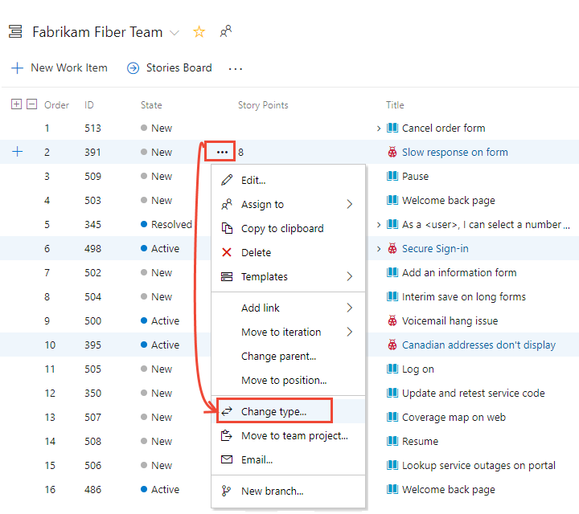
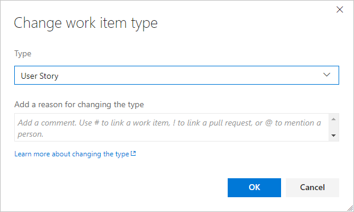

# Bulk move work items and change the work item type in Azure Boards

[!INCLUDE [version-gt-eq-2019](../../includes/version-gt-eq-2019.md)]

Sometimes, work items get created with the wrong type or assigned to an incorrect project. You can correct these issues by updating individual work items or bulk modifying multiple items. You can also remove irrelevant work items from your backlog or Taskboard.

To change the type of multiple work items, [export them using Excel](office/bulk-add-modify-work-items-excel.md) and reimport them with the correct type.

In the web portal, [multi-select work items](bulk-modify-work-items.md) from a backlog or query results page to perform bulk updates. To change, move, delete, or restore multiple work items simultaneously, see [Bulk modify work items](bulk-modify-work-items.md).Often you find that someone created a work item of the wrong work item type (WIT) or within an incorrect project. You can correct these issues for individual work items or bulk modify several work items. You can also remove work items added to your backlog or Taskboard that aren't relevant anymore.

For instructions on removing, deleting, or restoring work items, see [Remove, delete, or restore work items](remove-delete-work-items.md).

## Prerequisites  

::: moniker range="azure-devops"

| Category | Requirements |
|--------------|-------------|
| **Permissions** | - Member of the **Contributors** or **Project Administrators** group. To get added, [Add users to a project or team](../../organizations/security/add-users-team-project.md).   - To modify work items: **View work items in this node** and **Edit work items in this node** permissions set to **Allow**. By default, the **Contributors** group has this permission. For more information, see [Set permissions and access for work tracking](../../organizations/security/set-permissions-access-work-tracking.md).   - To move work items to another project: Member of the **Project Administrators** group or **Move work items out of this project** permission set to **Allow**. By default, the **Contributors** group doesn't have this permission. Users with **Stakeholder** access don't have access to this feature. |
| **Access levels** | To change the work item type: At least **Stakeholder** access. |

> [!NOTE]  
> Users with **Stakeholder** access for a public project have full access to all work tracking features just like users with **Basic** access. For more information, see [Stakeholder access quick reference](../../organizations/security/stakeholder-access.md).

::: moniker-end

::: moniker range=" < azure-devops"

| Category | Requirements |
|--------------|-------------|
| **Permissions** | - Member of the **Contributors** or **Project Administrators** group. To get added, [Add users to a project or team](../../organizations/security/add-users-team-project.md).   - To modify work items: **View work items in this node** and **Edit work items in this node** permissions set to **Allow**. By default, the **Contributors** group has this permission. For more information, see [Set permissions and access for work tracking](../../organizations/security/set-permissions-access-work-tracking.md).   - To move work items to another project: Member of the **Project Administrators** group or **Move work items out of this project** permission set to **Allow**. By default, the **Contributors** group doesn't have this permission. Users with **Stakeholder** access don't have access to this feature. Also, the project must use an Inherited process model.  |
| **Access levels** | To change the work item type: At least **Stakeholder** access. |

You can change the work item type or move work items to another project within a project collection. These features require that the data warehouse is disabled. With the data warehouse disabled, you use the [Analytics Service](../../report/powerbi/what-is-analytics.md) to support your reporting needs. For more information about disabling the data warehouse, see [Disable the data warehouse and cube](/previous-versions/azure/devops/report/admin/disable-data-warehouse). 

::: moniker-end 

For more information, see [Change project-level permissions](../../organizations/security/change-project-level-permissions.md). 

::: moniker range="azure-devops"

> [!IMPORTANT]  
> You can't change type or move work items whose work item types support test management or that belong to the [Hidden Types Category](../work-items/agile-glossary.md#hidden-types). This includes all work items that track tests&mdash;such as test cases, shared steps, and shared parameters&mdash;code review requests and responses, and feedback requests and responses.

::: moniker-end

::: moniker range=" < azure-devops"

> [!IMPORTANT]  
> - You can't change type, move work items, or delete/restore work items whose work item types support test management or that belong to the [Hidden Types Category](../work-items/agile-glossary.md#hidden-types). This includes all work items that track tests&mdash;such as test cases, shared steps, and shared parameters&mdash;code review requests and responses, and feedback requests and responses.
> 
> - You can't change the work item type if the project is defined on a collection that uses the On-premises XML process model. 

::: moniker-end

  

## Change the work item type 

Changing the work item type refreshes the work item form with the fields defined for the type selected. For example, you can change a bug to a task and the form refreshes with the fields defined for a task.

You can change a single work item or several [multi-selected work items](bulk-modify-work-items.md) to a new type. 

1. Open a work item, choose the  :::image type="icon" source="../media/icons/actions-icon.png" border="false"::: actions icon, and select the :::image type="icon" source="../media/icons/change-type-icon.png" border="false"::: **Change type...** option. 

	  

	Or, from the backlog or query results page, multi-select several work items whose type you want to change. You can select several work items of the same type or different type so long as you want to change them all to the same work item type.  

	Choose the  :::image type="icon" source="../media/icons/actions-icon.png" border="false"::: actions icon,  and select the :::image type="icon" source="../media/icons/change-type-icon.png" border="false"::: **Change type...** option.     

	> [!div class="mx-imgBorder"]  
	>   

	> [!IMPORTANT]   
	> From the **Query Results page**, the **Change type&hellip;** option becomes unavailable if you have checked the Query Editor's **Query across projects** checkbox. 

2. Select the type and optionally enter a comment.  

	    

	Comments are automatically added to the **Discussion** and an entry gets made to the **History**. Also, the system automatically resets the State and Reason fields to the default initial values for the work item type that you move.  

3. **Save** the work items.  
 
	> [!NOTE]     
	> The system automatically resets the **State** and **Reason** fields to the default initial values of the specified type. However, in some cases you may need to open the work item to change the **State** or **Reason** field to a value supported by the changed-to work item type.

	From the **Query Results** page, save all work items that you bulk-modified. When you bulk modify items from the backlog, they're automatically saved. Work items shown in bold text indicate that local changes aren't saved to the data store. The system automatically saves each work item. To reflect your changes, refresh.

  

## Move a work item to another project  

When you realize that a work item is assigned to the wrong project within your organization or collection, you can move it to the appropriate project. You can relocate either a single work item or multiple [selected work items](bulk-modify-work-items.md). 

> [!IMPORTANT]
> **Permanent and irreversible deletion:** Azure DevOps only supports the permanent deletion of test artifacts, including test plans, test suites, test cases, shared steps, and shared parameters. Deleted artifacts cannot be restored, and all associated child items, such as test results, are also removed. Additionally, bulk deletion of test artifacts is not supported; attempting to bulk delete will result in the deletion of all other selected work items except the test artifacts.
> 
> **Ensure you back up any necessary information before deleting test artifacts, as this action can't be undone.**

1. Open the work item and choose the  **Move...** option from the work item form's  Actions menu.    

	If you don't see the option, then you don't have [permissions to move work items out of the project](../../organizations/security/set-permissions-access-work-tracking.md#move-delete-permissions).  

	Or, from the backlog or query results page, multi-select several work items that you want to move to another project. You can select several work items so long as you want to move them all to the same project. 

	Choose the  :::image type="icon" source="../media/icons/actions-icon.png" border="false"::: actions icon to open the context menu of one of the selected work items, and choose the  **Move&hellip;** option. 

2. Select the destination project and choose the other options available, including changing the work item type. Optionally enter a comment.  

	::: moniker range="azure-devops"
	:::image type="content" source="media/move-change-delete/move-work-item-change-type-dialog.png" alt-text="Move work item type and change type dialog.":::
	::: moniker-end
	::: moniker range=">= azure-devops-2019 < azure-devops"
	
	::: moniker-end

	> [!NOTE]
	> Child work items don't get moved and remain in the origin project, but the Parent-Child links remain in place.

   Comments are automatically added to the **Discussion** and an entry gets made to the **History**. Also, the system automatically resets the State and Reason fields to the default initial values for the work item type that you move.  

## Related articles   

- [Remove or delete work items](remove-delete-work-items.md)  
- [View and add work items using the Work Items page](../work-items/view-add-work-items.md)  
- [Add or modify work items in bulk with Microsoft Excel](./office/bulk-add-modify-work-items-excel.md)
- [Import, update, and export bulk work items with CSV files](../queries/import-work-items-from-csv.md)
