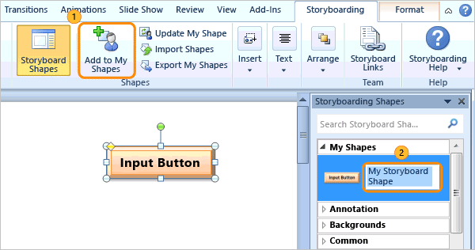
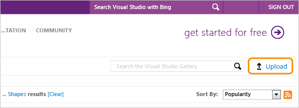

# Add and share storyboard shapes

[!INCLUDE [temp](../../../_shared/version-tfs-2018-earlier.md)]

Adding to your gallery of storyboard shapes can boost your ability to [storyboard your ideas using Microsoft PowerPoint Storyboarding](storyboard-your-ideas-using-powerpoint.md). You can import storyboard shapes created by other members of your team. To share custom shapes that you've created, you can export them to a storyboard shapes file.  
  
> [!IMPORTANT]  
> The Visual Studio Gallery for PowerPoint Storyboarding is deprecated. You can still create your own shapes and share them, however there is no longer a central place to upload or download storyboard shapes. Also, starting with Visual Studio 2019, the Team Foundation plug-in for Office is deprecating support for Office Project and Storyboarding with PowerPoint.  

## Share shapes that you create with your team  
 At any time, you can export custom storyboard shapes that you've created and share them with your team. You can create storyboard shapes with any combination of PowerPoint shapes, screenshots, inserted images, or storyboard shapes.  
  
1.  Add each of your storyboard shapes to the **My Shapes** category and name it. If you don't see the Storyboarding tab, you don't have the Team Foundation add-in for PowerPoint Storyboarding. See step 2 in the previous procedure.   
  
       
  
    > [!TIP]  
    >  To update the shape, highlight it, open the context menu, and then choose **Update My Shape**.  
  
2.  Export your shapes to a storyboard shapes file (.sbsx) and share it with other team members who use PowerPoint Storyboarding.  
       
 
<!--- 
## You can share your shapes with the Visual Studio community, too  
 Sell or share your custom storyboard shapes through the Visual Studio gallery.  
  
1.  Open the [Visual Studio Extensions Upload](http://visualstudiogallery.msdn.microsoft.com/site/upload) page.  
  
       
  
2.  Specify the storyboard shapes extension type.  
  
       
  
3.  Complete the next two steps and add your contribution.  

 In addition, you can author storyboard shapes with custom resize logic using the Storyboard Shapes Authoring Tool. To get this tool, download [Visual Studio Team Foundation Server Power Tools](https://go.microsoft.com/fwlink/?LinkId=248625).  
-->  
## Related articles  
- [Storyboard your ideas using PowerPoint Storyboarding](storyboard-your-ideas-using-powerpoint.md).