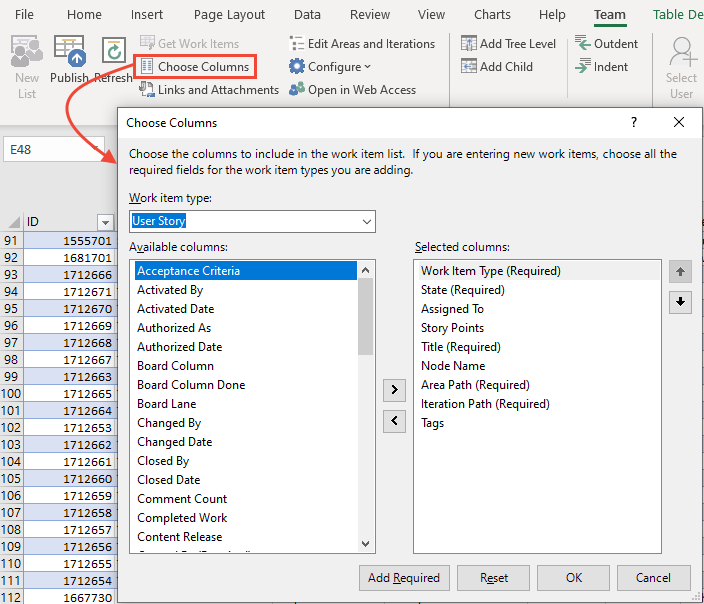
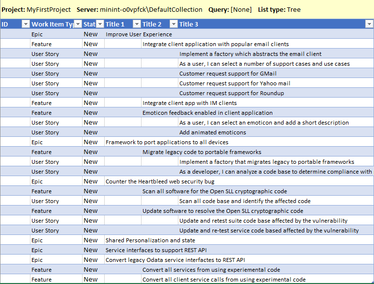
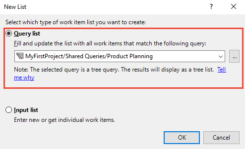
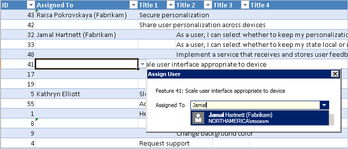
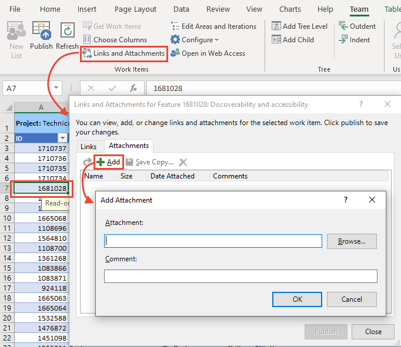

# Bulk add or modify work items with Excel 

[!INCLUDE [temp](../../includes/version-vsts-tfs-all-versions.md)]

When you have many work items to add or modify, using Microsoft Excel can save you time. Excel supports adding work items, updating existing work items, adding links and attachments to multiple work items, and more. In addition, you can use native Excel features to support other actions, such as summing a column, copy-and-paste rows, perform fill down, and more. 

In this article you'll learn how to perform the following tasks:  

> [!div class="checklist"]    
> * Import or update work items, either a flat list or hierarchy tree list 
> * Publish and refresh your work items  
> * Add and remove fields from your worksheet 
> * Convert a flat-list to a tree-list  
> * Select user accounts  
> * Link work items and add attachments to one or more work items   
> * Open a work item from Excel (opens in web portal)  
> * Edit Area and Iteration Paths (opens in web portal)   
> * Use Excel features  
> * Configure list properties, change from a query list to a work item list 

For answers to specific questions about the integration of Excel and Azure DevOps, see [FAQs: Work in Excel connected to Azure Boards ](faqs.md).

::: moniker range="<= tfs-2018" 
> [!NOTE]   
> You can also bulk add and modify work items using [Microsoft Project](create-your-backlog-tasks-using-project.md).
::: moniker-end  

::: moniker range="azure-devops"

> [!NOTE]  
> If you don't have access to Excel, you can still perform bulk import and update using CSV formatted files. To learn more, see [Bulk import or update work items using CSV files](../../queries/import-work-items-from-csv.md).

::: moniker-end

## Prerequisites 

> [!NOTE]  
> macOS isn't supported. Even if you've installed Visual Studio for Mac, connection to Azure DevOps from Excel isn't supported.   

::: moniker range="azure-devops" 

- Installed Microsoft Excel 2010 or later version, including Microsoft Office Excel 365
- Installed [Azure DevOps Office Integration 2019 (free)](https://visualstudio.microsoft.com/downloads/#other-family).
	> [!NOTE]   
	> The only way to get the Azure DevOps Office Integration plug-in is by installing one of the latest editions of Visual Studio or the Azure DevOps Office Integration installer. The plug-in supports connection to Azure Boards and Azure DevOps Server from Excel.  
- To connect to an Azure Boards project, you need to be a [member of the project](../../../organizations/security/add-users-team-project.md). If you don't have an Azure Boards project yet, you can [create one](/azure/devops/boards/get-started/sign-up-invite-teammates).  
- To view or modify work items, you must have these permissions set to **Allow**: **View work items in this node** and **Edit work items in this node**. By default, the **Contributors** group has this permission set. To learn more, see [Set permissions and access for work tracking](/azure/devops/organizations/security/set-permissions-access-work-tracking).  
- To add or modify work items, you must be granted **Stakeholder** access or higher. For details, see [About access levels](/azure/devops/organizations/security/access-levels). 
- To use the [Select User](#select-user) feature, you need to install [Visual Studio (at least VS 2015.1 or later version](https://visualstudio.microsoft.com/downloads/) or [Team Foundation Server Office Integration 2015 Update 2 or later version](https://visualstudio.microsoft.com/downloads/). You can download the free version of Visual Studio Community. Get this feature to avoid data validation errors by misspelling user names and when you must assign user names from a large group of user accounts.  

::: moniker-end  

::: moniker range=">= tfs-2017 < azure-devops" 

- Installed Microsoft Excel 2010 or later version, including Microsoft Office Excel 365
- Installed [Azure DevOps Office Integration 2019 (free)](https://visualstudio.microsoft.com/downloads/#other-family).
	> [!NOTE]   
	> The only way to get the Team Foundation plug-in is by installing one of the latest editions of Visual Studio or the TFS Standalone Office Integration installer. The TFS Office Integration 2017 plug-in supports connection to Azure Boards and TFS from Excel, Project, and the PowerPoint-based storyboarding tool.
- To connect to an Azure Boards project, you need to be a [member of the project](../../../organizations/security/add-users-team-project.md). If you don't have an Azure Boards project yet, you can [create one](/azure/devops/organizations/projects/create-project). 
- To view or modify work items, you must have these permissions set to **Allow**: **View work items in this node** and **Edit work items in this node**. By default, the **Contributors** group has this permission set. To learn more, see [Set permissions and access for work tracking](/azure/devops/organizations/security/set-permissions-access-work-tracking).  
- To add or modify work items, you must be granted **Stakeholder** access or higher. For details, see [About access levels](/azure/devops/organizations/security/access-levels). 
- To use the [Select User](#select-user) feature, you need to install [Visual Studio (at least VS 2015.1 or later version](https://visualstudio.microsoft.com/downloads/) or [Team Foundation Server Office Integration 2015 Update 2 or later version](https://visualstudio.microsoft.com/downloads/). You can download the free version of Visual Studio Community. Get this feature to avoid data validation errors by misspelling user names and when you must assign user names from a large group of user accounts.  

::: moniker-end  

::: moniker range=">= tfs-2013 <= tfs-2015" 

- Installed Microsoft 2007, Microsoft Excel 2010, or Microsoft Excel 2013 
- Installed Visual Studio 2013 or Visual Studio 2015 or [Team Foundation Server Standalone Office Integration (free)](https://go.microsoft.com/fwlink/?LinkId=832491&clcid=0x409)
- To connect to an Azure Boards project, you need to be a [member of the project](../../../organizations/security/add-users-team-project.md). If you don't have an Azure Boards project yet, you can [create one](/azure/devops/organizations/projects/create-project). 
- To view or modify work items, you must have these permissions set to **Allow**: **View work items in this node** and **Edit work items in this node**. By default, the **Contributors** group has this permission set. To learn more, see [Set permissions and access for work tracking](/azure/devops/organizations/security/set-permissions-access-work-tracking).  
- To add or modify work items, you must be granted **Stakeholder** access or higher. For details, see [About access levels](/azure/devops/organizations/security/access-levels).   

::: moniker-end  

To learn more about compatibility requirements, see [Compatibility with Azure DevOps](/azure/devops/server/compatibility). 

## Choose list type and query type   

When you work in Excel connected to Azure Boards, you're always working with a query type and a list type. Queries correspond to the queries you create using the Query Editor.
- **Query types**: 
	- **None**: Indicates it is an **input list**. 
	- **Query title**: Indicates the list of work items is tied to the specified **query**. 
- **List types**: 
	- **Flat list**: Simple list of work items that shows a single **Title** column. No link management is supported. 
	- **Tree list**: Hierarchical list of work items that support creating and updating tree topology links, such as Parent-Child links, between work items. These lists include two or more **Title** columns.  

You can add, publish, and refresh work items using any query type and list type. 

### Query types 

Azure Boards supports three query types. The icon next to each query indicates the query type. The first two query types, **Flat list of work items** and **Work items and direct links** are imported as flat list queries. 

> [!div class="mx-imgBorder"]  
> 

Only the **Tree of work items** queries import as a tree list. Direct links queries are imported as a flat list into Excel as modifying multiple types of links isn't a supported feature in Excel. 

### Tree lists

You can bulk add a nested list of work items, such as a work breakdown structure or a hierarchical set of user stories and customer experiences. For example, you can add a nested list of tasks, subtasks, and bugs, as shown in the following illustration, or linked tasks to product backlog items.

Here's how a three-level nested tree of items appears in Excel. 

Parent-child links or other tree topology link types support creating a hierarchical backlog structure. The work item types that participate in the hierarchy differ with different processes and are shown in the following images. 

[!INCLUDE [temp](../../includes/work-item-types.md)]

To import a hierarchical list, see [Add or import a hierarchical list of work items](#add-work-items-tree) later in this article. 

## Guide to list and query type usage

In general, you [Use a flat list](../../queries/using-queries.md#flat-list-query) to bulk add or modify several types of work items at once, such as backlog items, tasks, bugs, or issues. [Use a tree list](../../queries/using-queries.md#tree-query) to bulk add or modify work items and their parent-child links. 

Here is some additional guidance: 

::: moniker range="azure-devops" 

- Use an input list, flat list: To import a list of work items or create new work items, no hierarchy   
- Use an input list, tree list: To perform top down planning and publish linked work items  
- Use a query list, tree list: To view and modify the hierarchy of link relationships of many existing work items. 

::: moniker-end  

::: moniker range="< azure-devops" 

- Use an input list, flat list: To import a list of work items or create new work items, no hierarchy  
- Use an input list, tree list: To perform top down planning and publish parent-child linked work items  
- Use a query list, flat list: To create an Excel report based on the query of work items  
	> [!NOTE]
	To create an Excel report, you're project collection must be configured to support Analytics reporting. For more information, see [Create Excel reports from a work item query](../../../report/create-status-and-trend-excel-reports.md).
- Use a query list, tree list: To view and modify the hierarchy and parent-child link relationships of many existing work items. 

 
::: moniker-end  
 

## Work with different list types 

Select your list structure based on these guidelines.  

<table>
<thead>
<tr>
<th width="60%">
Task
</th>
<th width="15%">
List structure
</th>
<th width="15%">
List refresh
</th>
</tr>
</thead>
<tbody>
<tr>
<td>
Create and publish many unrelated work items
</td>
<td>
Flat list
</td>
<td>
Input list
</td>
</tr>
<tr>
<td>
Perform bulk edits on many unrelated work items
</td>
<td>
Flat list
</td>
<td>
Query list or input list
</td>
</tr>
<tr>
<td>
Perform bulk edits on many work items and their dependent or related work items
</td>
<td>
Tree list
</td>
<td>
Query list
</td>
</tr>
<tr>
<td>
Perform top down planning and publish parent-child linked work items
</td>
<td>
Tree list
</td>
<td>
Input list
</td>
</tr>
<tr>
<td>
View and modify the hierarchy and parent-child link relationships of many work items
</td>
<td>
Tree list
</td>
<td>
Query list
</td>
</tr>
<tr>
<td>
Review reports based on a filtered set of work items that change over time
</td>
<td>
Flat or tree list
</td>
<td>
Query list
</td>
</tr>
</tbody>
</table>

  

## Import a new list of work items

1. Open Excel and connect to your Azure Boards project. Use one of the four methods provided in [Connect Azure DevOps project to Excel](track-work.md#excel).

1.  In Excel, start with a blank worksheet. If you don't see the **Team** ribbon (or the **Team** menu if you use Excel 2007), see [Azure DevOps Office integration issues](tfs-office-integration-issues.md). 

1. Choose **New List** from the Team ribbon. 

	> [!div class="mx-imgBorder"]  
	> 

1.	From the **New List** dialog, choose **Input list**.  

    

1.  <a id="step-5" />Your worksheet is now bound to your project as an input list, flat list.  

	> [!div class="mx-imgBorder"]  
	> 

1.  Specify the titles of the work items you want to add and their work item type.

	> [!div class="mx-imgBorder"]  
	> 

    Notice how the **State** and **Reason** fields automatically fill in with default values once your select the work item type.

1.  Publish your worksheet. 

	> [!div class="mx-imgBorder"]  
	> 

    Make sure your cursor is in a cell that contains data. Otherwise, the **Publish** button might appear disabled.

    Notice how IDs are now assigned to your work items.

	> [!div class="mx-imgBorder"]  
	> 

1.  To assign values to other fields, open [**Choose Columns**](#choose-columns), add the fields, make the assignments, and publish your changes. 

    > [!TIP]
    > If you're adding work items that you want to appear on a team backlog, make sure that you add and specify the team's Area Path and Iteration Path. If you need to add Area Paths or Iteration Paths, choose the **Edit Areas and Iterations** link. The link opens a web browser to the Project Settings page. To learn more, see [Define area paths and assign to a team](../../../organizations/settings/set-area-paths.md) and [Define Iteration Paths and configure team iterations](../../../organizations/settings/set-iteration-paths-sprints.md).  

.  Also, note how you can open a work item in the web portal to add more information. Before you do, make sure you publish any changes you've made.  

    Choose the work item you want to open and then choose **Open in Web Access**. 

	> [!div class="mx-imgBorder"]  
	> 

    A web browser opens with the work item opens. 

    If you make changes to the work item, you should then immediately refresh your worksheet to capture those changes.  

  

## Choose column fields 

1. To assign values to other fields, choose **Column Options** to add the fields of interest.  

	> [!div class="mx-imgBorder"]  
	> 

	- To filter the fields based on work item type, select the **Work item type**.
	- To move or remove a field, choose the field and then click the > or < icons.
	- To change the field sequence, move the field up or down in the list using the up and down arrows. 
	- You can add a rich-text field, such as the **Description** field, however you may lose some of the formatting upon publish.  

1. Once the fields appear in the worksheet, assign values and publish your updates. 

1. Save your worksheet. 

  

## Import a hierarchical list of work items 

You can add work items linked using parent-child links, or other tree topology link type, to create a hierarchy of work items. 

> [!IMPORTANT]
> Don't sort a tree list. Sorting a tree list can change the hierarchical link relationships. If you do sort a tree list, recover immediately by refreshing your worksheet. 

1. Starting from [Step 5](#step-5) from the previous procedure, convert your flat list, input list into a tree list. Choose a cell within the flat list and then choose **Add Tree Level**. 
 
	> [!div class="mx-imgBorder"]  
	> 

	If the **Add Tree Level** is disabled, you're working from a query list. To convert your list to a tree list, you must first [reconfigure your list](#reconfigure-list) to an input list. 

1. Choose the link type to use when adding work items to a hierarchy, and then choose **Convert**. The most usual choice is **Parent-Child**. You can only select from tree topology link types. To learn more, see [Link type topologies and restrictions](../../../reference/xml/link-type-element-reference.md#topology). 

	> [!div class="mx-imgBorder"]  
	> 

	Note the List type has changed to **Tree**, and a second **Title** column appears.  

	> [!div class="mx-imgBorder"]  
	> 

1. To add more levels to the hierarchy, choose **Add Tree Level** again. For example, if you want to add a hierarchy of Epics, Features, and User Stories, you'll want to have **Title 1**, **Title 2**, and **Title 3** columns.

	If you want to add tasks, add another tree level to have four title columns. To remove a column, see [Remove a tree level](#remove-tree-level). 

1. Save your Excel file. 

1. Enter the **Work Item Type** and **Titles** for the hierarchy you want to import. The **State** fields automatically fill in with default values once you select the work item type. 

	> [!div class="mx-imgBorder"]  
	> 

8.  Publish your worksheet.

	> [!div class="mx-imgBorder"]  
	>  

1. To assign values to other fields, open [**Choose Columns**](#choose-columns), add the fields, make the assignments, and publish your changes. 

1. To change the hierarchy, cut and paste the row of a work item to place it under the new parent. - Make sure that you select the entire table row. When you publish the change, the old hierarchical links are deleted and the new hierarchical link are created. 

    You can use the  or  indent/outdent icons to demote or promote a work item within the tree hierarchy. Verify that the column to the left or right of the parent work item's title is a **Title** column. The header at the top of the column should read **Title n**, if it does not, add a tree level.

<a id="remove-tree-level" />

### Remove a tree level

1. First, publish changes that you have made to work items before you remove a tree level. Removing a tree level requires a refresh, which overwrites data in the work item list. You will lose any data you have not published. 

2. Next, remove any content entered under the tree-level **Title** *number* column you want to remove&mdash;the highest numbered column&mdash;. This should be the highest numbered column in the tree. 

3. **Refresh** your worksheet. The column containing empty values for the Title is removed. 

	You'll receive an error message if you attempt to delete the column. 

### Useful tips when working with a tree list 

- The plug-in interprets the data in the **Title** columns to determine the pattern of links between work items. When you publish changes, any of the following conditions can result in an error, an invalid link, or a tree link to be created between incorrect work items:
	- A row between is blank between two work items within the hierarchy 
	- The Title of a work item is in the wrong column. Make sure you enter a title for each child work item.
	- Within a row, multiple **Title** columns contain data. Enter text in only one of the title columns within each row.
	- The list was sorted. Don't sort a tree list. Sorting a tree list can change the hierarchical link relationships. If you do sort a tree list, you can recover from this operation by immediately refreshing.
- To resolve an error, see [Resolve invalid links](resolve-excel-invalid-links-tree-list.md).
- A parent-child linked work item can only have one parent. You can't add the same work item task to two backlog items. Instead, you need to define distinct work item tasks.

## Update work items using a query 

The easiest way to bulk update many work items is to create a query with the work items you want to update, and then open that query in Excel. 

> [!TIP]
> **Follow these tips to keep your work in sync:**   
>- When you first open a saved worksheet, use  (**Refresh**) to download the latest data from the data store.  
>- Enter data for additional fields by adding columns to the worksheet using  <strong>Choose Columns</strong>.  
>- To avoid data conflicts, publish your additions and modifications often.  
>- To prevent loss of data before you publish or refresh, save your workbook periodically.  

1. From the web portal or Visual Studio, create the work item query that contains the work items you want to update. For details, see [Create and save managed queries with the query editor](../../queries/using-queries.md). 

3. Open Excel and connect to your Azure Boards project. Use one of the four methods provided in [Connect Azure DevOps project to Excel](track-work.md#excel).

1.  If you opened your query from the web portal or Visual Studio, you're done. Make any changes you want. Open [**Choose Columns**](#choose-columns), add fields, make assignments, and publish your changes.  

1. If you start from Excel, open a blank worksheet. You can add a worksheet to an existing workbook, as long as you are choosing a query from the same project the workbook is bound to. 

1. Choose **New List** from the Team ribbon. 

	> [!div class="mx-imgBorder"]  
	> 

1.	From the **New List** dialog, choose **Query list**, and select the query you want from the drop-down menu.  

	> [!div class="mx-imgBorder"]  
	> 

	The icon next to each query indicates the query type. The first two query types, **Flat list of work items** and **Work items and direct links** are imported as flat list queries. Only the **Tree of work items** queries import as a tree list. 

	> [!div class="mx-imgBorder"]  
	> 

1. With the work items imported to Excel, make the modifications you want and publish your changes. 

    If you're working with a tree list, see also the information provided in [Import a hierarchical list of work items](#add-work-items-tree).

## Select user accounts 

You can use the Select User feature to find user accounts and assign values to person named fields. Also, this feature provides access to the most recently used (MRU) values. If your team contains several hundreds or thousands of user accounts, you'll want to use this feature.  

> [!TIP]  
> Without the **Select User** feature, you must enter user names exactly as they are in the database, or you'll receive data validation errors upon trying to publish.  

1. If you haven't installed or updated to the latest version of [Visual Studio (at least VS 2015.1 or later version](https://visualstudio.microsoft.com/downloads/), do that now. You need the latest update in order to access the Select User feature.  

2. Choose a person-named field to activate the **Select User** feature in the Team ribbon.  

	  

	A person-named field is a field that contains a user identity. These fields are typically synchronized to a database of user accounts, such as Azure Active Directory, Active Directory, or a Workgroup. Such fields are identified as those whose `syncnamechanges` attribute has been set to [synchronize](../../../reference/xml/field-definition-element-reference.md).  

3. Begin typing the name of the user account and the Assign User dialog will automatically filter the results until you can select the account of interest.  

	  

	Enter a letter to tab to the start of names beginning with that letter. Enter only user names as account aliases aren't recognized.   

	You'll notice that as you select user names, Excel remembers your recent selections and you can select those user accounts directly from the field.   

	  

## Link work items or add attachments  

- To link a work item to other work items, choose the work item and then choose **Links and Attachments**. From the Links tab, choose **Link to** and then choose the **Link Type** and work item(s) you want to link to. Choose **OK** and then **Publish**. 

	> [!div class="mx-imgBorder"]  
	> 

	When finished, choose **Close** to dismiss the dialog. 

	- To link several work items to the same work item(s), multi-select them by using **Ctrl-click** for consecutive rows, or **Shift-click** for non-consecutive rows. 

	For more information on linking work items, see [Link user stories, issues, bugs, and other work items](../add-link.md). 

- To add attachments, choose the work item, then **Links and Attachments**, and then the **Attachments** tab.  

	Choose the file you want to attach, then choose **OK** and then **Publish**.  

	> [!div class="mx-imgBorder"]  
	> 

	When finished, choose **Close** to dismiss the dialog. 

	- To add the same attachment(s) to several work items, multi-select them by using **Ctrl-click** for consecutive rows, or **Shift-click** for non-consecutive rows. 

## Change from a query list to a work item list 

If you want to change your flat list to a query list, you can. However, if you're list is a query list, then you first need to reconfigure the list. You'll know that it is a flat list, query list as the Tree group commands are disabled. 

> [!div class="mx-imgBorder"]  
> 

To convert your list, 

## Enable Tree commands

If the **Tree group** commands are not available, your worksheet is configured as a flat list. You can convert the flat list to a tree list as described in step 2 in [Import a hierarchical list of work items](#add-work-items-tree).

### Convert a tree to a flat list

First, publish whatever changes you have made. Then, on the **Team** ribbon, choose **Configure**, **List**, and then choose **Refresh work items only**. These actions flatten the tree structure and change the query list to an input list.

 

### Convert from an input list to a query

On the **Team** ribbon, choose **Configure**, **List**, and then select the query you want to use. The worksheet will refresh with only those work items returned by the query. Also, if you select a tree query, then the list becomes a tree list.

### Add existing work items to a list

If you're working with a non-query input list, you can add work items by choosing  from the Team ribbon. If you're working from a query, then you need to [modify your query](../../queries/using-queries.md) to contain the work items you want. Then refresh your list.

## Create a report 

New Report link 

https://docs.microsoft.com/azure/devops/report/create-status-and-trend-excel-reports?view=tfs-2018

## Troubleshoot 

- If you receive error TF208104, changes you made to the fields are published, but all changes you made to the link hierarchy are not published. At least one of the link relationships defined for the work item is locked by another process, such as Project Server integration. For more information, see [Addressing Error TF208104: Hierarchical Link Relationship Is Locked](resolve-excel-invalid-links-tree-list.md#tf208104). 

## Related articles

::: moniker range="azure-devops"  

- [Bulk modify work items (web portal)](../../backlogs/bulk-modify-work-items.md)  
- [Azure DevOps Office integration issues](tfs-office-integration-issues.md)
- [FAQs: Work in Excel connected to Azure Boards](faqs.md)
- [Bulk import or update work items using CSV files](../../queries/import-work-items-from-csv.md)
- [Basic Excel tasks](https://support.office.com/article/basic-tasks-in-excel-dc775dd1-fa52-430f-9c3c-d998d1735fca) 

::: moniker-end  

::: moniker range="< azure-devops"

- [Bulk modify work items (web portal)](../../backlogs/bulk-modify-work-items.md)  
- [Azure DevOps Office integration issues](tfs-office-integration-issues.md)
- [FAQs: Work in Excel connected to Azure Boards](faqs.md)
- [Create Excel reports from a work item query](../../../report/create-status-and-trend-excel-reports.md)
- [Basic Excel tasks](https://support.office.com/article/basic-tasks-in-excel-dc775dd1-fa52-430f-9c3c-d998d1735fca) 

::: moniker-end  

<!---

::: moniker range=">= azure-devops" 

Also, you can make bulk updates from You can make changes to work items in Excel, the web portal, Visual Studio/Team Explorer, or Team Explorer Everywhere. You can also make changes to work items using the [az boards work-item create](../../work-items/view-add-work-items.md#add-work-item) command.

::: moniker-end  

::: moniker range="azure-devops-2019" 
You can make changes to work items in Excel, the web portal, Visual Studio/Team Explorer, or Team Explorer Everywhere. 
::: moniker-end  

::: moniker range="<= tfs-2018" 

You can make changes to work items in Excel, Project, the web portal, or Visual Studio, or Team Explorer Everywhere.

::: moniker-end 

-->