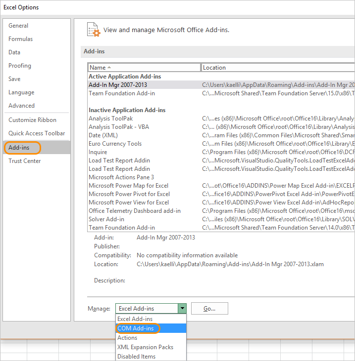
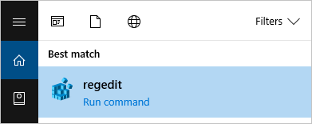
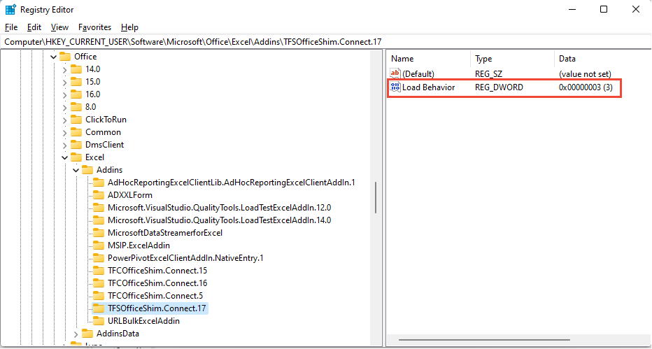
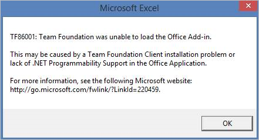
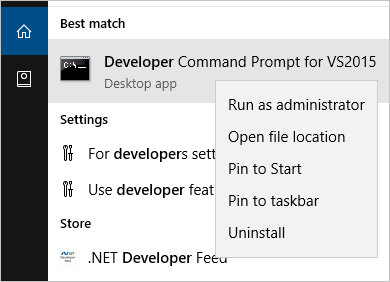

# Resolve Azure DevOps Office integration issues

[!INCLUDE [temp](../../includes/version-all.md)]

If you don't see the **Team** ribbon in Microsoft Excel, as shown in the image below, you may want to resolve the issue with the procedures provided in this article. 

> [!div class="mx-imgBorder"]
> 

[!INCLUDE [temp](../../includes/deprecate-project.md)]

> [!IMPORTANT]  
> All Office integration tasks require that you have installed a version of Visual Studio or the free [Azure DevOps Office Integration 2019](https://visualstudio.microsoft.com/downloads). These software installs the Azure DevOps Office Integration Add-in or Team Foundation Office Integration Add-in  For a list of prerequisites, see [Azure Boards and Office integration](track-work.md). 

## Enable the Azure DevOps add-in 

1.	From the Excel **File** menu, choose **Options**.  
2.	Choose Add-ins and from the **Manage** picklist, choose **COM Add-ins**, and then choose **Go**.

	> [!div class="mx-imgBorder"]
	> 

3.	Make sure that a check is placed in the **Team Foundation Add-in** checkbox. 

	> [!div class="mx-imgBorder"]
	>  

4.	Restart Excel. You should now see the Team ribbon. 

If the Team ribbon doesn't appear at next launch, the load behavior of the add-in may have changed and you'll need to complete the following steps: 

### Update the registry 

1.	Launch the Registry Editor from your Windows Start Menu by typing regedit in the Search or Run box.

	> [!div class="mx-imgBorder"]
	>  

2.	Navigate to one of the following paths containing the **TFCOfficeShim.Connect.[version]** folder:
	
	> [!NOTE]  
	>If there are multiple folders with the same name, select the one with the highest version number. 

	- HKEY_CURRENT_USER\SOFTWARE\Microsoft\Office\Excel\Addins (if this key doesn't exist, try one of the options below)
	- HKEY_LOCAL_MACHINE\SOFTWARE\Microsoft\Office\Excel\Addins
	- HKEY_LOCAL_MACHINE\SOFTWARE\WOW6432Node\Microsoft\Office\Excel\Addins

	> [!div class="mx-imgBorder"]
	>  

3.	Double-click to open **LoadBehavior** and set the value data field to **3** (if the value is **0**, the Team ribbon won't load).
 
4.	Press **OK** and restart Excel. 

	To learn more about the LoadBehavior entry, see [Registry Entries for VSTO Add-ins, LoadBehavior values](/visualstudio/vsto/registry-entries-for-vsto-add-ins#LoadBehavior).  

## Office add-in doesn't load or open in Excel when Visual Studio fails

To connect to Azure Boards or TFS, go to the Team ribbon and choose **New List**. If the New List dialog fails to open, or you receive TF86001 or similar error message, follow the steps below to ensure that policy redirection is configured. 
 
> [!div class="mx-imgBorder"]
>  

This error is typically caused when you install Visual Studio before you install Office Excel or Project. In this instance, the Visual Studio Tools for Office Run Time aren't correctly configured. To correct this error, you must repair Visual Studio.

> [!NOTE]
> For authentication issues, such as `TF31003` and `TF30063`, please refer to [User account does not have permission](/previous-versions/azure/devops/reference/error/tf31003-user-account-no-permission-connect-tfs).

### Prerequisites 

Install Visual Studio to ensure that you have access to the Visual Studio Command Prompt and the  [Gacutil.exe (Global Assembly Cache Tool)](/dotnet/framework/tools/gacutil-exe-gac-tool). If you don't have Visual Studio, you can install the [Visual Studio Community edition for free](https://visualstudio.microsoft.com/downloads/).   

### Run the Gacutil tool  

1. Open the Visual Studio Command Prompt and choose to run it as an administrator. 

	> [!div class="mx-imgBorder"]
	>  

2. **For Office 2016 and Office 2013**, run the following commands:   

   ```
   GACUTIL /I C:\Windows\assembly\GAC_MSIL\Policy.12.0.Microsoft.Office.Interop.Excel\15.0.0.0__71e9bce111e9429c\Policy.12.0.Microsoft.Office.Interop.Excel.dll
   ```  

   ```
   GACUTIL /I C:\Windows\assembly\GAC_MSIL\Policy.12.0.office\15.0.0.0__71e9bce111e9429c\Policy.12.0.Office.dll
   ```

   **For Office 2010**, run the following commands:  

   ```
   GACUTIL /I C:\Windows\assembly\GAC_MSIL\Policy.12.0.Microsoft.Office.Interop.Excel\14.0.0.0__71e9bce111e9429c\Policy.12.0.Microsoft.Office.Interop.Excel.dll
   ```  

   ```
   GACUTIL /I C:\Windows\assembly\GAC_MSIL\Policy.12.0.office\14.0.0.0__71e9bce111e9429c\Policy.12.0.Office.dll
   ```  

3. Once you've successfully run the `GACUTIL` commands, restart Excel and look for the Team Foundation Add-in. 

If the above steps are unsuccessful, try the following steps:  

1.	Run a full [repair of Office](https://support.office.com/article/Repair-an-Office-application-7821d4b6-7c1d-4205-aa0e-a6b40c5bb88b?ui=en-US&rs=en-US&ad=US).  

2.	Uninstall Office and Reinstall Office. 

3.	Contact the Microsoft support team.  


## Related articles

- [FAQs: Work in Excel connected to Azure Boards](faqs.yml)
- [Add or remove add-ins](https://support.office.com/article/Add-or-remove-add-ins-0af570c4-5cf3-4fa9-9b88-403625a0b460)
