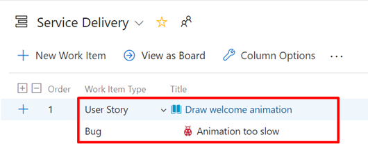
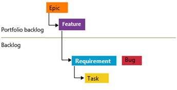
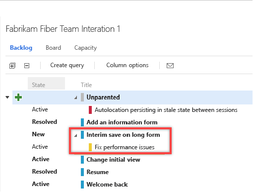

# Fix issues in Azure Boards with displaying, reordering, and nesting work items 

[!INCLUDE [version-lt-eq-azure-devops](../../includes/version-lt-eq-azure-devops.md)]

<!--- Supports FWLINK https://go.microsoft.com/fwlink/?linkid=529135 --> 

Azure Boards backlogs display a natural hierarchy of work items. When you add parent-child links to work items not in the natural hierarchy, you'll receive a message that indicates reordering is disabled. Some items may not display. Also, the system may disable the drag-and-drop reorder feature.  

Use this article to fix the issues that occur and that display one of the following messages: 

- `You cannot reorder work items and some work items may not be shown.`  

- `You cannot reorder work items and some work items may not be shown. See work item(s) 7 to either remove the parent to child link or change the link type to 'Related'." or "Work item 3 can't be reordered because its parent is on the same category".`  

- `Items added to the backlog may disappear on a refresh because your team project marks them as "in progress". Those items will appear when you change the "In progress" filter to Show.`

> [!NOTE]   
> This article addresses issues that arise when you create parent-child links that don't obey the natural hierarchy defined for backlogs. For other issues that may occur with multi-team ownership, see [Configure a hierarchy of teams, Exercising select features with shared area paths](../plans/configure-hierarchical-teams.md#op-issues).

## Natural hierarchy for work item types

The following image indicates the natural hierarchy for the Agile, Scrum, and Capability Maturity Model Integration (CMMI) processes. Along with these work item types, other custom work item types may be added to backlogs and boards. Also, custom backlog levels may be added. 

 

You break this natural hierarchy when you create same-category links between work items. 

When you link work items of the same type with parent-child links&mdash;such as bug-bug or user story-user story&mdash;you create same-category links. Also, when you create parent-child links between work items that belong to the same category&mdash;such as the Requirements category or Task category&mdash;you create same-category links. The category a work item belongs to is determined by your process backlog levels and your team's selected bug behavior. To understand more about same-category hierarchy, see the section [Recommended configuration](#recommended).
 

## Resolve the message that you can't reorder work items

You may see a message such as `You cannot reorder work items and some work items may not be shown`.  No work item IDs are listed. 

To address this message, take the following actions: 

1. Open your Backlog.

2. Review the list of items to determine which items of the same type are nested.  
    For example, the following shows that a user story is a child of another user story. 

	> [!div class="mx-imgBorder"]  
	>   
	
	As another example, the following shows that a bug is a child of a user story. Because the team has configured their backlog to display user stories and bugs at the same level (Requirements category), this configuration results in a nested item that disables the ordering feature.

	> [!div class="mx-imgBorder"]  
	>   
	
3.	Remove all parent-child links that exist among nested items of the same work item type or same category. Or, change the link to 'Related'.

4.	Refresh your Backlog.

The issue is now resolved and the message no longer displays.

## Resolve the message that specifies work item IDs 

You may see a message similar to `You cannot reorder work items and some work items may not be shown. See work item(s) 7 to either remove the parent to child link or change the link type to 'Related'." or "Work item 3 can't be reordered because its parent is on the same category"`. 

To address this message, take the following action: 

1. Open the work item listed in the error message.

2. Look for a parent or child link. Make sure this link goes to a work item within the same category as the work item you opened. This link goes to another work item  that appears on the same backlog level as the work item you opened. Depending on your team's bug behavior setting, bugs may appear with requirements or tasks. 

3. Remove the problem parent-child link. If you would like to keep these items associated, use 'Related' link type instead. 

The issue is resolved and the message no longer displays.

## Resolve the issue where work items that are in progress may disappear on a refresh

The message&mdash;`Items added to the backlog may disappear on a refresh because your team project marks them as "in progress". Those items will appear when you change the "In progress" filter to Show.`&mdash;indicates that the **In Progress** filter for the backlog has been turned off.  

Upon refresh of your browser, the backlog displays those work items based on your selected filters. 

To reset the filters, complete the following steps. 

::: moniker range=">= azure-devops-2019"

From the **View options** selector, you can choose to show or hide **In Progress items**. If you turn the **In Progress** control off, then items that are in the *Active*, *Committed*, or *Resolved* states or states that map to the  [In Progress category state](../work-items/workflow-and-state-categories.md) won't appear in the backlog. 

::: moniker-end

::: moniker range=">= azure-devops-2020"
:::image type="content" source="media/create-backlog/in-progress-control-2020.png" alt-text="Screenshot of View options selector, In progress control, version 2020 and later.":::
::: moniker-end

::: moniker range="azure-devops-2019"
:::image type="content" source="media/create-backlog/in-progress-control-2019.png" alt-text="Screenshot of View options selector, In progress control, version 2019.":::
::: moniker-end

::: moniker range="tfs-2018"
Choose **In progress items** show or hide **In Progress** backlog items. If you turn the **In Progress items** control off, then items that are in the *Active*, *Committed*, or *Resolved* states or states that map to the  [In Progress category state](../work-items/workflow-and-state-categories.md) won't appear in the backlog. 
::: moniker-end

You usually choose to hide **In Progress items** when you want to forecast work. To learn more, see [Forecast your product backlog](../sprints/forecast.md).

 

## Recommended configuration

While you can create a hierarchy of backlog items, tasks, and bugs&mdash;we recommend that you don't create same-category hierarchies. That is, don't create parent-child links among work items of the same type, such as story-story, bug-bug, task-task, or issue-issue. The reason is that the Backlog, Board, and Sprints experiences don't support reordering for same-category hierarchy. Since ordering is executed by hierarchy level, same-category hierarchy introduces confusion by ordering a work item that doesn't belong on that level. 

Instead of nesting requirements, bugs, and tasks, we recommend that you maintain a flat list. In other words, only create parent-child links one level deep between items that belong to a different category. 

Use the Feature work item type when you want to group user stories (Agile), issues (Basic), product backlog items (Scrum), or requirements (CMMI). You can [quickly map product backlog items to features](organize-backlog.md), which creates parent-child links in the background.

## Track bugs as requirements or tasks  

As mentioned previously, [each team can choose how they want to track bugs](../../organizations/settings/show-bugs-on-backlog.md) to behave like requirements, or tasks, or as neither. 

If you choose to track bugs as requirements, bugs should only be nested under the Feature level.

> [!div class="mx-imgBorder"]  
>   

If you choose to track bugs as tasks, bugs should only be nested under the requirements level.

> [!div class="mx-imgBorder"]  
>   

  

## How backlogs and boards display nested items

For TFS 2018 and earlier versions, the Kanban board only shows the last node with nested items of a same-category hierarchy. For all versions, sprint backlogs and taskboards only show the last node in a same-category hierarchy, called the leaf node. 

::: moniker range="tfs-2018"

> [!NOTE]
> For TFS 2018.2 and later versions, Kanban boards display all work items of nested same-category work items.  

::: moniker-end

::: moniker range="tfs-2018"

### Product backlog and Kanban boards

For example, if you link items within a same-category hierarchy that is four levels deep, only the items at the fourth level appear on the Kanban board, sprint backlog, and taskboard.

As shown in the following images, the third user story, *Interim save on long form*, has a child bug, *Save takes too long*. The child bug, *Save takes too long*, appears on the Kanban board, but not the parent user story.  

**All bugs and requirements appear on the backlog**  

  

**Only leaf nodes appear on the Kanban board**  

  

::: moniker-end

### Sprint backlogs and taskboards

When bugs appear in the backlog with tasks, linking tasks and bugs to their parent requirements groups them correctly on the sprint backlog and taskboard.  
But, if you create parent-child links between a requirement and a bug, and the bug and a task, as shown here, the task appears on the sprint backlog and taskboard, but not the bug. 

**Hierarchy of items assigned to a sprint backlog**  

   

**Only leaf nodes appear on sprint backlogs**  

  

**Only leaf nodes appear on taskboards**   
  
Is there a workaround to display intermediate nodes within a hierarchy?  Not at this time. You can always check the entire list of items assigned to a sprint by using the **Create Query** link. 

## Related articles

- [Set up your Backlogs and Boards](set-up-your-backlog.md)  
- [About Boards and Kanban, Limitations of multi-team Kanban board views](../boards/kanban-overview.md#limits-multi-team)  
- [Tasks supported by Backlogs, Boards, Taskboards, and Plans](backlogs-boards-plans.md)  

 