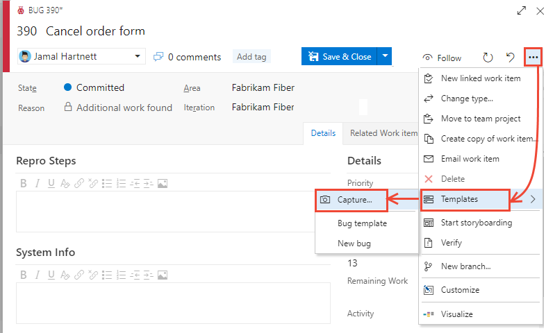
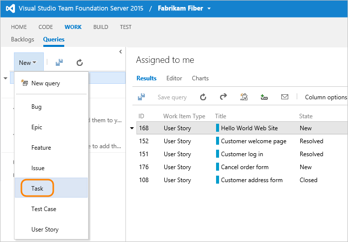
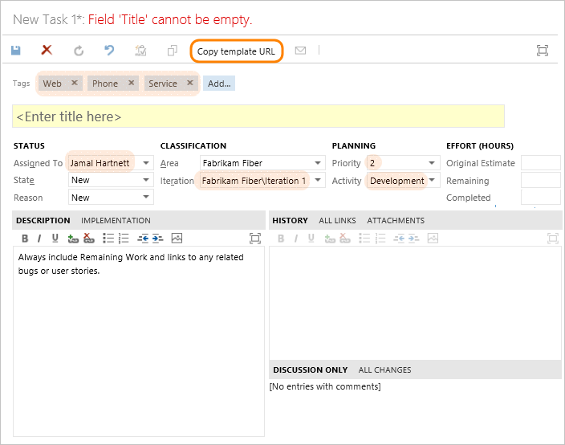
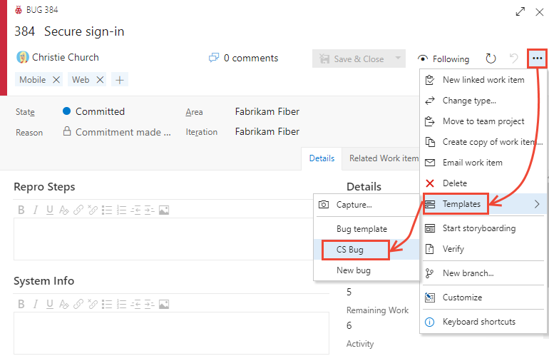
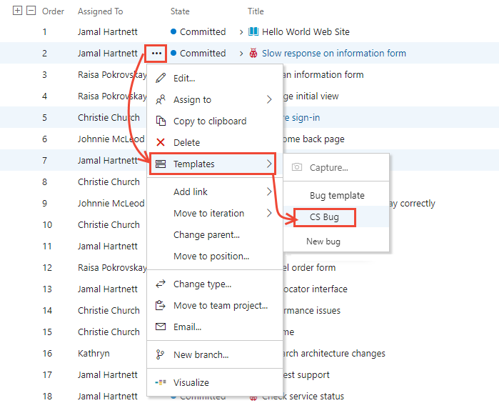
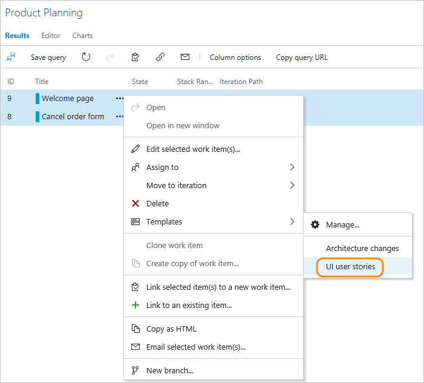
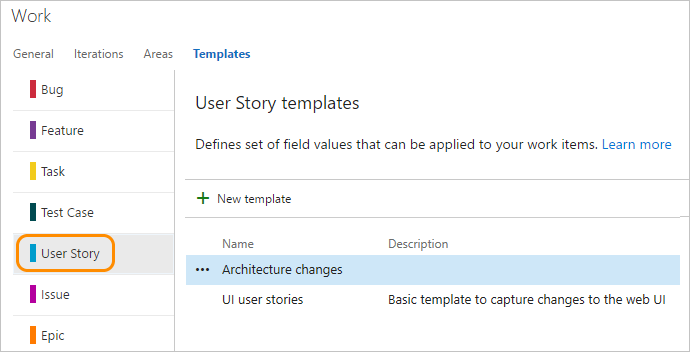
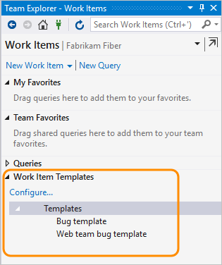
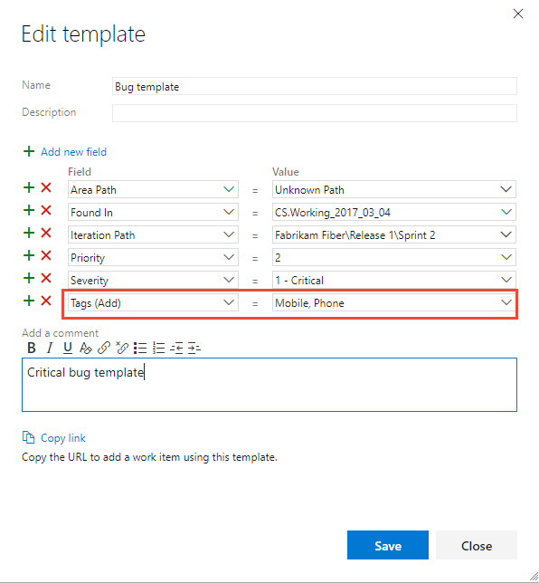

# Use templates to add and update work items 

**Azure Boards | Azure DevOps Server 2020 | Azure DevOps Server 2019 | TFS 2018 - TFS 2013 | Visual Studio 2015** 

<!--- Supports FWLINK https://go.microsoft.com/fwlink/?LinkId=824070 -->

With work item templates you can quickly create work items which have pre-populated values for your team's commonly used fields. For example, you can create a task template that will set the area path, iteration path, and discipline or activity whenever you use it to create a task.  

> [!NOTE]  
> Work item templates are distinct from process templates. For information on process templates, see [Choose a process template](../work-items/guidance/choose-process.md) or these specific topics for the default process templates: [Basic](../get-started/plan-track-work.md), [Agile](../work-items/guidance/agile-process.md), [Scrum](../work-items/guidance/scrum-process.md), or [CMMI](../work-items/guidance/cmmi-process.md).  

For example usage of work item templates, see [Sample work item templates](../work-items/work-item-template-examples.md)

[!INCLUDE [temp](../../repos/git/includes/note-new-git-tool.md)] 


## Prerequisites  

::: moniker range=">= azure-devops-2019"

- To add, capture, edit, or delete work item templates through the web portal, you must be a member of the team under which you add them. 
- To apply a work item template, you must be a Contributor of the project and a member of the team under which the work item template is defined. 

::: moniker-end

::: moniker range=">= tfs-2017 <= tfs-2018"
- To add, capture, edit, or delete work item templates through the web portal, you must be a team administrator. 
- To apply a team template, you must be a Contributor of the project and a member of the team under which the work item template is defined. 
::: moniker-end

::: moniker range="<= tfs-2015"
- To add, capture, or edit work item templates through Visual Studio Team Explorer, you must install the [Microsoft Visual Studio Team Foundation Server 2015 Power Tools](https://marketplace.visualstudio.com/items?itemName=TFSPowerToolsTeam.MicrosoftVisualStudioTeamFoundationServer2015Power). These templates only appear in your view of Team Explorer. 

::: moniker-end


> [!NOTE]  
> If you are working from Visual Studio 2019, the ability to capture and apply templates requires setting the Work Items page to the legacy experience. See [Set the Work Items experience in Visual Studio](../work-items/set-work-item-experience-vs.md).

<a id="capture"> </a> 

## Capture a work item as a template

The steps to capture a work item differ based on the platform, version, and client you use.  

#### [Browser](#tab/browser/)

<a id="team-services-capture" /> 

::: moniker range=">= azure-devops-2019"  

1. From the web portal, open a work item which you'll use as the basis for a template.  

2. Choose the  :::image type="icon" source="../media/icons/actions-icon.png" border="false"::: actions icon to open the menu. Choose **Templates** and then **Capture**.   

    > [!div class="mx-imgBorder"]  
    >  

    Name the template, select the team for which you want to save it under, and optionally define or clear fields. Save the template when finished. 

    > [!div class="mx-imgBorder"]  
    >  

3. Once you've saved the template, choose **Copy link** to capture the URL for the template. 

4. You can paste the URL link into a browser to create a work item, or provide it to others for their use to add work items. For example, you can add it as a hyperlink to a [project wiki](../../project/wiki/wiki-create-repo.md), a [dashboard via a markdown widget](../../report/dashboards/add-markdown-to-dashboard.md), or other shared network resource.

	Use the URL whenever you want to add a work item of the type you've defined with its predefined values.  

::: moniker-end  

::: moniker range=">= tfs-2017 <= tfs-2018"  

1. From the web portal, open a work item which you'll use as the basis for a template.  

    Within the web portal, work item templates are associated with a team. Only those templates defined for a team are accessible when working in a team context, either through a work item form or bulk update context menu.

2. Choose the  :::image type="icon" source="../media/icons/actions-icon.png" border="false"::: actions icon to open the menu. Choose **Templates** and then **Capture**.   

     

    Name the template and optionally define or clear fields. Save the template when finished. The template is saved under the team you selected in the first step. 

     

3. Once you've saved the template, choose **Copy link** to capture the URL for the template that you can use to add work items using the template.

4. Use the URL whenever you want to add a work item of the type you've defined with its predefined values.  

    You can save the URL as a text file or add the URL to a [dashboard](#markdown-widget) or web page as a hyperlink. 

::: moniker-end  

<a id="tfs-portal-capture" /> 

::: moniker range=">= tfs-2013 <= tfs-2015"  

If you connect to an on-premises TFS and primarily create work items working in the web portal, you can create a hyperlink that captures the default values you specify for a template. Choose the hyperlink, and it opens the template in the web portal. 

1. From the web portal Queries page, open a new work item. 

        

2. Fill in the default values you want the template to specify. You can leave required fields empty, or place some text in them

    Here, we fill in several values, including tags, but leave the Title blank. When you're done, copy the URL for the template. 

        

3. The URL defines each predefined field, for example (line breaks added for clarity): 

    ```
    http://fabrikamprime:8080/tfs/DefaultCollection/Fabrikam%20Fiber/_workItems/create/Task?%5B
   System.AssignedTo%5D=Jamal+Hartnett&%5B
   System.Description%5D=%3Cp%3EAlways+include+Remaining+Work+and+links+to+any+related+bugs+or+user+stories.%3C%2Fp%3E&%5B
   System.Tags%5D=Web%3B+Phone%3B+Service&%5B
   Microsoft.VSTS.Common.Activity%5D=Development&%5B
   System.IterationPath%5D=Fabrikam+Fiber%5CIteration+1
    ``` 

    > [!TIP]  
    > The URL won't contain defaults defined for the work item type. To specify a default field value, see [Add or modify a field](../../reference/add-modify-field.md). Also, there is a 2000 character limit imposed by some browser clients with no work around.   

4. Use the URL whenever you want to add a work item of the type you've defined with its predefined values. 

    You can save the URL as a text file or add the URL to a dashboard or web page as a hyperlink. 

::: moniker-end

#### [Visual Studio](#tab/visual-studio/)

<a id="team-explorer-capture" />

If you primarily work in Visual Studio or Team Explorer, and want to create work items from templates that you can access from the Work Items page, you can create work item template files (extension .wt).

You create these files using Work Item Templates, a power tool for Visual Studio, which you can download from [Microsoft Visual Studio Team Foundation Server 2015 Power Tools](https://marketplace.visualstudio.com/items?itemName=TFSPowerToolsTeam.MicrosoftVisualStudioTeamFoundationServer2015Power). 

1.  Open or run a query that lists the work item whose fields you want to capture.

2. Right-click the work item of the type and whose fields you want to capture, and select Capture Template from the context menu.

    

3. In the dialog, use the checkboxes to select all the fields you want to save in the template, and add a name and (optionally) description to the template. 

    

4. Save the template and it will appear in the root of the Team Explorer pane under the Templates section.  

* * *
<a id="add-wi"> </a>

## Add a work item using a template  

The main method for adding a work item using a template is to open the template link within a browser window. You can then share these links through email, a network share, team portal, or a team dashboard or Welcome page.  

<a id="team-services-copy-link" />

### Copy the link to a template 

::: moniker range=">= azure-devops-2019"  

#### [Browser](#tab/browser/)

1. Go to **Project Settings**.

    > [!div class="mx-imgBorder"]  
    >   

    Expand **Boards** and choose **Team configuration**.  Then, choose **Templates**.

1. Copy the link to a shared network or send to your team via email. Also, consider [adding a link to the team dashboard](#markdown-widget).  

2. Use the URL whenever you want to add a work item of the type you've defined with its predefined values.  

    You can save the URL as a text file or add the URL to a web page as a hyperlink. 

#### [Visual Studio](#tab/visual-studio/)

<a id="team-explorer-copy-link" />

1. You can copy the link to a template which will open in the web portal, by opening the context menu for the template.  

    

2. Paste the copied link into a web browser to check that it works as expected.    

* * *

::: moniker-end  


::: moniker range=">=tfs-2017 <= tfs-2018"  

#### [Browser](#tab/browser/)

1. Choose the :::image type="icon" source="../../media/icons/admin-gear-icon.png" border="false"::: gear icon to open the settings for a team. 

    > [!div class="mx-imgBorder"]  
    > 

1. Choose the **Work>Templates** tab. Then, choose the   :::image type="icon" source="../media/icons/actions-icon.png" border="false":::  actions icon for the template you want to copy and select **Copy link**.  

    

2. Copy the link to a shared network or send to your team via email. Also, consider [adding a link the team dashboard](#markdown-widget).  

3. Use the URL whenever you want to add a work item of the type you've defined with its predefined values.  

    You can save the URL as a text file or add the URL to a web page as a hyperlink. 

#### [Visual Studio](#tab/visual-studio/)

<a id="team-explorer-copy-link" />

1. You can copy the link to a template which will open in the web portal, by opening the context menu for the template.  

    

2. Paste the copied link into a web browser to check that it works as expected.    

* * *

::: moniker-end


<a id="tfs-portal-copy-link" />

::: moniker range=">= tfs-2013 <= tfs-2015"

See [Capture a work item as a template, Browser](#capture). 
::: moniker-end

::: moniker range=">= tfs-2015"

<a id="markdown-widget"> </a>

### Add a template link to the dashboard   

You can add links to a markdown widget that appear on your team dashboard in the web portal. These links open a work item with the template defined fields predefined.

::: moniker-end

::: moniker range="tfs-2015"

> [!NOTE]   
> Multiple team dashboards and the Markdown widget are available for Azure Boards and TFS 2015.2 and later versions. 

::: moniker-end

::: moniker range=">= tfs-2015"

For example, the following widget contains links to three templates.  

 

To learn more about the markdown widget see [Add Markdown to a dashboard, Markdown widgets](../../report/dashboards/add-markdown-to-dashboard.md).  

::: moniker-end

<a id="apply"> </a>

## Apply a template to new or existing work item(s)  

You can apply a template to a single work item or perform a bulk update of several work items.  

<a id="team-services-apply" />

#### [Browser](#tab/browser/)

::: moniker range=">= azure-devops-2019"  

### Apply a template within a work item form 

1. Open a new work item or an existing work item that you want to update using the fields defined within a template, choose the  :::image type="icon" source="../media/icons/actions-icon.png" border="false"::: actions icon to open the menu, select **Templates** and then select the name of a pre-defined template.  

    > [!div class="mx-imgBorder"]
    >  

    Only those templates defined for teams that you belong to appear.  

    > [!TIP]  
    > Refresh your browser to discover the latest templates that have been added. If you don't see any templates, it may be that there are none defined for the work item type. 

2. Save the work item for the changes to be applied. The fields changed are noted in the History field. </p>

::: moniker-end

::: moniker range=">= tfs-2017 <= tfs-2018"  

### Apply a template within a work item form 

1. Open the work item that you want to update using the fields defined within a template, choose the  :::image type="icon" source="../media/icons/actions-icon.png" border="false"::: actions icon to open the menu, select **Templates** and then select the name of a pre-defined template.  


~~~
 

> [!TIP]  
> Refresh your browser to discover the latest templates that have been added. If you don't see any templates, it may be that there are none defined for the work item type. 
~~~

2. Save the work item for the changes to be applied. The fields changed are noted in the History field. </p>

::: moniker-end


::: moniker range=">= azure-devops-2019"

### Apply a template to several work items (bulk update) 

1. To bulk update several work items, first select them from the backlog or a query results list, and then open the actions menu for one of them. All work items you select must be of the same work item type. For example, all user stories or all bugs. 

2. Choose the template to apply. 

    > [!div class="mx-imgBorder"]  
    > 

3. Field changes are automatically applied and work items saved. To learn more about bulk updates, see [Bulk modify work items](../backlogs/bulk-modify-work-items.md).

::: moniker-end 

::: moniker range=">= tfs-2017 <= tfs-2018"

### Apply a template to several work items (bulk update) 

1. To bulk update several work items, first select them from the backlog or a query results list, and then open the actions menu for one of them. All work items you select must be of the same work item type. For example, all user stories or all bugs. 

2. Choose the template to apply. 

    

3. Field changes are automatically applied and work items saved. To learn more about bulk updates, see [Bulk modify work items](../backlogs/bulk-modify-work-items.md).

::: moniker-end 

::: moniker range="<= tfs-2015"

The feature to apply a template to existing work items from the web browser isn't supported for TFS 2015 and earlier versions. 

::: moniker-end 


#### [Visual Studio](#tab/visual-studio/)
<a id="team-explorer-apply" />

### Apply a template to one or more work items  

> [!NOTE]  
> If you are working from Visual Studio 2019, the ability to capture and apply templates requires setting the Work Items page to the legacy experience. See [Set the Work Items experience in Visual Studio](../work-items/set-work-item-experience-vs.md).

1. Open or run a query that lists the work item(s) whose fields you want to capture.  

2. Right-click the work items&mdash;which must be of the same type&mdash; and choose **Apply Template** from the context menu.  

    

3. Select the template to use and click OK. 

    

4.  Save the work item.  

    

* * *
<a id="manage"> </a> 

## Manage work item templates

#### [Browser](#tab/browser/)
::: moniker range=">= azure-devops-2019"

You can view the list of templates defined for each work item type, and also add, edit, copy, delete, and copy the link of a template. All templates are defined and managed for a team. 

<a id="team-services-manage" /> 

You manage templates from  team settings. All templates are defined for a team. If you're not a team administrator, [get added as one](../../organizations/settings/add-team-administrator.md). Only team or project administrators can change work item templates.   

1. From the web portal, open settings for a team. 

    Choose **Project Settings**.

    > [!div class="mx-imgBorder"]  
    >   

    Expand **Boards** and choose **Team configuration**. If you need to switch to a different team, use the team selector.

1. Choose **Templates**.  

    From here, you can choose any work item type to view or add templates for that type.  

::: moniker-end

::: moniker range=">= tfs-2017 <= tfs-2018"

You can view the list of templates defined for each work item type, and also add, edit, copy, delete, and copy the link of a template. All templates are defined and managed for a team. 

<a id="team-services-manage" /> 

You manage templates from  team settings. All templates are defined for a team. If you're not a team administrator, [get added as one](../../organizations/settings/add-team-administrator.md). Only team or project administrators can change work item templates.   

1. From the web portal, open settings for a team. 

    Choose the :::image type="icon" source="../../media/icons/admin-gear-icon.png" border="false"::: gear icon to open the settings for a team. 

    Here we open the admin page for the Web team. 

      

1. Choose **Work>Templates**.  

      

    From here, you can click any work item type to view or add templates for that type.  

### Manage templates for a work item type   

Choose the work item type to view the templates defined for each type. 

For example, choose User Story to view templates defined to capture user stories.

  

### Define a template from scratch 

1. From the work item type page, choose the  **New template** to create a template from scratch.  

      

2. Name the template and optionally add and remove fields. Save the template when finished. 

    Once you've saved the template, click Copy link to capture the URL for the template that you can use to add work items using the template.  

### Edit, delete, or copy link to a template  

From the work item type page, choose  :::image type="icon" source="../media/icons/actions-icon.png" border="false"::: the actions icon for an existing template to access the menu options to **Edit**, **Delete**, or **Copy link**. 

  

### Copy or duplicate a template  

1. To duplicate an existing template, choose  :::image type="icon" source="../media/icons/actions-icon.png" border="false"::: the actions icon for an existing template and select the **Create copy** option. 

      

2. Name the template and optionally add and remove fields. Save the template when finished. 

::: moniker-end

::: moniker range=">= tfs-2013 <= tfs-2015"

Managing work item templates from the web portal is only supported from TFS 2017 and later versions. For TFS 2013 and TFS 2015, you can manage work item templates in Visual Studio 2013 or Visual Studio 2015 by downloading [TFS Power Tools](https://marketplace.visualstudio.com/items?itemName=TFSPowerToolsTeam.MicrosoftVisualStudioTeamFoundationServer2015Power). With the Work Item Templates power tool add-in, you can:
- Create and edit work item templates  
- Create and update work items using a template  
- Create a template from an existing work item  
- Bulk-edit work items by applying a template  
- Use templates created in Visual Studio to create work items through the Visual Studio client.  

> [!NOTE]  
> Visual Studio 2015 is the last version in which you can install TFS power tools. You can use the Work Item Templates tool whenever you connect to TFS 2015 version or an earlier version. Templates you define through the power tool are separate from those defined through the web portal for TFS.  

::: moniker-end

#### [Visual Studio](#tab/visual-studio/)
<a id="team-explorer-manage" />

If Visual Studio with power tools installed, you can view the list of templates defined for each work item type, and also add, edit, copy, delete, and copy the link of a template.   

You manage templates from the Team Explorer pane.  
  

The root Templates node represents the parent of all of your templates. You may create a directory structure underneath it by adding folders &mdash;right-click on the **Templates** node or a folder and select **New Folder** from the context menu.  

You can cut, copy, paste, rename, and delete templates and folders using the context menu. You may also drag and drop templates into folders. To edit multiple templates, use shift-click to select a range or ctrl-click to add individual templates to your selection, then right-click. 

### Define a template from scratch 

1. From the Templates section, right-click Templates and choose to create a template from scratch.

      

2. Save the template, provide a Name in the dialog provided.  

      

    Once you've saved the template, click Copy link to capture the URL for the template that you can use to add work items using the template.  

### Edit, use, copy, or delete a template  

To edit, delete, or perform another action on a template, open its context menu (right-click) and choose the option you want.  

  

To make frequently-used templates more accessible, you can set a default template for each work item type. To do so, right-click on a template in Team Explorer and click **Set As Default**. A checkmark will appear on the icon to indicate that it is now the default. 


### Set your template directory  

To change the directory where templates are stored, click the Configure link, or navigate to it via **Tools>Options>Microsoft Team Foundation Server>Work Item Templates**. Use this dialog to set your template store path. Place your templates in a network location to share them with your team.  

* * *
::: moniker range=">= tfs-2017"

## Add or remove tags from templates 

You can add tags to a template and they'll be applied to the work item when you use the template. To add two or more tags, delimit them with a comma (,).

> [!div class="mx-imgBorder"]  
> 

If you don't specify tags to remove, then all tags present in a work item will remain defined even when you apply a work item template to an existing work item. 

::: moniker-end

<a id="adhoc-template"> </a>

## Define an ad hoc work item template using a hyperlink 

You can specify a work item template that specifies several field values using the following syntax. Use the URL whenever you want to add a work item of the type you've defined with its predefined values. 

::: moniker range="azure-devops"

> [!div class="tabbedCodeSnippets"]
> ```URL
> https://dev.azure.com/{OrganizationName}/{ProjectName}/_workItems/create/{WorkItemType}?
> [FieldReferenceName 1]={FieldValue 1}&
> [FieldReferenceName 2]={FieldValue 2}&
> [FieldReferenceName 3]={FieldValue 3}&
> . . .
> ```

::: moniker-end

::: moniker range="< azure-devops"

> [!div class="tabbedCodeSnippets"]
> ```URL
> http://{ServerName}:8080/tfs/DefaultCollection/{ProjectName}/_workItems/create/{WorkItemType}?
> [FieldReferenceName 1]={FieldValue 1}&
> [FieldReferenceName 2]={FieldValue 2}&
> [FieldReferenceName 3]={FieldValue 3}&
> . . .
> ```

::: moniker-end


For example, the following syntax specifies a work item task with title *TaskTitle*, and specifies values for the Assigned To, Description, Tags, Activity, and Iteration Path fields. 

::: moniker range="azure-devops"
> [!div class="tabbedCodeSnippets"]
> ```URL
> https://dev.azure.com/{OrganizationName}/{ProjectName}/_workItems/create/Task?
> [System.Title]=TaskTitle&
> [System.AssignedTo]=Jamal+Hartnett&
> [System.Description]=<p>Always+include+Remaining+Work+and+links+to+any+related+bugs+or+user+stories.</p>&
> [System.Tags]=Web;+Phone;+Service&
> [Microsoft.VSTS.Common.Activity]=Development&
> [System.IterationPath]=Fabrikam+Fiber%5CIteration+1
> ``` 

::: moniker-end

::: moniker range="< azure-devops"

> [!div class="tabbedCodeSnippets"]
> ```URL
> http://{ServerName}:8080/tfs/DefaultCollection/{ProjectName}/_workItems/create/Task?
> [System.AssignedTo]=Jamal+Hartnett&
> [System.Description]=<p>Always+include+Remaining+Work+and+links+to+any+related+bugs+or+user+stories.</p>&
> [System.Tags]=Web;+Phone;+Service&
> [Microsoft.VSTS.Common.Activity]=Development&
> [System.IterationPath]=Fabrikam+Fiber%5CIteration+1
> ``` 

::: moniker-end

> [!TIP] 
> There is a 2000 character limit imposed by some browser clients. 

You can save the URL as a text file or add the URL to a dashboard or web page as a hyperlink. 


## Q & A


### Q: How do I set a default template for a team? 

**A:** The feature to set a default template for a team isn't a supported feature at this time. 

::: moniker range="<= tfs-2015"
From the Work Item Templates tool, you can set a default for each work item type. However, that default is set only for you and available only when working through Team Explorer. Open the template context menu and select **Set as default**. 

::: moniker-end

### Q: Can I copy a work item template to another team or project? 

**A:** No. This feature isn't supported at this time.  

### Q: How do I delete a work item template? 

**A:** From the work item type page, choose  :::image type="icon" source="../media/icons/actions-icon.png" border="false"::: the actions icon for an existing template and select the **Delete** option. 

> [!div class="mx-imgBorder"]  
> 


### How do I create a template with links to other work items?

::: moniker range=">= azure-devops-2019"

**A:** You can't create templates that contain default links to work items. However, you can use the Marketplace extension, [Work item form one click actions](https://marketplace.visualstudio.com/items?itemName=mohitbagra.witoneclickactions), to create rules that support adding linked work items with a single click. 

Or, you can use a Kanban board to add child tasks, backlog items, or features. To learn more, see:  
- [Add task checklists](../boards/add-task-checklists.md)
- [Add, run, and update inline tests](../boards/add-run-update-tests.md) 
- [Add features and epics](../boards/kanban-epics-features-stories.md)  

Otherwise, you can quickly copy tasks, bugs, and other items using [Excel](../backlogs/office/bulk-add-modify-work-items-excel.md) to apply parent-child links in a tree list.

::: moniker-end

::: moniker range="<= tfs-2018"

You can't create templates that contain default links to work items. However, you can quickly copy tasks, bugs, and other items using [Excel](../backlogs/office/bulk-add-modify-work-items-excel.md) to apply parent-child links in a tree list. 

Or, you can use a Kanban board to add child tasks, backlog items, or features. To learn more, see:  
- [Add task checklists](../boards/add-task-checklists.md)
- [Add, run, and update inline tests](../boards/add-run-update-tests.md) 
- [Add features and epics](../boards/kanban-epics-features-stories.md)  

::: moniker-end


## Related articles

- [Sample work item templates](../work-items/work-item-template-examples.md)