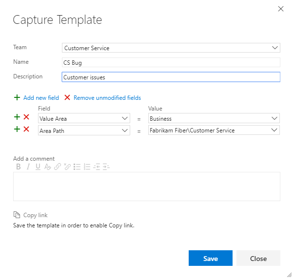
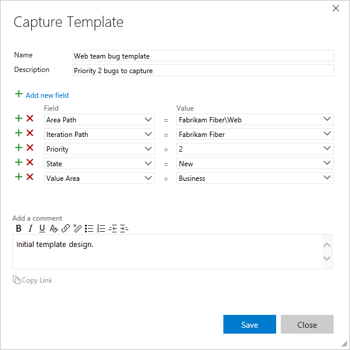
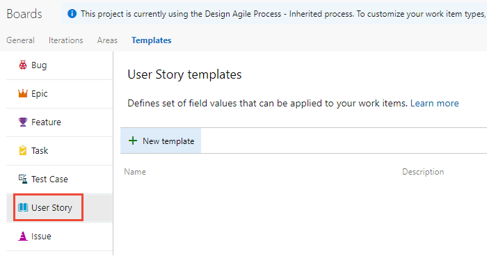
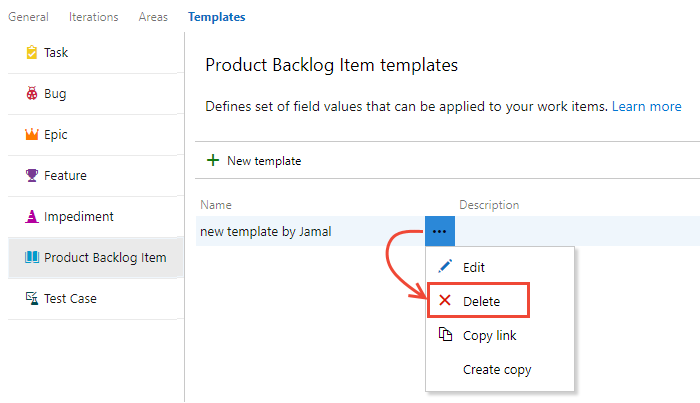
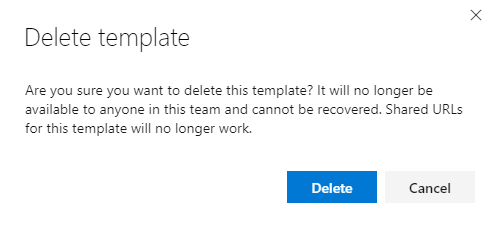
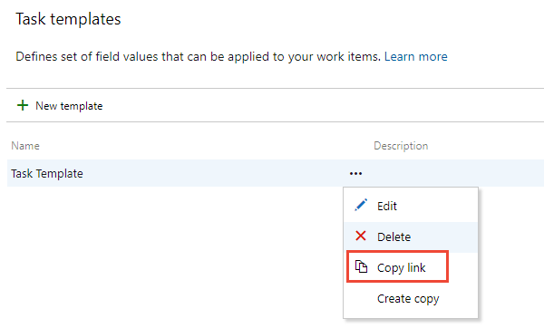
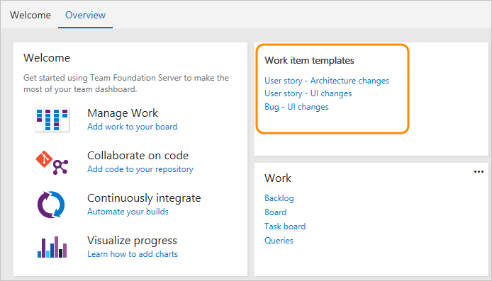

# Use templates to add and update work items in Azure Boards and Visual Studio

[!INCLUDE [version-lt-eq-azure-devops](../../includes/version-lt-eq-azure-devops.md)]
[!INCLUDE [version-vs-gt-2015](../../includes/version-vs-gt-2015.md)] 

<!--- Supports FWLINK https://go.microsoft.com/fwlink/?LinkId=824070 -->

With work item templates, you can quickly create work items that have pre-populated values for your team's commonly used fields. For example, create a template that defines the area path, iteration path, and activity to use when creating a task. 

You can use work item templates to create work items or bulk update several work items. For examples that show usage of work item templates, see [Sample work item templates](../work-items/work-item-template-examples.md). 

> [!NOTE]  
> Work item templates are distinct from process templates. For information on process templates, see [Choose a process template](../work-items/guidance/choose-process.md) or these specific topics for the default process templates: [Basic](../get-started/plan-track-work.md), [Agile](../work-items/guidance/agile-process.md), [Scrum](../work-items/guidance/scrum-process.md), or [CMMI](../work-items/guidance/cmmi-process.md).  

## Supported template tasks   

The availability of template task options depends on the client and platform version available to you. Add and manage work item templates from the web portal or from Visual Studio 2015 or earlier versions. Visual Studio 2015 and earlier versions support working with templates by installing the [Microsoft Visual Studio Team Foundation Server 2015 Power Tools](https://marketplace.visualstudio.com/items?itemName=TFSPowerToolsTeam.MicrosoftVisualStudioTeamFoundationServer2015Power). These templates only appear in your view of Team Explorer.  

As shown in the following table, a ✔️ indicates the task is available from the web portal or from Visual Studio 2015 or earlier versions. *(Make sure that you've selected the content version based on your platform version)*. 

---  
:::row:::
   :::column span="2":::
      **Task** 
   :::column-end:::
   :::column span="1":::
      Web portal
   :::column-end:::
   :::column span="1":::
      Visual Studio 2015 
   :::column-end:::
:::row-end:::
---
:::row:::
   :::column span="2":::
      [Capture a work item as a template](#capture)
   :::column-end:::
   :::column span="1":::
      ✔️   
   :::column-end:::
   :::column span="1":::
      ✔️   
   :::column-end:::
:::row-end:::
---
:::row:::
   :::column span="2":::
      [Manage work item templates](#manage)  
      (Define, edit, delete, copy link, create copy, and rename)
   :::column-end:::
   :::column span="1":::
      ✔️   
   :::column-end:::
   :::column span="1":::
      ✔️   
   :::column-end:::
:::row-end:::
---
:::row:::
   :::column span="2":::
      [Copy link (URL) of a template](#copy-link)
   :::column-end:::
   :::column span="1":::
      ✔️   
   :::column-end:::
   :::column span="1":::
      ✔️   
   :::column-end:::
:::row-end:::
---
:::row:::
   :::column span="2":::
      [Add a work item using a template](#add-wi)
   :::column-end:::
   :::column span="1":::
      ✔️   
   :::column-end:::
   :::column span="1":::
      ✔️   
   :::column-end:::
:::row-end:::
---
:::row:::
   :::column span="2":::
      [Define a work item template](#define-template)
   :::column-end:::
   :::column span="1":::
      ✔️   
   :::column-end:::
   :::column span="1":::
      ✔️   
   :::column-end:::
:::row-end:::
---
:::row:::
   :::column span="2":::
      [Apply a template to one or more work items](#apply)
   :::column-end:::
   :::column span="1":::
      ✔️   
   :::column-end:::
   :::column span="1":::
      ✔️   
   :::column-end:::
:::row-end:::
---
:::row:::
   :::column span="2":::
      [Add or remove tags from templates](#tags)
   :::column-end:::
   :::column span="1":::
      ✔️   
   :::column-end:::
   :::column span="1":::
       
   :::column-end:::
:::row-end:::
---
:::row:::
   :::column span="2":::
      [Define a template using a hyperlink](#adhoc-template) 
   :::column-end:::
   :::column span="1":::
      ✔️   
   :::column-end:::
   :::column span="1":::
          
   :::column-end:::
:::row-end:::
---


> [!TIP]    
> The templates you define through the web portal are distinct from those you define through Visual Studio. Web portal templates can only be managed and applied to work items through the web portal. Similarly, Visual Studio templates can only be managed, viewed, and applied to work items in Visual Studio. However, you can use the URLs of both template types to add work items through the web portal. 


## Prerequisites  

::: moniker range=">= azure-devops-2019"

- To add, capture, edit, or delete work item templates through the web portal, you must be a member of the team under which you add them.  

- To apply a work item template, you must be a Contributor of the project and a member of the team under which the work item template is defined.  

::: moniker-end

::: moniker range="tfs-2018"
- To add, capture, edit, or delete work item templates through the web portal, you must be a team administrator.   

- To apply a team template, you must be a Contributor of the project and a member of the team under which the work item template is defined.   
::: moniker-end

- To add, capture, or edit work item templates through Visual Studio Team Explorer, install the [Microsoft Visual Studio Team Foundation Server 2015 Power Tools](https://marketplace.visualstudio.com/items?itemName=TFSPowerToolsTeam.MicrosoftVisualStudioTeamFoundationServer2015Power). These templates only appear in your view of Team Explorer. 


<a id="capture"> </a> 

## Capture a work item as a template

The steps to capture a work item differ based on the platform, version, and client you use.  

### [Web portal](#tab/browser/)

<a id="team-services-capture" /> 

::: moniker range=">= azure-devops-2019"  

Templates captured through the web portal are assigned a GUID. 

1. From the web portal, open a work item that you'll use as the basis for a template.  

2. Choose the  :::image type="icon" source="../media/icons/actions-icon.png" border="false"::: actions icon to open the menu. Choose **Templates** and then **Capture**.   

    > [!div class="mx-imgBorder"]  
    >  

    Name the template, select the team for which you want to save it under, and optionally define or clear fields. Save the template when finished. 

    > [!div class="mx-imgBorder"]  
    >  

3. Once you've saved the template, choose **Copy link** to capture the URL for the template. 

4. You can paste the URL link into a browser to create a work item, or provide it to others for their use to add work items. For example, you can add it as a hyperlink to a [project wiki](../../project/wiki/wiki-create-repo.md), a [dashboard via a Markdown widget](../../report/dashboards/add-markdown-to-dashboard.md), or other shared network resource.

	Use the URL whenever you want to add a work item of the type you've defined with its predefined values.  

::: moniker-end  

::: moniker range="tfs-2018"  

Templates captured through the web portal are assigned a GUID. 

1. From the web portal, open a work item that you'll use as the basis for a template.  

    Within the web portal, work item templates are associated with a team. Only those templates that are defined for a team are accessible when you go to [apply a template](#apply) to work items using the web portal.  

2. Choose the  :::image type="icon" source="../media/icons/actions-icon.png" border="false"::: actions icon to open the menu. Choose **Templates** and then **Capture**.   

     

    Name the template and optionally define or clear fields. Save the template when finished. The template is saved under the team you selected in the first step. 

     

3. Once you've saved the template, choose **Copy link** to capture the URL for the template that you can use to add work items using the template.

4. Use the URL whenever you want to add a work item of the type you've defined with its predefined values.  

    You can save the URL as a text file or add the URL to a [dashboard](#markdown-widget) or web page as a hyperlink. 

::: moniker-end  

<a id="tfs-portal-capture" /> 

### [Visual Studio 2015](#tab/visual-studio/)

<a id="team-explorer-capture" />

If you primarily work in Visual Studio or Team Explorer, and want to create work items from templates that you access from the Work Items page, you can create work item template files (extension .wt).
 
1. If you haven't yet installed [Microsoft Visual Studio Team Foundation Server 2015 Power Tools](https://marketplace.visualstudio.com/items?itemName=TFSPowerToolsTeam.MicrosoftVisualStudioTeamFoundationServer2015Power), do that now. You need this software installed to access the Work Item Templates power tool for Visual Studio.  

1.  Open or run a query that lists the work item whose fields you want to capture.

2. Right-click the work item of the type and whose fields you want to capture, and select Capture Template from the context menu.

    

3. In the dialog, use the checkboxes to select all the fields you want to save in the template. Then, add a name and (optionally) description to the template. 

    

4. Save the template and it will appear in the root of the Team Explorer pane under the Templates section.  

* * *

<a id="manage"> </a> 

## Manage work item templates 

You can view the list of templates defined for each work item type, and also add, edit, copy, delete, rename, and copy the link of a template. All templates are defined and managed for a team. 

### [Web portal](#tab/browser/)

::: moniker range=">= azure-devops-2019"

<a id="team-services-manage" /> 

You must be a member of the team to add or edit team templates. 

1. From the web portal, open settings for a team. 

    Choose **Project Settings**.

    > [!div class="mx-imgBorder"]  
    >   

    Expand **Boards** and choose **Team configuration**. If you need to switch to a different team, use the team selector.

1. Choose **Templates**.  

    From here, you can choose any work item type to view or add templates for that type.  

::: moniker-end

<a id="team-services-manage" /> 

::: moniker range="tfs-2018"

You manage templates from  team settings. All templates are defined for a team. If you're not a team administrator, [get added as one](../../organizations/settings/add-team-administrator.md). Only team or project administrators can change work item templates.   

1. From the web portal, open settings for a team. 

    Choose the :::image type="icon" source="../../media/icons/admin-gear-icon.png" border="false"::: gear icon to open the settings for a team. 

    Here we open the admin page for the Web team. 

      

1. Choose **Work>Templates**.  

      

    From here, you can select any work item type to view or add templates for that type.  

::: moniker-end


### Manage templates for a work item type   

::: moniker range=">= azure-devops-2019"

- Choose the work item type to view the templates defined for each type. 

	For example, choose User Story to view templates defined to capture user stories.

	> [!div class="mx-imgBorder"]  
	>    

::: moniker-end

::: moniker range="tfs-2018"

- Choose the work item type to view the templates defined for each type. 
	For example, choose User Story to view templates defined to capture user stories.

	  

::: moniker-end

<a id="define-template" />

### Create a work item template 

1. From the work item type page, choose the  **New template** to create a template from scratch.  
    
      

2. Name the template and optionally add and remove fields. Save the template when finished. 

    Once you've saved the template, select Copy link to capture the URL for the template that you can use to add work items using the template.  

### Edit, rename, or copy a link to a template  

1. From the work item type page, choose  :::image type="icon" source="../media/icons/actions-icon.png" border="false"::: the actions icon for an existing template to access the menu options to **Edit**, **Delete**, or **Copy link**.  

	  

1. To rename a template, choose to edit the template, change the name, and then save your changes.  

### Create a copy of a template  

1. To duplicate an existing template, choose  :::image type="icon" source="../media/icons/actions-icon.png" border="false"::: the actions icon for an existing template and select the **Create copy** option. 

      

2. Name the template and optionally add and remove fields. Save the template when finished. 


<a id="delete"> </a>

### Delete a template  

1. From the web portal, open **Project Settings>Team configuration>Templates**.  

2. Choose the :::image type="icon" source="../media/icons/actions-icon.png" border="false"::: actions icon to open the menu, and choose **Delete**.   

    > [!div class="mx-imgBorder"]  
    >  

2. Choose **Delete** from the Delete template confirmation dialog that displays.

    > [!div class="mx-imgBorder"]  
    >  

	As indicated in the confirmation dialog, you can't recover a template once it's deleted. 


#### [Visual Studio 2015](#tab/visual-studio/)

<a id="team-explorer-manage" />

With Visual Studio with power tools installed, you can view the list of templates defined for each work item type, and also add, edit, copy, delete, and copy the link of a template. These templates are only available to you. To share them with others, you can copy the template URL and share that, or save the template as a .wt file. 

- You manage templates from the Team Explorer pane.  

	  

	The root Templates node represents the parent of all of your templates. You may create a directory structure underneath it by adding folders. Right-click on the **Templates** node or a folder and select **New Folder** from the context menu.  

- You can cut, copy, paste, rename, and delete templates and folders using the context menu. You may also drag and drop templates into folders. To edit multiple templates, use shift-click to select a range or ctrl-click to add individual templates to your selection, then right-click. 

### Define a template  

1. From the **Templates** section, right-click **Templates** and choose to create a template from scratch.

      

2. Save the template, provide a Name in the dialog provided.  

      

    Once you've saved the template, select Copy link to capture the URL for the template that you can use to add work items using the template.  

### Edit, use, copy, or delete a template  

- To edit, delete, or complete another action on a template, open its context menu (right-click) and choose the option you want.  

	  

- To make frequently used templates more accessible, you can set a default template for each work item type. To do so, right-click on a template in Team Explorer and select **Set As Default**. A checkmark will appear on the icon to indicate that it's now the default. 


### Set your template directory  

- To change the directory where templates are stored, select the Configure link, or navigate to it via **Tools>Options>Microsoft Team Foundation Server>Work Item Templates**. Use this dialog to set your template store path. Place your templates in a network location to share them with your team.  

* * *

<a id="add-wi"> </a>

## Add a work item using a template  

The main method for adding a work item using a template is to open the template link within a browser window. To get the template link, see the next section [Copy the link to a template](#copy-link).

You can share these links through email, a network share, or a team dashboard.  

<a id="copy-link" />

## Copy the link to a template 

Use the URL whenever you want to add a work item of the type you've defined with its predefined values. Copy the link to a shared network or send to your team via email. Also, consider [adding a link to the team dashboard](#markdown-widget).  

### [Web portal](#tab/browser/)

::: moniker range=">= azure-devops-2019"  

1. Go to **Project Settings**.

    > [!div class="mx-imgBorder"]  
    >   

    Expand **Boards** and choose **Team configuration**.  Then, choose **Templates**.

1. Choose the work item type whose template you want to copy. 

1. Choose the :::image type="icon" source="../media/icons/actions-icon.png" border="false"::: actions icon to open the menu, and choose **Copy link**.   

    > [!div class="mx-imgBorder"]  
    >  

    You can save the URL as a text file or add the URL to a web page as a hyperlink. 

::: moniker-end  

::: moniker range="tfs-2018"  

1. Choose the :::image type="icon" source="../../media/icons/admin-gear-icon.png" border="false"::: gear icon to open the settings for a team. 

    > [!div class="mx-imgBorder"]  
    > 

1. Choose the **Work>Templates** tab. Then, choose the   :::image type="icon" source="../media/icons/actions-icon.png" border="false":::  actions icon for the template you want to copy and select **Copy link**.  

    

    You can save the URL as a text file or add the URL to a web page as a hyperlink. 

::: moniker-end  

### [Visual Studio 2015](#tab/visual-studio/)

<a id="team-explorer-copy-link" />

1. You can copy the link to a template, which will open in the web portal, by opening the context menu for the template.  

    

2. Paste the copied link into a web browser to check that it works as expected.    

* * *

<a id="apply"> </a>

## Apply a template to new or existing work item(s)  

You can apply a template to a single work item or do a bulk update of several work items.  

<a id="team-services-apply" />

#### [Web portal](#tab/browser/)

::: moniker range=">= azure-devops-2019"  

### Apply a template within a work item 

1. Open a new work item or an existing work item that you want to update using the fields defined within a template, choose the  :::image type="icon" source="../media/icons/actions-icon.png" border="false"::: actions icon to open the menu, select **Templates**, and then select the name of a predefined template.  

    > [!div class="mx-imgBorder"]
    >  

    Only those templates defined for teams that you belong to appear.  

    > [!TIP]  
    > Refresh your browser to discover the latest templates that have been added. If you don't see any templates, it may be that there are none defined for the work item type. 

2. Save the work item for the changes to be applied. The fields changed are noted in the History field. </p>

::: moniker-end

::: moniker range="tfs-2018"  

### Apply a template within a work item 

1. Open the work item that you want to update using the fields defined within a template, choose the  :::image type="icon" source="../media/icons/actions-icon.png" border="false"::: actions icon to open the menu, select **Templates**, and then select the name of a predefined template.  

     

    > [!TIP]  
    > Refresh your browser to discover the latest templates that have been added. If you don't see any templates, it may be that there are none defined for the work item type. 

2. Save the work item for the changes to be applied. The fields changed are noted in the History field. </p>

::: moniker-end


<a id="apply-multiple"> </a>

### Apply a template to several work items 

::: moniker range=">= azure-devops-2019"

1. To bulk update several work items, first select them from the backlog or a query results list, and then open the actions menu for one of them. All work items you select must be of the same work item type. For example, all user stories or all bugs. 

2. Choose the template to apply. 

    > [!div class="mx-imgBorder"]  
    > 

3. Field changes are automatically applied and work items saved. To learn more about bulk updates, see [Bulk modify work items](../backlogs/bulk-modify-work-items.md).

::: moniker-end 

::: moniker range="tfs-2018"

1. To bulk update several work items, first select them from the backlog or a query results list, and then open the actions menu for one of them. All work items you select must be of the same work item type. For example, all user stories or all bugs. 

2. Choose the template to apply. 

    

3. Field changes are automatically applied and work items saved. To learn more about bulk updates, see [Bulk modify work items](../backlogs/bulk-modify-work-items.md).

::: moniker-end 

#### [Visual Studio 2015](#tab/visual-studio/)

<a id="team-explorer-apply" />

1. Open or run a query that lists the work item(s) whose fields you want to capture.  

2. Right-click the work items—which must be of the same type—and choose **Apply Template** from the context menu.  

    

3. Select the template to use and select OK. 

    

4.  Save the work item.  

    

* * *


<a id="tags"> </a>

## Add or remove tags from templates 

You can add tags to a template and they'll be applied to the work item when you use the template. To add two or more tags, delimit them with a comma (,).

> [!div class="mx-imgBorder"]  
> 

If you don't specify tags to remove, then all tags present in a work item will remain defined. They'll remain defined even when you apply a work item template to an existing work item. 


<a id="adhoc-template"> </a>

## Define an unplanned work item template using a hyperlink 

You can specify a work item template that specifies several field values using the following syntax. Use the URL whenever you want to add a work item of the type you've defined with its predefined values. 

::: moniker range="azure-devops"

> [!div class="tabbedCodeSnippets"]
> ```URL
> https://dev.azure.com/{OrganizationName}/{ProjectName}/_workItems/create/{WorkItemType}?
> [FieldReferenceName 1]={FieldValue 1}&
> [FieldReferenceName 2]={FieldValue 2}&
> [FieldReferenceName 3]={FieldValue 3}&
> . . .
> ```

::: moniker-end

::: moniker range="< azure-devops"

> [!div class="tabbedCodeSnippets"]
> ```URL
> http://{ServerName}:8080/tfs/DefaultCollection/{ProjectName}/_workItems/create/{WorkItemType}?
> [FieldReferenceName 1]={FieldValue 1}&
> [FieldReferenceName 2]={FieldValue 2}&
> [FieldReferenceName 3]={FieldValue 3}&
> . . .
> ```

::: moniker-end


For example, the following syntax specifies a work item task with title *TaskTitle*. It specifies values for the Assigned To, Description, Tags, Activity, and Iteration Path fields. 

::: moniker range="azure-devops"
> [!div class="tabbedCodeSnippets"]
> ```URL
> https://dev.azure.com/{OrganizationName}/{ProjectName}/_workItems/create/Task?
> [System.Title]=TaskTitle&
> [System.AssignedTo]=Jamal+Hartnett&
> [System.Description]=<p>Always+include+Remaining+Work+and+links+to+any+related+bugs+or+user+stories.</p>&
> [System.Tags]=Web;+Phone;+Service&
> [Microsoft.VSTS.Common.Activity]=Development&
> [System.IterationPath]=Fabrikam+Fiber%5CIteration+1
> ``` 

::: moniker-end

::: moniker range="< azure-devops"

> [!div class="tabbedCodeSnippets"]
> ```URL
> http://{ServerName}:8080/tfs/DefaultCollection/{ProjectName}/_workItems/create/Task?
> [System.AssignedTo]=Jamal+Hartnett&
> [System.Description]=<p>Always+include+Remaining+Work+and+links+to+any+related+bugs+or+user+stories.</p>&
> [System.Tags]=Web;+Phone;+Service&
> [Microsoft.VSTS.Common.Activity]=Development&
> [System.IterationPath]=Fabrikam+Fiber%5CIteration+1
> ``` 

::: moniker-end

> [!TIP] 
> There is a 2000 character limit imposed by some browser clients. 

You can save the URL as a text file or add the URL to a dashboard or web page as a hyperlink. 

<a id="markdown-widget"> </a>

## Add a template link to a team dashboard   

You can add links to a Markdown widget that appear on your team dashboard in the web portal. These links open a work item with the template defined fields predefined.


For example, the following widget contains links to three templates.  

 

To learn more about the Markdown widget see [Add Markdown to a dashboard, Markdown widgets](../../report/dashboards/add-markdown-to-dashboard.md). 
## Related articles

- [Azure Boards FAQs](../faqs.yml) 
- [Sample work item templates](../work-items/work-item-template-examples.md)
