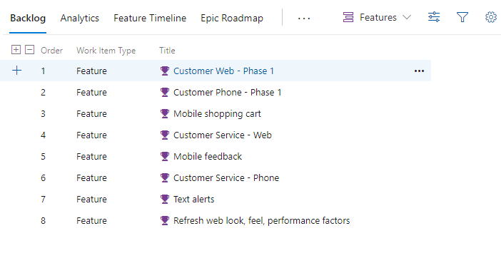
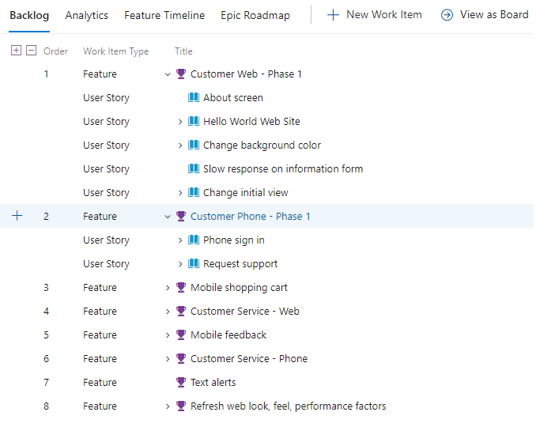
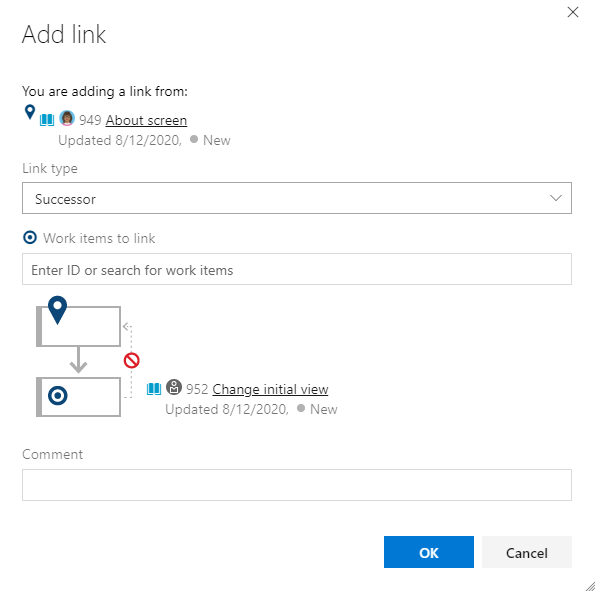
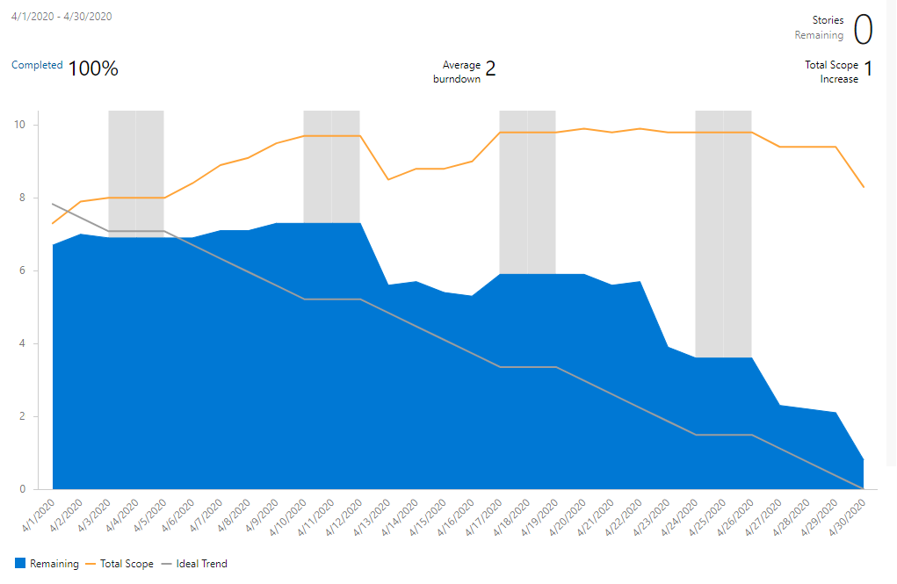
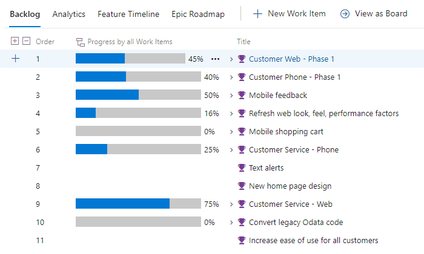
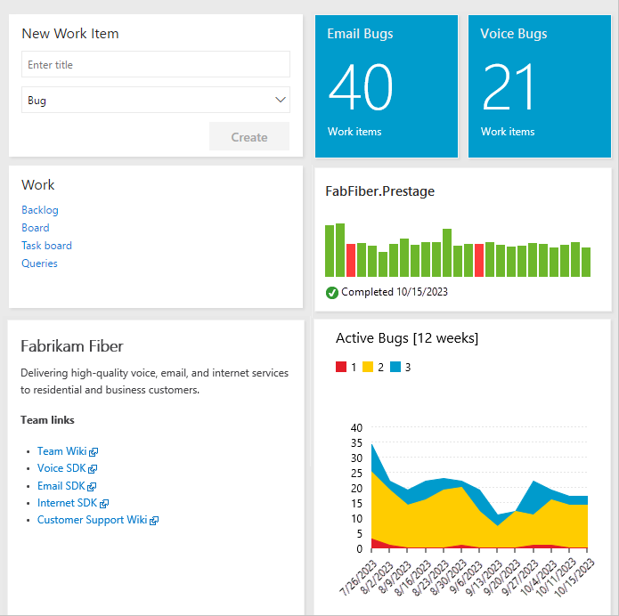

# Best practices for Agile project management

[!INCLUDE [version-lt-eq-azure-devops](../includes/version-lt-eq-azure-devops.md)]

Azure Boards provides a choice of Agile planning tools, many of which work in combination with each other. This article provides a get-started guide for project managers new to Azure Boards. If you and your teams want to take a minimal tracking approach to plan and manage your projects, start with this guide. Also, if you're moving from waterfall project management to Agile methods, start with this guide.

> [!NOTE]
> If your team is committed to practicing Kanban or Scrum methods, see [About Boards and Kanban](boards/kanban-overview.md) or the [tutorials for implementing Scrum](./sprints/scrum-overview.md).

Most of the guidance in this article is valid for both the cloud and on-premises versions. However, some of the features included in this article, such as Rollup, Analytics, and some portfolio planning tools, are only available for the cloud at this time.

## Configure your teams

Azure Boards provides each team with a set of Agile tools to plan and track work. Each project defines a default team, which you can start using immediately. If you have several development or feature teams, we recommend that you define a team in Azure DevOps for each feature team. This way, each team can work autonomously while collaborating with each other.

#### Best practice tips

- Configure teams along the value streams that your organization wants to deliver.
- Define a team for each development group of 6 to 12 developers.
- Configure development teams to support rollup to project management feature teams.

For more information about configuring teams, see:

- [Configure a hierarchy of teams](plans/configure-hierarchical-teams.md)
- [Add a team and move from one default team to several teams](../organizations/settings/add-teams.md)
- [Understand Agile culture](/devops/plan/adopting-agile)
- [Scale Agile to large teams](/devops/plan/scaling-agile)

## Configure your sprints

Sprints specified by iteration paths are defined for a project and then selected by teams. A sprint cadence can vary between one week to four weeks or longer. Also, you can define sprints within a hierarchy that includes release trains. You assign work to sprints that teams commit to deliver at the end of the sprint. These Azure Boards tools rely on sprint assignments to a team's [Sprint backlogs, Taskboard, and Forecast](sprints/scrum-overview.md) and [Delivery plans](plans/review-team-plans.md).

#### Best practice tips

- Define a sprint cadence for use by all teams within your product group.
- Define at least six or more iterations that support planning for the next 6 to 12 months.
- Determine how teams use iterations to manage backlog items.
	- Unassigned sprint work is assigned to the default backlog.
	- Unassigned sprint work is assigned to a designated future backlog sprint.

For more information about configuring sprints, see:

- [Define and assign iteration paths](../organizations/settings/about-areas-iterations.md#define-and-assign-iteration-paths)
- [Define iteration paths and configure team iterations](../organizations/settings/set-iteration-paths-sprints.md)

## Choose your work item types

Determine which work item types your team can use to capture customer requirements and development work. If your project is based on the Agile process, we recommend that you use the User Story, Bug, and Feature work item types.

If your project is based on another process, such as Basic, Scrum, or CMMI, you have the following choices. Each team determines how they want to track bugs.

[!INCLUDE [temp](includes/work-item-types.md)]

[!INCLUDE [temp](includes/note-requirements-terms.md)]

#### Best practice tips

- Use the Feature work item type to capture customer features you want to ship.
- Quickly add features or requirements from the backlog and fill in details later.
- Use the Requirement work item type to break down features into work that the development team owns. In addition:
    - For Agile, use the User Story work item type.
    - For Basic, use the Issue work item type.
    - For Scrum, use the Product backlog item work item type.
    - For CMMI, use the Requirement work item type.
- Use the Bug work item type to capture code defects.
- Map requirements to features to track progress at the project management level.
- Size requirements to be completed within a sprint.
- Size features to be completed within a sprint or several sprints.
- Size Epic work items to be delivered quarterly or to some milestone objective.
- Let developers use the Task category to break down their work as needed.

As project managers, you manage the features and the development team manages the requirements. When you map them by using parent-child links, you gain visibility into the progress of your features. Each work item you add to your team backlog is automatically assigned the default area path and iteration path set for your team.

If you have larger initiatives or scenarios that require shipping several features, group them under the Epic category by using parent-child links.

For more information about work item types, see:

- [Define features and epics](backlogs/define-features-epics.md)
- [Create your backlog](backlogs/create-your-backlog.md)
- [Organize your backlog (map or reparent)](backlogs/organize-backlog.md)

## Create your product plan

Create your product plan by using the features backlog. The development team then creates their product plan by using the product backlog. Periodically, you should review and refine your product plans.

### Features backlog

Project managers initiate the product plan by adding features to the features backlog. Each feature should represent a shippable deliverable that addresses a customer need.

> [!div class="mx-imgBorder"]
> 

### Product backlog

Development teams add User Stories to their product backlog so that the User Story is automatically assigned the team's default area path and iteration path. Then, they can map those stories under each feature that represents the work required to implement the feature. Each User Story should be sized so that it can be completed within a sprint.

> [!div class="mx-imgBorder"]
> 

### Refine each backlog

Periodically review each backlog by doing the following tasks:

- Define the work to be performed.
- Reorder work items by using the drag-and-drop method so that they appear in priority order.
- Open work items and add details.
- Assign work to team members or to sprints.
- Capture technical debt and nonfeature work required to support a healthy ecosystem of delivery.
- Map unparented work to the features to which it belongs.
- Estimate the size of the requirements to help determine team velocity and support forecasting (optional).

> [!TIP]
> You can monitor team velocity based on estimates assigned to completed work or a simple count of work items completed during sprints. To use the Forecast feature, you must assign a value to the **Story Points**, **Effort**, or **Size** field. If you don't want to estimate requirements, you can simply assign a value of **1** to requirement estimates and then use the Forecast tool based on a count of work items.

#### Best practice tips

- Periodically refine your backlog.
- Make sure features and requirements are sized appropriately.
- Define the acceptance criteria and the definition of done for features and work.
- Map unmapped work to features.
- Set your view options to support the backlog tasks you want to accomplish.
- Forecast your backlog.

For more information, see:

- [Define features and epics](backlogs/define-features-epics.md)
- [Create your backlog](backlogs/create-your-backlog.md)
- [Configure your backlog view](backlogs/configure-your-backlog-view.md)
- [Forecast your product backlog](sprints/forecast.md)

## Use tags to support queries and filtering

With work item tags, team members can assign ad-hoc tags to work items. You can use these tags to filter backlogs and boards. You can also use them to query on work items. For tags to be useful to the team, provide some general guidance on how your team should use tags. Consider documenting this guidance in a central place, such as the [project wiki](../project/wiki/about-readme-wiki.md).

The following image illustrates a board filtered on the **web** keyword that displays cards with the `Web` tag.

> [!div class="mx-imgBorder"]
> 

#### Best practice tips

- Have a policy in place about how your teams use tags.
- Indicate how you use tags to support queries, filtering, and reporting.
- Consider using tags to identify cross-team or cross-project dependencies.

For more information, see:

- [Add work item tags to categorize and filter lists and boards](queries/add-tags-to-work-items.md)
- [Filter your board](./backlogs/filter-backlogs-boards-plans.md)
- [Create a wiki for your project](../project/wiki/wiki-create-repo.md)

## Forecast and milestone planning

To gain insight into what features can ship when, use the Forecast tool. This tool requires that you provide estimates to the **Story Points**, **Effort**, or **Size** field for each requirement. If you want to forecast on a simple count of work items, assign the value of **1** to requirement estimates.

### Order the features backlog in priority order

As project managers, you should always have your features backlog in priority order, which conveys to the development team which features are most important to complete first.

Here, the features backlog shows the sequence of features to ship.

:::image type="content" source="media/best-practices/feature-backlog-priority-order.png" alt-text="Screenshot that shows a features backlog ordered by feature parent.":::

### Order the requirements backlog based on parent features

First, you want to make sure that you're completing the requirements needed to ship features. As shown in the following image, the requirements backlog is ordered according to the features you want to ship. This ordering assumes that all requirements in a feature must be complete to ship it. Also, Story Points are assigned to each User Story.

:::image type="content" source="media/best-practices/product-backlog-ordered-parent.png" alt-text="Screenshot that shows a requirements backlog ordered by feature parent.":::

### Forecast the requirements backlog

With estimates assigned to each requirement, you can set a team velocity. In the following example, we specify 12 for the velocity, which is equivalent to stating that on average the team can complete 12 Story Points per sprint. The Forecast tool shows which requirements and features the team can complete within the next six sprints. When you use the Planning tool, you can quickly assign requirements to the forecasted sprints.

[!INCLUDE [temp](../includes/lightbox-image.md)]

> [!div class="mx-imgBorder"]
> 

Getting good at estimates and having predictable team velocities are useful team goals for [process improvement](#process-improvement).

### Update your Features board

With a forecast of when a feature ships, you can update each feature's iteration path. Quickly assign values to a feature by adding those fields to the card on the board, as shown in the following image.

:::image type="content" source="media/best-practices/features-board-iteration-path-updates.png" alt-text="Screenshot that shows a Features board with updated iteration paths.":::

### Milestone planning

Milestone markers aren't used in Azure Boards work tracking, except for delivery plans. [Delivery plans](plans/review-team-plans.md) provide a calendar view and allow you to define a milestone marker. You can use one or more of the following options to mark a work item as a milestone:

- Prepend or append the word **Milestone** in the title of your work item.
- [Add a work item tag](./queries/add-tags-to-work-items.md) labeled **Milestone**.
- [Add a custom field](../organizations/settings/work/customize-process-field.md) labeled **Milestone** and populate it with a pick list of milestones.
- [Link work items](./backlogs/add-link.md) by using the Predecessor/Successor or Related link type to a milestone work item.
- [Assign a milestone work item to the sprint](./sprints/assign-work-sprint.md) targeted for completion.

## Manage dependencies

In Microsoft Project, you manage tasks that depend on the completion of other tasks by linking them. To manage dependencies in Azure Boards, you can add similar linking by adding Predecessor/Successor link types to work items. Add these links from the **Add link** dialog for a work item.

### Add link dialog

Azure Boards supports many link types to track related work. Choose the Predecessor/Successor link types to track work with dependencies. A quick way to link work items is to add a tag to work items that participate in producing or consuming dependencies. Create a query that's based on the tag, and then add the required links.

The following **Add link** dialog illustrates how two work items are linked by using the Successor link type.

> [!div class="mx-imgBorder"]
> 

### Visualize work item relationships

::: moniker range="azure-devops"

You can view dependencies and identify dependencies that have issues with delivery plans. As shown in the following image, you can toggle the display of dependency lines between linked work items. For more information, see [Track dependencies by using delivery plans](plans/track-dependencies.md).

:::image type="content" source="plans/media/dependencies/dependency-lines.png" alt-text="Screenshot that shows dependency lines between several work items.":::

::: moniker-end

::: moniker range="< azure-devops"

With the [Work Item Visualization](https://marketplace.visualstudio.com/items?itemName=ms-devlabs.WorkItemVisualization) Marketplace extension, you can visualize the link relationships among several work items, as shown in the following image.

[!INCLUDE [temp](../includes/lightbox-image.md)]

> [!div class="mx-imgBorder"]
> 

::: moniker-end

### Minimum Viable Product vs. Critical Path Management

Azure Boards doesn't provide a native view of the critical path. Agile methodologies favor a Minimum Viable Product (MVP) over Critical Path Management. By using MVP, you identify the shortest path and dependencies by prioritizing Epic, Feature, User Story, and Task work item types. For more context, see [The critical path on Agile projects](https://www.mountaingoatsoftware.com/blog/the-critical-path-on-agile-projects) and [Running a lean startup on Azure DevOps](https://medium.com/@giladkhen/running-a-lean-startup-on-azure-devops-5934ced2cc42).

#### Best practice tips

- Add a `dependency` tag to work items participating in dependency management.
- Use Predecessor/Successor link types to track dependencies of work owned by other teams or within other projects.
- Create queries to track, add, and triage dependencies.
- Use [delivery plans](plans/track-dependencies.md) to view work that you have dependencies on from other teams.
- Use the [Work Item Visualization](https://marketplace.visualstudio.com/items?itemName=ms-devlabs.WorkItemVisualization) Marketplace extension to visualize dependencies for a specific work item within the work item form.

> [!NOTE]
> Marketplace extensions aren't supported features of Azure Boards, so they aren't supported by the product team. For questions, suggestions, or issues you have when you use these extensions, see their corresponding extension pages.

For more information, see:

- [Link work items to objects](backlogs/add-link.md)
- [Track dependencies by using delivery plans](plans/track-dependencies.md)

## Work in sprints

Sprints allow the development team to focus on completing a preselected set of work. Work assigned to a sprint appears on the team's sprint backlog. Sprint backlogs are defined only for product backlogs, not for portfolio backlogs.

#### Sprint burndown chart

By updating the status of work daily throughout a sprint, you can easily track sprint progress with the Sprint burndown chart, as shown in the following image.

> [!div class="mx-imgBorder"]
> 

#### Best practice tips

For each sprint, perform the following tasks:

- Plan each sprint with your team.
- Use the team's sprint backlog to review sprint deliverables.
- Ensure that each sprint work item is assigned to a team member.
- Ensure that each work item is scoped for completion within the sprint.
- Ensure that the acceptance criteria for the work are well defined and understood.
- Update the status of sprint work items as work moves from *New* to *Active* to *Completed* states, tracking sprint burndown.
- Check in with other teams on dependencies on which your team's work depends.
- Monitor sprint progress by using the sprint burndown chart.

For more information, see:

- [Assign backlog items to a sprint](sprints/assign-work-sprint.md)
- [Configure and monitor sprint burndown](../report/dashboards/configure-sprint-burndown.md)
- [Define features and epics](backlogs/define-features-epics.md)

## Review progress and feature deliverables

The three main tools you should use to review progress and deliverables are:

- Features board
- Features backlog with rollup columns
- Delivery plans

### Features board

Your Features board is another place to review progress and ensure the continuous flow of deliverables. The following image illustrates a customized Features board, including in-progress columns like **Need more info**, **On Deck**, **In Progress**, and **Customer Rollout**. These columns provide a more natural set of states as features get proposed, researched, designed, developed, and then deployed to production.

[!INCLUDE [temp](../includes/lightbox-image.md)]

> [!div class="mx-imgBorder"]
> 

### Rollup

One quick and visual way to monitor progress is from the features backlog. By adding the rollup progress bar column, you can see what percentage of work items are completed for each feature, as shown in the following image.

> [!div class="mx-imgBorder"]
> 

### Delivery plans and multiple team deliverables

To review features delivered across several teams, configure a delivery plan. Delivery plans provide an interactive board to review a calendar schedule of stories or features that several teams plan to deliver.

::: moniker range="azure-devops"
:::image type="content" source="./plans/media/plans/overview-with-callouts.png " border="false" alt-text="Screenshot with callouts of delivery plans.":::
::: moniker-end

::: moniker range="< azure-devops"

::: moniker-end

### Best practice tips

- Customize your Features board to support your team's processes.
- Add fields to cards so that you can update their values quickly and easily.
- Update the iteration path (sprint) of features as you gain clarity about when they ship.
- Review the Features board to talk through status, blocks/issues/risks/changes, and update status.
- Use the filter feature to focus on tagged items, assigned-by features, specific sprints, and more.
- Add rollup columns to your feature backlog to monitor overall progress based on work item count completion.
- Use delivery plans to review features for several teams to discuss cross-team dependencies.

For more information, see:

- [Add columns to your board](boards/add-columns.md)
- [Customize cards](boards/customize-cards.md)
- [Filter your board](./backlogs/filter-backlogs-boards-plans.md)
- [Display rollup progress or totals](backlogs/display-rollup.md)
- [Review team delivery plans](plans/review-team-plans.md)

## Process improvement

Continuous improvement is at the heart of Agile methods. To improve your processes, you need to have shared goals and a shared plan. To initiate process improvement activities, consider adding them through regular practices. You might want to:

- Plan sprints.
- Set sprint goals.
- Conduct regular retrospectives.

Consider the following questions when you set goals:

- What are you learning about your customers? What do you need to know?
- What data is being measured? Is it actionable? What data needs to be measured?
- How is the flow of deliverables? Is it as expected? Where can improvements be made?
- Are your team members empowered to do their best? What tools or information would help them improve?
- How well is information being shared? How well are teams collaborating?
- How well is your team managing technical debt and closing bugs?

Some of the Agile tools you can use to support process improvement are team velocity, team dashboards, and the [Retrospectives](https://marketplace.visualstudio.com/items?itemName=ms-devlabs.team-retrospectives) Marketplace extension.

### Team velocity

From the team's Velocity chart, you can gain an understanding about how well the team is planning and executing a sprint. As shown in the following example, the Velocity chart shows the planned, completed, completed late, and incomplete count of work items for several sprints. Teams can review this chart to help determine how well they're estimating and executing and how they might improve.

> [!div class="mx-imgBorder"]
> 

### Team dashboards

Teams can define one or more dashboards to share information and monitor real-time data on work progress.

> [!div class="mx-imgBorder"]
> 

#### Best practice tips

- Identify process improvement goals that your team can agree to, write them down, and review them periodically.
- Use team dashboards to share information and work tracking charts, which you and your team review periodically.
- Have your team identify at least one sprint goal related to process improvement while at sprint planning meetings.
- Conduct regular retrospectives to capture what went well, what didn't go well, and actions to improve.
- Maintain an improvement tracking board, such as the one that's available with the [Retrospectives](https://marketplace.visualstudio.com/items?itemName=ms-devlabs.team-retrospectives) Marketplace extension.

For more information, see:

- [View or configure team velocity](../report/dashboards/team-velocity.md)
- [Add, rename, and delete dashboards](../report/dashboards/dashboards.md)
- [Implement Agile practices that scale](plans/practices-that-scale.md)
- [Retrospectives Marketplace extension](https://marketplace.visualstudio.com/items?itemName=ms-devlabs.team-retrospectives)

## Next steps

> [!div class="nextstepaction"]
> [Configure and customize Azure Boards](configure-customize.md)

## Related articles

- [Manage requirements](../cross-service/manage-requirements.md)
- [Work with multi-team ownership of backlog items](backlogs/backlogs-overview.md#multi-team)
- [11 Reasons for using Azure Boards to plan and track your work](get-started/why-use-azure-boards.md)

### Industry articles

- [Agile and a continuous improvement mindset](https://scrumtraininginstitute.com/agile-scrum-training/agile-team-health-check/#:~:text=At%20the%20core%20of%20Agile%20continuous%20improvement%20is,your%20organization%20can%20develop%20a%20continuous%20improvement%20mindset)
- [What is KAIZEN](https://www.kaizen.com/what-is-kaizen.html)
