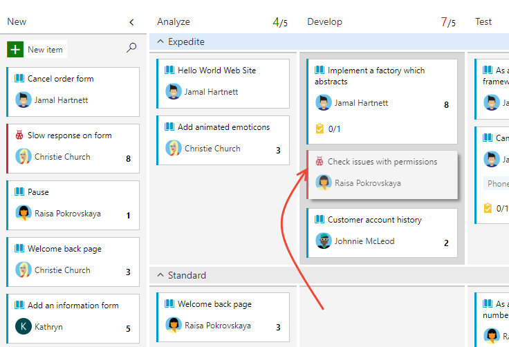
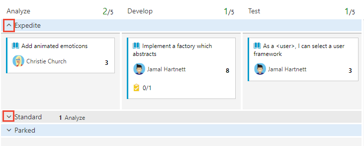
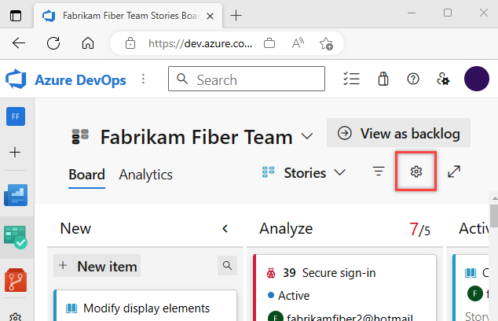

# Use swimlanes to differentiate work you want to expedite on your Kanban board

[!INCLUDE [version-lt-eq-azure-devops](../../includes/version-lt-eq-azure-devops.md)]  

Your Kanban board helps you visualize the flow of work as it moves from defined to completed. When you add swimlanes, you can also visualize the status of work that supports different service-level classes. You can create a swimlane to represent any other dimension that supports your tracking needs.    

For example, you can create three swimlanes&mdash;*Expedite*, *Standard*, and *Parked*&mdash;to track high-priority work, standard work, and work that's currently blocked.  

 

> [!TIP]
> Type **o** to expand all swimlanes and **u** to collapse all swimlanes. To move the focus up or down, enter the ↑↓ up/down arrows. For more tips, see [Keyboard shortcuts](../../project/navigation/keyboard-shortcuts.md).

[!INCLUDE [temp](../includes/prerequisites-team-settings.md)]

## Types of swimlanes  

You can use swimlanes to sort work on your Kanban board to track items that you differentiate as follows: 
*	High priority items  
*	Service-level class  
*	Date-driven requirement  
*	Dependency for or from another team   
*	Blocked items  
*	Technical debt or other engineering work that's not a specific user story  

## Track work in swimlanes  

Once you've set up your swimlanes, you can drag items into a swimlane and also reorder them within the lane.  

> [!TIP]  
> When you have many swimlanes or cards on your board, you may encounter slow performance when dragging a card. We recommend that you use swimlanes in conjunction with card styles, tags, and board filters to manage your work items. If you have a lot of cards in the default lane, place that lane lower on the board to enhance performance when dragging a card to another swimlane.  

> [!div class="mx-imgBorder"]
>   

You can also focus on a single swimlane by collapsing all other lanes.

> [!div class="mx-imgBorder"]  
>   

[!INCLUDE [temp](../includes/note-kanban-boards-teams.md)]
	
## Add or remove a swimlane 

*What swimlanes will support your tracking needs?* Once you've identified one or two, add them to your Kanban board.  

::: moniker range="azure-devops"

1. [Open your Kanban board](kanban-quickstart.md). If you're not a team admin, [get added as one](../../organizations/settings/add-team-administrator.md). Only team and project administrators can customize the Kanban board.

1. Choose :::image type="icon" source="../../media/icons/blue-gear.png" border="false"::: **Configure board settings** to configure the board.  

	:::image type="content" source="media/expedite/choose-configure-board-settings.png" alt-text="Screenshot of Kanban board, Choose Configure board settings.":::

1. Choose **Swimlanes**, choose **Add swimlane**, and then enter the name of the swimlane you want to add. For example, here we enter *Expedite*. 

	> [!NOTE]  
	> The following images show the user interface that displays when the **New Boards Hub** preview feature is enabled. Some features are only available when the **New Boards Hub** is enabled as described in [Key concepts and work item tasks in Azure Boards](../work-items/quick-ref.md). For example, the ability to choose the swimlane color is only supported when the **New Boards Hub** feature is enabled. To enable it, see [Manage or enable features](../../project/navigation/preview-features.md).

	:::image type="content" source="media/expedite/add-swimlane-new-board-hubs-enabled.png" alt-text="Screenshot of Kanban board Settings, Swimlane tab, Add swimlane.":::

	The default lane appears unlabeled on the Kanban board. You can rename it to anything you like, however, you can't delete it. 

1. To set the color of the swimlane, choose a color from the drop-down menu. To reset the swimlane to the default, choose :::image type="icon" source="../media/icons/refresh.png" border="false":::  **Reset to default color**. 

	:::image type="content" source="media/expedite/pick-swimlane-color.png" alt-text="Screenshot of Kanban board Settings, Swimlane tab, choose swimlane color.":::

3. To reorder or delete a swimlane, choose :::image type="icon" source="../media/icons/more-actions.png" border="false"::: context menu for the swimlane, and select the corresponding option from the menu.    

	:::image type="content" source="media/expedite/move-remove-swimlane-options.png" alt-text="Screenshot of Kanban board Settings, Swimlane tab, swimlane menu options."::: 

	> [!NOTE]  
	> If you need to delete a swimlane, first move all items out of the lane. Then open the Settings dialog, choose :::image type="icon" source="../media/icons/more-actions.png" border="false"::: context menu for the swimlane,  and select **Remove**. 

5. When done with your changes, choose **Save**.  

::: moniker-end 

::: moniker range=">= azure-devops-2019 < azure-devops"

1. [Open your Kanban board](kanban-quickstart.md). If you're not a team admin, [get added as one](../../organizations/settings/add-team-administrator.md). Only team and project admins can customize the Kanban board.

1. Choose the  :::image type="icon" source="../../media/icons/blue-gear.png" border="false":::  gear icon to configure the board and set general team settings.  

	> [!div class="mx-imgBorder"]
	>   

2. Choose **Swimlanes** and then choose the :::image type="icon" source="../media/icons/green_plus_icon.png" border="false"::: plus icon and enter the name of the swimlane you want to add.  

	> [!div class="mx-imgBorder"]
	>   

	The default lane appears unlabeled on the Kanban board. You can rename it to anything you like, however, you can't delete it. Also, you can rename it directly from the Kanban board. 
    
3. To reorder your swimlanes, grab the lane and move it up or down.   

   > [!div class="mx-imgBorder"]
   >   

4. If you need to delete a swimlane, first move all items out of the lane. Then open the Settings dialog, choose the  :::image type="icon" source="../../media/icons/actions-icon.png" border="false":::  actions icon and select **Remove**. 
	
   > [!div class="mx-imgBorder"]
   >   

5. When done with your changes, choose **Save**.  

::: moniker-end 

::: moniker range="tfs-2018"  

1. [Open your Kanban board](kanban-quickstart.md). If you're not a team admin, [get added as one](../../organizations/settings/add-team-administrator.md). Only team and project admins can customize the Kanban board.  

2. Choose the :::image type="icon" source="../../media/icons/team-settings-gear-icon.png" border="false"::: gear icon to open the common configuration settings dialog for the Kanban board. 

	  

3. Choose **Swimlanes** and then choose the :::image type="icon" source="../media/icons/green_plus_icon.png" border="false"::: plus icon and enter the name of the swimlane you want to add.  

	> [!div class="mx-imgBorder"]
	>   

	The default lane appears unlabeled on the Kanban board. You can rename it to anything you like, however, you can't delete it. Also, you can rename it directly from the Kanban board. 
    
4. To reorder your swimlanes, grab the lane and move it up or down. 

   > [!div class="mx-imgBorder"]
   >   

5. If you need to delete a swimlane, first move all items out of the lane. Then open the Settings dialog, choose the  :::image type="icon" source="../../media/icons/actions-icon.png" border="false":::  actions icon and select **Remove**. 
	
   > [!div class="mx-imgBorder"]
   >   

6. When done with your changes, choose **Save**.  

::: moniker-end  

## Query for work items based on swimlane

You can track which work items have been added to a Kanban board swimlane by creating a query and using the [Board Lane field](../queries/query-by-workflow-changes.md#kanban_query_fields).  

## Related articles

As you can see, swimlanes provides another way to organize and visualize the flow of work using [Kanban](kanban-basics.md). Here are a few more options you have for customizing the look and feel of your Kanban board.   

* [About teams and Agile tools](../../organizations/settings/about-teams-and-settings.md)
* [Query by assignment or workflow changes](../queries/query-by-workflow-changes.md#kanban_query_fields)
* [Add columns](add-columns.md)  
* [Split columns](split-columns.md)   
* [Customize cards](../../boards/boards/customize-cards.md)   

### REST API resources

To programmatically interact with the Kanban board and other team settings, see the [REST API, Boards reference](/rest/api/azure/devops/work/boards).

