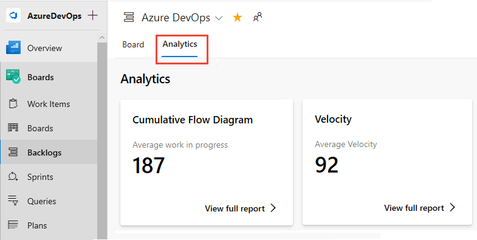
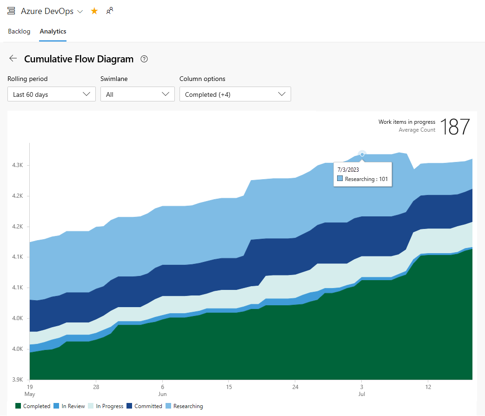

# Kanban basics

[!INCLUDE [temp](../includes/version-all.md)]

To maximize a team's ability to consistently deliver high quality software, Kanban emphasize two main practices. The first, visualize the flow of work, requires you to map your team's workflow stages and configure your Kanban board to match. The second, constrain the amount of work in progress, requires you to set work-in-progress (WIP) limits. You're then ready to track progress on your Kanban board and monitor key metrics to reduce lead or cycle time.  

> [!div class="mx-imgBorder"]  
>  

Your Kanban board turns your backlog into an interactive signboard, providing a visual flow of work. As work progresses from idea to completion, you update the items on the board. Each column represents a work stage, and each card represents a user story (blue cards) or a bug (red cards) at that stage of work.

Review this article to gain an understanding of how to configure and start working with your Kanban boards:   

> [!div class="checklist"]    
> * View your Kanban board    
> * Customize the columns shown on your Kanban board to support how your team works  
> * Set WIP limits to constrain work in progress   
> * Update the status of work via drag-and-drop  
> * View the Cumulative flow chart     
> * How to turn live updates on or off  

> [!NOTE]  
> Both Kanban boards and Taskboards support visualizing the flow of work and monitoring metrics to optimize that flow. Kanban boards track requirements, are sprint-independent, and provide a cumulative flow chart for monitoring progress. Each sprint is associated with a Taskboard that supports tracking tasks defined for the sprint. You can monitor progress through capacity charts and the sprint burndown chart. For guidance on using the Taskboard, see [Update and monitor your Taskboard](../sprints/task-board.md).

User stories and bugs correspond to types of work items. You use [work items](../backlogs/add-work-items.md) to share information, assign work to team members, update status, track dependencies, and more.

[!INCLUDE [temp](../includes/prerequisites-kanban.md)]

[!INCLUDE [temp](../includes/open-kanban-board.md)] 

<a id="map-flow" />

## 1. Map the flow of how your team works
<meta name="description" content="Kanban workflow" />
Kanban literally means signboard or billboard. As a first step, you customize your board to map to how your team works.

When you first open your Kanban board, you'll see one column for each [workflow state](../work-items/guidance/choose-process.md#workflow-states). Your actual columns vary based on the [process](../work-items/guidance/choose-process.md) used to create your project.

For user stories, the New, Active, Resolved, and Closed states track progress from idea to completion.
<table>
<tbody>
<tr valign="top">
<td>

</td>
<td>

</td>
</tr>
</tbody>
</table>

However, your team's workflow stages most likely don't map to these default states. For your team to have a functional board they must identify the stages of their workflow process and then configure the board to match.

For example, you can change your Kanban columns to map to the following five workflow stages.

[Once you've identified your stages, simply add and rename columns](add-columns.md) to map to them. Keep the number of columns to a minimum while still representing the key handoffs that occur for your team.

## 2. Set WIP limits to constrain work in progress

<meta name="description" content="Kanban WIP limits" />
In this next step, your team sets WIP limits for each workflow stage. While setting WIP limits is easy, adhering to them takes a team commitment. Teams new to Kanban may find WIP limits counterintuitive and uncomfortable. However, this single practice has helped teams identify bottlenecks, improve their process, and increase the quality of software they ship.

What limits should you set? Start with numbers that don't exceed 2 or 3 items per team member working within a stage. Respecting WIP limits means teams don't pull items into a column if doing so causes the number of items in the column to exceed the WIP limit.

When they do exceed the limit, the column count displays red. Teams can use this as a signal to focus immediately on activities to bring the number of items in the column down.

[Set WIP limits](wip-limits.md) based on team discussions and revisit as your team identifies ways to improve their processes. Use WIP limits to identify bottlenecks and eliminate waste from your work flow processes.

## 3. Track work in progress

<meta name="description" content="Kanban tools track progress" />
Once you&#39;ve configured your Kanban board to match how your team works, you&#39;re ready to use it.

Here are a few things you can do. See at a glance the estimated size of work for each item which displays at the bottom right of each card. Add items to your backlog in the first column. When priorities change, move items up and down within a column. And, as work completes in one stage, update the status of an item by moving it to a downstream stage.

   

::: moniker range="tfs-2015"

> [!NOTE]  
> You can [reorder items within a column](../../boards/boards/reorder-cards.md#reorder-cards) from TFS 2015.1 and later versions.

::: moniker-end

::: moniker range=">= tfs-2015"

Also, you can quickly update a field or reassign ownership directly from the board.

   

::: moniker-end

Updating your Kanban board as work progresses helps keep you and your team in sync. Also, you'll be able to see and share the value stream your team is delivering to customers.

[!INCLUDE [temp](../includes/note-kanban-boards-teams.md)]

## 4. Monitor metrics and fine tune

As with most Agile practices, Kanban encourages monitoring key metrics to fine tune your processes. After your team has used the Kanban board for several weeks, check out your Cumulative Flow Diagram (CFD).

::: moniker range="azure-devops"

Choose the **Analytics** tab, and then choose **View full report** for the Cumulative Flow Diagram as shown in the following image. 

> [!div class="mx-imgBorder"]  
> 

The Average work in progress value excludes completed work items. 

Use the interactive controls to choose the time frame, swimlanes, and workflow states or Kanban board columns. Hover over a point in time to show how many work items are in a particular state. The default settings for the Cumulative Flow Diagram-Average work in progress includes completed work items since the team started tracking work. 

For example, On July 3, 101 items were in a Research state.

> [!div class="mx-imgBorder"]  
> 

The selections you make are only set for you, and persist across sessions until you change them. 

::: moniker-end

::: moniker range="<= azure-devops-2019"

Choose the chart as shown in the following image. 

   

The CFD shows the count of items in each Kanban column for the past 30 weeks or less. From this chart you can gain an idea of the amount of work in progress and lead time. Work in progress counts unfinished requirements. Lead time indicates the amount of time it takes to complete a requirement from the time it was first proposed.  

   

::: moniker-end

By monitoring these metrics, you can gain insight into how to optimize your processes and minimize lead time. For additional guidance, see [Configure a cumulative flow chart](../../report/dashboards/cumulative-flow.md). 

::: moniker range=">= azure-devops-2019"

In addition to the above chart, you can add Analytics widgets to your dashboard. The Analytics Service is in preview and provides access to several widgets. To learn more, see these topics: 
- [Widgets based on the Analytics Service](../../report/dashboards/analytics-widgets.md)
- [Add a widget to a dashboard](../../report/dashboards/add-widget-to-dashboard.md)
- [What is the Analytics Service?](../../report/powerbi/what-is-analytics.md)

::: moniker-end

## Try this next

Here are some useful tips when working with the Kanban board:
- To focus on select work items, [filter your Kanban board](filter-kanban-board.md)
- To quickly assign items to a team member, add the Assign To field to display on the cards, see [Customize cards](../../boards/boards/customize-cards.md)     
- Add a swimlane to track high-priority work or track work which falls into different service level agreements, see [Swimlanes](expedite-work.md)   
- Highlight specific work items by color coding cards based on a field value or tag, (see [Customize cards](../../boards/boards/customize-cards.md)) 
- If you use Scrumban, drag-and-drop cards onto a sprint to quickly assign them to a sprint.  

Each team can manage their backlog and customize their Kanban board. [Add teams](../../organizations/settings/add-teams.md) when you assign specific feature areas to different teams for development. Each team can then manage their backlog and focus on how they will develop their deliverables. 

If you're new to tracking work with Agile tools and want to understand what you can customize, see [Customize your work tracking experience](../../reference/customize-work.md). 

::: moniker range=">= tfs-2017"

[!INCLUDE [temp](../includes/live-updates.md)]  

::: moniker-end

## Related articles

- [Kanban key concepts](kanban-key-concepts.md)
- [Kanban best practices](best-practices-kanban.md)
- [Cumulative flow diagram](../../report/dashboards/cumulative-flow.md)
- [Cumulative flow, lead time, and cycle time guidance](../../report/dashboards/cumulative-flow-cycle-lead-time-guidance.md)