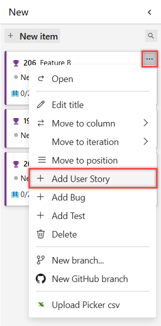

# Add board features and epics  

[!INCLUDE [version-lt-eq-azure-devops](../../includes/version-lt-eq-azure-devops.md)]

If you track progress on your backlog with a board, you can also use boards to track epics and features.  

And, as with [child task checklists for backlog items](add-task-checklists.md), you can quickly define and track the progress of child items for your features or epics. Here we see several stories defined for features, both in progress and completed.    

For more information, see [Define features and epics](../backlogs/define-features-epics.md). 

> [!div class="mx-imgBorder"]
> 

## Prerequisites

[!INCLUDE [temp](../includes/prerequisites-kanban.md)]

## Open your board from the web portal

Your board is one of two types of boards available to you. For an overview of the features supported on each backlog and board, see [Backlogs, boards, and plans](../backlogs/backlogs-boards-plans.md). To switch to the [product backlog](../backlogs/create-your-backlog.md), choose **Stories backlog**. And, to switch to the [taskboard](../sprints/task-board.md), choose **Sprints** and then choose **Taskboard**.

1. (1) Check that you selected the right project, (2) choose **Boards>Boards**, and then (3) select the correct team from the team selector menu. 

	  

	To choose another team's board, open the selector and select a different team or choose the :::image type="icon" source="../../media/icons/home-icon.png" border="false"::: **Browse all team boards** option. Or, you can enter a keyword in the search box to filter the list of team backlogs for the project.

	> [!div class="mx-imgBorder"]  
	>  

	> [!TIP]    
	> Choose the :::image type="icon" source="../../media/icons/icon-favorite-star.png" border="false"::: star icon to favorite a team board. Favorited artifacts (:::image type="icon" source="../../media/icons/icon-favorited.png" border="false"::: favorited icon) appear at the top of the team selector list.

2. Select **Features** or **Epics** from the backlog selector menu. 

	> [!div class="mx-imgBorder"]  
	> 

## Add epics or features   

Add new items to a feature or epic through the item's   :::image type="icon" source="../media/icons/actions-icon.png" border="false":::  Action menu. For descriptions of fields used to support features and epics, see [Define features and epics](../backlogs/define-features-epics.md). 

When you have many items to add, keep entering your task titles and press Enter. If you have details you want to add about to a work item, hover over the item and press Enter.  
 
## Related articles

- [Kanban board overview](kanban-overview.md)
- [Add tasks or child items as checklists](add-task-checklists.md)
- [Add columns](add-columns.md)  
- [Customize cards](../../boards/boards/customize-cards.md)  

### REST API resources
To programmatically interact with a board and other team settings, see the [REST API, Boards reference](/rest/api/azure/devops/work/boards).
