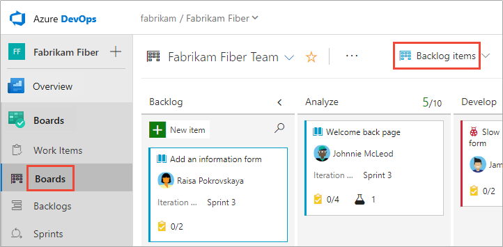
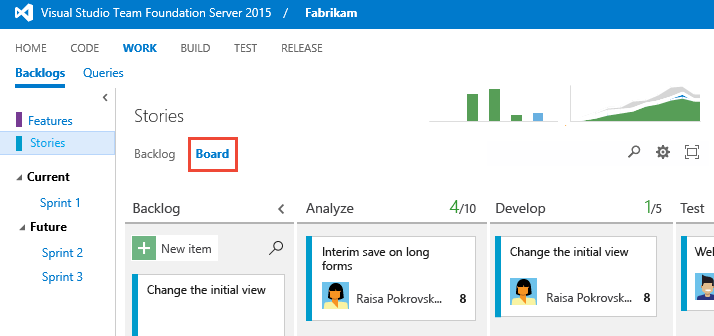

# About boards and Kanban  

[!INCLUDE [temp](../_shared/version-vsts-tfs-all-versions.md)]
 
Your Kanban board provides you with a visual interactive space for you and your team to plan and show progress. With it, your team can track the critical information they need by seeing which work items are in progress, where the bottlenecks are, who work is assigned to, and more.

Boards present work items as cards and support quick status updates through drag-and-drop, similar to sticky notes on a physical whiteboard. 

####In a nutshell you use boards to: 
- Implement [Kanban methods](kanban-basics.md) 
- Define work your team is tasked with by [defining user stories, product backlog items, or requirements](kanban-quickstart.md)
- Monitor progress and update the status of work items by [drag-and-drop to a column](#update)
- [Add details and estimates](../backlogs/create-your-backlog.md#estimates) to your backlog items 
- Quickly [define tasks for backlog items](add-task-checklists.md) 
- [Add, run, and update inline tests](add-run-update-tests.md) 

To get started, you'll want to follow the steps outlined below. 

## Product and portfolio boards 

Each [product and portfolio backlog](../backlogs/backlogs-overview.md) has a corresponding Kanban board. Both backlogs and boards are associated with a team, and display work items based on the area and iteration paths selected by the team as described in [Define iteration paths (aka sprints) and configure team iterations](../../organizations/settings/set-iteration-paths-sprints.md). 

Each board supports many Kanban practices such as defining columns and swimlanes, setting Work-in-Progress (WIP) limits, defining the Definition of Done, and more. To get started, see [Kanban quickstart](../boards/kanban-quickstart.md). 

# [New navigation](#tab/new-nav)
::: moniker range=">= azdevserver-2019"
   

::: moniker-end

::: moniker range=">= tfs-2013 <= tfs-2018"
[!INCLUDE [temp](../../_shared/new-navigation-not-supported.md)] 
::: moniker-end 

# [Previous navigation](#tab/previous-nav)

::: moniker range=">= tfs-2017 <= tfs-2018 || azdevops"
     
::: moniker-end   
::: moniker range=">= tfs-2013 <= tfs-2015"    
> [!div class="mx-imgBorder"]  
>        
::: moniker-end   

::: moniker range="azdevserver-2019"
[!INCLUDE [temp](../../_shared/previous-navigation-not-supported-azd.md)] 
::: moniker-end

---

## Configure and customize your Kanban board

Your Kanban board is highly configurable to support your team's workflow. Each team can configure each board in the following areas: 

::: moniker range=">= tfs-2017"
- Configure boards:
	- [Add columns](add-columns.md)  
	- [Set WIP limits](wip-limits.md)  
	- [Set Definition of Done](definition-of-done.md)  
	- [Add swimlanes](expedite-work.md)
	- [Define card reordering](reorder-cards.md)
	- [Enable backlog and board levels](../../organizations/settings/select-backlog-navigation-levels.md)
	- [Working with bugs](../../organizations/settings/show-bugs-on-backlog.md)
- Configure card displays:
	- [Add or remove fields from cards](customize-cards.md)
	- [Define card styles](customize-cards.md#style-rule)
	- [Apply tag colors](customize-cards.md#color-tags)
	- [Enable/disable annotations](customize-cards.md#annotations)
	- [Define inline test behavior on cards](customize-cards.md#tests) 

::: moniker-end

::: moniker range="tfs-2015"
- Configure boards:
	- [Add columns](add-columns.md)
	- [Set WIP limits](wip-limits.md)  
	- [Set Definition of Done](definition-of-done.md)  
	- [Add swimlanes](expedite-work.md)
	- [Define card reordering](reorder-cards.md)
	- [Enable backlog and board levels](../../organizations/settings/select-backlog-navigation-levels.md)
	- [Working with bugs](../../organizations/settings/show-bugs-on-backlog.md)
- Configure card displays:
	- [Add or remove fields from cards](customize-cards.md)
	- [Define card styles](customize-cards.md#style-rule)
	- [Apply tag colors](customize-cards.md#color-tags)

::: moniker-end

::: moniker range="tfs-2013"
- [Add columns](add-columns.md)  
- [Set WIP limits](wip-limits.md)  
- [Set Definition of Done](definition-of-done.md)
- [Working with bugs](../../organizations/settings/show-bugs-on-backlog.md)
::: moniker-end

In addition to these team configurations, you can [customize a project](#customize) by adding or modifying work item types, the workflow, and add customized portfolio backlogs and boards. 

<a id="update" />
## Update work item status
::: moniker range=">= tfs-2015"
Once you've configured your Kanban board, you can add work items directly to the board. You can then update the status of work by dragging a card to another column on the Kanban board. You can even change the order of items as you move a card to a new column. For additional information, see [Workflow states and state categories](../work-items/workflow-and-state-categories.md). 

::: moniker-end

::: moniker range="tfs-2013"
Once you've configured your Kanban board, you can add work items directly to the board. You can then update the status of work by dragging a card to another column on the Kanban board. 
::: moniker-end

::: moniker range=">= tfs-2013 <= tfs-2018"
## Display of leaf node work items  

When a product or portfolio backlog contains same-category, nested work items, only the last child item within the nested set displays on the Kanban board. 

[!INCLUDE [temp](../_shared/display-leaf-nodes.md)]

To learn more, see [Fix "Ordering backlog items is disabled"](../backlogs/resolve-backlog-reorder-issues.md).
::: moniker-end

<a id="limits-multi-team" />
## Limitations of multi-team Kanban board views 

While the management teams you configure can use the Kanban board to monitor feature progress by turning on the Features backlog, there are limitations inherent within these views. Even if the management team and the feature teams configure their Feature [Kanban board columns](add-columns.md) with identical workflow mapping, updating the Features on one team's Kanban board won't be reflected on another team's Kanban board. 
Only when the work item state changes does the card column reflect the same on all boards.

> [!IMPORTANT]   
> Work items that appear on more than one team's Kanban board can yield query results that don't meet your expectations. Because each team can customize the Kanban board columns and swimlanes, the values assigned to work items which appear on different boards may not be the same. The primary work around for this issue is to maintain single ownership of work items by [Defining area paths and assign to a team](../../organizations/settings/set-area-paths.md). Another option is to add custom workflow states which all teams can use. For details, see [Customize your work tracking experience](../../reference/customize-work.md). 

## Permissions and access

As a member added to the Contributors group of a project, you can use most features provided under **Boards** or **Work**. Users with Basic access have full access to all features. Users with Stakeholder access are limited to certain features. For details, see [Work as a Stakeholder](../../organizations/security/access-levels.md#stakeholder-access). 

To learn more about permissions and access, see [Permissions and access for work tracking](../../organizations/security/permissions-access-work-tracking.md) and [About access levels](../../organizations/security/access-levels.md).   

To add users to a project, see [Add users to a project or team](../../organizations/security/add-users-team-project.md).

<a id="customize" />
## Customize your project and boards 
::: moniker range="azdevops"
If you need more than three board levels, you can add more. To learn how, see [Customize your backlogs or boards for a process](../../organizations/settings/work/customize-process-backlogs-boards.md). 

You can also add or modify the fields defined for a work item type (WIT), add a custom WIT, or modify the workflow. To learn more, see [Customize an inheritance process](../../organizations/settings/work/inheritance-process-model.md). 

::: moniker-end
 
::: moniker range="<= tfs-2018 || azdevserver-2019" 
If you need more than three board levels, you can add more. To learn how, see [Add portfolio backlogs](../../reference/add-portfolio-backlogs.md).

You can also add or modify the fields defined for a work item type (WIT), add a custom WIT, or modify the workflow.  To learn more, see [Customize the On-premises XML process model](../../reference/on-premises-xml-process-model.md). 
::: moniker-end

## Try this next  

Take these tools for a test run by [signing up for free](../get-started/index.md). From there, you're ready to add items to your Kanban board and customize it. 

> [!div class="nextstepaction"]
> [Kanban quickstart](kanban-quickstart.md)  
  

## Related articles  
- [Kanban key concepts](kanban-key-concepts.md) 
- [Web portal navigation](../../project/navigation/index.md) 
- [Backlogs, portfolios, and Agile project management](../backlogs/backlogs-overview.md) 
- [About work items](../work-items/about-work-items.md)  

 

 