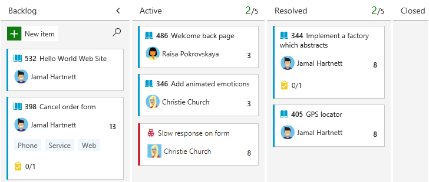
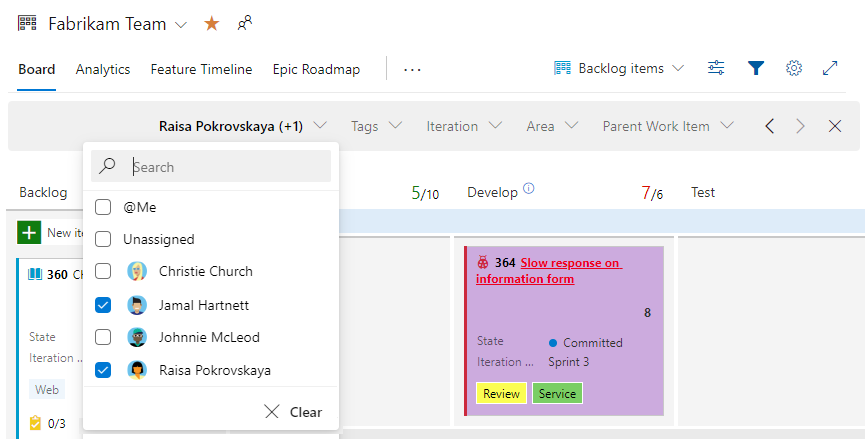
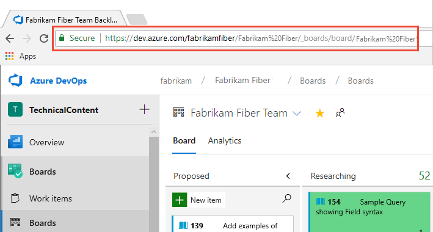

# Start using your Kanban board

[!INCLUDE [version-lt-eq-azure-devops](../../includes/version-lt-eq-azure-devops.md)]

Your Kanban board turns your backlog into an interactive signboard, which provides a visual flow of work. As work progresses from idea to completion, you update the items on the board. Each column represents a work stage. Each card represents a backlog item, user story, or bug at that stage of work. 

> [!div class="mx-imgBorder"]  
>  

User stories and bugs correspond to types of work items. You use [work items](../backlogs/add-work-items.md) to share information, assign work to team members, update status, track dependencies, and more.

[!INCLUDE [temp](../includes/prerequisites-kanban.md)]

## Add a Kanban board

If you have a project, you have a Kanban board. Each project defines a default team and set of boards for that team. You only need to add a Kanban board when you want to support a new team. When you add a team, you add many team assets. A team admin can configure the assets to support the way the team works. To add a set of Kanban boards to support a new team, see [Add a team](../../organizations/settings/add-teams.md). 

Each team's Kanban boards are associated with one or more work item types. The association depends on the process selected when the project was created, team configurations, and process customizations. The boards defined for each process are:

::: moniker range=">= azure-devops-2019" 
- [**Agile**](../work-items/guidance/agile-process.md): **Stories**, **Features**, and **Epics**
- [**Basic**](../get-started/plan-track-work.md): **Issues** and **Epics** 
- [**Scrum**](../work-items/guidance/scrum-process.md): **Backlog items**, **Features**, and **Epics** 
- [**CMMI**](../work-items/guidance/cmmi-process.md): **Requirements**, **Features**, and **Epics**
::: moniker-end 

::: moniker range="< azure-devops-2019" 
- [**Agile**](../work-items/guidance/agile-process.md): **Stories**, **Features**, and **Epics**
- [**Scrum**](../work-items/guidance/scrum-process.md): **Backlog items**, **Features**, and **Epics** 
- [**CMMI**](../work-items/guidance/cmmi-process.md): **Requirements**, **Features**, and **Epics**
::: moniker-end 

::: moniker range=">= azure-devops-2019" 
You choose the board from the backlog selector as shown in the following image.  

:::image type="content" source="media/quickstart/board-selector.png" alt-text="Choose board level, Backlog items, Stories, or Requirements.":::  
::: moniker-end 

::: moniker range=">= azure-devops-2019" 

To customize your Kanban boards to add custom work item types, add portfolio backlogs, or other supported options, see the following articles, depending on the process your project uses: 
- [Inherited process model](../../organizations/settings/work/inheritance-process-model.md)
- [On-premises XML process model](../../reference/on-premises-xml-process-model.md) 
::: moniker-end 

::: moniker range="< azure-devops-2019"

To customize your Kanban boards to add custom work item types, add portfolio backlogs, or other supported options, see [On-premises XML process model](../../reference/on-premises-xml-process-model.md).

::: moniker-end   

[!INCLUDE [temp](../includes/open-kanban-board.md)] 

## Add work items 

::: moniker range=">= azure-devops-2019"

To add a work item, select the :::image type="icon" source="../media/icons/add_icon.png" border="false"::: plus sign, enter a title, and then press Enter. 

::: moniker-end

::: moniker range=">= azure-devops-2020"

> [!div class="mx-imgBorder"]  
>  

::: moniker-end

::: moniker range="azure-devops-2019"

> [!div class="mx-imgBorder"]  
>  

::: moniker-end

::: moniker range=">= azure-devops-2019"

The system automatically saves the work item with the title you entered. You can add as many work items you want by using this method. 

::: moniker-end

::: moniker range="tfs-2018"

To add a work item, select the :::image type="icon" source="../media/icons/add_icon.png" border="false"::: plus sign, enter a title, and then press Enter. 

> [!div class="mx-imgBorder"]  
> 

The system automatically saves the work item with the title you entered. You can add as many work items you want by using this method. 

::: moniker-end

To add details to any work item, select the title. Or, you can directly modify any field that displays. For example, you can reassign a work item by selecting **Assigned To**. For a description of each field, see [Create your backlog, Add details and estimates](../backlogs/create-your-backlog.md#estimates). 

[!INCLUDE [temp](../includes/note-user-assigned.md)]

To customize the set of fields displayed on the card, see [Customize cards](../../boards/boards/customize-cards.md).

## Update the status of a work item 

As work completes in one stage, update the status of an item by dragging it to a downstream stage. 

[!INCLUDE [temp](../includes/note-closed-items.md)]

::: moniker range="< azure-devops-2022"

> [!NOTE]   
> Users assigned Stakeholder access aren't able to use the drag-and-drop feature to update status. 

::: moniker-end

  

## Update fields from the card 

You can quickly update a field or reassign ownership directly from the board. If the field you want to update isn't showing, then [customize the card to show it](../../boards/boards/customize-cards.md). 

### Filter your board using keywords, field values, or tags

You can apply filters interactively to focus on a subset of work. For example, you can filter the board to focus on work assigned to at team member for a specific sprint. To start filtering, choose **Filter** :::image type="icon" source="../../media/icons/filter-icon.png" border="false":::. To learn more about applying filters, see [Interactively filter your backlogs, boards, and plans](../backlogs/filter-backlogs-boards-plans.md).

::: moniker range="<= azure-devops-2019"

::: moniker-end

For example, here we filter for all items assigned to Jamal and Raisa.

::: moniker range=">= azure-devops-2020"
> [!div class="mx-imgBorder"]  
> 
::: moniker-end

::: moniker range="< azure-devops-2020"

::: moniker-end

## Invite others to work on your Kanban board 

All members of a project can view and contribute to your Kanban board. To invite users to contribute, copy the URL of your Kanban board and email it to people you want to invite to your project.

::: moniker range=">= azure-devops-2020"

> [!div class="mx-imgBorder"]  
> 

::: moniker-end

::: moniker range="azure-devops-2019"

> [!div class="mx-imgBorder"]  
> 

::: moniker-end

::: moniker range="tfs-2018"

::: moniker-end

To add users to your project, see [Add users to a project](../../organizations/security/add-users-team-project.md).   

## Next steps 

> [!div class="nextstepaction"]
> [Implement Kanban practices](kanban-basics.md)  

## Related articles

- [Filter backlogs, boards, queries, and plans](../backlogs/filter-backlogs-boards-plans.md)
- [Kanban key concepts](kanban-key-concepts.md)
- [Kanban best practices](best-practices-kanban.md)
- [Cumulative flow diagram](../../report/dashboards/cumulative-flow.md)
- [Cumulative flow, lead time, and cycle time guidance](../../report/dashboards/cumulative-flow-cycle-lead-time-guidance.md)
