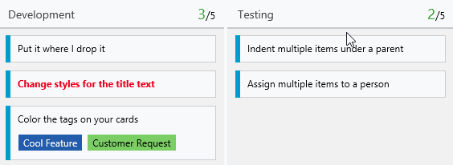

# Reorder cards  
[!INCLUDE [temp](../includes/version-vsts-tfs-2015-on.md)]  

You can drag any work item to any column or swimlane on the Kanban board. You can even change the order of items as you move a card to a new column. 

The last column, typically the **Closed** or **Done** column, is always ordered by *Closed Date* with the most recently closed items appearing towards the top of the column. In all other columns, cards are ordered by the backlog order or they are reorder based on the Card reordering setting selected.  

[!INCLUDE [temp](../includes/prerequisites-team-settings.md)]

## Set card reordering team preference  

If you want to preserve the backlog priority when you move a card to a new column, you can change the Kanban board card reordering setting for your team. 

::: moniker range=">= azure-devops-2019"

1. [Open your Kanban board](kanban-quickstart.md). If you're not a team admin, [get added as one](../../organizations/settings/add-team-administrator.md). Only team and project admins can customize the Kanban board.

1. Choose the  gear icon to configure the board and set general team settings.  

	> [!div class="mx-imgBorder"]
	>   

2. Choose **Card reordering** and select from the two reordering  behaviors listed.  

	> [!div class="mx-imgBorder"]  
	>  

	The setting you choose applies to all active Kanban boards for your team.  

3. When done with your changes, choose **Save**.

::: moniker-end 

::: moniker range="tfs-2015"
> [!NOTE]  
> Reordering cards is supported on TFS 2015.1 and later versions.  
::: moniker-end

::: moniker range=">= tfs-2015 <= tfs-2018"

1. [Open your Kanban board](kanban-quickstart.md). If you're not a team admin, [get added as one](../../organizations/settings/add-team-administrator.md). Only team and project admins can customize the Kanban board.

1. Choose  to open the common configuration settings dialog for the Kanban board. 

	  

2. Choose **Card reordering** and select from the two reordering behaviors listed.  

	> [!div class="mx-imgBorder"]  
	>  

	The setting you choose applies to all active Kanban boards for your team.  

3. When done with your changes, choose **Save**.

	> [!TIP]
	> You can drag-and-drop work items onto a sprint from any backlog or board. To add sprints to a team backlog, see [Define iteration paths (aka sprints) and configure team iterations](../../organizations/settings/set-iteration-paths-sprints.md). 

::: moniker-end

## Related articles   

* [Backlog priority or stack rank order](../backlogs/backlogs-overview.md#stack-rank)
* [Customize cards](../../boards/boards/customize-cards.md)   

