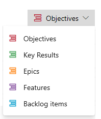
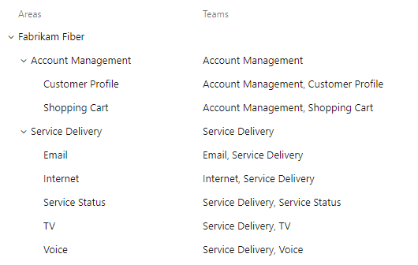
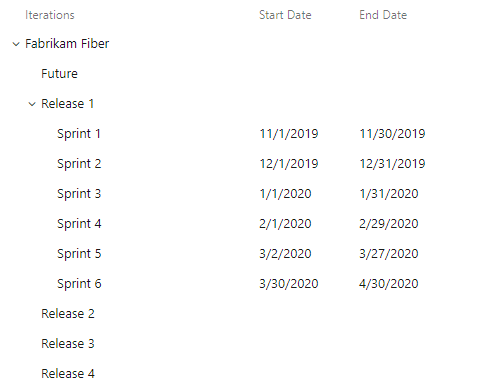
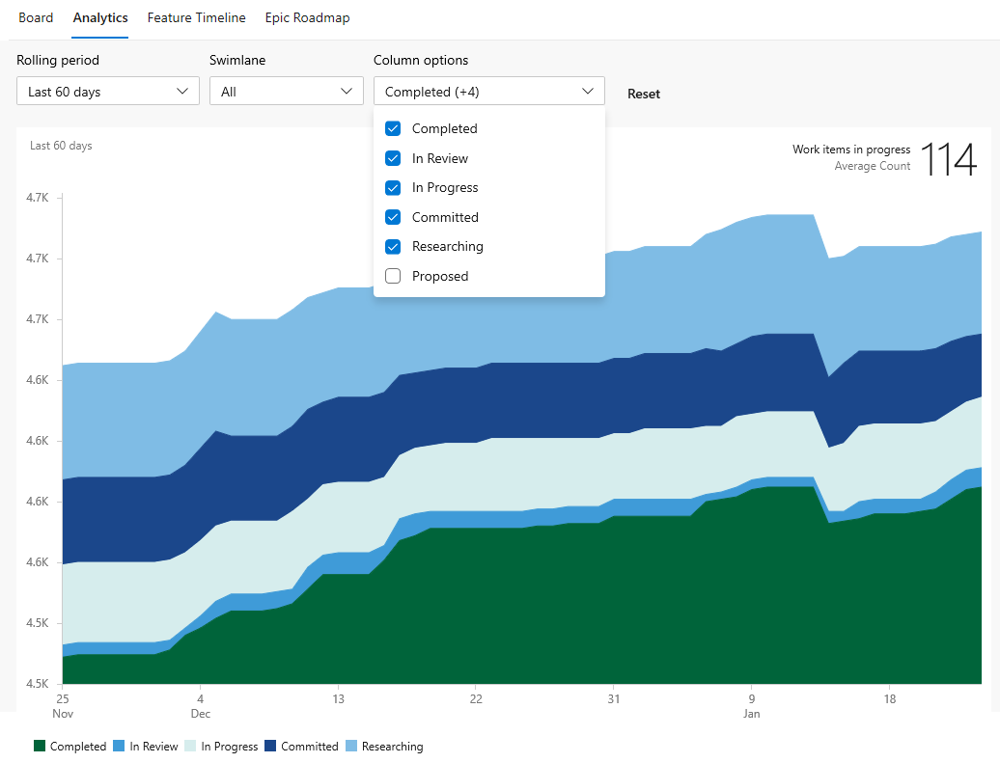

# Configure and customize Azure Boards 

[!INCLUDE [temp](includes/version-vsts-only.md)]

This article provides guidance to configure and customize Azure Boards. You should read this article if you are tasked with administrating a project for several teams and supporting the following business objectives: 

- Support portfolio management views 
- View calendar views to update status and progress  
- Track dependencies across teams or projects 
- Track time estimates or actual work completed 

> [!NOTE]   
> This article applies to Azure DevOps Services. Most of the guidance is valid for both the cloud and on-premises versions. However, some of the features included in this article, such as Rollup, Analytics, and some portfolio planning tools, are only available for the cloud at this time. 

If you're just getting started as a Project Administrator, see also [Get started as an administrator](../user-guide/project-admin-tutorial.md).

## What to consider?

When configuring or customizing work tracking tools, you'll want to consider the tools your teams use and how they will use them. Whether your teams follow Scrum, Kanban, or some combination of Scrumban, you can gain the most advantage of the Azure Boards tools by understanding the dependencies they have on configurations and customizations.  

The primary items to consider as you structure your project are: 

**At a project level**: 
- How many teams you want to define 
- How to structure area paths to support portfolio management views
- Field customizations 
- Work item type customizations or custom work item types
- Portfolio backlog customizations 
- Workflow customizations 

**At a team level**: 
- How you'll use your product backlog to plan and prioritize your work 
- Whether you'll track bugs as requirements or as tasks, or not use bugs at all
- Whether or not you'll use tasks to track time and capacity  
- How you'll use portfolio backlog levels 
- How you'll inform upper management of progress, status, and risks 
 
Once you determine how you'll use the work tracking building blocks and tools, you'll want to make any necessary configurations and customizations to support your business and communicate to your teams how they should use the tools. 

## Work item types and portfolio backlogs

The first choice made in work tracking is the process selected when creating a project. For a comparison of each process, see [Choose a process](work-items/guidance/choose-process.md).  Each process&mdash;Agile, Basic, Scrum, and CMMI&mdash;supports a set hierarchy of work item types.  This hierarchy supports a product backlog and portfolio backlog(s).  

The default work item types for each supported process are shown in the following tabs. Backlog work item types correspond to the Requirements category. Tasks correspond to the Task category. 

[!INCLUDE [work-item-types](includes/work-item-types.md)]

You can add custom work item types at each level, and even add custom portfolio backlogs. Here, for example, is a project that added Objectives and Key Results as custom work item types and corresponding portfolio backlogs to the Scrum process. 

> [!div class="mx-tdCol2BreakAll"]
>   

## Work tracking options and recommended usage  

One of the main choices teams have is choosing the work item types they use to track their work. The following table summarizes the main options, recommended usage, and supported tasks and tools.  

:::row:::
   :::column span="":::
      **Work tracking options**
   :::column-end:::
   :::column span="2":::
      **Tasks and tools supported**
   :::column-end:::
:::row-end:::
:::row:::
   :::column span="":::
      ----------------------------
   :::column-end:::
   :::column span="2":::
      ----------------------------
   :::column-end:::
:::row-end:::
:::row:::
   :::column span="":::
      Tasks only
   :::column-end:::
   :::column span="2":::
      **Not recommended**  
      There is no way to quickly enter new tasks in a backlog nor prioritize a backlog of tasks. In addition, there is no support for calendar views, cross-team views, or portfolio planning 
   :::column-end:::
:::row-end:::
:::row:::
   :::column span="":::
      Requirements with child-dependent tasks
   :::column-end:::
   :::column span="2":::
     **Supports Scrum methods**  
     Recommended for teams that follow Scrum methods and want to track time associated with work.  
     - Quickly define and prioritize backlog items: [Product backlog](backlogs/create-your-backlog.md)</li>
     - Forecast sprints using team velocity: [Forecast](sprints/forecast.md)  
     - Plan sprints: [Backlog Planning tool](sprints/assign-work-sprint.md)  
     - Plan and track capacity: [Sprint capacity tool](sprints/set-capacity.md)
     - Track estimated and remaining work: [Taskboard](sprints/adjust-work.md)
     - Monitor sprint burndown based on remaining work such as hours or days: [Sprint burndown](../report/dashboards/configure-sprint-burndown.md?bc=%252fazure%252fdevops%252fboards%252fbreadcrumb%252ftoc.json&toc=%252fazure%252fdevops%252fboards%252ftoc.json)
     - Conduct daily scrums, update and monitor task status: [Sprint Taskboard](sprints/task-board.md)  
     - Estimate work: [Define Story Points, Effort, or Size](backlogs/create-your-backlog.md#add-details-and-estimates)
     - View progress bars, counts, or sums of rollup on tasks: [Rollup](backlogs/display-rollup.md)  
     - Track dependencies across teams and projects: [Dependency Tracker](extensions/dependency-tracker.md)  

     Many teams start out using Scrum methods to track and plan their work using the tools available through the Sprints hub. The Sprints tools support estimating and tracking remaining work and use of capacity planning. If you don't plan on using these tools, then adding child-dependent tasks is optional. Developers might add them simply as a checklist of items they need to complete a user story or backlog requirement. 
   :::column-end:::
:::row-end:::
:::row:::
   :::column span="":::
      Requirements only, such as user stories (Agile), issues (Basic), product backlog items (Scrum), requirements (CMMI)  
   :::column-end:::
   :::column span="2":::
      **Supports Kanban and Scrumban methods**  
      Recommended for teams that follow Kanban or Scrumban methods, estimate work using Story Points, Effort, or Size, and don't track time associated with work.  
      - Quickly define and prioritize backlog items: [Product backlog](backlogs/create-your-backlog.md)  
      - Plan sprints: [Backlog Planning tool](sprints/assign-work-sprint.md)  
      - Estimate work: [Define Story Points, Effort, or Size](backlogs/create-your-backlog.md#add-details-and-estimates)  
      - Forecast sprints using team velocity: [Forecast](sprints/forecast.md)  
      - Monitor sprint burndown based on requirement estimates: [Sprint burndown](../report/dashboards/configure-sprint-burndown.md?bc=%252fazure%252fdevops%252fboards%252fbreadcrumb%252ftoc.json&toc=%252fazure%252fdevops%252fboards%252ftoc.json)  
      - Update requirement status: [Kanban board](boards/kanban-quickstart.md)  
      - Track dependencies across teams and projects: [Dependency Tracker](extensions/dependency-tracker.md)
   :::column-end:::
:::row-end:::
:::row:::
   :::column span="":::
      Requirements grouped under portfolio work item types, such as epics and features
   :::column-end:::
   :::column span="2":::
      **Supports calendar views, cross-team views, and portfolio planning**  
      Recommended for organizations with several teams that want to view rollups and calendar views associated with multiple teams, and take advantage of all portfolio planning tools.  
      - Quickly define and prioritize portfolio items: [Portfolio backlogs](backlogs/define-features-epics.md)  
      - Quickly define child user stories of portfolio items: [Portfolio checklists](boards/kanban-epics-features-stories.md)  
      - Map work items to features and epics: [Mapping tool](backlogs/organize-backlog.md)  
      - View cross-team progress calendar view: [Delivery plans](plans/review-team-plans.md)  
      - View calendar view of all team features: [Feature Timeline](https://marketplace.visualstudio.com/items?itemName=ms-devlabs.workitem-feature-timeline-extension)  
      - View calendar view of a specific epic: [Epic Roadmap](https://marketplace.visualstudio.com/items?itemName=ms-devlabs.workitem-feature-timeline-extension)  
      - View progress bars, counts, or sums of rollup on child items: [Rollup](backlogs/display-rollup.md)  
      - Track dependencies across teams and projects:[Dependency Tracker](extensions/dependency-tracker.md)  
   :::column-end:::
:::row-end:::

## Configure and customization options 

The following table indicates the areas you can configure and customize and the tools impacted by those customizations. Each area is customized either at the Organization, Project, or Team level as noted, or a combination of two. For a description of the Standard tools, Analytics tools, and Portfolio planning tools, see [What is Azure Boards](get-started/what-is-azure-boards.md), [In-context reports: Work tracking](../report/dashboards/overview.md#in-context-reports-work-tracking), and [Plans (Agile at scale)](plans/index.md). 

<table width="100%">
<tbody valign="top">
<tr>
<th width="23%">Configure or customize</th>
<th width="28%">Standard tools</th>
<th width="24%">Analytics</th>
<th width="25%">Portfolio planning tools</th>
</tr>
<tr>
<td><a href="#area-path">Area paths, project configuration, and team subscriptions</a> (Project, Team)</td>
<td>
<ul>
<li>Boards>All tools</li>
<li>Backlogs>All tools</li>
<li>Sprints>All tools</li>
</ul>
</td>
<td>
<ul>
<li>Cumulative flow diagram</li>
<li>Velocity</li>
<li>Burndown trend </li>
</ul>
</td>
<td>
<ul>
<li>Delivery plans</li>
<li>Feature timeline</li>
<li>Epic Roadmap</li>
<li>Portfolio plans (Beta)</li>
<li>Dependency Tracker</li>
</ul>
</td>
</tr>
<tr>
<td><a href="#iteration-path">Iteration paths, project configuration, and team subscription</a> (Project, Team)</td>
<td>
<ul>
<li>Backlogs>Sprint planning</li>
<li>Sprints>Sprint backlogs</li>
<li>Sprints>Sprint capacity</li>
<li>Sprints>Taskboard</li>
</td>
<td>
<ul>
<li>Velocity</li>
<li>Burndown trend </li>
</ul>
</td>
<td>
<ul>
<li>Delivery plans</li>
<li>Feature timeline</li>
<li>Epic Roadmap</li>
<li>Portfolio plans (Beta)</li>
<li>Dependency Tracker</li>
</ul>
</td>
</tr>
<tr>
<td><a href="/azure/devops/organizations/settings/show-bugs-on-backlog">Show bugs on backlogs &amp; boards (Team)</a> 
Custom work item types, Product backlog (Process) 
Custom work item types, Taskboard (Process)
</td>
<td>
<ul>
<li>Boards>Product board</li>
<li>Backlogs>Product backlog</li>
<li>Backlogs> Mapping tool</li>
<li>Sprints>Sprint backlogs</li>
<li>Sprints>Taskboard</li>
</td>
<td>
<ul>
<li>Velocity</li>
</ul>
</td>
<td>   
</td>
</tr>
<tr>
<td>
Custom work item types, Portfolio backlog (Process) 
Additional portfolio backlogs (Process)
</td>
<td>
<ul>
<li>Boards>Portfolio boards</li>
<li>Backlogs>Portfolio backlogs</li>
<li>Backlogs> Mapping tool</li>
</ul>
</td>
<td>
<ul>
<li>Velocity</li>
</ul>
</td>
<td>   
</td>
</tr>
<tr>
<td>
Custom workflow (Process)
</td>
<td>
<ul>
<li>Boards>Product board</li>
<li>Boards>Portfolio boards</li>
<li>Sprints>Taskboard</li>
</ul>
</td>
<td>
<ul>
<li>Cumulative flow diagram</li>
</ul>
</td>
<td>
<ul>
<li>Dependency Tracker</li>
</ul>
</td>
</tr>
<tr>
<td>
Custom field (Process)
</td>
<td>
<ul>
<li>Boards>Product board</li>
<li>Boards>Portfolio boards</li>
</ul>
</td>
<td>
<ul>
<li><a href="#rollup">Rollup progress bars, sum, or count</a></li>
</ul>
</td>
<td>
</td>
</tr>
</tbody>
</table>

<a id="area-path" />

## Area paths, product teams, and portfolio management  

Area paths are used to group work items by product, feature, or business areas and to support teams responsible for work assigned to those areas. You can define a hierarchical set of area paths or a flat set. Typically, you define a hierarchical set of area paths when you want to support a business hierarchy that wants to track progress of several teams.  

### Area paths and hierarchical grouping 

The two main ways to group work items are by area path and by parenting them under a portfolio work item type as described early is this article. The two are not mutually exclusive. Note the distinctions between the two usages:  
- Area paths assigned to a team determine what work items appear in a team view: product backlog, portfolio backlog, delivery plans, or other portfolio planning tool 
- Grouping work items under a parent feature or epic determine what rollup views are supported and how work appears in a portfolio planning tool   

You can also assign tags to work items to group them for query and filter purposes. So when you structure your teams and projects, you want to make sure you understand how you'll use these grouping tools to support your business needs. Your choices impact the use of portfolio planning tools.

### Area path-dependent tools 

To use the following tools, teams must subscribe to area paths. 

- [Boards> all tools](boards/kanban-overview.md)  
- [Backlogs> all tools](backlogs/backlogs-overview.md)  
- [Sprints> all tools](sprints/scrum-overview.md)  
- [Analytics> all](../report/dashboards/overview.md#in-context-reports-work-tracking) and [Rollup](#rollup)  
- Portfolio planning tools   
	- [Delivery plans](plans/review-team-plans.md), provides individual team and cross-team progress calendar views  
	- [Feature Timeline](https://marketplace.visualstudio.com/items?itemName=ms-devlabs.workitem-feature-timeline-extension), provides a calendar view of team epics and features with the ability to drill down into child items  
	- [Epic Roadmap](https://marketplace.visualstudio.com/items?itemName=ms-devlabs.workitem-feature-timeline-extension), provides a calendar view of a selected team epic and features with the ability to drill down into child items  
	- [Dependency Tracker](extensions/dependency-tracker.md), provides list and calendar views of dependencies being produced or consumed by teams  
	

### Area paths and team assignments 

A default team and default area path are defined for each project. For small teams, a single team is sufficient to begin planning and tracking work. As organizations grow, however, it's useful to add teams to support their ability to manage their backlog and sprints. 

Here is an example of area paths and their assignment to teams, which support portfolio management views for the Account Management and Service Delivery teams. 

> [!div class="mx-imgBorder"] 
>   

- You create hierarchical area paths to support sub categories of features and product areas 
- To provide portfolio views, you assign two or more area paths and include sub-areas to a portfolio management team 
- Area paths assigned to a team determine what work items are filtered in a team view: product backlog, portfolio backlog, delivery plans, or other portfolio planning tool  
- Grouping work items under a parent feature or epic determine what rollup views are supported and how work appears in a calendar view such as Feature Timeline and Epic Roadmap  

Prior to adding teams, we recommend you read the following articles:  

- [Portfolio management](plans/portfolio-management.md)
- [About area paths](../organizations/settings/about-areas-iterations.md?bc=%252fazure%252fdevops%252fboards%252fbreadcrumb%252ftoc.json&toc=%252fazure%252fdevops%252fboards%252ftoc.json)
- [About teams and Agile tools](../organizations/settings/about-teams-and-settings.md?bc=%252fazure%252fdevops%252fboards%252fbreadcrumb%252ftoc.json&toc=%252fazure%252fdevops%252fboards%252ftoc.json)
- [Agile culture](plans/agile-culture.md). 

Recommendations:
- Consider what views upper management may want to view and how to best support them 
- Consider how you want to use rollup both for a team and portfolio management 
- Define epics and scenarios for large initiatives that will take two or more sprints to complete
- Define requirements for work that can be accomplished in a single sprint and can be assigned to a single individual  
- Define tasks to track more granular details or when you want to track time spent working 

> [!TIP]    
> - Work items can only be assigned to a single individual. So when defining work items, consider how many work items are needed to assign the work to those individuals who will be tasked to complete the work.  
> - Choose the Node Name field as a column option to view the leaf area node in a backlog list or board card.
> - Don't create parent-child links among work items of the same type, such as story-story, bug-bug, task-task.

Most Azure Boards tools support a filtered view of work items based on area path and/or iteration path. Additional filters can also be applied based on keyword, assignment, work item type, and more. 

<a id="show-bugs" />

## Treat bugs as requirements or tasks

Each team can choose how they want to manage bugs. Some teams like to track bugs along with requirements on the backlog. Other teams like to track bugs as tasks performed in support of a requirement. The bugs then appear on their [taskboard](sprints/task-board.md).

If you use the Scrum process, your default setup is to track bugs along with product backlog items (PBIs). If you work in a project based on the [Agile or CMMI processes](work-items/guidance/choose-process.md), bugs don't automatically appear on your backlog.

Talk with your team to determine how they want to manage bugs. Then [change your team settings](../organizations/settings/show-bugs-on-backlog.md) accordingly.

> [!TIP]  
> After you refresh a backlog or board and you don't see bugs where you expect them, review [How backlogs and boards display hierarchical (nested) items](backlogs/resolve-backlog-reorder-issues.md#leaf-nodes). Only leaf nodes of nested items appear on sprint taskboards.  

<a id="add-oob-to-backlog" /> 

::: moniker range="azure-devops"

## Add system work item types to a backlog   

If you want to track issues or impediments along with your requirements or in a portfolio backlog, you can by adding them to your custom Inherited process. For details, see [Customize your backlogs or boards (Inheritance process)](../organizations/settings/work/customize-process-backlogs-boards.md#add-oob-to-backlog).

::: moniker-end

<a id="hierarchy" />

<a id="rollup" />

## Rollup, hierarchy, and portfolio management  

Rollup columns allow you to view progress bars or totals of numeric fields or descendant items within a hierarchy. Descendant items correspond to all child items within the hierarchy. You can add one or more rollup columns to a product or portfolio backlog. 

Here we show **Progress by all Work Items** which displays progress bars for ascendant work items based on the percentage of descendant items that have been closed. 

> [!div class="mx-imgBorder"]  
>   

::: moniker range="azure-devops"

In addition, the new [Delivery Plans (Preview)](plans/review-team-plans.md) supports rollup views of epics, features, and other custom portfolio backlogs. 

> [!div class="mx-imgBorder"]  
>   

::: moniker-end

<!---
Consider how your selection impacts rollup
If your development team uses tasks 
--> 

<a id="iteration-path" />

## Iteration paths, sprints, releases, and versioning

Iteration paths support Scrum and Scrumban processes where work is assigned to a set time period. Iteration paths allow you to group work into sprints, milestones, or other event-specific or time-related period. Each iteration or sprint corresponds to a regular time interval referred to as a sprint cadence. Typical sprint cadences are two weeks, three weeks, or a month long. To learn more about Iteration paths, see [About area and iteration paths](../organizations/settings/about-areas-iterations.md?toc=/azure/devops/boards/toc.json&bc=/azure/devops/boards/breadcrumb/toc.json).  

Iteration paths can be a simple flat list, or grouped under release milestones as shown in the following image. 

> [!div class="mx-imgBorder"]  
>   

> [!NOTE]   
> While Iteration Paths don't impact Kanban board tools, you can use Iteration Paths as a filter on boards. To learn more, see [Filter your Kanban board](boards/filter-kanban-board.md).

To use the following tools, teams must subscribe to iteration paths and set sprint dates. 

- [Sprints> all tools](sprints/scrum-overview.md) 
- [Delivery plans](plans/review-team-plans.md), provides individual team and cross-team progress calendar views
- [Feature Timeline](https://marketplace.visualstudio.com/items?itemName=ms-devlabs.workitem-feature-timeline-extension), provides a calendar view of team features 
- [Dependency Tracker](extensions/dependency-tracker.md), provides list and calendar views of dependencies being produced or consumed by teams  
- And all other timeline or calendar view tools  

> [!TIP]    
> If a team hasn't subscribed or selected the iteration path, then that iteration path won't appear in a team view, tool, or portfolio planning tool.   

## Time tracking 

Most organizations following Scrum processes use time estimates for Sprint capacity planning. Azure Boards tools fully support tracking time for this purpose. The main field used is the task Remaining Work field, which typically zeros out at the end of the sprint. 

However, some organizations require time tracking to support other purposes, such as for billing or maintaining time allocation records. Time values for estimated work and completed work are of interest. The Agile and CMMI processes provide these fields&mdash;[Original Estimate, Completed Work, Remaining Work](queries/query-numeric.md#fields)&mdash;for use in tracking time. You can use them for that purpose. However, Azure Boards provides limited native support for time tracking. Instead, you may want to consider using a [Marketplace extension](https://marketplace.visualstudio.com/search?term=time%20tracking&target=AzureDevOps&category=Azure%20Boards&sortBy=Relevance) to support your additional time tracking requirements.  

> [!NOTE]   
> The Original Estimate, Completed Work, Remaining Work fields were designed to support integration with Microsoft Project. Integration support with Microsoft Project is deprecated for Azure DevOps Server 2019 and later versions, including the cloud service. 

## Process changes that impact all teams 

Any change made to a process applied to a project impacts all teams in that project. Many changes won't cause much disruption to the teams they support. However a few do, and those are described in this section.  

### Custom fields

Adding custom fields to a work item type doesn't impact any specific tool. The fields simply appear in the corresponding work items. If you add a custom numeric field, however, you can use it to support rollup on backlogs as well as the following reporting tools: 
- [In-context Velocity report and dashboard widget](../report/dashboards/team-velocity.md)
- [In-context Sprint Burndown report and dashboard widget](../report/dashboards/configure-sprint-burndown.md)
- [Dashboard Burndown and Burnup widget](../report/dashboards/configure-burndown-burnup-widgets.md)

> [!NOTE]   
> All default and custom fields are shared across all projects in a collection or organization. There is a limit of 1024 fields that you can define for a process. 

### Custom work item types 

When you make one or more of the following customizations, you impact the team tools as indicated. 
- Add a custom work item type to the Requirement category: 
- Add a custom work item type to the Task category: 
- Add a custom work item type to the Epic or Feature category: 
- Add a custom portfolio backlog level 

When you add a custom work item type (WIT) to one of the following work tracking categories, you impact team tools in the following ways: 
- Task category:
	- Child work items of the new WIT appear on the product backlog
	- Work items based on the new WIT appear on the sprint backlogs and Taskboards
- Requirement category:
	- Work items based on the new WIT appear on the product backlog and Kanban board
	- Each team must configure the Kanban board to support the new WIT 
- Epic or Feature category:
	- Work items based on the new WIT appear on the corresponding portfolio backlogs and Kanban boards
	- Each team must configure the Kanban boards to support the new WIT
	- The new WITs may not appear on one or more of the portfolio planning tools  

### Custom workflow 

Each process supports a default workflow. This workflow defines the default columns that appear on the Kanban boards and sprint Taskboards. 

[!INCLUDE [temp](includes/four-process-workflow.md)] 

Sometimes, teams want to track the status of their work that go beyond these default states. Support is provided for this in one of two ways: 
- Add custom workflow states to the work item type\
	- This option impacts all teams and requires that they update their Kanban board configuration 
- Add columns to a Kanban board 
	- This option only impacts the team that adds the columns

Both workflow states and Kanban columns appear in the Cumulative Flow diagram for a team. Individuals can choose which columns appear in the chart. 

> [!div class="mx-imgBorder"]  
>   

To learn more, see [Cumulative flow diagram](../report/dashboards/cumulative-flow.md). 

## Who can make changes? 

Because process-level, project-level and team-level settings can have a wide impact, changes are restricted to the following people who have the required permissions. 

### Process-level changes 

To create, edit, or manage Inherited processes and apply them to projects, you must be a member of the [Project Collection Administrators group](../organizations/security/set-project-collection-level-permissions.md). Or, you must have  the corresponding permissions **Create process**, **Delete process**, **Edit process**, or **Delete a field from organization** set to **Allow**. See [Set permissions and access for work tracking, Customize an inherited process](../organizations/security/set-permissions-access-work-tracking.md?view=azure-devops-2019#customize-an-inherited-process).

For additional information, see the following articles:  

- [About the inheritance process](../organizations/settings/work/inheritance-process-model.md)  
- [Customize a project](../organizations/settings/work/customize-process.md)  
- [Create and manage a process](../organizations/settings/work/manage-process.md)  

### Project-level changes 

To add Area Paths or Iteration Paths, you must be a member of the [Project Administrators or Project Collection Administrators groups](../organizations/security/set-project-collection-level-permissions.md). 

Or, to add, edit, and manage Area Paths or Iteration Paths under a specific node, you must have been granted one or more of the following permissions set to **Allow**:

- **Create child nodes**  
- **Delete this node**  
- **Edit this node**  
- **View permissions in this node**  

For additional information, see the following articles:  
- [Define area paths & assign to a team](../organizations/settings/set-area-paths.md)  
- [Define iteration paths (sprints) & assign team iterations ](../organizations/settings/set-iteration-paths-sprints.md)  

### Team-level changes

All team tools can be configured by a [team administrator](../organizations/settings/add-team-administrator.md) or a member of the [Project Administrators or Project Collection Administrators groups](../organizations/security/set-project-collection-level-permissions.md).  
 
Team administrators are tasked with performing the following operations:  
- Add team members 
- Subscribe to area and iteration paths
- Configure backlogs and other common team settings 
- Configure Kanban boards 
- Manage team notifications

For details on configuring backlogs and boards, see [Manage and configure team tools](../organizations/settings/manage-teams.md).

## Try this next
> [!div class="nextstepaction"]
> [Get started as an administrator](../user-guide/project-admin-tutorial.md)

## Related articles

- [Set up your Backlogs and Boards](backlogs/set-up-your-backlog.md)  
- [Inherited process model](../organizations/settings/work/inheritance-process-model.md)  
-  [Manage and configure team tools](../organizations/settings/manage-teams.md)