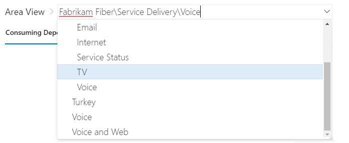
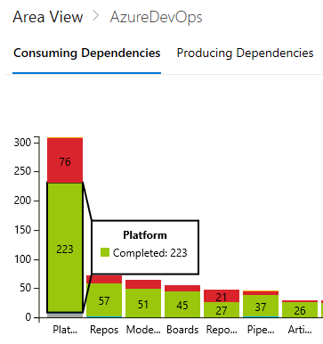
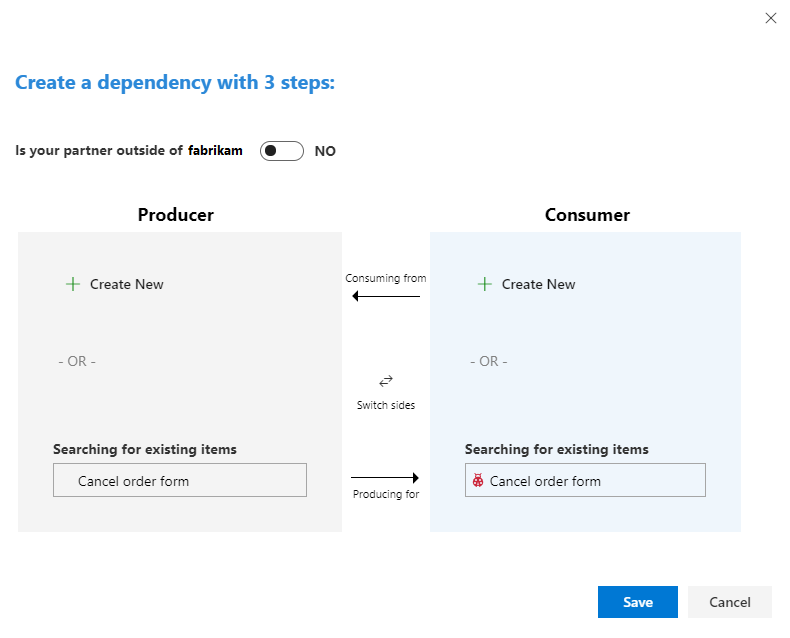
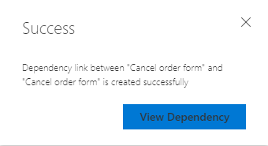
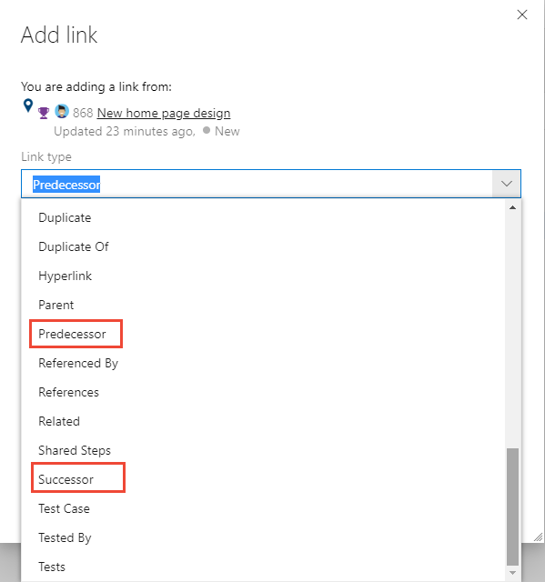

# Plan and track dependencies using the Dependency Tracker extension

[!INCLUDE [temp](../_shared/version-vsts-only.md)]


<!--- Suggest link to tutorial be changed from https://osgwiki.com/wiki/Dependency 

https://microsoft.visualstudio.com/OS/_apps/hub/wdgeswm.dependencytracker.dependencytracker-hub#b4cd1b1c9c7ce3dfbaa3fabc9532a040

--> 


The Dependency Tracker extension provides you with the ability to plan and manage dependencies across teams, projects, and organizations. It provides filterable views to show all dependencies a team is consuming and producing. These views allow you  to track the state of the dependencies as well as their timing to help support you in assessing the risk of dependencies to deliverables. 

> [!NOTE]   
> The Dependency Tracker extension is only available on Azure DevOps Services at this time. You can download it from the [Marketplace for Azure DevOps, Dependency Tracker extension](https://marketplace.visualstudio.com/items?itemName=ms-eswm.dependencytracker&ssr=false#overview)

You use the Dependency Tracker to plan dependencies at the beginning of an iteration or release, as well as to track the status during development. For any given dependency, there are two parties involved: 
- **Consumer**: Feature team who has a need and initiates a request for work
- **Producer**: Feature team who makes a commitment to deliver work 

Each work request and work deliverable is defined as a work item. The work items are linked by the Successor-Predecessor link type or other directional link type. For details about link types, see [Link type reference](../queries/link-type-reference.md) 
Producing for/Consuming from link.

> [!TIP]   
> While any work item type can participate in dependency tracking, you may want to decide if you want to limit dependencies to specific types, such as Features, Epics, User Stories, or Bugs. You can create that restriction through [Configuration of Dependency Tracker](#configuration).

From the Dependency Tracker, you can choose different views and filters, as well as drill down to obtain specific details. These views and options are described in the following sections: 
- [Filter options](#filter)
- [Drill-down](#drill-down)
- [Consuming Dependencies](#consume)
- [Producing Dependencies](#produce)
- [Timeline](#timeline)
- [Risk Graph](#risk-graph)

## Recommended use and key terms

You can use Dependency Tracker to visualize and track the following work items: 
- Dependencies on deliverables for work that your team is delivering  
- Dependencies you have on other teams for work that your team is delivering 
- Dependencies that other teams have on work your team is delivering 

All teams across organizations can participate in tracking dependencies. 

> [!NOTE] 
> Dependency Tracker doesn't replace the in person interactions required to agree to doing the work. It provides easier planning and tracking capabilities. Dependencies should be agreed upon by all parties before they are entered in to the Dependency Tracker.

### Key terms

- **Dependency**: work that Team A requires from Team B to do the work Team A is trying to do
- **Consumer**: the team that wants work done
- **Producer**: the team that is being asked to do the work
- **Sequencing**: when a producing team’s work is needed before the consuming team can start their work

### Recommended practices 

- The consumer is the team that asks for the work – they initiate all discussions on the work they require
- The consumer owns the engagement and tracking of that work – since it is the work their scenario requires, the burden is on the consumer to file, monitor, and track the status of the work
- The consumer owns entering the work into VSTS and submitting that work request to the producer
- Once the work has been submitted to the producer, the producer owns the work item,
	- The producer is responsible for maintaining the work item in VSTS
	- The producer owns the state of the work item (is it going to be done) and iteration (when it will be done).  
	- The consumer should not touch these values, once the work item has been handed off
- The consumer is in charge of keeping tabs on the work they requested (the Dependency Tracker report is one way to do so), so that they are aware of any material changes and adjustments


## Prerequisites

- Install the [Dependency Tracker extension](https://marketplace.visualstudio.com/items?itemName=ms-eswm.dependencytracker&ssr=false#overview) for the organization(s) for which you want to track dependencies.
- To view dependencies, you must be a member of the Project Valid Users group for the project.  
- To create a dependency, you must be a member of the Contributors group for both projects that participate in the dependency linking.
- To support cross-organization participation, all organizations must authenticate users through the same [Azure Active Directory](../../organizations/accounts/connect-organization-to-azure-ad.md). 
- Azure Boards must be enabled as a service. If it is disabled, then you'll need to have it reenabled. For details, see [Turn a service on or off](../../organizations/settings/set-services.md). 

> [!IMPORTANT]  
> The default configuration for Dependency Tracker supports the Agile process. If your project(s) are based on a different process or you have customized your process, you may need to modify the configuration. See [Configure the Dependency Tracker](#configuration) later in this article. 

In addition, you will have wanted to perform these tasks: 
- Set up the area paths and teams that will participate in dependency tracking 
- Configure iteration paths/sprints for the project and assign them to work items participating in dependency tracking - this is essential for the Timeline view to yield meaningful data. 


## Open the Dependency Tracker

1. Open the web portal for the project where your team is defined.  

2. Choose **Dependency Tracker** from under the Boards group. 

	> [!div class="mx-imgBorder"]  
	> 

1. To focus on your area of ownership, choose the **Area** that corresponds to the team you want to view dependencies for.   

	> [!div class="mx-imgBorder"]  
	> 

	You can only filter on those Area paths defined for the project. 

<a id="filter" /> 

## Filter options 

You can filter each supported view by typing a keyword or using one or more of the fields provided, such as State, Work item type, and Iteration Path. Based on the keyword that you enter, the filter function will list work items based on any visible/displayed column or field.  

To show the filter toolbar, choose the  filter icon. 

> [!div class="mx-imgBorder"]  
>   

You can toggle filters  on and off by choosing the filter icon. To see more filters use the arrows at the end of the list of filters. 

Choose one or more values from the multi-select drop-down menu for each field. The values for these fields are populated as follows:

- **State**: Check one or more check boxes for the  work item states you want to view. The drop-down list should include all workflow States defined for all work item types shown in the selected view.  
- **Work item type**: Check one or more check boxes for the Work item types you want to view. Work item types configured to participate in dependency tracking. The default work item types are: Epic, Feature, User Story, and Bug. To modify the configuration, see [Configuration of Dependency Tracker](#configuration).
- **Iteration**: Check one or more check boxes for the Iteration Paths you want to view.  The drop-down list should include all Iteration Paths [configured for the project](../../organizations/settings/set-iteration-paths-sprints.md) and for which there are work items listed in the current view.
- **Priority**:  Check one or more check boxes for the Priorities you want to view. The priority values assigned to work items  
- **Partner**: The partner organization for which the work item is defined. 

> [!NOTE]   
> Filter options are dependent on the [configuration](#configuration) defined for the Dependency Tracker. Also, only those options that correspond to work items shown in the selected view that meet the filter criteria. For example, if you don't have any work items assigned to Sprint 4, then the Sprint 4 option won't appear in the filter options for the Iteration Path. 

Ability to drop dependencies within the selected area (usually used for excluding dependencies inside my team)


<a id="drill-down" /> 

## Drill-down options 


Several views provide interative visualization through drilldowns. 

> [!div class="mx-imgBorder"]  
>  


<a id="create" /> 

## Create a dependency 

A dependency represents work where one team is dependent on another team. Both teams should track their own work in their own area path. By linking the work that is dependent on the other teams work, the dependencies can be visualized and tracked.  

1. Choose **New Dependency**.  

	> [!div class="mx-imgBorder"]  
	> 

	If the partner team is in a different organization, then first choose the **Partner Account**.   

	> [!div class="mx-imgBorder"]  
	> 

1.  You can search for work items by ID or by entering a keyword contained within the work item title. Here, we link a user story and a bug. 

	> [!div class="mx-imgBorder"]  
	> 

	- The Producer is the team that commits to delivering the work.
	- The Consumer is the team that needs or is dependent on the work.
	- The fastest way to create a dependency link is to type the Producer and Consumer work item ids in the search boxes and then choose **Save**.

	Optionally, you can choose **Create New** to add work items that you then link as dependent upon each other. Here we create two new features and link them. 

	> [!div class="mx-imgBorder"]  
	> 

	If no work items exist for one half of the dependency it is possible to create a new work item also.

1.  Choose **Save**. The **Save** button becomes available only after you've chosen two work items to link.  	

1. From the success confirmation dialog, choose **View dependency**. 

	> [!div class="mx-imgBorder"]  
	> 

1.  The work items that you just linked are highlighted.	
	
	As shown in this example, the Fabrikam Fiber/Service Delivery/Voice team is dependent on the MyFirstProject team to deliver their `User Story 706: Cancel order form` to complete `Bug 390: Cancel order form`. 

	> [!div class="mx-imgBorder"]  
	> 

## Create links manually 

You can also link work items using the **Links** tab to create Successor/Predecessor links. A Predecessor is the producer of the work item, or the item that must come first. A Successor is the consumer of the work item, or the item that is dependent on the first item.

> [!div class="mx-imgBorder"]  
> 

> [!NOTE]   
> The Successor/Predecessor (consumes/produces) link types are the default link types used by the Dependency Tracker. If you're projects are customized using a Hosted XML process model, it's possible to specify different link types in the Dependency Tracker configuration. See [Configure the Dependency Tracker](#configuration) later in this article.

To learn more, see [Link user stories, issues, bugs, and other work items](../backlogs/add-link.md). 

## Remove dependency links

You can remove a dependency by choosing the  actions icon from the linked work item and choose **Remove Dependency Link** option from the menu. 

> [!div class="mx-imgBorder"]  
> 

Optionally, you can remove the link from the work item's **Links** tab. 

## Create a query of dependencies 

To open a set of dependent work items, select them in the same way you would via a [bulk edit](../backlogs/bulk-modify-work-items.md), choose the  actions icon from one of the selected linked work items and choose **Open in Query** option from the menu. 

> [!div class="mx-imgBorder"]  
> 

A new tab opens to the Query Results page. 

You can also create a custom query by selecting the Work items and direct links query type and choose any work item type. 

Choose **Copy to HTML** to copy the selected work items to the clipboard as a formatted table. 

<a id="consume" />

## Consuming Dependencies: View dependencies for a team 

The **Consuming Dependencies** view shows work that my team is dependent upon other teams/area paths. It is useful for answering the following questions: 

- *Which dependencies am I consuming as the owner of the selected Area?* 
- *How many dependencies per Producer team (by area level 3)?*
- *What are the State of my consumer dependencies?*

> [!div class="mx-imgBorder"]  
> [Consuming-View](_img/tracker/consuming-dependencies-view.png)

On the bar chart each column represents another area path that is producing dependencies for this area path by state or risk. The table shows the number of unique dependencies and lists all work items participating in the filtered view of tracked dependencies. 

- Filtering down work items
- Changing if the Producer or Consumer work items are displayed on top
- Expanding using the + to show both halves of the dependency

<a id="produce" />

## Producing Dependencies: view deliverable work for a team  

The **Producing Dependencies** view shows work that other teams/area paths are dependent on per the selected area. It is useful for answering the following questions: 

- *Which dependencies am I reponsible for delivering as the owner of the selected Area?* 
- *How many dependencies exist per Consumer team (by area level 3)?*
- *What are the states of my producer dependencies?*


> [!div class="mx-imgBorder"]  
> [Dependency Tracker](_img/tracker/producing-dependencies-view.png)

- Filtering down work items
- Changing if the Producer or Consumer work items are displayed on top
- Expanding using the + to show both halves of the dependency


<a id="timeline" />

## Timeline view

The **Timeline** tab provides a calendar view of dependencies  

- What are all the deliverable dependencies against selected timeline for a given team?

> [!NOTE]   
> The Dependency Timeline feature is in Beta. From the Timeline view, you can view the sequencing of dependencies across months. In order for the Timeline to function correctly, Iteration Paths must have dates assigned. 


- Red arrows highlight when the sequencing is out of order and a predecessor is scheduled to be complete after a successor
- The left-hand colored bar designates the state of each item
- Hover over an item to see a detailed card or double click to open an individual work item
- Right clicking of an item to reassign it to a new iteration

> [!div class="mx-imgBorder"]  
> 

> [!div class="mx-imgBorder"]  
> 


<a id="risk-graph" />

## Risk Graph

The Risk Graph is a bird’s eye view of how dependencies flow from Producer team to Story (V1), or from Producer to Consumers (view coming soon). The graph allows a team to, at a glance, understand the magnitude of dependencies and level of risks associated. In addition, the risk graph view demonstrates the value of linking dependencies and laddering them up to Stories, as well as leveraging Risk Assessment fields. 


The color coding in the risk graph is dependent on the State of the item and is configurable. The width of the lines in the risk graph indicate how many dependencies exist in that area, the thicker the link the more dependencies as indicated in the legend.

<a id="configuration" /> 

## Configure the Dependency Tracker

You can customize the configuration used in the Dependency Tracker as follows: 

- The link type to use to create dependency links. Default is Successor/Predecessor. Only customize if you use the [Hosted XML process model](../../organizations/settings/work/hosted-xml-process-model.md) to customize work tracking.  
- Work items 
	- Work item category states and colors 
	- Work item display states and colors
	- Work item types to participate in dependency tracking 
- Default filter selections:
	- Default selected dependency work item types
	- Default selected Iteration Paths
- Enabled options:
	- Timeline
	- New Dependency link 
	- Cross account (organization) dependencies 
	- Cross account dependency toggle default state 
- Risk graph configuration:
	- Work item state(s) associated with at risk (Red color)
	- Work item state(s) associated with neutral (Gray color)
	- Work item state(s) associates with on track (Green color)

To change the configuration, choose the  gear icon  and modify the syntax listed. Choose **Save** when done. 


### Enable or disable the New Dependency option

To enable or disable the **New Dependency** option, set the following syntax in the JSON configuration to `true` or `false`:

> [!div class="tabbedCodeSnippets"]
```
{
    "newDependencyButtonEnabled": true
}
```


### Enable or disable cross-organization linking

To enable cross-organization dependency linking from the New dependency dialog, set the following syntax in the JSON configuration to `true` or `false`:

> [!div class="tabbedCodeSnippets"]
```
{
    "crossAccountConfigs": {
        "crossAccountDependencyEnabled": true,
        "crossAccountDependencyToggleDefaultState": true, //default state for cross account toggle
        "crossAccountDependencyToggleOnText": "Cross-account dependencies on",
        "crossAccountDependencyToggleOffText": "Cross-account dependencies off"
      }
}
```

Cross account linking requires the use of a special link type and should only be used in coordination with the **New Dependency** option.


### Default configuration syntax

> [!div class="tabbedCodeSnippets"]
```
{
    "consumesLinkName": "System.LinkTypes.Dependency-Reverse",
    "producesLinkName": "System.LinkTypes.Dependency-Forward",
    "queryFields": {},
    "dependencyWorkItemTypes": [
        "Epic",
        "Feature",
        "User Story",
        "Bug"
    ],
    "selectedDependencyWorkItemTypes": "Any",
    "selectedReleases": "",
    "workItemCategoriesAndColors": {
        "Proposed": {
            "displayName": "Proposed",
            "color": "#a6a6a6"
        },
        "InProgress": {
            "displayName": "In Progress",
            "color": "#00bcf2"
        },
        "Completed": {
            "displayName": "Completed",
            "color": "#9ac70b"
        },
        "Removed": {
            "displayName": "Removed",
            "color": "#d9242c"
        },
        "Resolved": {
            "displayName": "Resolved",
            "color": "#ff9d00"
        }
    },
    "workItemDislayStatesAndDisplayColors": {
        "New": {
            "textColor": "rgb(112, 112, 112)",
            "chartColor": "rgb(112, 112, 112)",
            "states": [
                "New"
            ]
        },
        "Active": {
            "textColor": "rgb(0, 122, 204)",
            "chartColor": "rgb(0, 122, 204)",
            "states": [
                "Active",
                "Resolved"
            ]
        },
        "Closed": {
            "textColor": "rgb(16, 124, 16)",
            "chartColor": "rgb(16, 124, 16)",
            "states": [
                "Closed"
            ]
        },
        "Removed": {
            "textColor": "rgb(204, 41, 61)",
            "chartColor": "rgb(204, 41, 61)",
            "states": [
                "Removed"
            ]
        },
        "Other": {
            "textColor": "rgb(178, 178, 178)",
            "chartColor": "rgb(178, 178, 178)",
            "states": []
        }
    },
    "riskAssessmentValues": [],
    "releases": [],
    "partnerAccounts": [],
    "rankValues": [],
    "timelineEnabled": true,
    "newDependencyButtonEnabled": true,
    "crossAccountConfigs": {
        "crossAccountDependencyEnabled": true,
        "crossAccountDependencyToggleDefaultState": false
    },
    "priorityValues": [
        "0",
        "1",
        "2",
        "3",
        "4",
        "(blank)"
    ],
    "defaultColumns": [
        "Id",
        "Area Path",
        "Dependency Title",
        "State",
        "Consumers",
        "Producers"
    ],
    "riskGraphConfig": {
        "atRisk": [
            "Removed"
        ],
        "neutral": [
            "New"
        ],
        "onTrack": [
            "Active",
            "Resolved",
            "Closed",
            "Other"
        ]
    },
    "iterationDepth": 8
}
```
## Other customizations

*Are there other customizations I can make to the Dependency Tracker?* 


## Related articles

- [Review team delivery plans](../plans/review-team-plans.md)

## Related Marketplace extensions

- [Work Item Visualization](https://marketplace.visualstudio.com/items?itemName=ms-devlabs.WorkItemVisualization) 


## Dependency Bot

The dependency bot works in the background to notify teams when dependencies are created. These include performing the following actions: 
- Notify the producer (copy the consumer) when a dependency is created
- Notify the consumer (copy the producer) when the producer has changed the State of the deliverable to Cut
- Notify the consumer (copy the producer) when the producer has moved out the iteration path of a committed dependency.


<!--- TO BE COMPLETED

- cross linking
- Ask Cheryl how her link type is Producing for/Consuming from link


--> 

