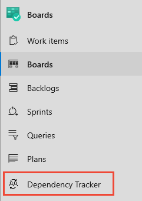
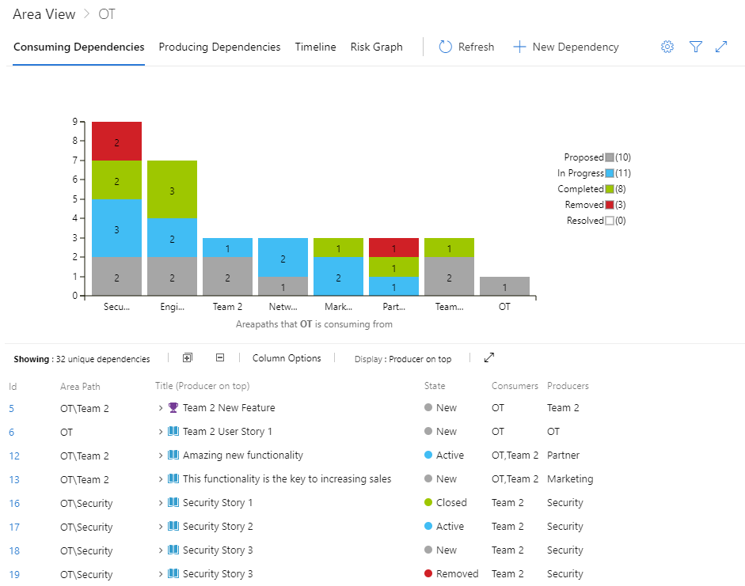
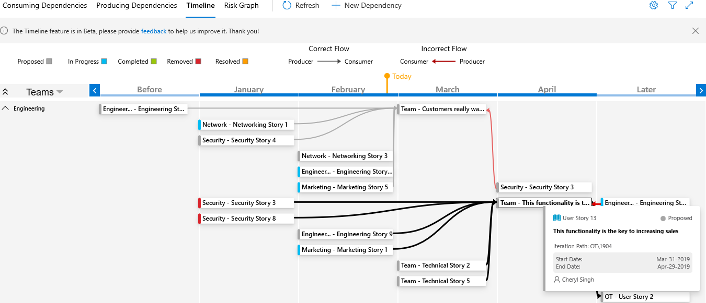

# Dependency Tracker extension for Azure Boards

[!INCLUDE [temp](../../_shared/version-vsts-only.md)]


<!--- Suggest link to tutorial be changed from https://osgwiki.com/wiki/Dependency --> 


The [Dependency Tracker extension](https://marketplace.visualstudio.com/items?itemName=ms-eswm.dependencytracker&ssr=false#overview) provides you with the ability to plan and manage dependencies across teams, projects, and organizations. It provides filterable views to show all dependencies a team is consuming and producing. These view allow you  to view the state of the dependencies as well as their timing to help support you in assessing the risk of the dependencies. 

> [!NOTE]   
> The Dependency Tracker extension is only available on Azure DevOps Services at this time. 

You use the Dependency Tracker to plan dependencies at the beginning of an iteration or release, as well as to track the status during development.  

## Key concepts

For any given dependency, there are two parties involved: 
- **Consumer**: Feature team who has a need and initiates a request for work
- **Producer**: Feature team who makes a commitment to deliver work 

Each work request and work deliverable is defined as a work item. The work items are linked by the Successor-Predecessor link type or other directional link type. For details about link types, see [Link type reference](../../queries/link-type-reference.md) 
Producing for/Consuming from link.

> [!TIP]   
> While any work item type can participate in dependency tracking, you may want to decide if you want to limit dependencies to specific types, such as Features, Epics, User Stories, or Bugs. 

## Recommended use and sequence

You can use the Dependency Tracker to visualize and track: 
- Dependencies on deliverables for work that your team is delivering  
- Dependencies you have on other teams for work that your team is delivering 
- Dependencies that other teams have on work your team is delivering 


## Prerequisites

- Install the [Dependency Tracker extension](https://marketplace.visualstudio.com/items?itemName=ms-eswm.dependencytracker&ssr=false#overview) for the organization(s) for which you want to track dependencies.
- To create a dependency, you must be a member of the Contributors group for both projects that participate in the dependency linking.
- Configuration? 
- Partnership 
- Azure Boards must be enabled as a service. If it is disabled, then you'll need to have it reenabled. For details, see [](). 


## Open the Dependency Tracker


1. Open the web portal for the project where your team is defined.  

2. Choose **Dependency Tracker** from under the Boards group. 

	> [!div class="mx-imgBorder"]  
	> 

1. To focus on your area of ownership, choose the **Area** that corresponds to the team you want to view dependecies for.   

	> [!div class="mx-imgBorder"]  
	> 

	You can only filter on those Area paths defined for the project. 


## Create a dependency 

A dependency represents work where one team is dependent on another team. Both teams should track their own work in their own area path. By linking the work that is dependent on the other teams work, the dependencies can be visualized and tracked.  

1. Choose **New Dependency**.  

	> [!div class="mx-imgBorder"]  
	> 

	If the partner team is within the same organization, then you can either create new work items to link, or search for existing work items to link. 

1.  You can search for work items by ID or by entering a keyword contained within the work item title. Here, we link a user story and a bug. 

	> [!div class="mx-imgBorder"]  
	> 

1.  Choose **Save**.	

	> [!TIP]   
	> The **Save** button becomes available only after you've chosen two work items to link.  

1. From the success confirmation dialog, choose **View dependency**. 

	> [!div class="mx-imgBorder"]  
	> 

1.  The work items that you just linked are highlighted.	
	
	As shown in this example, the Fabrikam Fiber/Service Delivery/Voice team is dependent on the MyFirstProject team to deliver their `User Story 706: Cancel order form` to complete `Bug 390: Cancel order form`. 

	> [!div class="mx-imgBorder"]  
	> 


 

From there the Dependency Creation screen pops up.

The Producer is the team that commits to delivering the work.
The Consumer is the team that needs or is dependency on the work.
The fastest way to create a dependency link is to type the Producer and Consumer work item ids in the search boxes and then click save.

If no work items exist for one half of the dependency it is possible to create a new work item also.

## Dependencies can also be created from the Links Tab

Dependencies can be created using the Predecessor and Successor links on the Links tab.
A predecessor is the producer of the work item, or the item that must come first.
A successor is the consumer of the work item, or the item that is dependent on the first item.


## Supported views, filters, and drill downs 


### Supported filters
- Area
- Story (toggle between Area or Story)
- Release (multiselect)
- Iteration (multiselect)
- Product Family (multiselect)
- Product (multiselect)
- Ability to drop dependencies within the selected area (usually used for excluding dependencies inside my team)


## Filter using keywords, tags, or select field values

You can filter by select field values. To start filtering, choose the  filter icon.

> [!div class="mx-imgBorder"]  
> 

Choose one or more values from the multi-select drop-down menu for each field. The values for these fields are populated as follows:

- **Search title or tag**: Enter a keyword used within a work item title or tag. 
- **State**: Check one or more check boxes for the  work item states you want to view. 
- **Work item type**: Check one or more check boxes for the Work item types you want to view. 
- **Iteration**: Check one or more check boxes for the Iteration Paths you want to view.   All Iteration Paths [selected for the current team](../../sprints/define-sprints.md) and for which there are work items assigned to that iteration 
- **Priority**: Check one or more check boxes for the Priorities you want to view. 
- **Partner**: Check one or more check boxes for the leaf node of the Area Paths participating in the dependencies.  

> [!NOTE]   
> Filter options are dependent on the configuration set for the Dependency Tracker. For details, see [Configuration](#configuration).  Also, only those options that correspond to work items which XXXX to w ork items that meet the filter criteria. For example, if you don't have any work items assigned to Sprint 4, then the Sprint 4 option won't appear in the filter options for the Iteration Path. 


filter


### Supported drilldowns 

## View dependencies 

### Consuming Dependencies view


The **Consuming Dependencies** view shows work that my team is dependent upon other teams/area paths. It is useful for answering the following questions: 

- *Which dependencies am I consuming as the owner of the selected Area?* 
- *How many dependencies per Producer team (by area level 3)?*
- *What are the State of my consumer dependencies?*

The **Producing Dependencies** view addresses these questions: 

- *Which dependencies am I reponsible for producing as the owner of the selected Area?* 
- How many dependencies exist per Consumer team (by area level 3)?
- What are the State of my producer dependencies?


### Producing Dependencies view


The **Producing Dependencies** view shows work that other teams/area paths are dependent on per the selected area. It is useful for answering the following questions: 

- *Which dependencies am I reponsible for delivering as the owner of the selected Area?* 
- *How many dependencies exist per Consumer team (by area level 3)?*
- *What are the states of my producer dependencies?*


Consuming Dependencies - work the selected area path is dependent on other area paths to complete
Producing Dependencies - work the selected area path is doing that other area paths are dependent on

You can view and filter specific dependency views. 

> [!div class="mx-imgBorder"]  
> 


## Timeline view

- What are all the deliverable dependencies against selected timeline for a given team?

## View the Timeline

The Dependency Timeline feature is in Beta. The Timeline is designed to provide clear sequencing of dependencies across months.

[!INCLUDE [temp](../_shared/version-vsts-only.md)]

## Features

- Red arrows highlight when the sequencing is out of order and a predecessor is scheduled to be complete after a successor
- The left-hand colored bar designates the state of each item
- Hover over an item to see a detailed card or double click to open an individual work item
- Right clicking of an item to reassign it to a new iteration



In order for the timeline to function correctly Iterations must have dates assigned


<!--- TO BE COMPLETED

- cross linking
- Ask Cheryl how her linnk type is Producing for/Consuming from link

--> 

## Dependency Bot

Dependency Bot 
The dependency bot works in the background to help dependency management less painful. Have a suggestion on what other skills the bot can have? Please use the Feedback Hub to let us know. Starting skills: 
Notify the producer (copy the consumer) when a dependency is created
Notify the consumer (copy the producer) when the producer has changed the State of the deliverable to Cut
Notify the consumer (copy the producer) when the producer has moved out the iteration path of a committed dependency.

<a id="configuration" /> 

## Configuration

You can customize the configuration used in the Dependency Tracker as follows: 

- The link type to use to create dependency links  
- Work items 
	- Work item category states and colors 
	- Work item display states and colors
	- Work item types to participate in dependency tracking 
- Default filter selections:
	- Default selected dependency work item types
	- Default selected Iteration Paths
- Enabled options:
	- Timeline
	- New Dependency link 
	- Cross account (organization) dependencies 
	- Cross account dependency toggle default state 
- Risk graph configuration:
	- Work item state(s) associated with at risk (Red color)
	- Work item state(s) associated with neutral (Gray color)
	- Work item state(s) associates with on track (Green color)

To change the configuration, choose the  gear icon  and modify the syntax listed. Choose **Save** when done. 

### Default configuration syntax

> [!div class="tabbedCodeSnippets"]
```
{
    "consumesLinkName": "System.LinkTypes.Dependency-Reverse",
    "producesLinkName": "System.LinkTypes.Dependency-Forward",
    "queryFields": {},
    "dependencyWorkItemTypes": [
        "Epic",
        "Feature",
        "User Story",
        "Bug"
    ],
    "selectedDependencyWorkItemTypes": "Any",
    "selectedReleases": "",
    "workItemCategoriesAndColors": {
        "Proposed": {
            "displayName": "Proposed",
            "color": "#a6a6a6"
        },
        "InProgress": {
            "displayName": "In Progress",
            "color": "#00bcf2"
        },
        "Completed": {
            "displayName": "Completed",
            "color": "#9ac70b"
        },
        "Removed": {
            "displayName": "Removed",
            "color": "#d9242c"
        },
        "Resolved": {
            "displayName": "Resolved",
            "color": "#ff9d00"
        }
    },
    "workItemDislayStatesAndDisplayColors": {
        "New": {
            "textColor": "rgb(112, 112, 112)",
            "chartColor": "rgb(112, 112, 112)",
            "states": [
                "New"
            ]
        },
        "Active": {
            "textColor": "rgb(0, 122, 204)",
            "chartColor": "rgb(0, 122, 204)",
            "states": [
                "Active",
                "Resolved"
            ]
        },
        "Closed": {
            "textColor": "rgb(16, 124, 16)",
            "chartColor": "rgb(16, 124, 16)",
            "states": [
                "Closed"
            ]
        },
        "Removed": {
            "textColor": "rgb(204, 41, 61)",
            "chartColor": "rgb(204, 41, 61)",
            "states": [
                "Removed"
            ]
        },
        "Other": {
            "textColor": "rgb(178, 178, 178)",
            "chartColor": "rgb(178, 178, 178)",
            "states": []
        }
    },
    "riskAssessmentValues": [],
    "releases": [],
    "partnerAccounts": [],
    "rankValues": [],
    "timelineEnabled": true,
    "newDependencyButtonEnabled": true,
    "crossAccountConfigs": {
        "crossAccountDependencyEnabled": true,
        "crossAccountDependencyToggleDefaultState": false
    },
    "priorityValues": [
        "0",
        "1",
        "2",
        "3",
        "4",
        "(blank)"
    ],
    "defaultColumns": [
        "Id",
        "Area Path",
        "Dependency Title",
        "State",
        "Consumers",
        "Producers"
    ],
    "riskGraphConfig": {
        "atRisk": [
            "Removed"
        ],
        "neutral": [
            "New"
        ],
        "onTrack": [
            "Active",
            "Resolved",
            "Closed",
            "Other"
        ]
    },
    "iterationDepth": 8
}
```
