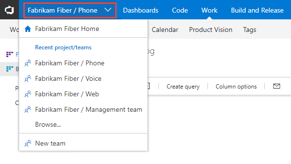

# View progress using the Epic Roadmap 

[!INCLUDE [temp](../includes/version-vsts-tfs-2017-on.md)]

Similar to the Feature Timeline, the Epic Roadmap supports portfolio management by providing a calendar view of a single epic and it's child features.  

> [!NOTE]   
> The Feature Timeline and Epic Roadmap extension is not a supported feature of Azure Boards and therefore not supported by the product team. For questions, suggestions, or issues you have when using the extension, visit the extension page.  

Use the Epic Roadmap to support the following tasks: 

- Support roadmap planning  
- Produce reports at each business level to show high and low-level progress views  
- Adjust sprint assignments to child work items  

> [!NOTE]   
> The Feature Timeline and Epic Roadmap  extension is available on TFS 2017 Update 2 and later versions. You can download it from the [Marketplace for Azure DevOps, Feature Timeline and Epic Roadmap](https://marketplace.visualstudio.com/items?itemName=ms-devlabs.workitem-feature-timeline-extension).

> [!div class="mx-imgBorder"]  
> 

The Feature Timeline and Epic Roadmap extension provides you with calendar views of feature progress with the ability to drill down to see details at the requirements level.  

> [!NOTE]   
> The Feature Timeline and Epic Roadmap  extension is available on TFS 2017 Update 2 and later versions. You can download it from the [Marketplace for Azure DevOps, Feature Timeline and Epic Roadmap ](https://marketplace.visualstudio.com/items?itemName=ms-devlabs.workitem-feature-timeline-extension)

## Prerequisites

- Install the [Feature Timeline and Epic Roadmap](https://marketplace.visualstudio.com/items?itemName=ms-devlabs.workitem-feature-timeline-extension) extension for the organization(s) or collection(s) for which you want to track progress at the epic and feature level. In order to install an extension, you must be a member of the Project Collection Administrator Group. To learn more, see [Install extensions](../../marketplace/install-extension.md). 
- To view the Feature Timeline, you must be a member of the project and have view permissions to work items under the area path they are assigned to.
- To modify work items, you must have permissions to edit work items under the area path they are assigned to.   

## Define your epics, features, and stories 

## Open Boards or Backlogs 

You can access the Feature Timeline from either your team's Kanban board or backlog. 

Here we open Boards. 

::: moniker range="azure-devops"

1. Check that you selected the right project, and select **Boards** > **Boards**. Then select the correct team from the team selector menu. 

	> [!div class="mx-imgBorder"]  
	>   

	To select another team's board, open the selector. Then select a different team, or select the  **Browse all team boards** option. Or, you can enter a keyword in the search box to filter the list of team backlogs for the project.

	> [!div class="mx-imgBorder"]  
	>  

::: moniker-end

::: moniker range="azure-devops-2019"

1. Check that you selected the right project, and select **Boards** > **Boards**. Then select the correct team from the team selector menu. 

	> [!div class="mx-imgBorder"]  
	>   

	To select another team's board, open the selector. Then select a different team, or select the  **Browse all team boards** option. Or, you can enter a keyword in the search box to filter the list of team backlogs for the project.

	> [!div class="mx-imgBorder"]  
	>  

::: moniker-end

::: moniker range=">= tfs-2017 <= tfs-2018"

1. To view your Kanban board, open your project from a web browser. Select **Work** > **Backlogs** > **Stories**, and then select **Board**. 

	> [!div class="mx-imgBorder"]  
	> 

	If you don't see **Work**, your screen size might be reduced. Select the three dots () icon. Then select **Work** > **Backlogs** > **Board**.   

	> [!div class="mx-imgBorder"]  
	>    

1. To select another team, open the project and team selector. Select a different team, or select the **Browse** option.  

   > [!div class="mx-imgBorder"]  
   >   

   Your Kanban board appears. 
	  
	> [!div class="mx-imgBorder"]  
	>    

::: moniker-end   

## Open Epic Roadmap 

1. Choose **Epic Roadmap**. 

	> [!div class="mx-imgBorder"]  
	> 

	If you don't see the **Feature Timeline** link, then the [Feature Timeline and Epic Roadmap](https://marketplace.visualstudio.com/items?itemName=ms-devlabs.workitem-feature-timeline-extension) extension isn't installed or enabled. Check with your Project Collection Administrator to request that it be installed. To learn more, [Request and approve extensions](../../marketplace/request-extensions.md). 

2. Choose the Epic you want to view from the drop-down menu. 

	> [!div class="mx-imgBorder"]  
	> 
	
4. Customize your view. 
 
	- **View Sprints**: Enter the number of iterations to show. The maximum number is 11. 
		> [!NOTE]  
		Sprint labels may not display for iterations above six, however, the calendar view represents those iterations.
	- **Show Details**: Displays progress bars of Feature child items
	- **Track Progress Using**: Progress bars indicate completion based on child requirements or overall total effort. 

## Drill-down to view details 

1. To view the requirements linked to a feature, choose the  info icon for that feature. 

	> [!div class="mx-imgBorder"]  
	> 

	A dialog opens showing the child items of the feature. 

	> [!div class="mx-imgBorder"]  
	> 

	The Start and End iterations are derived from the iteration paths assigned to the child work items. You can change those values by selecting new Start and End iterations from the drop down path. 

## Q & A

[!INCLUDE [temp](../includes/faq-critical-path.md)]

<!--- Enter some notes about critical path and MVP  --> 

## Related articles

- [Review team delivery plans](../plans/review-team-plans.md)
- [View portfolio progress with the Feature Timeline](feature-timeline.md) 
- [Plan and track dependencies using the Dependency Tracker](dependency-tracker.md)  
- 

## Related Marketplace extensions

- [Work Item Visualization](https://marketplace.visualstudio.com/items?itemName=ms-devlabs.WorkItemVisualization) 
 