# Plan and track work in Azure Boards

[!INCLUDE [version-lt-eq-azure-devops](../../includes/version-lt-eq-azure-devops.md)]

You track your work by creating work items. This article walks you through creating issues and tasks using a Kanban board. You can learn the Basic process or the Agile process for creating these items. 

Choose one of the following four system processes&mdash;**Agile**, **Basic**, **Scrum**, or **Capability Maturity Model Integration (CMMI)**&mdash;for guidance depending on what process was selected for your project. For an overview of each of these processes, see [Choose a process](../work-items/guidance/choose-process.md).

[!INCLUDE [temp](../includes/basic-process-note.md)] 

#### [Agile process](#tab/agile-process) 

The Agile process provides several work item types&mdash;for example, user stories, tasks, bugs, features, and epics among others&mdash;to plan and track work. We recommend you start by adding user stories. If you need to group them into a hierarchy, you can define features. To track other details of work, you can add tasks to a user story.  

> [!div class="mx-tdCol2BreakAll"]
> |Work item types| Backlog hierarchy |
> |------|---------|
> |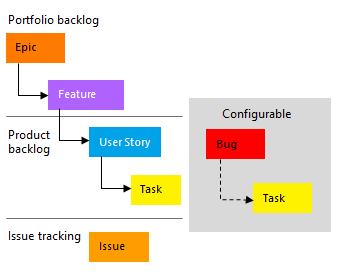 | 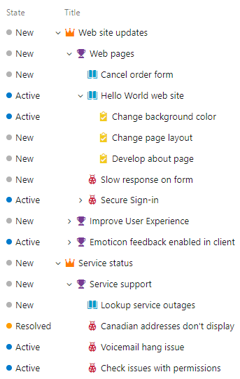 |

Within each work item form, you can describe the work to be done, assign work to project contributors, track status, and collaborate with others through the Discussion section. 

Here we show how to add user stories and child tasks from the web portal and add details to those work items. 

#### [Basic process](#tab/basic-process) 

The Basic process provides three work item types&mdash;epics, issues, and tasks&mdash;to plan and track work. We recommend you start by adding issues to track your user stories, bugs, or feature items. If you need to group them into a hierarchy, you can define epics. To track more work details, you can add tasks to an issue. 

> [!div class="mx-tdCol2BreakAll"]
> |Work item types| Backlog hierarchy |
> |------|---------|
> | | 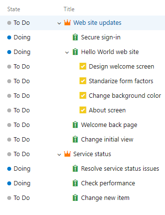 |

Within each work item form, you can describe the work to be done, assign work to project contributors, track status, and collaborate with others through the Discussion section. 

Here we show how to add issues and child tasks from the web portal and add details to those work items. 

#### [Scrum process](#tab/scrum-process) 

The Scrum process provides several work item types&mdash;for example, product backlog items, tasks, bugs, features, and epics among others&mdash;to plan and track work. We recommend you start by adding product backlog items. If you need to group them into a hierarchy, you can define features. To track more details of work, you can add tasks child items to a product backlog item.  

> [!div class="mx-tdCol2BreakAll"]
> |Work item types| Backlog hierarchy |
> |------|---------|
> |  | 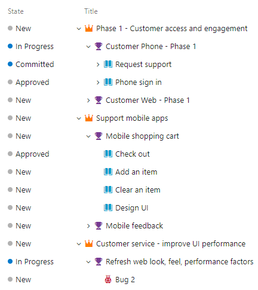  |

Within each work item form, you can describe the work to be done, assign work to project contributors, track status, and collaborate with others through the Discussion section. 

Here we show how to add product backlog items and child tasks from the web portal and add details to those work items. 

#### [CMMI process](#tab/cmmi-process) 

The CMMI process provides several work item types&mdash;for example, requirements, tasks, bugs, features, and epics among others&mdash;to plan and track work. We recommend you start by adding requirements. If you need to group them into a hierarchy, you can define features and epics. To track more details of work, you can add tasks child items to a requirement.  

> [!div class="mx-tdCol2BreakAll"]
> |Work item types| Backlog hierarchy |
> |------|---------|
> |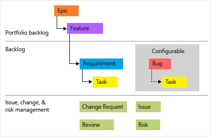 | 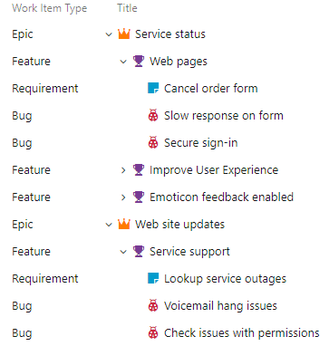  |

Within each work item form, you can describe the work to be done, assign work to project contributors, track status, and collaborate with others through the Discussion section. 

Here we show how to add user stories and child tasks from the web portal and add details to those work items. 

* * * 

## Prerequisites

::: moniker range="azure-devops"

- After you connect to a project, you can add work items. If you don't have a project yet, [create one in Azure DevOps](sign-up-invite-teammates.md). 
- To add work items to a board, and use all other board features, you must be granted **Basic** access and have been added as a member of the Contributors or Project Administrators group. 
- If you have been granted **Stakeholder** access for a private project and have been added as a member of the Contributors or Project Administrators group, you can view boards, open and modify work items, and add child tasks to a checklist. However, you can't reorder or reparent a backlog item using drag-and-drop, nor update a field on a card. 
- If you have been granted **Stakeholder** access for a public project, and have been added as a member of the Contributors or Project Administrators group, you have full access to all Boards features. 

::: moniker-end

::: moniker range="azure-devops-2020"

- After you connect to a project, you can add work items. If you don't have a project yet, [create one in Azure DevOps](sign-up-invite-teammates.md). 
- To add work items to a board, and use all other board features, you must be granted **Basic** access and have been added as a member of the Contributors or Project Administrators group. 
- If you have been granted **Stakeholder** access and have been added as a member of the Contributors or Project Administrators group, you can view boards, open and modify work items, and add child tasks to a checklist. However, you can't reorder or reparent a backlog item using drag-and-drop, nor update a field on a card.

> [!NOTE]   
> The ability for Stakeholders to drag-and-drop cards to different columns requires installation of Azure DevOps Server 2020.1 update. To learn more, see [Azure DevOps Server 2020 Update 1 RC1 Release Notes, Boards](/azure/devops/server/release-notes/azuredevops2020u1#stakeholders-can-move-work-items-across-board-columns).  

::: moniker-end

::: moniker range="< azure-devops-2020"

- After you connect to a project, you can add work items. If you don't have a project yet, [create one in Azure DevOps](sign-up-invite-teammates.md). 
- To add work items to a board, and use all other board features, you must be granted **Basic** access and have been added as a member of the Contributors or Project Administrators group. 
- If you have been granted **Stakeholder** access for a private project and have been added as a member of the Contributors or Project Administrators group, you can view boards, open and modify work items, and add child tasks to a checklist. However, you can't update the status of a backlog item or reorder or reparent a backlog item using drag-and-drop, nor update a field on a card.
- If you have been granted **Stakeholder** access for a public project, and have been added as a member of the Contributors or Project Administrators group, you have full access to all Boards features. 

::: moniker-end

For details, see [Default permissions and access for Azure Boards](permissions-access-boards.md)

::: moniker range="tfs-2018"

> [!NOTE]   
> The images shown in this article correspond to the latest version of Azure Boards. While they may differ from those shown in earlier, on-premises versions of Azure DevOps, they are similar in the functions described unless otherwise noted. 

::: moniker-end

## Open your Kanban board 

A Kanban board is provisioned with the addition of each project and each team. You can only create or add Kanban boards to a project by adding another team. To learn more, see [About teams and Agile tools](../../organizations/settings/about-teams-and-settings.md).

#### [Agile process](#tab/agile-process) 

The User Stories Kanban board is the best tool for quickly adding user stories and child tasks. To open, choose **Boards>Boards**.  

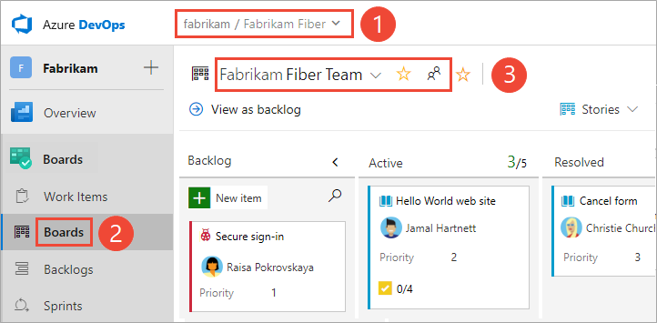  

The Features Kanban board is the best tool for quickly adding features and user stories that are children of those features. 
To open the Features board from the Stories board, choose **Features** from the board selector. 

> [!div class="mx-imgBorder"]  
>   

#### [Basic process](#tab/basic-process) 

The Issues Kanban board is the best tool for quickly adding issues and child tasks. To open, choose **Boards>Boards**.  
  

The Epics Kanban board is the best tool for quickly adding epics and issues that are children of those epics. 
To open the Epics board from the Issues board, choose **Epics** from the board selector. 

> [!div class="mx-imgBorder"]  
>   

#### [Scrum process](#tab/scrum-process) 

The Backlog items Kanban board is the best tool for quickly adding product backlog items and child tasks. To open, choose **Boards>Boards**.  

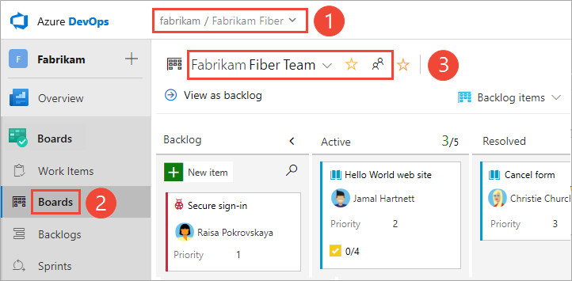  

The Features Kanban board is the best tool for quickly adding features and product backlog items that are children of those features. 
To open the Features board from the Backlog items board, choose **Features** from the board selector. 

> [!div class="mx-imgBorder"]  
> 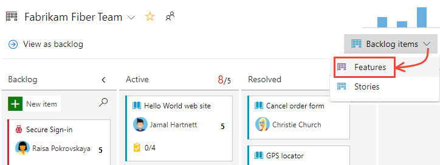  

The default Scrum process configuration doesn't enable the Epic backlog level for a team. To enable it, see [Select backlog navigation levels for your team](../../organizations/settings/select-backlog-navigation-levels.md).

#### [CMMI process](#tab/cmmi-process) 

The Requirements Kanban board is the best tool for quickly adding requirements and child tasks. To open, choose **Boards>Boards**.  

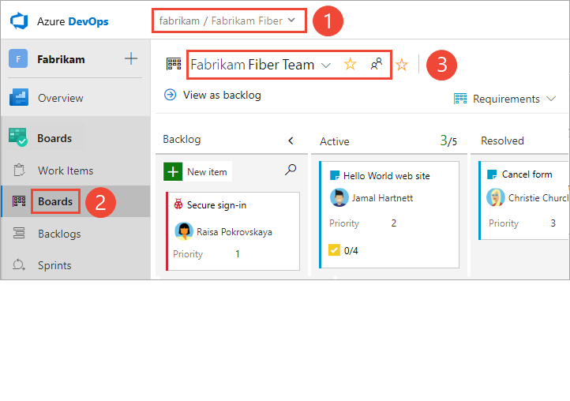  

The Features Kanban board is the best tool for quickly adding features and requirements that are children of those features. 
To open the Features board from the Requirements board, choose **Features** from the board selector. 

> [!div class="mx-imgBorder"]  
> 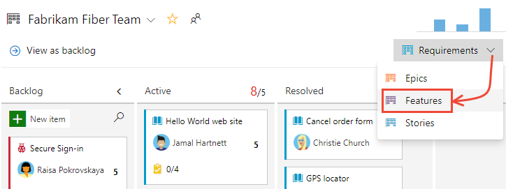  

* * *

## Add work items to your board

Work items you add to your board are automatically assigned the default **Area Path** and **Iteration Path** assigned to the team. To learn more, see [Configure team settings](../../organizations/settings/manage-teams.md). 

#### [Agile process](#tab/agile-process) 

1. From the Stories board, choose **New item** and start adding those stories you want to track. 

	> [!div class="mx-imgBorder"]  
	>  

1. Enter return and the system assigns a work item ID to the user story. 

	> [!div class="mx-imgBorder"]  
	>  

2. To track the work you want to manage, add as many user stories that you need.  

#### [Basic process](#tab/basic-process) 

1. From the Issues board, choose **New item** and start adding those issues you want to track. 

	> [!div class="mx-imgBorder"]  
	>  

2. Enter return and the system assigns a work item ID to the issue. 

	> [!div class="mx-imgBorder"]  
	>  

3. To track the work you want to manage, add as many issues that you need.  

#### [Scrum process](#tab/scrum-process) 

1. From the Backlog items board, choose **New item** and start adding those stories you want to track. 

	> [!div class="mx-imgBorder"]  
	>  

1. Enter return and the system assigns a work item ID to the user story. 

	> [!div class="mx-imgBorder"]  
	>  

2. To track the work you want to manage, add as many backlog items that you need.  

#### [CMMI process](#tab/cmmi-process) 

1. From the Requirements board, choose **New item** and start adding those stories you want to track. 

	> [!div class="mx-imgBorder"]  
	>  

1. Enter return and the system assigns a work item ID to the user story. 

	> [!div class="mx-imgBorder"]  
	>  

2. To track the work you want to manage, add as many requirements that you need.  

* * *

## Add details to a board item

Choose the issue or user story title to open it. Change one or more field values, add a description, or make a note in the **Discussion** section. You can also choose the  **Attachments** tab and drag-and-drop a file to share the file with others.  

#### [Agile process](#tab/agile-process) 

For example, here we assign the story to Raisa Pokrovskaya and we add a discussion note, at-mentioning Raisa. 

> [!div class="mx-imgBorder"]
> 

 Choose **Save & Close** when done. 

#### [Basic process](#tab/basic-process) 

For example, here we assign the issue to Raisa Pokrovskaya and we add a discussion note, at-mentioning Raisa. 

> [!div class="mx-imgBorder"]
> 

Choose **Save & Close** when done. 

#### [Scrum process](#tab/scrum-process) 

For example, here we assign the product backlog item to Christie Church and set an Effort level of 8. 

> [!div class="mx-imgBorder"]  
> 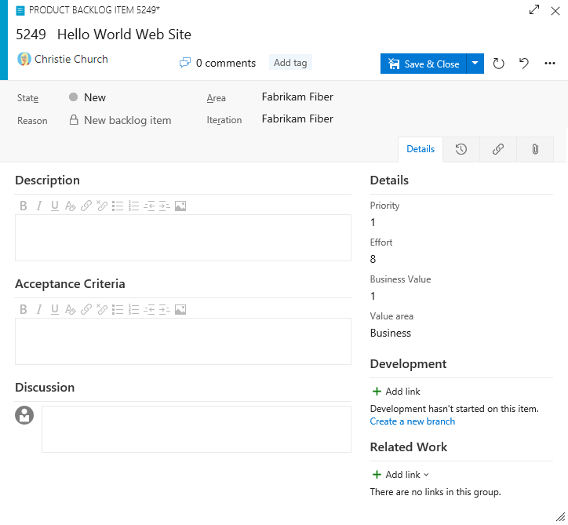 

Choose **Save & Close** when done. 

#### [CMMI process](#tab/cmmi-process) 

For example, here we assign the product backlog item to Jamal Hartnett and set Size to 8. 

> [!div class="mx-imgBorder"]  
> 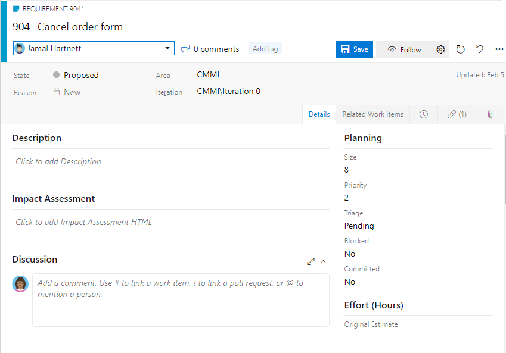 

Choose **Save & Close** when done.  

#### CMMI-specific field descriptions

[!INCLUDE [temp](../includes/section-cmmi-field-descriptions.md)] 

* * *

### Field descriptions

[!INCLUDE [temp](../includes/section-basic-field-descriptions.md)] 

## Update work status

The State field tracks the status of a work item. With the Kanban board, you can quickly update the status of backlog items by dragging and dropping them to a different column. This feature requires that you have Basic access or higher.  

#### [Agile process](#tab/agile-process) 

As work starts, drag the user story card from the **Backlog** column to the **Active** column. Once work is ready for review, move to the **Resolved** column. After it's reviewed and accepted, move to the **Closed** column. 

> [!div class="mx-imgBorder"]  
>  

You can add or rename columns as needed, see [Customize your board](customize-boards.md).

#### [Basic process](#tab/basic-process) 

As work starts, drag the issue from the **To Do** column to the **Doing** column. Once completed, move to the **Done** column. 

> [!div class="mx-imgBorder"]  
>  

You can add or rename columns as needed, see [Customize your board](customize-boards.md).

#### [Scrum process](#tab/scrum-process) 

Once a backlog item is approved to start work, drag the backlog item card from the **New** column to the **Approved** column.  When work actually starts, drag the card to the **Committed** column. Once work has completed, move to the **Done** column. 

> [!div class="mx-imgBorder"]  
> 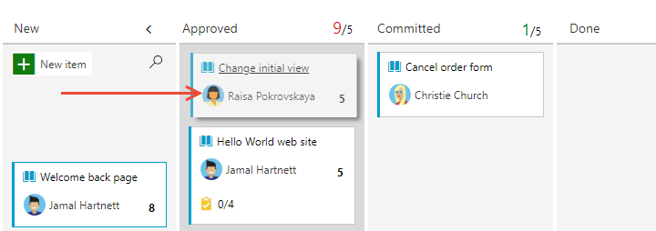 

#### [CMMI process](#tab/cmmi-process) 

As work starts, drag the requirement card from the **Backlog** column to the **Active** column. Once work is ready for review, move to the **Resolved** column. After it's reviewed and accepted, move to the **Closed** column. 

> [!div class="mx-imgBorder"]  
> 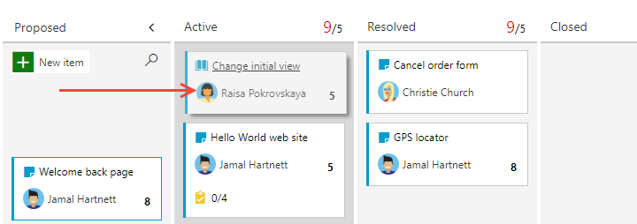 

* * *

> [!TIP]  
> You can add or rename columns as needed, see [Customize your board](customize-boards.md). 

## Add tasks 

Task checklists provide a quick and easy way to track elements of work that are important to support completing a backlog item. Also, you can assign individual tasks to different team members. 

> [!TIP]   
> Tasks that you create from the Kanban board are automatically assigned the **Area Path** and **Iteration Path** of their parent work item. 

Tasks that you create from the Kanban board show up on your sprint taskboard. Also, tasks that you create from the [sprint backlog](../sprints/assign-work-sprint.md) or [taskboard](../sprints/task-board.md) show up within tasks checklists on the Kanban board.  

#### [Agile process](#tab/agile-process) 

1. To start adding tasks, choose the  :::image type="icon" source="../../media/icons/actions-icon.png" border="false":::  actions icon for the story and select the   **Add Task** option.  

	> [!div class="mx-imgBorder"]  
	>  

	Enter a title for the task and type Enter when done.

	> [!div class="mx-imgBorder"]  
	>  

1. If you have many tasks to add, keep typing your task titles and type Enter.   

	> [!div class="mx-imgBorder"]  
	>   

2. You can mark a task as done, expand or collapse the task checklist, or reorder and reparent tasks. 

	> [!div class="mx-tdCol2BreakAll"]  
	> |Mark a task as done |Reorder and reparent tasks | Expand or collapse the checklist| 
	> |------------------|--------------|--------------|  
	> |To mark a task as complete, check the task checkbox. The task State changes to **Done**.  |To reorder a task, drag it within the checklist. To reparent a the task, drag it to another issue on the board.   |To expand or collapse a task checklist, simply choose the task annotation.  |  

#### [Basic process](#tab/basic-process) 

1. To start adding tasks, choose the  :::image type="icon" source="../../media/icons/actions-icon.png" border="false":::  actions icon for the issue and select the   **Add Task** option.  

	> [!div class="mx-imgBorder"]  
	> 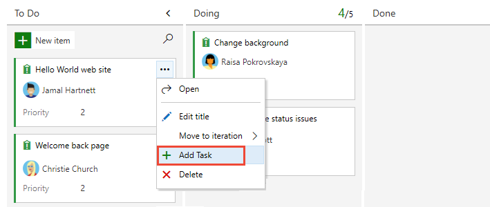 

	Enter a title for the task and type Enter when done.

	> [!div class="mx-imgBorder"]  
	>  

1. If you have various tasks to add, keep typing your task titles and type Enter.   

	> [!div class="mx-imgBorder"]  
	> 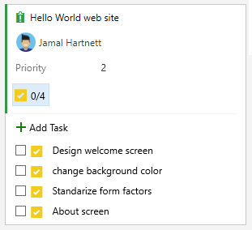  

2. You can mark a task as done, expand or collapse the task checklist, or reorder and reparent tasks. 

	> [!div class="mx-tdCol2BreakAll"]  
	> |Mark a task as done |Reorder and reparent tasks | Expand or collapse the checklist| 
	> |------------------|--------------|--------------|  
	> |To mark a task as complete, check the task checkbox. The task State changes to **Done**.  |To reorder a task, drag it within the checklist. To reparent a the task, drag it to another issue on the board.   |To expand or collapse a task checklist, simply choose the task annotation.  |  

#### [Scrum process](#tab/scrum-process) 

1. To start adding tasks, choose the  :::image type="icon" source="../../media/icons/actions-icon.png" border="false":::  actions icon for the story and select the   **Add Task** option.  

	> [!div class="mx-imgBorder"]  
	>  

	Enter a title for the task and type Enter when done.

	> [!div class="mx-imgBorder"]  
	>  

1. If you have many tasks to add, just keep typing your task titles and type Enter.   

	> [!div class="mx-imgBorder"]  
	>   

2. You can mark a task as done, expand or collapse the task checklist, or reorder and reparent tasks. 

	> [!div class="mx-tdCol2BreakAll"]  
	> |Mark a task as done |Reorder and reparent tasks | Expand or collapse the checklist| 
	> |------------------|--------------|--------------|  
	> |To mark a task as complete, check the task checkbox. The task State changes to **Done**.  |To reorder a task, drag it within the checklist. To reparent a the task, drag it to another issue on the board.   |To expand or collapse a task checklist, simply choose the task annotation.  |  

#### [CMMI process](#tab/cmmi-process) 

1. To start adding tasks, choose the  :::image type="icon" source="../../media/icons/actions-icon.png" border="false":::  actions icon for the story and select the   **Add Task** option.  

	> [!div class="mx-imgBorder"]  
	>  

	Enter a title for the task and type Enter when done.

	> [!div class="mx-imgBorder"]  
	>  

1. If you have various tasks to add, just keep typing your task titles and type Enter.   

	> [!div class="mx-imgBorder"]  
	>   

2. You can mark a task as done, expand or collapse the task checklist, or reorder and reparent tasks. 

	> [!div class="mx-tdCol2BreakAll"]  
	> |Mark a task as done |Reorder and reparent tasks | Expand or collapse the checklist| 
	> |------------------|--------------|--------------|  
	> |To mark a task as complete, check the task checkbox. The task State changes to **Done**.  |To reorder a task, drag it within the checklist. To reparent a the task, drag it to another issue on the board.   |To expand or collapse a task checklist, simply choose the task annotation.  |  

* * *

## Add details to a task

If you have details you want to add about a task, choose the title, to open it. Change one or more field values, add a description, or make a note in the **Discussion** section. Choose **Save & Close** when done. 

#### [Agile process](#tab/agile-process) 

Here we assign the task to Christie Church.   

> [!div class="mx-imgBorder"]  
>   

#### [Basic process](#tab/basic-process) 

Here we assign the task to Jamal.   

> [!div class="mx-imgBorder"]  
> 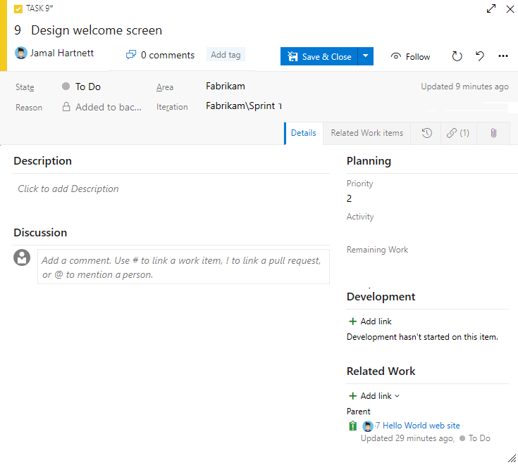  

#### [Scrum process](#tab/scrum-process) 

Here we assign the task to Jamal.  

> [!div class="mx-imgBorder"]  
> 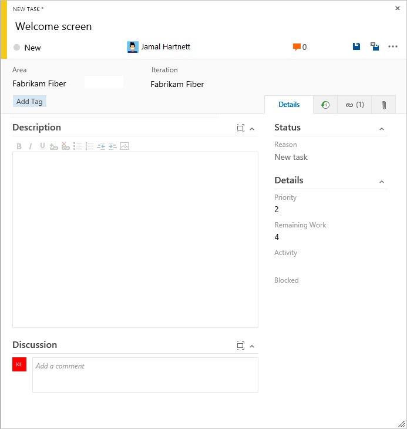  

#### [CMMI process](#tab/cmmi-process) 

Here we assign the task to Jamal.   

> [!div class="mx-imgBorder"]  
> 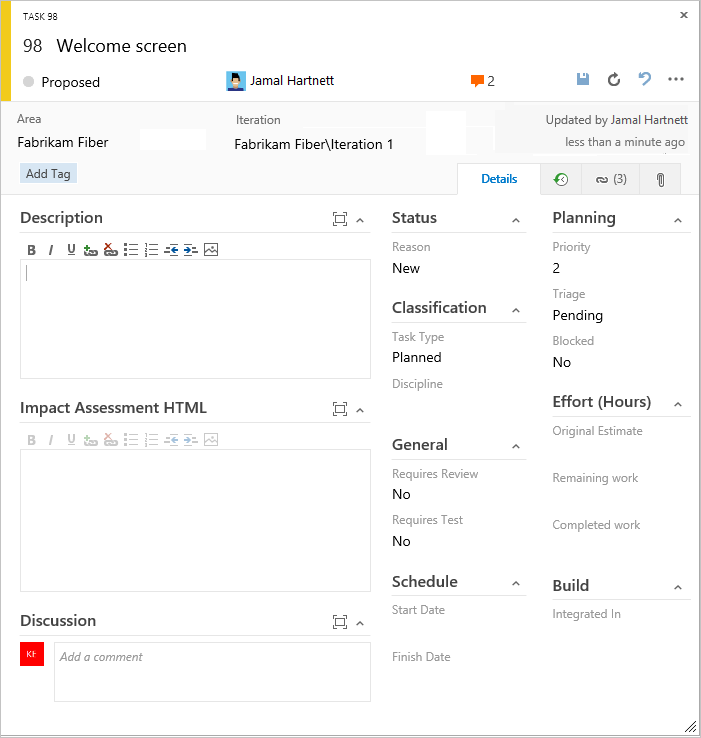  

* * *

### Field descriptions

In addition to the fields you can define for a backlog item&mdash;user story, issue, product backlog item, or requirement&mdash;you can specify the following fields for a task to support capacity and time tracking. 

> [!NOTE]   
> There are no inherent time units associated with this field even though the taskboard always shows "h" for hours in relationship to Remaining Work. You can specify work in any unit of measurement your team chooses. 

:::row:::
   :::column span="":::
      **Field**
   :::column-end:::
   :::column span="3":::
      **Usage**
   :::column-end:::
:::row-end:::
---
:::row:::
   :::column span="":::
      [Activity](../queries/query-numeric.md) 
   :::column-end:::
   :::column span="3":::
      The type of activity that's required to do a task.To learn more about how this field is used, see [Capacity planning](../sprints/set-capacity.md). Allowed values are:  
      - **Deployment**
      - **Design**
      - **Development**
      - **Documentation**
      - **Requirements**
      - **Testing**
   :::column-end:::
:::row-end:::
:::row:::
   :::column span="":::
      [Discipline](../queries/query-numeric.md) (CMMI process)
   :::column-end:::
   :::column span="3":::
      The type of activity that's required to do a task.To learn more about how this field is used, see [Capacity planning](../sprints/set-capacity.md). Allowed values are:  
      - **Analysis**
      - **Development**
      - **Test**
      - **User Education**
      - **User Experience**
   :::column-end:::
:::row-end:::
:::row:::
   :::column span="":::
      [Original Estimate](../queries/query-numeric.md)
   :::column-end:::
   :::column span="3":::
      The amount of estimated work required to complete a task. Typically, this field doesn't change after it is assigned. 
   :::column-end:::
:::row-end:::
:::row:::
   :::column span="":::
      [Remaining Work](../queries/query-numeric.md)
   :::column-end:::
   :::column span="3":::
      The amount of work that remains to finish a task. You can specify work in hours or in days. As work progresses, update this field. It's used to calculate [capacity charts](../sprints/set-capacity.md) and the [sprint burndown chart](../../report/dashboards/configure-sprint-burndown.md).   
      If you divide a task into subtasks, specify Remaining Work for the subtasks only. 
   :::column-end:::
:::row-end:::
:::row:::
   :::column span="":::
      [Completed Work](../queries/query-numeric.md)
   :::column-end:::
   :::column span="3":::
      The amount of work spent implementing a task. Enter a value for this field when you complete the task.
   :::column-end:::
:::row-end:::
:::row:::
   :::column span="":::
      [Task Type](../work-items/guidance/cmmi/guidance-requirements-field-reference-cmmi.md) (CMMI only)
   :::column-end:::
   :::column span="3":::
      Select the kind of task to implement from the allowed values:

      - **Corrective Action**
      - **Mitigation Action**
      - **Planned**
   :::column-end:::
:::row-end:::

[!INCLUDE [temp](../includes/discussion-tip.md)]

## Next step  
 
> [!div class="nextstepaction"]
> [Customize your board](customize-boards.md)

## Related articles

- [Azure Boards FAQs](../faqs.yml) 
- [Index to field descriptions](../work-items/guidance/basic-field-reference.md?toc=/azure/devops/boards/get-started/toc.json)  
- [Add tags to issues or tasks](../queries/add-tags-to-work-items.md)   

