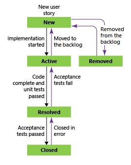
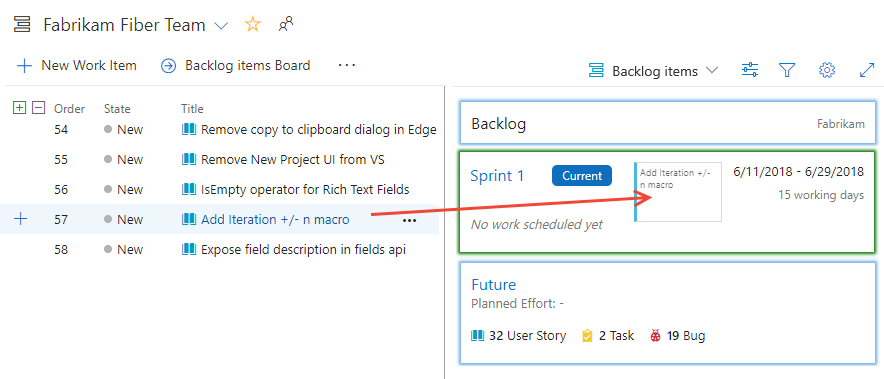
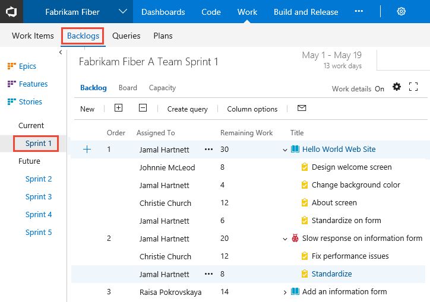

# What is Azure Boards?

[!INCLUDE [temp](../_shared/version-vsts-tfs-all-versions.md)]

With Azure Boards, you can quickly and easily start tracking user stories, backlog items, task, features, and bugs associated with your project. You do this by adding one of three work item types&mdash;user stories, bugs, features, epics, and tasks&mdash;that the Agile process provides. As works progresses from not started to completed, you update the State workflow field from **New**, **Active**, **Resolved**, and **Closed**.

> [!div class="mx-tdCol2BreakAll"]
> |Work item types| Workflow |
> |------|---------|
> | |  

When you add a user story, bug, task, or feature, you create a work item. Each work item represents an object stored in the work item data store. Each work item is assigned a unique identifier (ID) within your projects. 

> [!NOTE]  
> Your first project corresponds to the Agile process unless Scrum or CMMI were selected. If you want a project that uses the Scrum or CMMI process, then you can [add another project](../../organizations/projects/create-project.md) and specify the process through advanced setting options. See [Choose a process for a comparison of processes](../work-items/guidance/choose-process.md).

Add epics to track significant business initiatives, add features to track specific applications or set of work. Define user stories to track work that you'll assign to specific team members, and bugs to track code defects. Lastly, use tasks to track even smaller amounts of work for which you want to track time either in hours or days. 

> [!IMPORTANT]  
> **Select the version that meets your location and process**:
> We are experimenting with a new acquisition model which is 
> currently available for users located in the United States and that sign up through [azure.com/boards](https://azure.microsoft.com/en-us/services/devops/boards/?nav=min). This model supports a new Basic process.  
> For International users and others who sign up through another method, the Agile process is used. Select your version of this article based on your location and process used.
> - [**Basic process**](what-is-azure-boards-basic-process.md?toc=/azure/devops/boards/get-started/toc.json&bc=/azure/devops/boards/get-started/breadcrumb/toc.json)  
> - [**Agile process**](what-is-azure-boards.md?toc=/azure/devops/boards/get-started-agile/toc.json&bc=/azure/devops/boards/get-started-agile/breadcrumb/toc.json)  

## Track work, implement Kanban

- Quickly add and update the status of work you track from **New**, **Active**, **Resolved**, and **Closed** using the Kanban board. Add tasks as child items to user stories. Learn more: [Track user stories, features, and tasks](plan-track-work.md).  
- Assign work to team members, tag with labels to support queries and filtering, or share information through descriptions, attachments, or links to network shared content.  
- Prioritize work through drag-and-drop on your team backlog. Learn more: [Create your backlog](../backlogs/create-your-backlog.md).  

**Update the status of issues**  
> [!div class="mx-imgBorder"]  
>   

**Prioritize your backlog of issues**  
> [!div class="mx-imgBorder"]  
>   

## Collaborate 
- Collaborate with others through the **Discussion** section of the work item form, using **@mention**s and **#ID** controls to quickly include others in the conversation or link to other work items. Learn more: [Discussion section](plan-track-work.md#discussion).  
- Create dashboards that track status and trends of work being accomplished. Learn more: [Add and manage dashboards](../../report/dashboards/dashboards.md).  
- Set notifications to get alerted when an issue is created or changed. Learn more: [Set personal notifications](../../notifications/howto-manage-personal-notifications.md).  
- Elect to follow specific issues to get alerted when they are updated. Learn more: [Follow a work item](../work-items/follow-work-items.md).  

**Get updated when a work item is updated**   
> [!div class="mx-imgBorder"]  
>   

## Work in sprints, implement Scrum   

- Plan sprints by assigning work to current or future sprints. Learn more: [Assign work to sprints](../sprints/assign-work-sprint.md).   
- Forecast work that can get completed based on effort estimates: Learn more: [Forecast work](../sprints/forecast.md).  
- Determine how much work can be done within a sprint.  Learn more: [Set team capacity](../sprints/set-capacity.md).  
- Bulk assign issues and tasks to team members and sprints. Learn more: [Bulk modify work items](../backlogs/bulk-modify-work-items.md).  

**Assign backlog items to a sprint**   
> [!div class="mx-imgBorder"]  
>   

## Work effectively 

- Organize work into a hierarchy by grouping issues under epics, and tasks under issues. Learn more: [Organize your backlog](../backlogs/organize-backlog.md).    
- Create queries and quickly triage issues and tasks. Learn more: [View and run queries](../queries/view-run-query.md) and [Triage work](../queries/triage-work-items.md).   
- Create work item templates to help contributors quickly add and define open meaningful issues and tasks. Learn more: [Use work item templates](../backlogs/work-item-template.md).  
- Quickly find work items assigned to you or pivot or filter work items based on other criteria, such as work items that you follow, that you're mentioned in, or that you viewed or updated. Learn more: [View and add work items](../work-items/view-add-work-items.md).  

**Group items to create a hierarchy**  
> [!div class="mx-imgBorder"]   
>  

## Connect with GitHub 

If you use Azure Boards connected with GitHub, you can also do the following:   
- From GitHub, use #AB to link GitHub commits and pull requests to your issues and tasks
- From Azure Boards issues and tasks, link to GitHub commits and pull requests.

Learn more: [GitHub & Azure Boards](../github/index.md).  

## Best tool for the job
Azure Boards provides the following main interactive lists and signboards. Each tool provides a filtered set of work items. All tools support viewing and defining work items. To learn more about effective use of these tools, see  [Best tool to add, update, and link work items](../work-items/best-tool-add-update-link-work-items.md).   

- [**Boards**](../boards/kanban-quickstart.md): Boards present work items as cards and support quick status updates through drag-and-drop. The feature is similar to sticky notes on a physical whiteboard. Use to implement Kanban practices and visualize the flow of work for a team. 
- [**Backlogs**](../backlogs/create-your-backlog.md): Backlogs present work items as lists. A product backlog represents your project plan and a repository of all the information you need to track and share with your team. Portfolio backlogs allow you to group and organize your backlog into a hierarchy. Use to plan, prioritize, and organize work.  
- [**Sprints**](../sprints/assign-work-sprint.md): Sprint backlogs and taskboards provide a filtered view of work items a team assigned to a specific iteration path, or sprint. From your backlog, you can assign work to an iteration path by using drag-and-drop. You can then view that work in a separate *sprint backlog*. Use to implement Scrum practices. 
- [**Queries**](../queries/view-run-query.md): Queries are filtered lists of work items based on criteria that you define by using a query editor. You use queries to support the following tasks:   
	- Find groups of work items with something in common  
	- List work items for the purposes of sharing with others or performing bulk   updatesTriage a set of items to prioritize or assign them  
	- Create status and trend charts that you then can add to dashboards.  
- [**Work items**](../work-items/view-add-work-items.md): Use to quickly find work items assigned to you or pivot or filter work items based on other criteria, such as work items that you follow, that you're mentioned in, or that you viewed or updated.

<a id="scale" />
## Teams and Backlogs, Boards, and Sprints 

A team refers to a group of project members who work in a particular product area. Those areas are represented as *area paths*. Area paths are hierarchical paths that denote the possible areas of ownership in an organization. A team is defined by a name, its members, and its area paths.

Boards, Backlogs, Sprints rely on team configurations. For example, if you want to add a Kanban board or product backlog, you define a team. For more information on teams, see [About teams and Agile tools](../../organizations/settings/about-teams-and-settings.md).  

## Install and manage extensions 

An extension is an installable unit that adds new capabilities to your projects. You can find extensions in the [Visual Studio Marketplace](https://marketplace.visualstudio.com/azuredevops), Azure DevOps tab to support planning and tracking of work items, sprints, scrums, and more and collaboration among team members.  

<!---
## Interactive Agile tools
Azure Boards provides a suite of interactive Agile tools that you can use to plan and track work, bugs, and issues. Azure Boards is available from Azure DevOps Services and Team Foundation Server (TFS).

Agile is a term that was coined in 2001 in the [Agile Manifesto](http://agilemanifesto.org). Agile approaches to software development emphasize incremental delivery, team collaboration, and continual planning and learning. The Agile tools that Azure Boards provides are designed to support teams that work with Agile methodologies, such as Kanban and Scrum. To learn more, see [What is Agile?](/azure/devops/learn/agile/what-is-agile).

All tools support viewing and defining work items. Each work item represents an object stored in the work item data store. Each work item is assigned a unique identifier. The IDs are unique within an account or project collection. 

Your Agile tool set, available from Azure Boards, consists of the following main interactive lists and signboards. Each of these pages provides a filtered set of work items. 

[!INCLUDE [temp](../../_shared/new-navigation-azd.md)] 

[!INCLUDE [temp](../_shared/page-work-item-tasks.md)] 

<a id="scale" />
## Teams and Agile tools
A team refers to a group of project members who work in a particular product area. Those areas are represented as *area paths*. Area paths are hierarchical paths that denote the possible areas of ownership in an organization. A team is defined by a name, its members, and its area paths.

The Agile tools Boards, Backlogs, Sprints, and Plans rely on team configurations. For example, if you want to add a Kanban board or product backlog, you define a team. For more information on teams, see [About teams and Agile tools](../../organizations/settings/about-teams-and-settings.md). 

::: moniker range="azdevops"   
Your view and options available differ somewhat depending on whether you [enabled the New Navigation feature](../../project/navigation/preview-features.md). This feature displays a vertical navigation interface along with several changes to navigation of Agile tools. 
::: moniker-end  

## Work items and work item types

Open **Work Items** to access several personalized pivots and filter functions to focus on work items you care about. You can quickly find work items assigned to you. You also can find work items that you're following or viewed or modified recently. You can even find work items defined for different teams and projects. To learn more, see [View and add work items](../work-items/view-add-work-items.md). 

# [New navigation](#tab/new-nav)
::: moniker range=">= azdevserver-2019"
> [!div class="mx-imgBorder"]  
> 
::: moniker-end

::: moniker range="<= tfs-2018"
[!INCLUDE [temp](../../_shared/new-navigation-not-supported.md)] 
::: moniker-end

# [Previous navigation](#tab/previous-nav)

::: moniker range="azdevops"   
> [!div class="mx-imgBorder"]
> 
::: moniker-end

::: moniker range="<= tfs-2018"

The **Work Items** page isn't available for TFS 2018 and earlier versions.  
::: moniker-end   

::: moniker range="azdevserver-2019"
[!INCLUDE [temp](../../_shared/previous-navigation-not-supported-azd.md)] 
::: moniker-end

---
 

## Boards 

Boards present work items as cards and support quick status updates through a drag-and-drop feature. The feature is similar to sticky notes on a physical whiteboard. Each board supports many Kanban practices. You can define columns and swim lanes, set Work-in-Progress (WIP) limits, define the Definition of Done, and more. To get started, see [Kanban quickstart](../boards/kanban-quickstart.md). 

# [New navigation](#tab/new-nav)
::: moniker range=">= azdevserver-2019"
   

::: moniker-end

::: moniker range="<= tfs-2018"
[!INCLUDE [temp](../../_shared/new-navigation-not-supported.md)] 
::: moniker-end 

# [Previous navigation](#tab/previous-nav)

::: moniker range=">= tfs-2017 <= tfs-2018 || azdevops" 
     
::: moniker-end   
::: moniker range=">= tfs-2013 <= tfs-2015"    
> [!div class="mx-imgBorder"]  
>        
::: moniker-end   

::: moniker range="azdevserver-2019"
[!INCLUDE [temp](../../_shared/previous-navigation-not-supported-azd.md)] 
::: moniker-end

---

## Backlogs

Backlogs present work items as lists. A product backlog represents your project plan, the roadmap for what your team plans to deliver. Your backlog also provides a repository of all the information you need to track and share with your team. Portfolio backlogs allow you to group and organize your backlog into a hierarchy. To get started, see [Create your backlog](../backlogs/create-your-backlog.md). 

# [New navigation](#tab/new-nav)
::: moniker range=">= azdevserver-2019"
    
::: moniker-end

::: moniker range="<= tfs-2018 || azdevops"
[!INCLUDE [temp](../../_shared/new-navigation-not-supported.md)] 
::: moniker-end 

# [Previous navigation](#tab/previous-nav)

::: moniker range=">= tfs-2017 <= tfs-2018 || azdevops"

::: moniker-end
::: moniker range="<= tfs-2015"

::: moniker-end

::: moniker range="azdevserver-2019"
[!INCLUDE [temp](../../_shared/previous-navigation-not-supported-azd.md)] 
::: moniker-end

---

## Sprints

Sprint backlogs and taskboards provide a filtered view of work items a team assigned to a specific iteration path, or sprint. Sprints are defined for a project and then selected by teams. From your backlog, you can map work to an iteration path by using the drag-and-drop feature. You then can view that work in a separate *sprint backlog*. 

# [New navigation](#tab/new-nav)
::: moniker range=">= azdevserver-2019"
    
::: moniker-end

::: moniker range="<= tfs-2018"
[!INCLUDE [temp](../../_shared/new-navigation-not-supported.md)] 
::: moniker-end 

# [Previous navigation](#tab/previous-nav)

::: moniker range=">= tfs-2017 <= tfs-2018 || azdevops"

::: moniker-end
::: moniker range=">= tfs-2013 <= tfs-2015"

::: moniker-end

::: moniker range="azdevserver-2019"
[!INCLUDE [temp](../../_shared/previous-navigation-not-supported-azd.md)] 
::: moniker-end

---

You also can filter the cards on your taskboard to show only those cards mapped to a given sprint. We recommend that an entire organization share the same sprint interval to align multiple teams in a single org to the same rhythm. A common sprint rhythm is sometimes referred to as the "heartbeat" of an org. 

## Queries

Queries are filtered lists of work items based on criteria that you define by using a query editor. You use queries to find groups of work items with something in common. You can use queries to triage a set of items to prioritize or assign them. You also use queries to create status and trend charts that you then can add to dashboards. To get started, see [Create a managed query](../queries/using-queries.md). 

> [!div class="mx-imgBorder"]  
>    

## Delivery plans

Delivery plans display work items as cards along a timeline or calendar view. This format can be an effective communication tool with managers, partners, and stakeholders for a team. It also can be used for several teams that collaborate on specific features or requirements.

::: moniker range="azdevops"

## GitHub integration 

By integrating Azure Boards with GitHub repositories, you support linking between GitHub commits and pull requests to work items. You can use GitHub for software development while using Azure Boards to plan and track your work.  

To learn more, see [Integrate GitHub with Azure Boards](../../boards/github/index.md).

::: moniker-end

-->