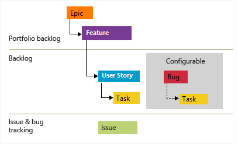
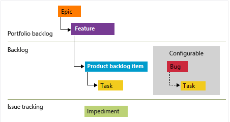

# What is Azure Boards?

[!INCLUDE [temp](../includes/version-vsts-plus-azdevserver-2019.md)]

Azure Boards provides software development teams with the interactive and customizable tools they need to manage their software projects. It provides a rich set of capabilities including native support for Agile, Scrum, and Kanban processes, calendar views, configurable dashboards, and integrated reporting. These tools scale as your business grows. 
  
Quickly and easily track user stories, backlog items, task, features, and bugs associated with your project. Track work by adding work items based on the process and work item types available to your project. An example of one of the Azure Boards tools is the Kanban board as shown in the following image. 

:::image type="content" source="media/about-boards/intro-boards.png" alt-text="Screenshot of Azure Boards Hub Pages, Kanban Board":::

> [!NOTE]  
> This article applies to Azure DevOps Services and Azure DevOps Server 2019 and later versions. Most of the information is valid for earlier on-premises versions. However, images show only examples for the latest version.  
 
## Track user stories, bugs, features, and epics  

Track various types of work using the default work item types&mdash;such as user stories, bugs, features, and epics. Or, customize these types or create your own. Each work item form provides a standard set of system fields and controls, including **Discussion** for adding and tracking comments, **History**, **Links**, and **Attachments**. The **Deployment**, **Development**, and **Related Work** controls facilitate tracking when code is released or changed, and relationships between work items. 

:::image type="content" source="media/about-boards/work-item-form.png" alt-text="Screenshot of Azure Boards Work Item Form, User Story":::

## Interactive backlogs, boards, lists, and calendar views  

Azure Boards provides several hubs, each providing a set of interactive tools. Each tool provides a filtered set of work items, filtered based on a team, logged in user, or custom filters. Most tools support adding and updating work items. To learn more about effective use of these tools, see [Best tool to add, update, and link work items](../work-items/best-tool-add-update-link-work-items.md).   

### Work Items provide personalized filtered lists

Use the [**Work items**](../work-items/view-add-work-items.md) hub to quickly find work items that are assigned to you. Pivot or filter work items based on other criteria. Other criteria includes work items that you follow, that you're mentioned in, or that you viewed or updated.

:::image type="content" source="../work-items/media/view-add/work-items-hub-new.png" alt-text="Screenshot of Azure Boards, Work Items"::: 

### Kanban boards for adding and updating product and portfolio items
 

Use the [**Boards**](../boards/kanban-quickstart.md) hub to view work items as cards and perform quick status updates through drag-and-drop. The feature is similar to sticky notes on a physical whiteboard. Use to implement Kanban practices and visualize the flow of work for a team.

:::image type="content" source="media/about-boards/kanban-board.png" alt-text="Screenshot of Azure Boards, Kanban Board"::: 

### Product and portfolio backlogs facilitate organizing and assigning work 

Use the [**Backlogs**](../backlogs/create-your-backlog.md) hub to view, plan, prioritize, and organize work items.  A product backlog represents your project plan and a repository of all the information you need to track and share with your team. Portfolio backlogs allow you to group and organize your backlog into a hierarchy. 

:::image type="content" source="media/about-boards/product-backlog.png" alt-text="Screenshot of Azure Boards, Product Backlog":::   

### Sprints support Scrum processes with a sprint backlog and taskboard

Open the [**Sprints**](../sprints/assign-work-sprint.md) hub to access a team's filtered view of work items based on a specific iteration path, or sprint. From your backlog, you can assign work to an iteration path by using drag-and-drop. You can then view that work in a separate *sprint backlog*. Use to implement Scrum practices.

:::image type="content" source="media/about-boards/taskboard.png" alt-text="Screenshot of Azure Boards, Task Board":::   

### Queries provide custom filtered work item lists and charts 

Access the [**Queries**](../queries/view-run-query.md) hub to define filter critera using a query editor. Queries support the following tasks:
- Find groups of work items with something in common.  
- List work items for the purposes of sharing with others or doing bulk updates.  
- Triage a set of items to organize or assign.  
- Create status and trend charts that you then can add to dashboards.  

#### Backlog hierarchy 

:::image type="content" source="media/about-boards/queries.png" alt-text="Screenshot of Azure Boards, Queries":::   
 
#### Query charts

:::image type="content" source="../../report/dashboards/media/charts/config-pie-chart-priority-qe.png" alt-text="Screenshot of Configure Chart, Flat list query":::    
 
### Delivery plans show calendar views and dependencies

With the [**Delivery Plans**](../plans/review-team-plans.md) hub, management teams can view deliverables across several teams in a calendar view. Several teams can review and discuss their dependencies and deliverables.  

:::image type="content" source="../plans/media/plans/intro-image.png" alt-text="Screenshot of Azure Boards, Delivery Plans":::   
 

## Support for Agile, Scrum, and Kanban processes  

Azure Boards is designed to support the following software development processes through the default process models selected for a project:  
 

:::row:::
   :::column span="2":::
   [**Basic**](../get-started/plan-track-work.md) provides the simplest model that tracks work through Issues, Tasks, and Epics. 
   :::column-end:::
   :::column span="2":::
   
   :::column-end:::
:::row-end:::
:::row:::
   :::column span="2":::
   [**Agile**](../work-items/guidance/agile-process.md) supports Agile planning methods (learn more about Agile methodologies at the
   [Agile Alliance](https://www.agilealliance.org/)), including Scrum,
   and tracks development and test activities separately. This process works great if you want to track user stories and
   (optionally) bugs on the Kanban board, or track bugs and tasks on the taskboard.  
   :::column-end:::
   :::column span="2":::
   
   :::column-end:::
:::row-end:::
:::row:::
   :::column span="2":::
   [**Scrum**](../work-items/guidance/scrum-process.md) tracks work using product backlog items (PBIs) and
   bugs on the Kanban board, or break down PBIs and bugs into tasks on the taskboard.
   
   This process supports the Scrum methodology as defined by the [Scrum organization](https://www.scrum.org/)
   :::column-end:::
   :::column span="2":::
   
   :::column-end:::
:::row-end:::
:::row::: 
   :::column span="2":::
   [**Capability Maturity Model Integration** (CMMI)](../work-items/guidance/cmmi-process.md) supports a framework for process improvement and an auditable record of decisions. With this process, you can track requirements, change requests, risks, and reviews.
   This process supports [formal change management activities](../work-items/guidance/cmmi/guidance-background-to-cmmi.md?viewFallbackFrom=vsts). 
   :::column-end:::
   :::column span="2":::
   
   :::column-end:::
  :::row-end:::
 

## Configurable dashboards and Power BI reports 

With dashboards, teams can create customized views to gain visibility into their status, view progress, and analyze trends. Dashboards provide flexibility to share information and improve workflow processes. Each team can tailor their dashboards to share information and monitor their progress. 

:::image type="content" source="media/about-boards/dashboard.png" alt-text="Screenshot of Azure Boards, Dashboards":::   

In addition, you can use Power BI to create custom, complex reports based on custom queries of the Analytics service. The Analytics service is the reporting platform for Azure DevOps. It is optimized for fast read-access and server-based aggregations. Use it to answer quantitative questions about the past or present state of your projects.

To learn more, see [About dashboards, charts, reports, & widgets](../../report/dashboards/overview.md) and [What is the Analytics service?](../../report/powerbi/what-is-analytics.md).

::: moniker range=">= azure-devops-2019"

## Use GitHub, track work in Azure Boards 

By connecting Azure Boards with GitHub repositories, you enable linking between GitHub commits, pull requests, and issues to work items. You can use GitHub for software development while using Azure Boards to plan and track your work. Azure Boards provides the scalability to grow as your organization and business needs grow.

From your Kanban board, you can see and quickly open linked GitHub commits, pull requests, or issues for more detail.  

:::image type="content" source="../github/media/link/board-view-github-links.png" alt-text="Screenshot of Azure Boards, Kanban board with GitHub annotations":::   
  
To learn more, see [GitHub & Azure Boards](../github/index.md).  

::: moniker-end

<a id="scale" />

## Support independent, autonomous teams 

A team refers to a group of project members who work in a particular product area. Those areas are represented as *area paths*. Area paths are hierarchical paths that denote the possible areas of ownership in an organization. A team is defined by a name, its members, and its area paths.

Boards, Backlogs, Sprints rely on team configurations. For example, if you want to add a Kanban board or product backlog, you define a team. For more information on teams, see [About teams and Agile tools](../../organizations/settings/about-teams-and-settings.md).  

## Manage work across projects

Most work is tracked within a project. However, many enterprises create several projects to support their business needs as described in [Plan your organizational structure](../..//user-guide/plan-your-azure-devops-org-structure.md?toc=/azure/devops/boards/toc.json&bc=/azure/devops/boards/breadcrumb/toc.json). 

To track work across several projects, you can: 
- [Create work item queries that list work items across projects](../queries/using-queries.md#across-projects)
- [Gain visibility across teams](../plans/visibility-across-teams.md)

## End-to-end traceability

With Azure Boards you gain the advantage of full integration with the Azure DevOps platform. Azure DevOps is designed to provide end-to-end traceability, tracking work from requirements to deployment. You gain insight at each step of decisions made and the software deployed. Some of the traceability tasks supported include: 
 
- Create a branch from a requirement
- Create a pull request of updated branch
- Validate the pull request using a build pipeline
- Create and run inline tests on requirements
- Merge the pull request into the main, default branch
- Deploy changes into production with deployment status to Azure Boards
- Monitor and report on requirements traceability

To learn more about these features, see [End-to-end traceability](../../cross-service/end-to-end-traceability.md) and [Cross-service integration and collaboration overview](../../cross-service/cross-service-overview.md).

## Access even more tools    

Azure Boards works with your favorite tools. Integrate with [Microsoft Teams](../integrations/boards-teams.md) and [Slack](../integrations/boards-slack.md) to enable efficient ChatOps.

Extensions provide support for other tools. An extension is an installable software unit that adds new capabilities to your projects. Find extensions in the [Azure DevOps Marketplace](https://marketplace.visualstudio.com/azuredevops). Extensions can support planning and tracking of work items, sprints, scrums, and more and collaboration among team members.  
 
  

## Related articles

- [The DevOps journey at Microsoft](https://azure.microsoft.com/solutions/devops/devops-at-microsoft/)
- [Agile culture](../plans/agile-culture.md)  
- [Practices that scale](../plans/practices-that-scale.md)  
- [About teams and Agile tools](../../organizations/settings/about-teams-and-settings.md)

<!--- 

### Video: Plan your work with Azure Boards

> [!VIDEO https://channel9.msdn.com/Events/Microsoft-Azure/Azure-DevOps-Launch-2018/A105/player]

-->
