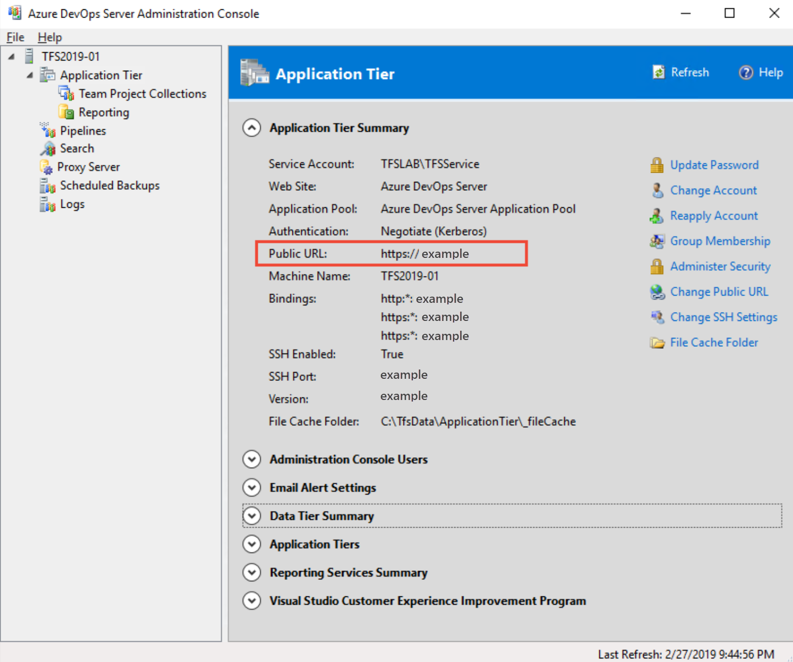
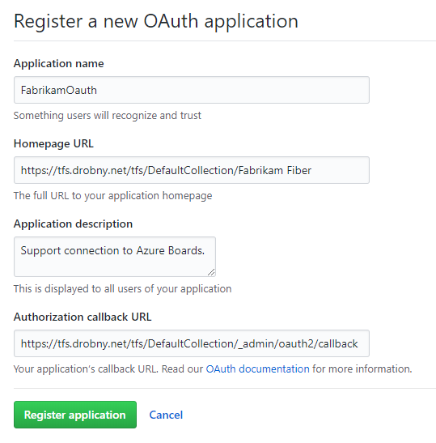
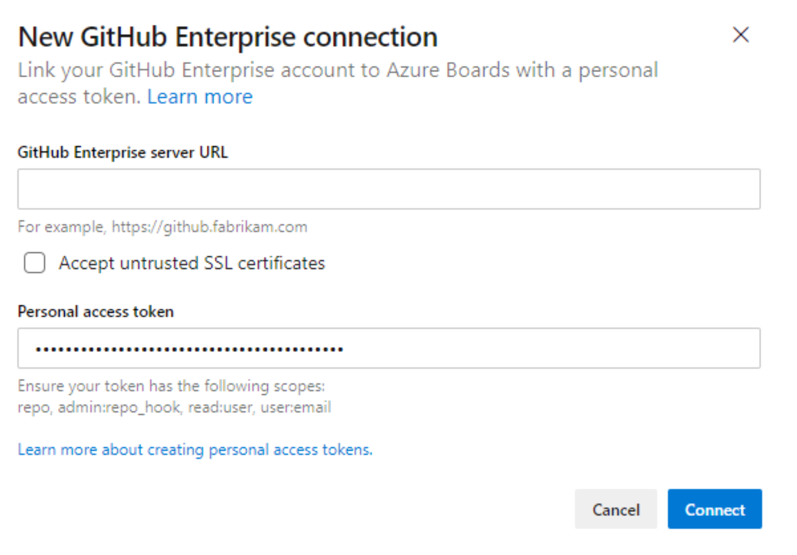
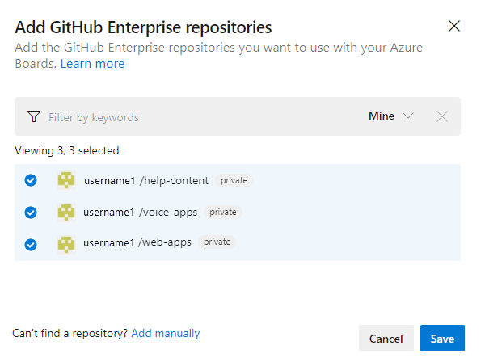
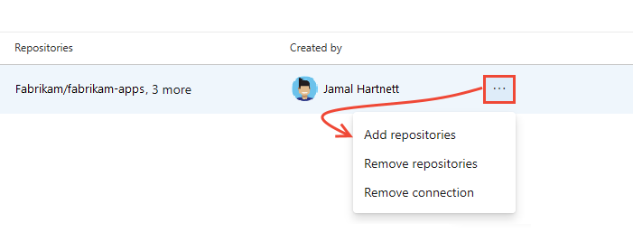

# Connect Azure Boards to GitHub  

**Azure DevOps Server 2020 | Azure DevOps Server 2019**
 

By connecting your Azure DevOps Server project with your GitHub Enterprise Server repositories, you support linking between GitHub commits and pull requests to work items. You can use GitHub Enterprise for software development while using Azure Boards to plan and track your work. 
 
[!INCLUDE[temp](../includes/github-platform-support.md)]

## Prerequisites 
 

* You must connect to an Azure Boards or Azure DevOps project. If you don't have a project yet, [create one](../../organizations/projects/create-project.md). 
* You must be a member of the [Project Administrators group](../../organizations/security/set-project-collection-level-permissions.md) and the project's [Contributors group](../../organizations/security/add-users-team-project.md). If you created the project, then you have permissions. 
* You must be an administrator of the GitHub Enterprise Server you'll be connecting to. 
 

## Authentication options

The following authentication options are supported. 

- [OAuth (Recommended, registration required)](#server-github-ent-oauth-register) 
- [PAT](#server-github-ent-pat)
- [Username plus password](#server-github-ent-username)
 

 

<a id="github-oauth" />

 

<a id="github-pat" />
 

<a id="server-github-ent-oauth-register" />

 

## Register Azure DevOps in GitHub as an OAuth App

If you plan to use OAuth to connect Azure DevOps Server with your GitHub Enterprise Server, you first need to register the application as an OAuth App. For details, see [Creating an OAuth App](https://developer.github.com/apps/building-oauth-apps/creating-an-oauth-app/).

 
<a id="register-services-oauth" />
 

<a id="register-server-oauth" />
 

###  Register Azure DevOps Server 

1. Sign into the web portal for your GitHub Enterprise server.  

	> [!div class="mx-imgBorder"]  
	>   

1. Open <strong>Settings>Developer settings>Oauth Apps</strong> and choose <strong>New OAuth App</strong>. 

	> [!div class="mx-imgBorder"]  
	>   

2. Fill out the form to register your Azure DevOps Server application.  

	For the <strong>Homepage URL</strong>, specify the <strong>Public URL</strong> of your project collection. You can find this URL by [opening the Azure DevOps Administration Console](/azure/devops/server/admin/open-admin-console) and viewing the <strong>Application Tier</strong> node. 

	> [!div class="mx-imgBorder"]  
	>   

	For the <strong>Authorization callback URL</strong>, use the following pattern to construct the URL. 

	`{Azure DevOps Server Public Url}/{Collection Name}/_admin/oauth2/callback`

	For example: 

	`http://contoso/DefaultCollection/_admin/oauth2/callback`

	Or, 

	`https://tfs.contoso.com/MyCollection/_admin/oauth2/callback`

	> [!div class="mx-imgBorder"]  
	>   

3. Choose <strong>Register application</strong>.

4. Upon success, you'll see a page that provides the <strong>Client ID</strong> and <strong>Client Secret</strong> for your registered OAuth application. 

	> [!div class="mx-imgBorder"]  
	>   

  

<a id="register-server-github-ent-oauth" />
 
### Register your OAuth configuration in Azure DevOps Server

1. Sign into the web portal for your Azure DevOps Server. 

1. Add the GitHub Enterprise Oauth configuration to your Azure DevOps Server collection. 

2. Open <strong>Admin settings>Oauth configurations</strong>, and choose <strong>Add Oauth configuration</strong>.  

	> [!div class="mx-imgBorder"]  
	>   

3. Fill in the form that appears, and then choose <strong>Create</strong>.

	> [!div class="mx-imgBorder"]  
	>   
 

<a id="github-ent-oauth-services" />
 

<a id="github-ent-oauth-server" />
 

## Connect Azure DevOps Server to GitHub Enterprise Server

1. Choose the :::image type="icon" source="/azure/devops/media/icons/project-icon.png" border="false"::: Azure DevOps logo to open <strong>Projects</strong>, and then choose the Azure Boards project you want to configure to connect to your GitHub Enterprise repositories.

2. Choose (1) <strong>Project Settings</strong>, choose (2) <strong>GitHub connections</strong> and then (3) <strong>Connect your GitHub Enterprise account</strong>.   

	> [!div class="mx-imgBorder"]  
	>    

	Or, choose a <strong>personal access token</strong> or <strong>username and password</strong>, if you are choosing to make your connection with those credentials.

	To create a PAT, see [Creating a personal access token](https://help.github.com/en/articles/creating-a-personal-access-token-for-the-command-line).

	> [!TIP]  
	> When creating your GitHub PAT, make sure that you include these scopes: `repo, admin:repo_hook, read:user, user:email`. 

	#### Connect using OAuth  

	Choose the configuration that you set up in [Step 4 of Register your OAuth configuration in Azure DevOps Server](#register-server-github-ent-oauth), and then choose <strong>Connect</strong>. 

	> [!div class="mx-imgBorder"]  
	>   

	<a id="server-github-ent-pat" />

	#### Connect using a Personal Access Token  

	Enter the URL for your GitHub Enterprise server and the <strong>Personal access token</strong> credentials recognized by that server. And then choose <strong>Connect</strong>.

	> [!div class="mx-imgBorder"]  
	>   

	<a id="server-github-ent-username" />
	#### Connect using a Username and Password   

	Enter the URL for your GitHub Enterprise server and the administrator account credentials recognized by that server. And then choose <strong>Connect</strong>.

	> [!div class="mx-imgBorder"]  
	>   

3. The dialog lists all repositories for which you have GitHub administration rights. You can toggle between <strong>Mine</strong> and <strong>All</strong> to determine if others appear, and then check the ones that you want to add. Choose <strong>Save</strong> when done.

	> [!div class="mx-imgBorder"]  
	>   

 

## Add or remove repositories, or remove a connection 

1. To add or remove repositories, open the  :::image type="icon" source="../../media/icons/actions-icon.png" border="false"::: actions icon for the connection and choose <strong>Add</strong> repositories or <strong>Remove</strong> repositories from the menu. 

	> [!div class="mx-imgBorder"]  
	>   

1. To remove all repositories and the connection, choose the <strong>Remove connection</strong> option. Then, choose <strong>Remove</strong> to confirm.

	> [!div class="mx-imgBorder"]  
	>   

## Resolve connection issues

See [Troubleshoot GitHub repository connection](troubleshoot-github-connection.md).

## Try this next

> [!div class="nextstepaction"]
> [Link GitHub commits and pull requests to work items](link-to-from-github.md) 

## Related articles

- [What is Azure Boards?](../../boards/get-started/what-is-azure-boards.md)
- [Install and configure the Azure Boards app for GitHub](install-github-app.md)
- [Configure status badges to add to GitHub README files](configure-status-badges.md)
- [Troubleshoot GitHub & Azure Boards integration](troubleshoot-github-connection.md)
