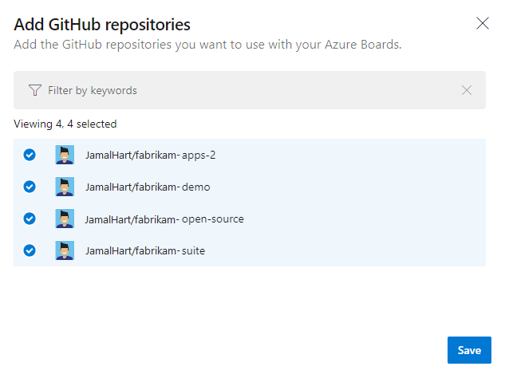
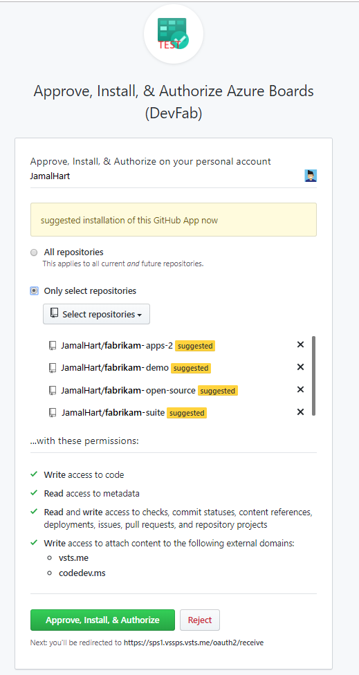
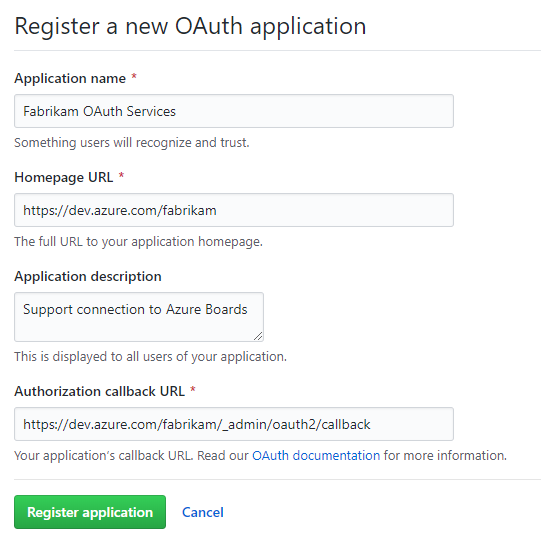

# Connect Azure Boards to GitHub (Cloud) 

**Azure Boards** | [**Azure DevOps Server 2020 | Azure DevOps Server 2019**](/azure/devops/boards/github/connect-on-premises-to-github?view=azure-devops-2020&preserve-view=true)

 

To support linking of GitHub commits and pull requests to Azure Boards work items, you start by connecting your Azure Boards project to GitHub.com repositories. You can use GitHub for software development while using Azure Boards to plan and track your work.  

When you make the connection from Azure Boards, the list of GitHub repositories correspond to ones that you allow Azure Boards to access. You can limit which repositories Azure Boards can access overall, and limit what a particular project can access or split the management of work across different Azure Boards projects.

> [!NOTE]   
> Azure Boards and Azure DevOps Services support integration with GitHub.com and GitHub Enterprise Server repositories. If you want to connect from an on-premises Azure DevOps Server, see [Connect Azure DevOps Server to GitHub Enterprise Server](/azure/devops/boards/github/connect-on-premises-to-github?view=azure-devops-2020&preserve-view=true).

## Prerequisites 

* You must connect to an Azure Boards or Azure DevOps project. If you don't have a project yet, [create one](../../boards/get-started/sign-up-invite-teammates.md). 
* You must be a member of the [Project Administrators group](../../organizations/security/set-project-collection-level-permissions.md) and the project's [Contributors group](../../organizations/security/add-users-team-project.md). If you created the project, then you have permissions. 
* You must be an administrator or owner of the GitHub repository you'll be connecting to.  

> [!IMPORTANT]  
> You can connect to multiple GitHub repositories so long as you are an administrator for those repositories. 

## Authentication options

The following authentication options are supported based on the GitHub platform you want to connect to.  

:::row:::
   :::column span="":::
      **GitHub.com**
   :::column-end:::
   :::column span="":::
      **GitHub Enterprise Server**
   :::column-end:::
:::row-end:::
:::row:::
   :::column span="":::
      - [GitHub.com user account (Recommended)](#server-github-ent-username)
      - [Personal access token (PAT)](#github-pat)
   :::column-end:::
   :::column span="":::
      - [OAuth (preferred, registration required)](#server-github-ent-oauth-register) 
      - [PAT](#server-github-ent-pat) 
      - [Username plus password](#server-github-ent-username) 
   :::column-end:::
:::row-end:::
 

 
## Open Project Settings>GitHub Connections.

1. Sign into Azure Boards for the project you want to connect to GitHub repositories.  

1. Choose (1) **Project Settings**> (2) **GitHub connections**.   

	:::image type="content" source="media/connect-cloud/open-project-settings-github-connections.png" alt-text="Screenshot of open Project Settings>GitHub connections.":::

1.	If it is the first time making a connection from the project, choose **Connect your GitHub account** to use your GitHub account credentials. 

	:::image type="content" source="media/connect-cloud/connect-github-account-first-time.png" alt-text="Screenshot of first time connecting with GitHub credentials.":::

	Otherwise, choose :::image type="icon" source="../../media/icons/add-light-icon.png" border="false"::: **New connection**, and select your authentication method from the **New Connection** dialog.

	If connecting using PAT, see [Add a GitHub connection using PAT](#github-pat). If connecting to a GitHub Enterprise Server, see [Register Azure DevOps in GitHub as an OAuth App](#server-github-ent-oauth-register).

## Add a GitHub connection with GitHub credentials 

1. 	If this is your first time connecting to GitHub from Azure Boards, you will be asked to sign in using your GitHub credentials. Choose an account for which you are an administrator for the repositories you want to connect to. 

	:::image type="content" source="media/connect-cloud/choose-github-org.png" alt-text="Screenshot of single sign-on to GitHub organization.":::

1. 	When asked, enter your GitHub credentials.

	> [!div class="mx-imgBorder"]  
	>   
	If you have enabled two-factor authentication, enter the authentication code that GitHub sent you and choose <strong>Verify</strong>. 

	> [!div class="mx-imgBorder"]  
	>   

	Otherwise, the system will automatically recognize your GitHub organization as your GitHub account has previously been associated with your Azure DevOps Services account. 

### Choose the repositories to connect to 

1. The **Add GitHub Repositories** dialog automatically displays and selects all GitHub.com repositories for which you are an administrator for the organization you selected. Unselect any repositories that you don't want to participate in the integration. 

	> [!div class="mx-imgBorder"]  
	>   

	> [!TIP]   
	> We recommend that you only connect a GitHub repo to projects defined in a single Azure DevOps organization. Connecting the same GitHub repo to projects defined in two or more Azure DevOps organizations can lead to unexpected AB# mention linking. For details, see [Troubleshoot GitHub & Azure Boards integration](troubleshoot-github-connection.md#integrate-repo-to-several-organizations). 

	If all repositories have been connected already to the current or other organization, then the following message displays. 

	:::image type="content" source="media/connect-cloud/message-repos-already-added.png" alt-text="Screenshot of message indicating all repositories are connected.":::

	The GitHub connections feature only allows one repository to be connected an Azure Boards project. 

1. When done, choose **Save**.
2. 
### Confirm the connection 

1. Review the GitHub page that displays and then choose **Approve, Install, & Authorize**.

	> [!div class="mx-imgBorder"]  
	>   

1. Provide your GitHub password to confirm.

1.	When done, you should see the new connection with the selected repositories listed.

	> [!div class="mx-imgBorder"]  
	>   

<a id="github-oauth" />
<a id="github-pat" />

## Add a GitHub connection using PAT   

We recommend that you use OAuth to connect to your GitHub repository. However, if you need to use a PAT, you can by following these procedures. 

> [!TIP]  
> When creating your GitHub PAT, make sure that you include these scopes: `repo, read:user, user:email, admin:repo_hook`. 

1. To choose a PAT when connecting a GitHub repository, choose **Personal Access Token** when making a first time connection. 

	:::image type="content" source="media/connect-cloud/first-connection-pat.png" alt-text="First connection , choose Personal Access Token.":::

	Or, from the New GitHub connection dialog. 

	:::image type="content" source="media/connect-cloud/connect-with-pat.png" alt-text="New GitHub connection dialog, choose Personal Access Token.":::

	To create a GitHub PAT, go to [GitHub Developer Settings>Personal access tokens](https://github.com/settings/tokens). 

1. Enter the PAT and choose **Connect**. 

	> [!div class="mx-imgBorder"]  
	>   

<a id="server-github-ent-oauth-register" />

## Register Azure DevOps in GitHub as an OAuth App

If you plan to use OAuth to connect Azure DevOps Services or Azure DevOps Server with your GitHub Enterprise Server, you first need to register the application as an OAuth App. For details, see [Creating an OAuth App](https://developer.github.com/apps/building-oauth-apps/creating-an-oauth-app/).

<a id="register-services-oauth" />

###  Register Azure DevOps Services   

1. Sign into the web portal for your GitHub Enterprise server.  

	> [!div class="mx-imgBorder"]  
	>   

1. Open <strong>Settings>Developer settings>Oauth Apps</strong> and choose <strong>New OAuth App</strong>. 

	> [!div class="mx-imgBorder"]  
	>   

2. Fill out the form to register your Azure DevOps Server application.  

	For the <strong>Homepage URL</strong>, specify the <strong>Organization URL</strong> of your organization.  
	For the <strong>Authorization callback URL</strong>, use the following pattern to construct the URL.  

	`{Azure DevOps Services Organization URL}/_admin/oauth2/callback`

	For example: 

	`https://dev.azure.com/fabrikam/_admin/oauth2/callback`

	> [!div class="mx-imgBorder"]  
	>   

3. Choose **Register application**.

4. Upon success, you'll see a page that provides the <strong>Client ID</strong> and **Client Secret** for your registered OAuth application. 

	> [!div class="mx-imgBorder"]  
	>   

 

<a id="register-services-github-ent-oauth" />

### Register your OAuth configuration in Azure DevOps Services

1. Sign into the web portal for Azure DevOps Services. 

2. Add the GitHub Enterprise Oauth configuration to your organization. 

3. Open **Organization settings>Oauth configurations**, and then choose **Add Oauth configuration**.  

	:::image type="content" source="media/connect-cloud/open-oauth-configuration.png" alt-text="Open Organization Settings, OAuth configurations.":::

4. Fill in the form that appears, and then choose **Create**.

	:::image type="content" source="media/connect-cloud/register-oauth-azure-devops.png" alt-text="OAuth configurations dialog.":::
<!---
	> [!div class="mx-imgBorder"]  
	>   
-->

<a id="github-ent-oauth-services" />

## Connect Azure DevOps Services to GitHub Enterprise Server

> [!IMPORTANT]  
> To connect Azure DevOps Services to your GitHub Enterprise Server, your GitHub Enterprise Server must be sufficiently accessible from the Internet. Make sure Azure DNS can resolve your GitHub Enterprise Server name and your firewall allows access from Azure Data Center IP addresses. To determine the IP address range, see [Microsoft Azure Datacenter IP Ranges](https://www.microsoft.com/download/details.aspx?id=41653). A common error message encountered when connectivity issues exist is: 
> 
> *The remote name could not be resolved: 'github-enterprise-server.contoso.com'*
> 
> If you encounter this error, check that your server is accessible. For more information, see [Azure DNS FAQ](/azure/dns/dns-faq). 

1. From the **Project Settings>GitHub connections** page choose GitHub Enterprise Server, choose **GitHub Enterprise Server** when making a first time connection. 

	:::image type="content" source="media/connect-cloud/first-connection-enterprise.png" alt-text="First connection, choose GitHub Enterprise Server.":::

	Or, from the **New GitHub connection** dialog, choose **GitHub Enterprise Server**.

	:::image type="content" source="media/connect-cloud/connect-to-enterprise.png" alt-text="New GitHub connection dialog, choose GitHub Enterprise Server.":::

1. Select the authentication method. 

	:::image type="content" source="media/connect-cloud/enterprise-select-authentication-method.png" alt-text="Select authentication method dialog.":::

	**Connect using OAuth**  

	Choose the configuration that you set up in [Step 4 of Register your OAuth configuration in Azure DevOps Services](#register-services-github-ent-oauth), and then choose **Connect**. 

	:::image type="content" source="media/connect-cloud/new-github-enterprise-server-dialog-oauth.png" alt-text="New GitHub Enterprise connection, OAuth connection dialog":::

	<a id="server-github-ent-pat" />

	**Connect using a Personal Access Token**  

	Enter the URL for your GitHub Enterprise server and the Personal access token credentials recognized by that server. And then choose **Connect**.

	:::image type="content" source="media/connect-cloud/new-github-enterprise-server-dialog-pat.png" alt-text="New GitHub Enterprise connection, Personal access token connection dialog":::

	<a id="server-github-ent-username" />

	**Connect using a Username and Password**   

	Enter the URL for your GitHub Enterprise server and the administrator account credentials recognized by that server. And then choose <strong>Connect</strong>.

	:::image type="content" source="media/connect-cloud/new-github-enterprise-server-dialog-user-name.png" alt-text="New GitHub Enterprise connection, User Name connection dialog":::

	**Choose the repositories to connect to**  

2. The dialog lists all repositories for which you have GitHub administration rights. You can toggle between **Mine** and  **All** to determine if others appear, and then check the ones that you want to add. Choose **Save** when done.

	> [!div class="mx-imgBorder"]  
	>   

	> [!TIP]    
	> You can only make a connection to repositories defined under one GitHub organization. To connect a project to other repositories defined in another GitHub organization, you must add another connection. 

## Resolve connection issues

See [Troubleshoot GitHub repository connection](troubleshoot-github-connection.md).

## Try this next

> [!div class="nextstepaction"]
> [Link GitHub commits and pull requests to work items](link-to-from-github.md) 

## Related articles

- [Add or remove GitHub repositories](add-remove-repositories.md)
- [What is Azure Boards?](../../boards/get-started/what-is-azure-boards.md)
- [Install and configure the Azure Boards app for GitHub](install-github-app.md)
- [Configure status badges to add to GitHub README files](configure-status-badges.md)
- [Troubleshoot GitHub & Azure Boards integration](troubleshoot-github-connection.md)

<!---
> [!NOTE]   
> We recommend that you use the [Azure Boards app for GitHub](install-github-app.md) to configure and manage your connections to GitHub.com. The app provides a more streamlined configuration experience and has the advantage of authenticating and operating as the app rather than an individual. Once you have configured your connection, you can manage the connected repositories either from Azure Boards or GitHub.com. 

-->

<!---

## Add a GitHub connection using OAuth 

1. Sign into Azure Boards. 

1. Choose (1) <strong>Project Settings</strong>, choose (2) <strong>GitHub connections</strong> and then (3) <strong>Connect your GitHub Account</strong>.   

	> [!div class="mx-imgBorder"]  
	>    

	If connecting using PAT, see [Add a GitHub connection using PAT](#github-pat).
	If connecting to a GitHub Enterprise Server, see [Register Azure DevOps in GitHub as an OAuth App](#server-github-ent-oauth-register).

2. Enter your GitHub account credentials. Choose an account for which you are an administrator for the repositories you want to connect to. 

	> [!div class="mx-imgBorder"]  
	>   
3. If you have enabled two-factor authentication, enter the authentication code that GitHub sent you and choose <strong>Verify</strong>. 

	> [!div class="mx-imgBorder"]  
	>   

4. Review the GitHub authorization dialog that appears which indicates the information you'll allow Azure Boards to access from GitHub. Choose <strong>Authorize AzureBoards</strong> when ready.

	> [!div class="mx-imgBorder"]  
	>   

5. In the Add GitHub repositories dialog, you'll see the list of repositories for which you are an administrator. 

	> [!div class="mx-imgBorder"]  
	>   

	 Check the ones that you want to add and then choose <strong>Save</strong>. When done, you should see the new connection with the selected repository listed.  

	> [!div class="mx-imgBorder"]  
	>    

> [!TIP]   
> We recommend that you only connect a GitHub repo to projects defined in a single Azure DevOps organization. Connecting the same GitHub repo to projects defined in two or more Azure DevOps organizations can lead to unexpected AB# mention linking. For details, see [Troubleshoot GitHub & Azure Boards integration](troubleshoot-github-connection.md#integrate-repo-to-several-organizations). 

-->