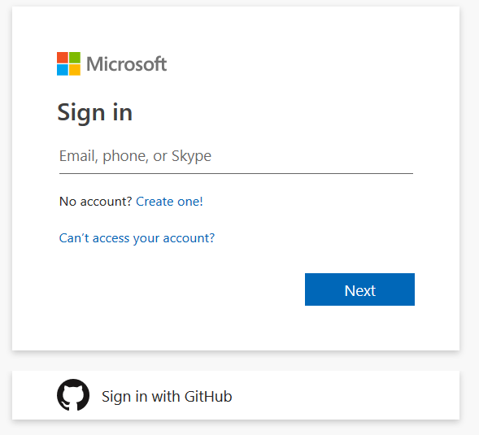

# GitHub integration overview

[!INCLUDE [temp](../includes/version-vsts-plus-azdevserver-2019.md)]

Use this guide to connect Azure Boards with one or more GitHub repositories. This connection uses the Azure Boards app for GitHub to support the integration between Azure Boards and GitHub. This app is free for both public and private repositories. 

By connecting Azure Boards with GitHub repositories, you enable linking between GitHub commits, pull requests, and issues to work items. You can use GitHub for software development while using Azure Boards to plan and track your work. Azure Boards provides the scalability to grow as your organization and business needs grow.  

> [!NOTE]   
> Azure DevOps only supports integation with GitHub repositories or Azure Repos Git repositories. Integration with other Git repositories is not supported.  
 

> [!VIDEO https://channel9.msdn.com/Shows/DevOps-Lab/Introducing-Azure-Boards-to-the-GitHub-Marketplace/player]

::: moniker range="azure-devops"

If you haven't yet signed up for Azure Boards, you can do that now. See [Sign up for free and invite others to collaborate on your project](../get-started/sign-up-invite-teammates.md). You can also sign up and sign in using your GitHub credentials. 

> [!div class="mx-imgBorder"]  
>    

In addition to accessing developer services such as Azure DevOps and Azure, you can use your GitHub account to access all Microsoft online services, from Excel Online to XBox.

::: moniker-end

## Connect Azure Boards to GitHub repositories 

You can start from Azure Boards or from GitHub to make the connection.  
 
> [!NOTE]   
> We recommend that you use the [Azure Boards app for GitHub](install-github-app.md) to configure and manage your connections to GitHub.com. The app provides a more streamlined configuration experience and has the advantage of authenticating and operating as the app rather than an individual. Once you have configured your connection, you can manage the connected repositories either from Azure Boards or GitHub.com. 
 
	
**To start from GitHub**

- [Install and configure the Azure Boards app for GitHub](install-github-app.md)  
	- Install  the Azure Boards app for GitHub for your GitHub account or organization 
	- Choose all or select repositories to participate in the integration  
	- Approve and install the app 

::: moniker range="azure-devops"
- [Connect Azure Boards to GitHub (Cloud)](connect-to-github.md):
	- Specify the GitHub repositories to connect to an Azure Boards project 
::: moniker-end

::: moniker range=">= azure-devops-2019 < azure-devops"
- [Connect Azure DevOps Server to GitHub Enterprise Server (On-premises)](connect-on-premises-to-github.md):
	- Specify the GitHub repositories to connect to an Azure Boards project 
::: moniker-end
  
**To start from Azure Boards**

::: moniker range="azure-devops"

- [Connect Azure Boards to GitHub (Cloud)](connect-to-github.md):
	- Add a connection from an Azure Boards project to select GitHub repositories  
	- Approve and install the Azure Boards app for GitHub for your GitHub account or organization  

::: moniker-end

::: moniker range=">= azure-devops-2019 < azure-devops"

- [Connect Azure DevOps Server to GitHub Enterprise Server (On-premises)](connect-on-premises-to-github.md):
	- Add a connection from an Azure Boards project to select GitHub Enterprise Server repositories  
	- Approve and install the Azure Boards app for GitHub for your GitHub account or organization  
::: moniker-end

## Exercise Azure Boards-GitHub integration features

Once you've configured the connection, you can then exercise these features:
- [Link GitHub commits and pull requests to work items](link-to-from-github.md)
- [Configure status badges](configure-status-badges.md)
- [Change GitHub repository access, or suspend or uninstall the integration](change-azure-boards-app-github-repository-access.md)

 
## Add or remove connections, suspend operations, or uninstall the app  
 
- [Add or remove GitHub repositories, remove connection](add-remove-repositories.md)  
	Use the procedures provided here to add or remove GitHub connections to GitHub repositories from Azure Boards.  
- [Change repository access to Azure Boards](change-azure-boards-app-github-repository-access.md)  
	Use the procedures provided here to change which GitHub repositories can be connected to Azure Boards for the selected GitHub account or organization, to suspend the integration, or to uninstall the app.  
 
 
## Restrictions 

- You can only connect a GitHub repository to one Azure DevOps organization and project
	Connecting the same GitHub repo to projects defined in two or more Azure DevOps organizations can lead to unexpected AB# mention linking. For details, see [Troubleshoot GitHub & Azure Boards integration](troubleshoot-github-connection.md#integrate-repo-to-several-organizations). 
  
## Additional resources

- [Add or remove GitHub repositories](add-remove-repositories.md)
- [Build GitHub repositories](../../pipelines/repos/github.md) 
- [Build GitHub Enterprise Server repositories](../../pipelines/repos/github-enterprise.md)
- [Trigger an Azure Pipelines run from GitHub Actions](../../pipelines/ecosystems/github-actions.md)  
- [Link work items](../backlogs/add-link.md)
- [About work items](../work-items/about-work-items.md)
 

