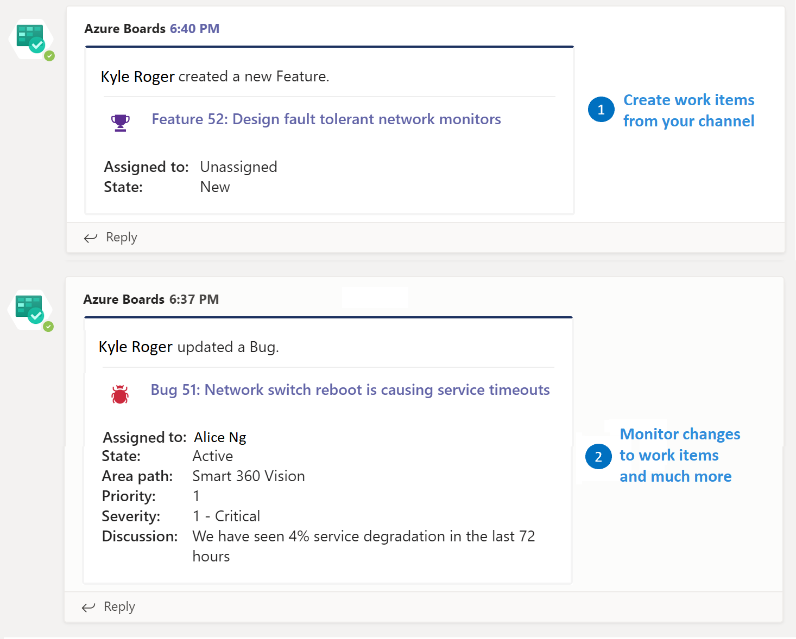
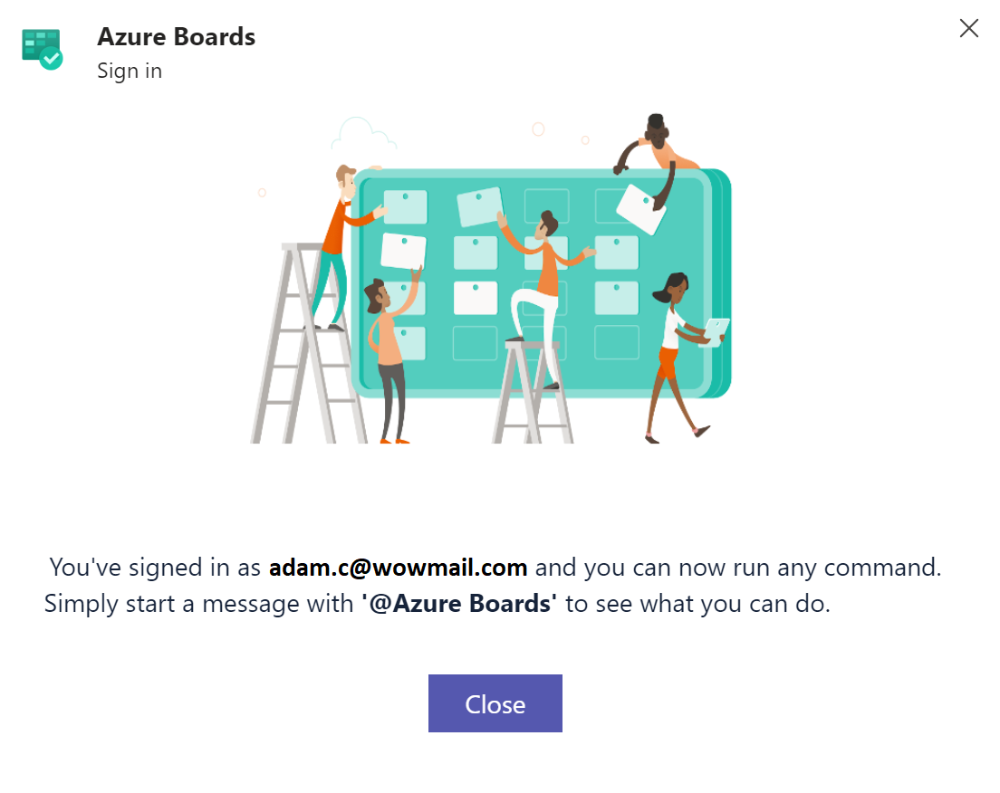
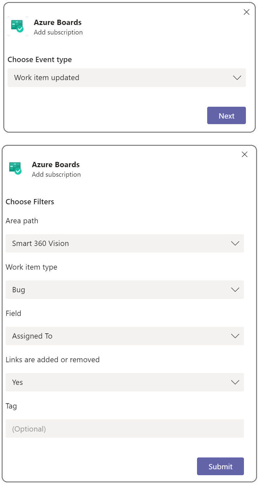
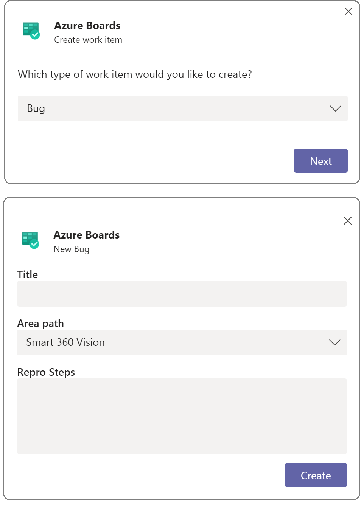
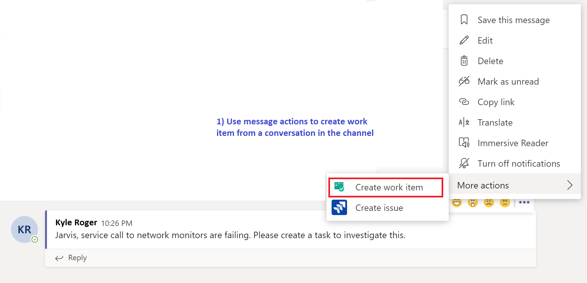
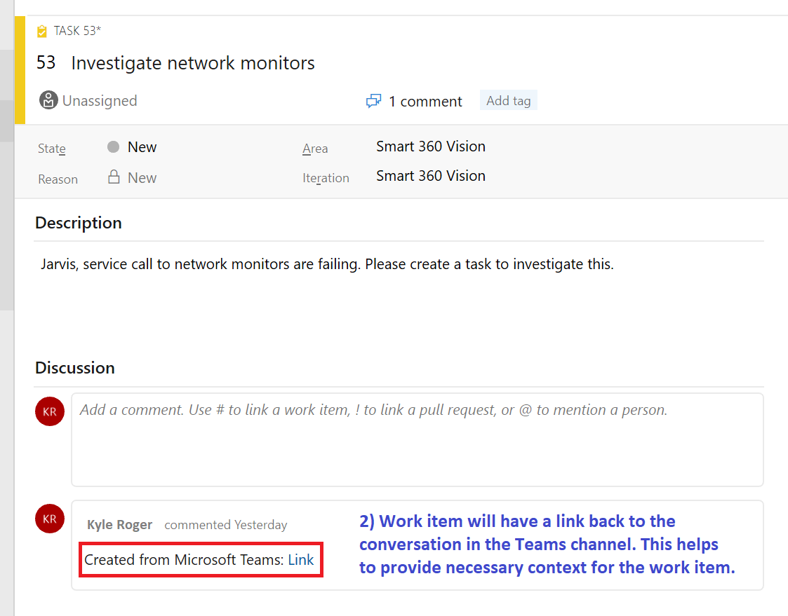
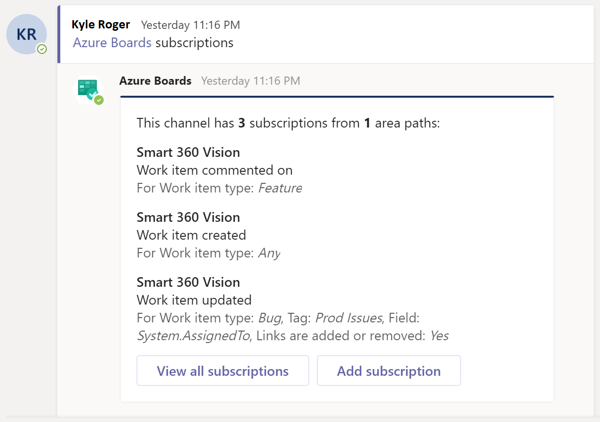
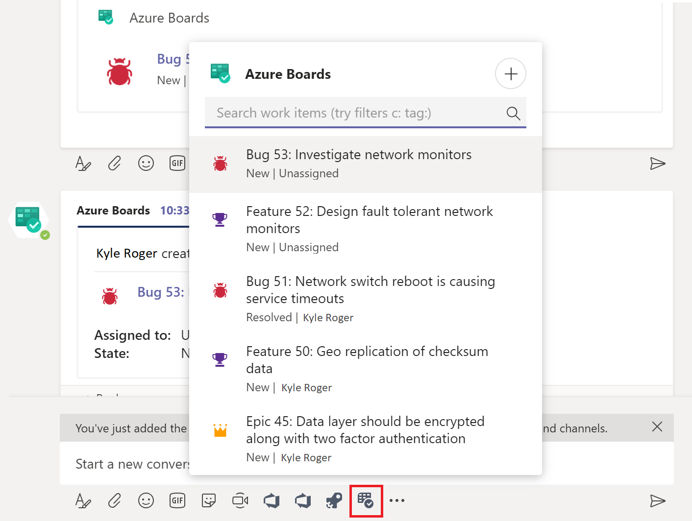
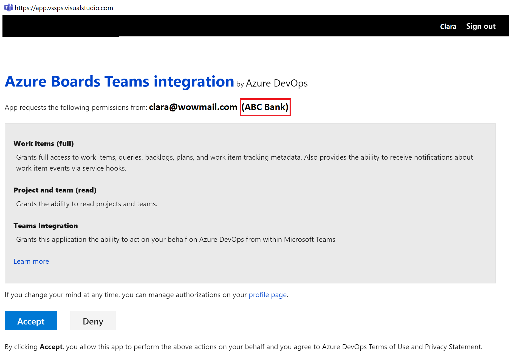

 
# Azure Boards with Microsoft Teams

[!INCLUDE [temp](../_shared/version-vsts-only.md)]

If you use [Microsoft Teams](https://products.office.com/microsoft-teams/group-chat-software), you can use the [Azure Boards app for Microsoft Teams](https://appsource.microsoft.com/product/office/WA200000644?tab=Overview) to create work items and monitor work item activity in your Azure Boards project from your Teams channel. 

With this app, users can set up and manage subscriptions for creating and updating work items, and managing other work item events. Also users get notifications for these events in their Teams channel. Users can create work items from conversations in the channel. Using messaging extension, users can search and share work items with other members in the channel. Users can also get previews for work item URLs to initiate discussions and keep the conversations contextual.



Read this article to learn how to: 

> [!div class="checklist"]  
> * Add the Azure Boards app to your team in Microsoft Teams
> * Link and unlink your Azure Boards project to the Azure Boards app
> * Set up subscriptions to work item related events in your Teams channel
> * Create work items from your Teams channel
> * Monitor work item activity in your Teams channel  


## Prerequisites

- To create a work item, you must be a contributor to the Azure Boards project. If you don't have a project yet, you can sign up and create a project. For details, see [Start using Azure Boards](../get-started/index.md). 
- To create subscriptions in a Teams channel for work item events, you must be a member of the Azure Boards Project Administrators group. To get added, see [Set permissions at the project- or collection-level](../../organizations/security/set-project-collection-level-permissions.md). 
- To receive notifications, the **Third party application access via OAuth** setting must be enabled for the organization. See [Change application access policies for your organization](../../organizations/accounts/change-application-access-policies.md)

> [!NOTE]
> * You can link the Azure Boards app for Microsoft Teams only to a project hosted on Azure DevOps Services at this time.  
> * Notifications are currently not supported inside direct messages.

## Add the Azure Boards app to Microsoft Teams

You add the app to your Teams channel in Microsoft Teams.

1. Visit the App store in Microsoft Teams and search for the Azure Boards app. Upon installing, you will see a welcome message from the app as shown in the following image. 

	

2. Use the `@azure boards` handle to interact with the app. A list of commands are provided later in this article, [Command reference](#command-reference).

## Link your Azure Boards project to the Azure Boards app

To use the app, you must first link your Azure Boards project to your Teams channel. 

1. Once the app has been installed in your team, connect and authenticate yourself to Azure Boards. 

	
	
	

2. After signing in, use the following command inside a Teams channel to link to the Azure Boards project which you specify with the URL:

	```
	@azure boards link [project url]
	```

	For example:

	```
	@azure boards link https://dev.azure.com/myorg/myproject
	```

Once the project is linked, you can create work items using `@azure boards create` command or use message actions. 

## Set up subscriptions

You can create subscriptions to monitor work items at any time using the `@azure boards subscriptions` command.  

1. Select the desired area path, event that you are interested in, and leverage the associated 
filters to customize what you get notified on in your Teams channel. To help easily set up subscriptions, your recently accessed area paths are shown in the area path dropdown.

	

In case the desired area path doesn't appear in the Area path dropdown menu, follow the instructions mentioned in the next section, [Add area paths](#add-area-paths). Area paths added using the `@azure boards addAreapath` command and area paths for which subscriptions are  created in the channel always appear in the Area path dropdown along with recently accessed area paths.


## Add area paths

You can add areas that your team works on to the channel so that they are always available for creating work items and subscriptions. 

- Use the following command to add area paths from your project to the Teams channel.

	```
	@azure boards addAreapath [area path] 
	```

	For example:

	```
	@azure boards addAreapath myproject\fabrikam
	```

	
	
 - If you choose project name as your area path, then you will receive notifications for all the area paths in the project. It is logically equivalent to choosing 'Any' area path.

## Create a work item with a command

With Azure Boards app you can create work items from your channel. The app supports custom work items as well.

- To create a work item, use `@azure boards create`. 

	


## Create a work item from message actions

Often, discussions in a channel necessitates creation of work items. You can use message actions to create a work item. The selected message is prefilled in the description section of the work item. A link back to the conversation in the channel is stored in the Discussion section of the newly created work item, giving users access to the discussion that led to the creation of the work item.

- To create work items using message actions

	> [!div class="mx-imgBorder"]  
	> 
	
	> 


## Manage subscriptions

1. To view, add and remove subscriptions for a channel, use the `@azure boards subscriptions` command:

	```
	@azure boards subscriptions
	```

This command lists all the current subscriptions for the channel and allows you to add new subscriptions and remove existing ones. As part of adding subscriptions, you can also customize what you get notified on by using various filters.

	> [!div class="mx-imgBorder"]  
	> 

## Search and share work items using compose extension

To help users search and share work items, Azure Boards app for Microsoft Teams supports compose extension. You can now search for work items by work item id or by title. For compose extension to work, users will have to sign into Azure Boards app either by running `@azure boards signin` command or by signing into the compose extension directly.



## Preview work item URLs

To support collaboration around work items discussed within a channel, a preview of work items referenced in the channel is displayed. When a user pastes the work item URL, a preview is shown similar to that in the following image. This helps to keep work item related conversations relevant and accurate. 


For this feature to work, users have to be signed-in. Once they are signed in, this feature will work for all channels in a team in Microsoft Teams.

## Unlink a project from a channel

A Teams channel can only link to one Azure Boards project at a time. To link to a different project, you must first unlink the current project using `@azure boards unlink` command. 

Unlinking a project deletes all the subscriptions along with added area paths from the channel. If the channel has no subscriptions, any user can unlink a project. However if a channel has subscriptions, only project admins can unlink a project from a channel.


## Command reference

The following table lists all the `@azure boards` commands you can use in your Microsoft Teams channel. 

| Command        | Functionality  |
| -------------------- |----------------|
|@azure boards link [project url]	|Link a project to this channel to create work items and receive notifications|
|@azure boards subscriptions	| Add or remove subscriptions for this channel|
|@azure boards create | Create a work item|
|@azure boards addAreapath	[area path]| Add an area path from your project to this channel |
|@azure boards signin	| Sign in to your Azure Boards organization|
|@azure boards signout	| Sign out from your Azure Boards organization|
|@azure boards unlink	| Unlink a project from this channel|
|@azure boards feedback	| Report a problem or suggest a feature |

## Troubleshoot 

If you are experiencing the following errors when using the [Azure Boards App for Microsoft Teams](https://appsource.microsoft.com/product/office/WA200000644?tab=Overview), follow the procedures in this section.

[!INCLUDE [troubleshooting](_shared/boards-troubleshoot-authentication.md)]

In the **same browser**, start a new tab, navigate to `https://teams.microsoft.com/`. Run the `@azure boards signout` command and then run the `@azure boards signin` command in the channel where the Azure Boards app for Microsoft Teams is installed. 

Select the `Sign in` button and you'll be redirected to a consent page like the one in the following example. Ensure that the directory shown beside the email is same as what was chosen in the previous step. Accept and complete the sign-in process.

> [!div class="mx-imgBorder"]
> 

If these steps don't resolve your authentication issue, please reach out to us at [Developer Community](https://developercommunity.visualstudio.com/spaces/21/index.html).


## Related articles

- [Define area paths and assign to a team](../../organizations/settings/set-area-paths.md)
- [Azure Pipelines with Microsoft Teams](https://aka.ms/AzurePipelinesTeamsIntegration)
- [Azure Repos with Microsoft Teams](https://aka.ms/AzureReposTeamsIntegration)
