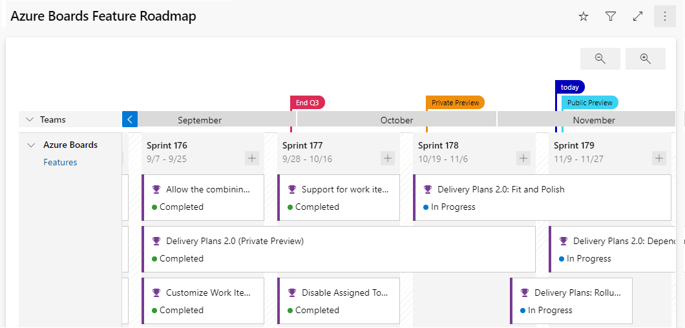
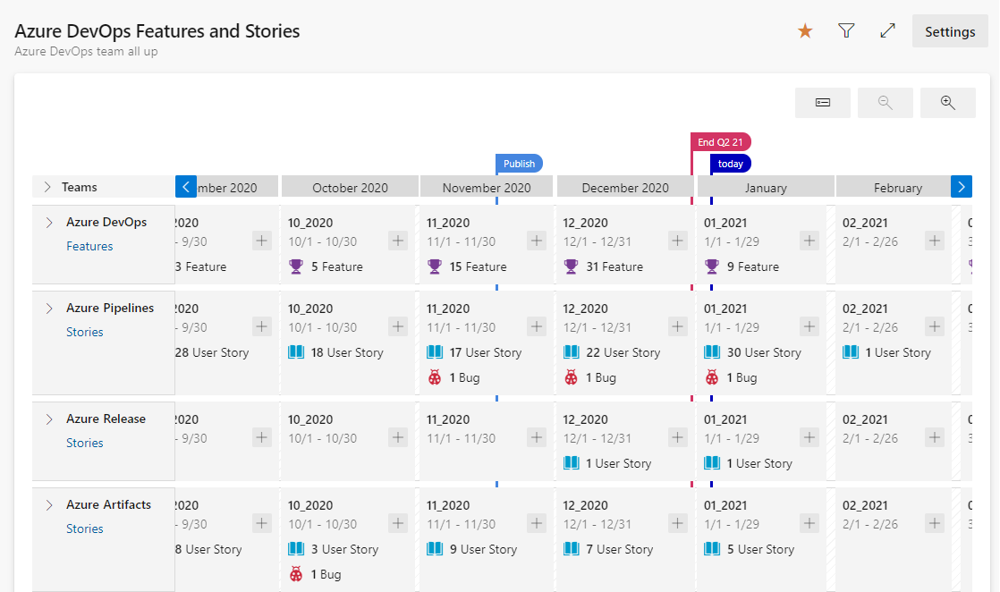
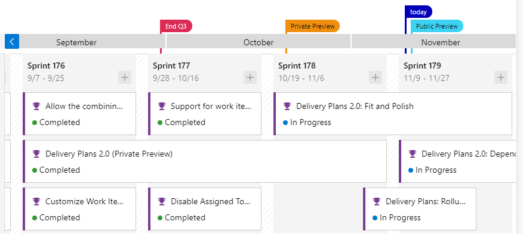

# Review team Delivery Plans 

**Azure Boards |** [**Azure DevOps Server 2020 | Azure DevOps Server 2019 | TFS 2018 - TFS 2017**](../extensions/delivery-plans.md) 

Use the visualization options provided by Delivery Plans to review the schedule of stories or features your teams plan to deliver. Delivery Plans show the scheduled work items by sprint (iteration path) of selected teams against a calendar view.

Use Delivery Plans to ensure your teams are aligned with your organizational goals. You can view multiple backlogs and multiple teams across your whole account. You can interact with the plan with simple drag-and-drop operations to update or modify the schedule, opening cards, expanding and collapsing teams, and more. 

> [!NOTE]   
> Delivery Plans 2.0 is available for Azure Boards (cloud service). This tool is now part of Azure Boards and not an extension. This new version of Delivery Plans supports the following tasks: 
> - Add up to 15 team backlogs
> - Add custom portfolio backlogs as well as Epics 
> - View work items that span several iterations 
> - Reset Start Date and Target Date through drag and drop borders 
> - Add backlog items to a team from a plan   
> - View rollup progress of Features, Epics, and other portfolio items
> - View work item dependencies 
> - Stakeholders can view plans
 
Any plan you created with the original Delivery Plans extension will work with Delivery Plans. You don't have to migrate any data or reconfigure plan settings. To learn how to add or edit a plan, see [Add or edit a Delivery Plan](add-edit-delivery-plan.md). 

> [!div class="mx-imgBorder"]  
> 

In this article you'll learn how to perform the following tasks:

> [!div class="checklist"]   
> - Open a plan from the list of defined plans 
> - Review a plan with your teams
> - Use the interactive elements of plans and change the plan view
> - Understand rollup  

For information on working with dependencies, see [Track dependencies](track-dependencies.md). 

## Prerequisites

- To view a Delivery Plan, you must be a member of the Project Collection Valid Users group. Users granted **Stakeholder** access for a private project can view plans. Users granted **Stakeholder** access for a public project can add and view plans.  
- To open or modify a work item or add work items, you must have the **Edit work items in this node** set to **Allow** for the Area Paths assigned to the work item.  
 
## Review a plan with your teams

It takes several teams to develop large software projects. Very large projects require multiple autonomous teams. Autonomous teams manage their own backlog and priority which contributes to a unified direction for that project. Review [Agile culture](agile-culture.md) for a discussion of autonomous teams and organizational alignment. 

Regular reviews of the project schedule with these teams help ensure that the teams are working toward common goals. Delivery Plans provide the needed multi-team view of your project schedule. 

Some questions you might address during the review: 
- *How confident are the teams in meeting the deliverables scheduled for each sprint?* 
- *Are dependencies across teams adequately addressed via the planned deliverables?* 
- *Are there gaps in the schedule, where no deliverables are scheduled? What's the cause? Can this be mitigated?*  

For example, we use Delivery Plans internally to share the schedule of Features. By seeing the work many teams have planned for the next 3 sprints, we can easily discuss whether these are the right priorities and if dependencies exist. 

In this way, a Delivery Plan is a driver of alignment while allowing each team to retain a strong sense of autonomy. Individual teams can work to different sprint cadences, if needed, and manage different work item types&mdash;stories, features, or epics. Their work is all visible with the same plan view. Teams can even be part of different projects if they use different processes. You can also customize the card fields so that you only see the data fields of interest and applicable per work item type.  

## Best practices 

- Use a consistent sprint schedule across your project teams and organization. Use the same sprints for backlogs, features, and epics. Don't create specific sprints for epics or other portfolio backlogs. 
- Use **Start Date** and **Iteration** to specify the time frame for a work item. Or, use **Start Date** and **Target Date**. However, don't specify both **Iteration** and **Target Date** for a work item. The **Target Date** will always override the **Iteration** end date on the plan.
- Minimize the number of fields you choose to display on your cards.  
- Eliminate cross-team ownership of area paths. Cross-team area path ownership isn't recommended and can lead to undesirable edge cases.  

Note the following: 
- Plan views are limited to 12 to 13 months. 
- Plan views are limited to a maximum of 15 teams/backlogs
- Zooming out can cause fields and tags to disappear from the cards. The further you zoom out, the harder it is to fit items on a card. By design, we hide select items depending on the zoom level.  
-  Rollup isn't supported for child work items that belong to a different project than that of the originating parent work item.  
- If the **Start Date** or **Target Date** are missing from a work item, you can add them to the custom process defined for the project as discussed in [Add and manage fields (Inheritance process)](../../organizations/settings/work/customize-process-field.md#add-an-existing-field-to-another-wit).
 

## Open a plan  

Once you've defined a few plans, you'll see them listed from the **Plans** page under **All**, or the ones you've favorited (**Add to favorites** :::image type="icon" source="../../media/icons/icon-favorite-star.png" border="false":::) under **Favorites**. You can see their title, description and their most recent creator/editor. 

Use the favorite's star to favorite a plan so that you can quickly return to that plan. You can also search for other plans in the project. 

To open a plan, open **Boards>Delivery Plans** and choose the plan name. You can Sort by any of the columns&mdash;**Name**, **Created By**, **Description**, **Last configured**, or :::image type="icon" source="../../media/icons/icon-favorite-star.png" border="false":::) **Favorites**.   

> [!div class="mx-imgBorder"]  
>  

## Interact with a plan
 
Each team's backlog specified in a Delivery Plan appears as a row within the plan view. When collapsed, a roll-up of the backlog items shows. When expanded, a card for each backlog item appears, organized by their assigned iteration. 

:::image type="content" source="media/plans/overview-with-callouts.png " border="false" alt-text="Screenshot with callouts of Delivery Plans, collapsed teams.":::   

You can interact with the plan in the following ways:  

- Filter the plan by choosing Choose **Filter** :::image type="icon" source="../../media/icons/filter-icon.png" border="false":::. You can filter on any field you include in the plan Settings based on the keyword or text filter. For additional details, see [Interactively filter your backlogs, boards, and plans](../backlogs/filter-backlogs-boards-plans.md).
- Scale the size of the cards and calendar by choosing **Zoom out** :::image type="icon" source="media/plans/collapse-calendar-icon.png" border="false"::: or **Zoom in** :::image type="icon" source="media/plans/expand-calendar-icon.png" border="false":::.
- To view previous or future months, choose **Scroll calendar left** :::image type="icon" source="media/plans/scroll-calendar-left-icon.png" border="false"::: or **Scroll calendar right** :::image type="icon" source="media/plans/scroll-calendar-right-icon.png" border="false"::: .You can also scroll the plan by clicking the plan and dragging your mouse horizontally.
- To view details for a team, expand the team row by choosing **Expand team row** or clicking once on a sprint within a team row.  
- To expand and collapse all team rows, choose **Expand all team rows** or **Collapse all team rows** next to **Teams**.  
- Scroll the view vertically to view teams that appear lower within the plan view. 
- To view titles only, choose **Collapsed card fields** :::image type="icon" source="media/plans/collapsed-card-fields-icon.png" border="false":::. To view all fields, choose **Expand card fields** :::image type="icon" source="media/plans/expand-card-fields-icon.png" border="false":::.  
- Click a card title to open the backlog item and view details. Close the work item to return to the plan.   
- To add a work item to a sprint, choose **Add item** :::image type="icon" source="media/plans/add-item-icon.png" border="false":::  within the sprint and team you want to add it to. 
- To [change the fields displayed on the cards](#card-settings), choose **More actions** :::image type="icon" source="../../media/icons/more-actions.png" border="false":::. 

## Collapse teams for summary information

A benefit of Delivery Plans is to view multiple teams across your projects that you care about. Two main ways to view more teams within the plan view is to collapse all teams to focus on summary data and to minimize the number of fields displayed on cards. 

To gain a summary view of work that is schedule, collapse all teams. You can then more easily look for gaps in the forward forecast.

Collapse and expand each team row by choosing **Expand team row** or **Collapse team row** next to the team name.

> [!div class="mx-imgBorder"]  
>   

## Show work that spans one or more iterations

For work items that span one or more iterations, you can define the **Start Date** and **Target Date**. The plan displays cards that start and end according to the dates you set as shown in the following image. In addition, you can grab the left or right border of a work item and drag it to a new **Start Date** or **Target Date**. 

> [!div class="mx-imgBorder"]  
>   

## View titles only, collapsed card view 

The collapsed card view allows you to quickly switch back and forth between cards showing titles only and cards showing all fields configured for the plan. To view titles only, choose **Collapsed card fields** :::image type="icon" source="media/plans/collapsed-card-fields-icon.png" border="false":::. To view all fields, choose **Expand card fields** :::image type="icon" source="media/plans/expand-card-fields-icon.png" border="false":::.  

> [!div class="mx-imgBorder"]  
>   

## View rollup of features and epics 

Rollup displays a fuller picture of the underlying work directly on the cards in your delivery plan. Rollup views are available for features, epics, or any portfolio backlog you've added to your project. To enable rollup, open your plan settings, choose **Fields**, and select **Show child rollup data**.

For example, here we show a plan view of four scenarios with rollup of the child features, user stories, and bugs for a single team.   

> [!div class="mx-imgBorder"]  
>   

You can also view rollup from a backlog view as described in [Display rollup progress or totals](../backlogs/display-rollup.md).

## Update the iteration for a backlog item 

As changes occur to the schedule, you can update the iteration for a backlog item by moving a card to a different iteration. This will help to drive alignment across your organization.

> [!div class="mx-imgBorder"]  
> 

## Related articles  
 
- [Add or edit a Delivery Plan](add-edit-delivery-plan.md)
- [Track dependencies using Delivery Plans](track-dependencies.md)
- [Interactively filter your backlogs, boards, and plans](../backlogs/filter-backlogs-boards-plans.md)
- [Backlogs, boards, and plans](../backlogs/backlogs-boards-plans.md)  
- [Add teams](../../organizations/settings/add-teams.md)  
- [Portfolio management](portfolio-management.md)  
- [Manage teams and configure team tools](../../organizations/settings/manage-teams.md)  
 