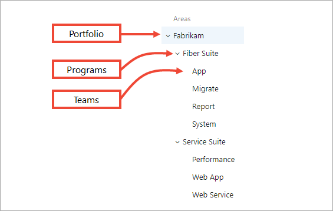
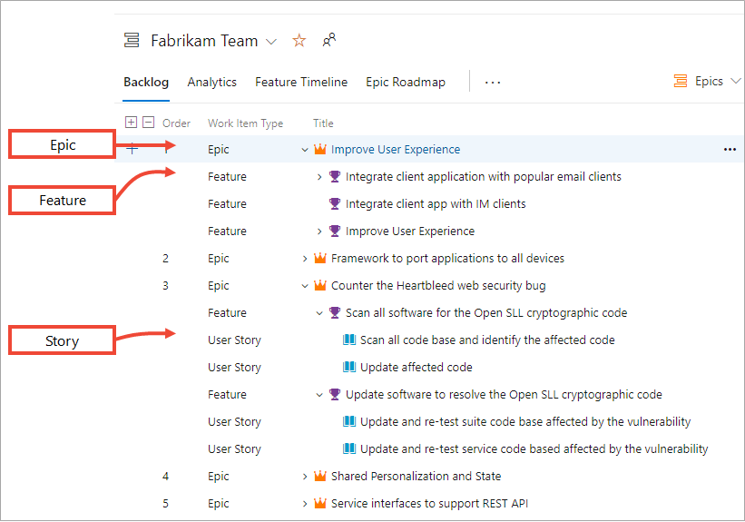
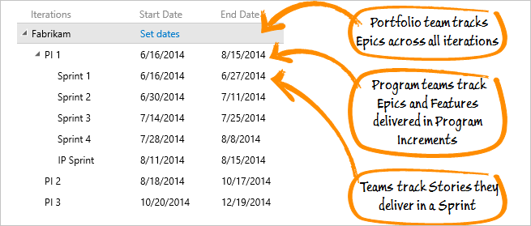
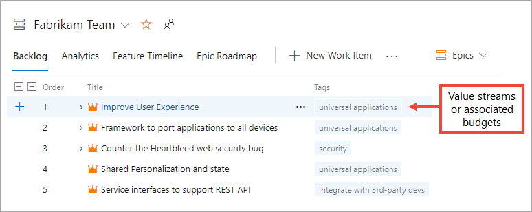

# SAFe&reg; concepts map to Azure Boards artifacts 

[!INCLUDE [temp](../includes/version-vsts-tfs-all-versions.md)]

<!--- Intro To be provided --> 

Examples provided below illustrate how to configure a three-level team hierarchy and map teams to their respective area and iteration paths. The examples build from the [Agile process](../work-items/guidance/agile-process.md), However, the changes can be applied to any project hosted on Azure Boards or an on-premises TFS.

  

>[!div class="checklist"]      
> * SAFe deliverables 
> * SAFe roles and a team hierarchical structure
> * Product, program, and portfolioi backlogs and boards
> * Timeboxes, release trains, and sprints 
> * Events and milestones 

Because your Agile tools support a hierarchical team structure, each team has its own view of their work which rolls up to the next level within the team hierarchy.  

::: moniker range=">= azure-devops-2019"

::: moniker-end

::: moniker range="<= tfs-2018"

  

::: moniker-end

To support SAFe teams, you reconfigure the default team as the Portfolio team to manage your epics. You then create sub-teams for program-level work and team-level work. Work can be tracked across teams and throughout each of the levels.

## Role mapping

Scrum Master, Product Owner, Release Train Engineer, Product Manager, Functional Manager, Business Owner, Epic Owners 

SAFe&reg; roles of Product Owner, Business Owners, Dev Team map to Azure Boards team structure 

SAFe&reg; roles of Product Owner, Business Owners, Dev Team map to Azure Boards team structure 

What are the Azure Board tools they use, when, how
<!--- To be provided --> 

## Team, program, and portfolio backlogs

SAFe&reg; backlogs map to team, program, and portfolio backlogs

Out of the box, the Agile process supports user story, feature, and epic backlog levels. The hierarchical backlog structure shows work done to support features and user stories in the progress of an epic.  

::: moniker range=">= azure-devops-2019"

::: moniker-end

::: moniker range="<= tfs-2018"

::: moniker-end

## SAFe&reg; releases, iterations, and sprints map to iterations

SAFe Release Trains, Releases, Iterations, Program Increments (PIs), and Sprints map easily to your iteration paths. By sharing iterations across the team hierarchy, you manage the releases in a cohesive manner. 

::: moniker range=">= azure-devops-2019"

  

::: moniker-end

::: moniker range="<= tfs-2018"

  

::: moniker-end

Because epics can span several release trains, the Portfolio team isn't associated with any specific iterations. Program teams track their Feature deliverables, which ship with a PI. And Feature teams work in Sprints to complete several stories. Each team chooses which iterations will support them to track their focused set of deliverables.

::: moniker range=">= azure-devops-2019"

 

::: moniker-end

::: moniker range="<= tfs-2018"

   

::: moniker-end
 

## SAFe&reg; value streams, budgets, and enablers map to tags and the Value Area field 
 
You can use tags for a quick and easy way to map epics to their Value Streams, strategic themes, enablers, and associated budgets.

::: moniker range=">= azure-devops-2019"

  

::: moniker-end

::: moniker range="<= tfs-2018"

    

::: moniker-end

With tags that you add to work items, you can:

- Filter any backlog or Kanban board
- Create queries based on tags, and filter query results by tags
- Create progress and trend charts or reports based on tags 

For a more robust mapping of work to architecture or business features, you can specify the Value Area for each epic, feature, or story.  

::: moniker range=">= azure-devops-2019"

  

::: moniker-end

::: moniker range="<= tfs-2018"

    

::: moniker-end

## SAFe&reg; roadmap can be viewed via Delivery Plans and Feature Timeline extensions 

<!--- To be provided --> 
### Near term PI roadmap

### Solution Train roadmap 

## SAFe metrics can be viewed via Azure Boards dashboards, widgets, and Analytics 

<!--- To be provided --> 

## Try this next

> [!div class="nextstepaction"]
> [How to plan and track SAFe® projects using Azure Boards](safe-plan-track-boards.md)

## Related articles

<!--- To be provided --> 
