# Configure Azure Boards to support SAFe&reg;  

[!INCLUDE [temp](../includes/version-vsts-tfs-all-versions.md)]

Configuration of Azure Boards to support your SAFe programs and portfolios requires performing the following tasks: 

>[!div class="checklist"]      
> - Define your feature, program, and portfolio teams  
> - Configure your hierarchy of Area Paths to support your teams  
> - Define your Iteration Paths to support your release trains, Program Increments, sprints, and Innovation and Planning (IP) Iterations 
> - Configure each team's area paths, iteration paths, and team members 

You'll need to be a [member of the Project Administrators group](../../organizations/security/add-users-team-project.md) to make these configurations.    

Once you've performed these core configurations, you can then consider customizing your project to support specific business needs. This is addressed in [Customize Azure Boards to support SAFe&reg; ](safe-customize.md). 

## Team hierarchy 

::: moniker range=">= azure-devops-2019"

In this article, we'll go from having one project, named "Fabrikam" and one team, which shares the name of the project, to the following set of nine teams. 

> [!div class="mx-imgBorder"]  
> 

We'll then configure the area path to the following hierarchy and configuring each team's area path. This configuration supports each team's backlog view and rollup of views within the hierarchy.  

> [!div class="mx-imgBorder"]  
> 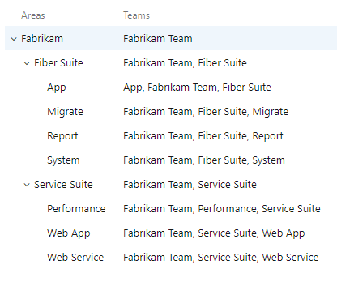
> 
::: moniker-end

::: moniker range="<= tfs-2018" 

In this article, we'll go from having one project, named "Fabrikam" and one team, which shares the name of the project, to the following structure of three levels and nine teams. The area path hierarchy and configuring each team's area path supports each team's backlog view and rollup of views within the hierarchy.  

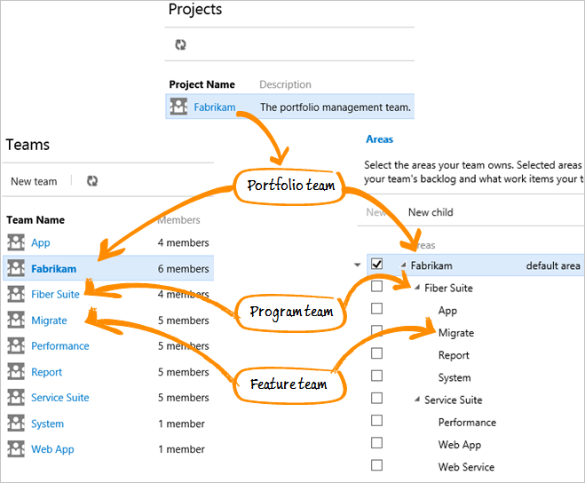 
::: moniker-end

Each project has a default team. You can configure additional teams for program-level and feature team-level work. And, you can also redefine the default team as the portfolio team that manages epics.  

In this way, all teams can manage their own workload and priorities while clearly understanding how their work supports those epics managed in the portfolio team's backlog. At the same time, the portfolio team can monitor progress of its backlog on their own Kanban board, prioritize the items on their backlog, and view progress across release trains.

All this might sound complicated, but it actually takes very little configuration to set up the teams and get started.
In order to go from one project with one default team, area, and set of iterations, we'll first configure an area path structure to support the hierarchy of teams we want. Then we'll make sure that the iteration paths support the release structure we want and the program and feature teams to use. Finally, we'll create, configure, and populate the membership of teams.  

::: moniker range="azure-devops"

## Define your teams 

To start, we'll simply add each team, creating a default area path for each. Later in this article, we'll configure those area paths into the necessary hierarchy. This structure maps the following SAFe teams to Azure Boards teams:  
- Portfolio team -> default top-level team, the Fabrikam team (already defined) 
- Program teams -> secondary-level teams, Fiber Suite and Service Suite  
- Feature teams -> tertiary-level teams defined under Fiber Suite and Service Suite.  

You'll need to be a [project administrator](../../organizations/security/add-users-team-project.md) to perform these steps. If you need more-detailed guidance, see [Portfolio management](portfolio-management.md).  

Add each team, one by one

> [!NOTE]   
> The following procedure uses the **New Teams Page** user interface that is in preview. To enable this feature, see [Enable preview features](../../project/navigation/preview-features.md).

1. From the web portal, choose **Project settings** and open **Teams**. 

	> [!div class="mx-imgBorder"]
	> 

2. Choose **New team**. Give the team a name, and optionally a description. 

	Here we add the App team. Choose the team administrator and ensure the **Create an area path with the name of the team** checkbox is checked. Optionally add team members.  

	> [!div class="mx-imgBorder"]
	> 

3. Repeat step 2 for each team you need to add. 

::: moniker-end

::: moniker range="azure-devops"

> [!TIP]   
> If you have a large number of teams, you may want to use the [Azure DevOps team create](../../organizations/settings/add-teams.md#add-team-cli) command line tool. Or, you can also use the [Teams (REST API)](/rest/api/azure/devops/core/teams). 

::: moniker-end

::: moniker range="azure-devops-2019"

> [!TIP]   
> If you have a large number of teams, you may want to use the [Teams (REST API)](/rest/api/azure/devops/core/teams). 

ok, than

### Create and configure each Program team

1. From the Overview page for the project, create a new team. Make sure that you clear the checkbox for Create an area path with the name of the team.  

	  

2. Choose the team from the list, go to the Areas page, and select the check box next to the area path that you previously created for that team.  

	  

3. Use the context menu to exclude sub-areas. By excluding sub-areas, the team's backlog only includes those items whose Area Path matches the team's default area path.

	  

4. Next, configure the iterations that will be active for the program team. In this example, we have configured three PIs, each with five two-week sprints. Four of the sprints are regular sprints and the last sprint is an Innovation and Planning (IP) sprint.  
	  
  
	Because the Fiber Suite program team is concerned with Release Trains, we choose PI 1, 2, and 3, but we don't choose the individual sprints.

6. Once you've selected which iterations are active for the team, add users to the new team. Ideally, you would add the scrum masters for each feature team, product owners, as well as the Release Train Engineers (RTEs) to the program teams, such as Fiber Suite.  

	  

6. If you've more than one team at the program level, repeat steps 1 through 4 for each program team. 

### Create and configure each Feature team

Next, we'll create some feature teams to get work done at the third level of the team hierarchy. Each feature team will contribute sprint work that rolls up into the PI. The number of teams you create will depend on the size of your organization.

1. Create a new team from the administration page for the original team, and name the team. Just like before, make sure you clear the check box next to **Create an area path with the name of the team**.

	  

2. Just as before, choose the team from the list, go to the Areas page, and select the check box next to the area path that you previously created for that team.  

	  

3. Configure iterations for the team, using the PIs and sprints you created earlier. Unlike the program teams, this time select the individual sprints as the working iterations for the feature team.  

	  

4. Lastly, add the accounts for the developers, testers, and the scrum master for the team. Your Agile tools support assigning a scrum master to multiple teams. The scrum master can track work across multiple teams.  

	 

5. Repeat steps 1 through 4 for each feature team in your organization. Make sure that the default area path you configure for the team is sub-area path under its corresponding program-level area path. This ensures rollup from feature teams to program teams.

::: moniker-end

## Configure Area Paths 

To support your team hierarchy, you'll now configure the area paths created in the first step of defining teams into a hierarchy. 

::: moniker range=">=azure-devops-2019"

1. From the **Project Settings** page, choose **Project configuration** and then **Areas**. You should see a flat list of Area Paths. 

	> [!div class="mx-imgBorder"]
	> 

2. You'll want to choose each feature team's Area Path under the top Area Path and move it under the Area Path hierarchy to which it belongs. 

	For example, highlight the *App* Area Path, open the  context menu, and choose **Edit**.   

	> [!div class="mx-imgBorder"]
	> 

3. Change the **Location** to *Fiber Suite*, it's parent program area path.  

	> [!div class="mx-imgBorder"]
	> 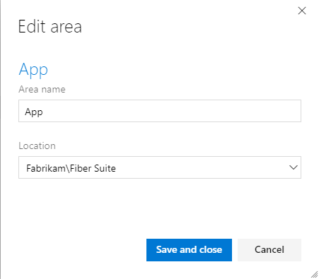
	
	Choose **Save and close** when done. 

3. Repeat steps 2 and 3 for the remaining feature team area paths. 

::: moniker-end

::: moniker range="<= tfs-2018"

1.  Connect to the project you want to configure to support SAFe, and use the gear icon  to open the administration page for the default team.  
2.  On the **Areas** page, create a child under the top-level area path and name it to correspond to one of the program teams you'll create.

	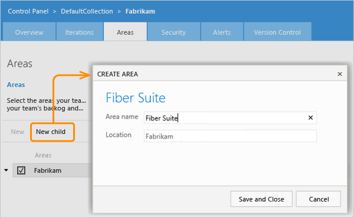  

3.  Next, create a second area at the same child level, and name it after the second program team.  

4.  Under each program area, create a child area for each feature team that will support their respective program team. You should end up with a 3-level area path hierarchy.

	  
::: moniker-end

## Define Iteration Paths  

To track progress towards Releases, create your iteration path structure. Unlike area paths, multiple teams can share the same iteration path structure. Sharing the iteration structure lets multiple teams work in the same sprint cadence towards the same release trains.  

If you already have iterations for your default team, you can rename them. You'll want to create an iteration structure that supports your entire team structure, not just one team.  

::: moniker range=">=azure-devops-2019"

1. From the **Project Settings** page, choose **Project configuration** and then **Iterations**.  

::: moniker-end

::: moniker range="<= tfs-2018"

1. Under the default iteration, which shares the same name as the project, create a child iteration that will represent your first program increment (PI). Optionally, add a start and end date for the PI, but keep in mind that the iteration will be broken down further into sprints.

	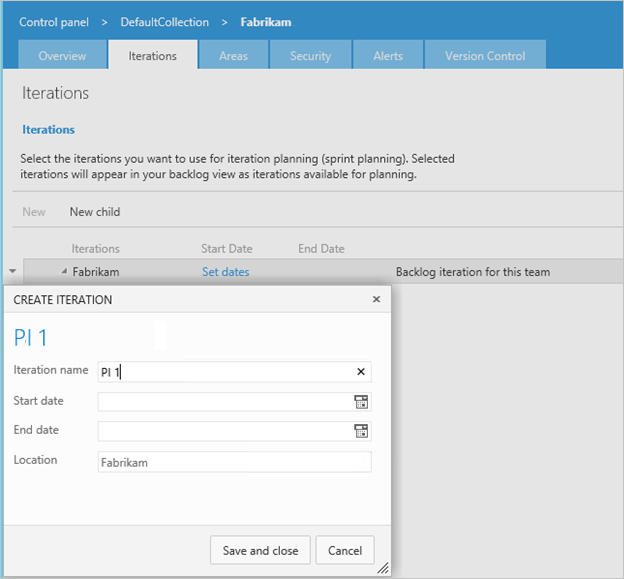

2. Next, create a child iteration for each Sprint within the PI. Set dates for these sprints to correspond your feature teams' cadences.  

	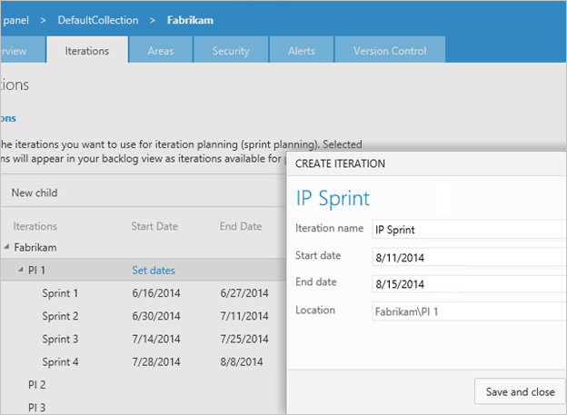

::: moniker-end

::: moniker range=">= azure-devops-2019
"
## Configure your teams 

3. Select the team to configure it. To select the set of sprints and area paths the team plans to use, choose **Iterations and areas** See [Define area paths and assign to a team](set-area-paths.md) and [Define iteration paths (also known as sprints) and configure team iterations](set-iteration-paths-sprints.md). 

	> [!div class="mx-imgBorder"]
	> 

	> [!IMPORTANT]  
	> Team tools aren't available until the team's default area path is set. If you haven't created one or more Area Paths for the team to use, then [do that now](set-area-paths.md). Area Paths must be created for the project first, then assigned to the team. 

	From the team profile, you can do these additional tasks:  
   - [Add team administrators](add-team-administrator.md)
   - [Add team members](#add-team-members)
   - [Navigate to team notifications](../../notifications/howto-manage-team-notifications.md)
   - [Navigate to and set default team dashboard permissions](../../report/dashboards/dashboard-permissions.md)

To configure other team features, see [Manage teams and configure team tools](manage-teams.md).

### Track bugs as requirements or tasks? 

::: moniker-end

::: moniker range="<= tfs-2018"

## Configure your teams

In this section, we'll show how to configure a hierarchical team structure which maps to the hierarchical area paths we created previously.
This structure maps the following SAFe teams to your Agile tools' teams:  
- Portfolio team -> default top-level team, the Fabrikam team  
- Program teams -> secondary-level teams, Fiber Suite and Service Suite  
- Feature teams -> tertiary-level teams defined under Fiber Suite and Service Suite.  
- 
  If you need more-detailed guidance, see [Portfolio management](portfolio-management.md).  

You'll need to be a [project administrator](../../organizations/security/add-users-team-project.md) to perform these steps. 

### Track bugs as requirements or tasks? 

### Create and configure each Program team

1. From the Overview page for the project, create a new team. Make sure that you clear the checkbox for Create an area path with the name of the team.  

	  

2. Choose the team from the list, go to the Areas page, and select the check box next to the area path that you previously created for that team.  

	  

3. Use the context menu to exclude sub-areas. By excluding sub-areas, the team's backlog only includes those items whose Area Path matches the team's default area path.

	  

4. Next, configure the iterations that will be active for the program team. In this example, we have configured three PIs, each with five two-week sprints. Four of the sprints are regular sprints and the last sprint is an Innovation and Planning (IP) sprint.  
	  
  
	Because the Fiber Suite program team is concerned with Release Trains, we choose PI 1, 2, and 3, but we don't choose the individual sprints.

6. Once you've selected which iterations are active for the team, add users to the new team. Ideally, you would add the scrum masters for each feature team, product owners, as well as the Release Train Engineers (RTEs) to the program teams, such as Fiber Suite.  

	  

6. If you've more than one team at the program level, repeat steps 1 through 4 for each program team. 

### Create and configure each Feature team

Next, we'll create some feature teams to get work done at the third level of the team hierarchy. Each feature team will contribute sprint work that rolls up into the PI. The number of teams you create will depend on the size of your organization.

1. Create a new team from the administration page for the original team, and name the team. Just like before, make sure you clear the check box next to **Create an area path with the name of the team**.

	  

2. Just as before, choose the team from the list, go to the Areas page, and select the check box next to the area path that you previously created for that team.  

	  

3. Configure iterations for the team, using the PIs and sprints you created earlier. Unlike the program teams, this time select the individual sprints as the working iterations for the feature team.  

	  

4. Lastly, add the accounts for the developers, testers, and the scrum master for the team. Your Agile tools support assigning a scrum master to multiple teams. The scrum master can track work across multiple teams.  

	 

5. Repeat steps 1 through 4 for each feature team in your organization. Make sure that the default area path you configure for the team is sub-area path under its corresponding program-level area path. This ensures rollup from feature teams to program teams.

### Configure the Portfolio team

Now that your sub-team structure is configured, we reconfigure the default team to act as the Portfolio team. While this team will continue to have the name of the project, the changes you make to this top-level team will help ensure that it effectively tracks epics across PIs at the highest level.  

1. On the Areas page for the project, change the settings so that sub-areas are not included. Make sure you choose the project and not the default team, Fabrikam.  

	  

2. On the Iterations page, clear the check boxes next to all iterations except for the root level, which cannot be cleared. Because the Portfolio team is only concerned with epics that span PIs, it only uses the root iteration and not the PIs or sprints. Portfolio teams don't work in sprints.  

	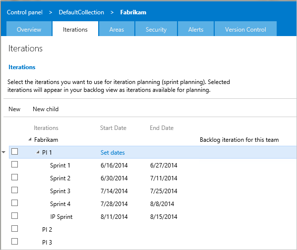  

3. Lastly, add and remove users from the Portfolio team appropriate to this level. From the Overview page, choose the default team.  

	   

	If you're following SAFe, you'll probably want to add portfolio managers, enterprise-level architects, and Release Train Engineers (RTEs) at this level and remove everyone else.

	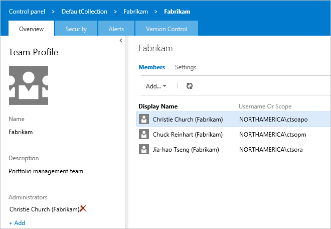

## Update the Area Path for existing work items

For any existing work items to show up on a team's backlog, you must update the Area path of each work item to the team's default area path. You can use the bulk edit feature from your web browser or you can use Excel.  

1. Create a query that contains the work items you want to edit, select the ones you want to edit, and then open the context menu from any one of the selected items.  

	   

2. Select the area path that corresponds to the team's default area path.  

	   

3.  Bulk save all work items that you modified.

	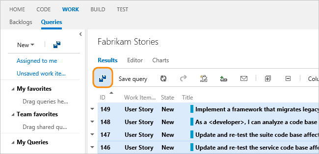  

	For more info on bulk modifying work items, see [Bulk modify work items](../backlogs/bulk-modify-work-items.md).

## Add epics and map epics to features

You add epics in the same way you add user stories and features. From the Portfolio team's backlog page for epics, add an epic backlog item.

   

Add as many epics as you need. Drag them to reorder them and have them listed in their order of importance.

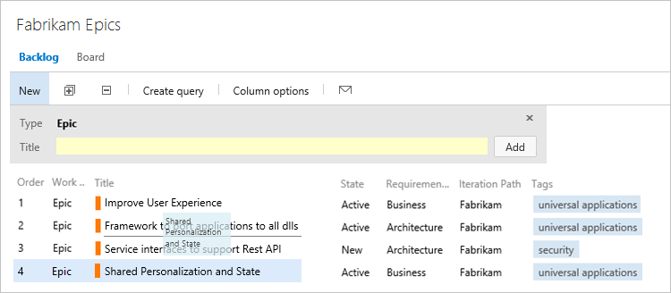   

The default Business Value for epics is Business, but you can change this to Architectural by opening the form.  

  

You can also add tags to your epics, to help you track the investment themes each epic supports.  

Now view your epics on the Kanban board. To get this view, you need to [customize the Kanban columns to rename and add intermediate workflow states](../boards/add-columns.md). For a description of these states&mdash;Funnel, Review, Analysis, Portfolio Backlog, and Implementing (not shown)&mdash;see [Business Epic Kanban Abstract](http://scaledagileframework.com/business-epic-kanban/).

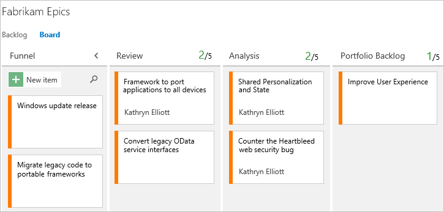

However, this is not very interesting yet. Nothing is in progress, and you can't drill down to see which features support your epics. You'll want to map existing features to the epics you just created, and map user stories to those features, if they're not already mapped.  

## Map multiple items if you've an existing backlog 

Mapping work items is easy using the mapping pane. First, turn on the mapping pane from the features or stories backlog page. Here, we choose the Fiber Suite team and turn on both the mapping pane and the view to see the hierarchy of features mapped to epics.

Note that if you've already changed the area path of all your features to the appropriate program-level team, the features list will be empty, because the Portfolio team does not own any features! In that case, switch to one of the program teams.  

Drag items from the backlog onto the item you want to associate as a parent. Keep in mind that you can only map features to epics. Similarly, you can only map the third level of backlog item (whether that is user story, backlog item, or requirement) to features. 

Repeat this process at each backlog level until you've created the hierarchy you want. 

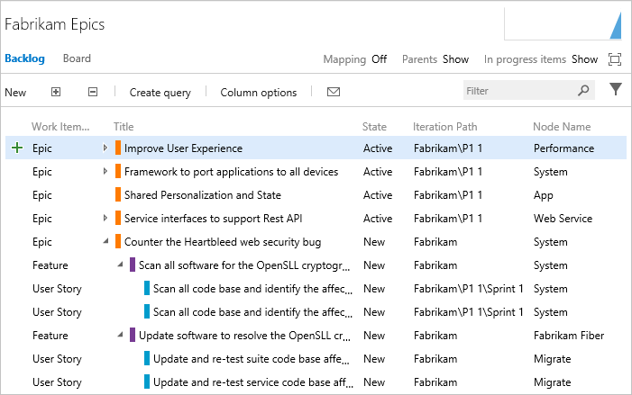  

What about features already in progress? They definitely won't appear on the Portfolio team's backlog. They are the responsibility of the program teams, so they appear on that team's backlog. (This is actually a function of the area path set for the work item; a work item will only appear on a team's backlog if you assign it to the area path you created for that team.) You can map them from there.  

You can also [bulk edit work items and manage their hierarchy in Microsoft Excel](../backlogs/office/bulk-add-modify-work-items-excel.md).  

Since an important aspect of SAFe is to map work to business or architecture goals, you'll want to make sure to set the Value Area=Architectural for any feature mapped to an architecture epic. (Because the default choice is Business, you don't have to change the field for any item that supports a business epic.) You can also add tags to track the investment.  

The same principles apply to user stories in progress. You can map them to features, change the requirement type to Architecture for work that you do to support architectural epics, and add tags for tracking themes.  

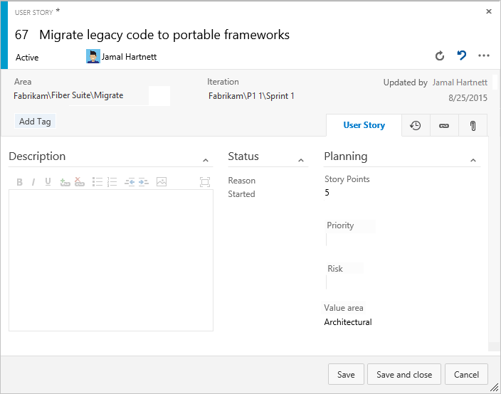  

## Try this next

> [!div class="nextstepaction"]
> [Customize Azure Boards to support SAFe&reg; ](safe-customize.md)

## Try this next

> [!div class="nextstepaction"]
> [Customize Azure Boards to support SAFe&reg; ](safe-customize.md)

## Related articles

<!--- To be provided --> 
