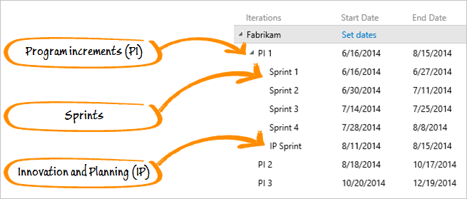
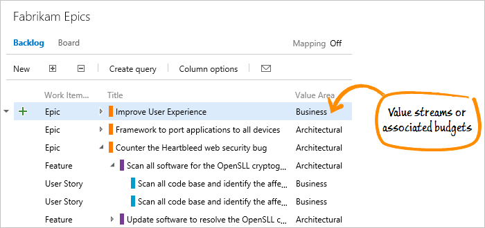

# How SAFe&reg; concepts map to Azure Boards artifacts

<!--- Intro To be provided --> 

## SAFe&reg; portfolios, programs, and teams map to Agile tool teams and projects  

Because your Agile tools support a hierarchical team structure, each team has its own view of their work which rolls up to the next level within the team hierarchy.  

  

To support SAFe teams, you reconfigure the default team as the Portfolio team to manage your epics. You then create sub-teams for program-level work and team-level work. Work can be tracked across teams and throughout each of the levels.

## SAFe&reg; backlogs map to your Agile tools backlogs

Out of the box, the Agile process supports user story, feature, and epic backlog levels. The hierarchical backlog structure shows work done to support features and user stories in the progress of an epic.  

## SAFe&reg; releases, iterations, and sprints map to iterations

SAFe Release Trains, Releases, Iterations, Program Increments (PIs), and Sprints map easily to your iteration paths. By sharing iterations across the team hierarchy, you manage the releases in a cohesive manner. 

  

Because epics can span several release trains, the Portfolio team isn't associated with any specific iterations. Program teams track their Feature deliverables, which ship with a PI. And Feature teams work in Sprints to complete several stories. Each team chooses which iterations will support them to track their focused set of deliverables.

  

## SAFe&reg; value streams and budgets map to tags and the Value Area field  
You can use tags for a quick and easy way to map epics to their Value Streams, strategic themes, and associated budgets.

  

With tags that you add to work items, you can:

- Filter any backlog or Kanban board
- Create queries based on tags, and filter query results by tags
- Create progress and trend charts or reports based on tags 

For a more robust mapping of work to architecture or business features, you can specify the Value Area for each epic, feature, or story.  

  
 

## Related articles

<!--- To be provided --> 