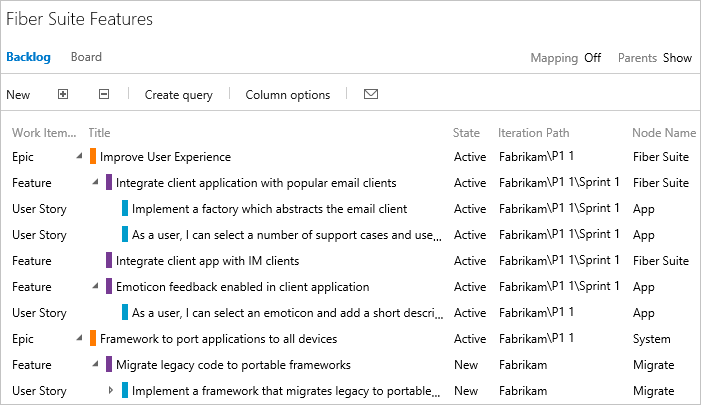
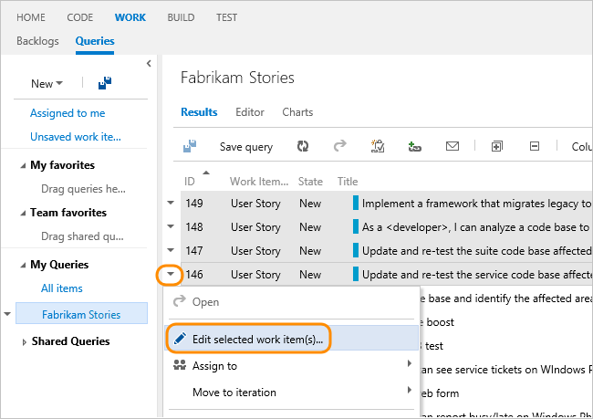
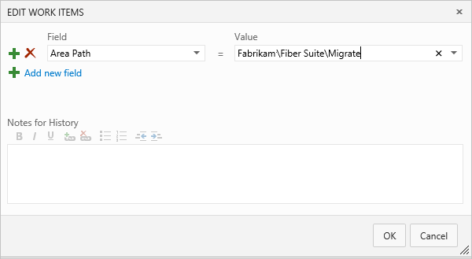
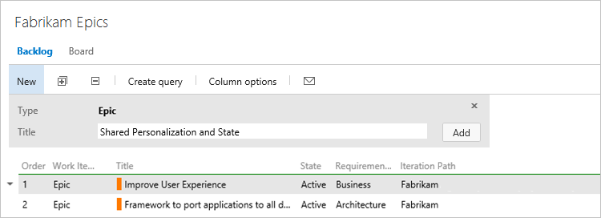
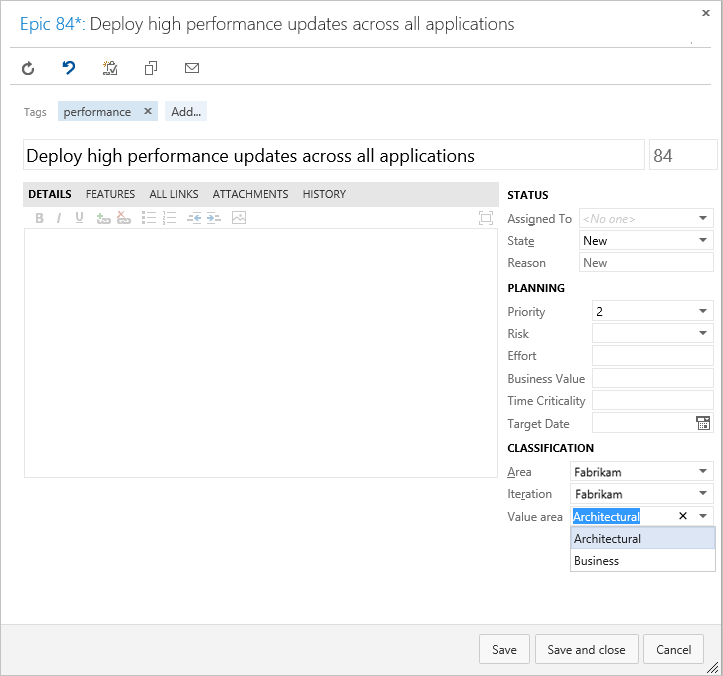
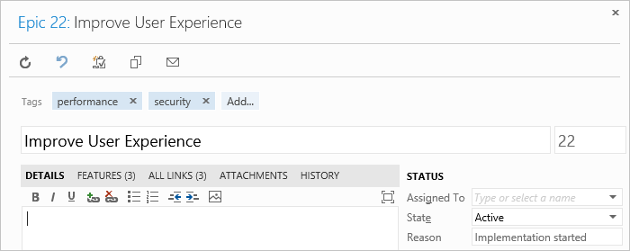

# Plan and track SAFe&reg; programs and portfolios  

[!INCLUDE [temp](../includes/version-vsts-tfs-all-versions.md)]

Once you've configured your Agile tools to support SAFe, trace relationships can be created from stories all the way up to epics. Additionally, you can view progress from the portfolio, program, and feature team levels.  

This article walks you through some of the basic tools you'll use to plan and track your SAFe&reg; programs and portfolios. Specifically, you'll learn how to quickly perform these tasks:

>[!div class="checklist"]      
> - Define epics, features, and stories  
> - Group or map stories to features, and features to epics
> - Assign value streams  
> - Plan a sprint 
> - Review feature team progress
> - Review program features
> - Review portfolio epics 

## Define epics, features, and stories

## Map features to epics, and stories to features

The program team can map features to epics using the mapping pane. Feature teams can use the same experience to map their stories to features.
 

  

## View plan and progress  

### Portfolio team's view 

To track the progress of epics that span Releases, the Portfolio team's backlog shows epics. Each epic can be expanded to show the features and user stories that support it.

  

The Portfolio team can also view the progress of epics on their Kanban board.

  

 
> [!TIP]  
> You can also [customize the card color based on various criteria](../../boards/boards/customize-cards.md#style-rule), such as the Value Area=Architectural, by applying styling rules.  

### View Progress Rollup

<!--- To be provided --> 

### View Feature Timeline

<!--- To be provided --> 

### View Delivery Plans  

<!--- To be provided --> 

## Program teams' progress view 

Program teams, primarily concerned with Release Trains, can see the features in their backlog, along with the PIs with which they're associated.

  

Just like the Portfolio team, they can also toggle their view to see which epics their features support, or the user stories that support their features, or both.  

Another view available to program teams shows query-based graphs of release train progress, backlog items, or active tasks during a shipping sprint. A customizable home page view is available to each team.

  

Since so much of a program team's work revolves around PIs and Release Trains, a custom report showing the scheduled shipping dates and what is projected to be on any given train might be useful. In addition, you can take advantage of the [rich reporting options and built-in reports](../../report/dashboards/overview.md).

### View Feature Timeline

<!--- To be provided --> 

### View Delivery Plans  

<!--- To be provided --> 

## Feature teams' view of progress

For individual feature teams, their backlog view shows the Stories that they're working on.

  

Because feature teams don't own epics or features, epics and features don't appear in their team-level backlog views. However, if the team wants to know which epics and features their stories support, they can turn on those views from their backlog.

  

They can also break down their work into tasks and use the taskboard to keep themselves on track during specific sprints.

The chart view of queries becomes very useful in the Innovation and Planning (IP) sprint, when feature teams work together to stabilize the features scheduled for a Release.  

  

For everything else, it is very much business as usual for individual feature teams. They can sprint in their usual cadences, use their Kanban board and taskboard to track progress and break down work into manageable chunks.  

However, now their progress on individual stories is visible to their program and portfolio management teams. The management view reflects what they do.

## Update the Area Path for existing work items

For any existing work items to show up on a team's backlog, you must update the Area path of each work item to the team's default area path. You can use the bulk edit feature from your web browser or you can use Excel.  

1. Create a query that contains the work items you want to edit, select the ones you want to edit, and then open the context menu from any one of the selected items.  

	   

2. Select the area path that corresponds to the team's default area path.  

	   

3.  Bulk save all work items that you modified.

	  

	For more info on bulk modifying work items, see [Bulk modify work items](../backlogs/bulk-modify-work-items.md).

## Add epics and map epics to features

You add epics in the same way you add user stories and features. From the Portfolio team's backlog page for epics, add an epic backlog item.

   

Add as many epics as you need. Drag them to reorder them and have them listed in their order of importance.

   

The default Business Value for epics is Business, but you can change this to Architectural by opening the form.  

  

You can also add tags to your epics, to help you track the investment themes each epic supports.  

Now view your epics on the Kanban board. To get this view, you need to [customize the Kanban columns to rename and add intermediate workflow states](../boards/add-columns.md). For a description of these states&mdash;Funnel, Review, Analysis, Portfolio Backlog, and Implementing (not shown)&mdash;see [Business Epic Kanban Abstract](http://scaledagileframework.com/business-epic-kanban/).

However, this is not very interesting yet. Nothing is in progress, and you can't drill down to see which features support your epics. You'll want to map existing features to the epics you just created, and map user stories to those features, if they're not already mapped.  

## Map multiple items if you've an existing backlog 

Mapping work items is easy using the mapping pane. First, turn on the mapping pane from the features or stories backlog page. Here, we choose the Fiber Suite team and turn on both the mapping pane and the view to see the hierarchy of features mapped to epics.

Note that if you've already changed the area path of all your features to the appropriate program-level team, the features list will be empty, because the Portfolio team does not own any features! In that case, switch to one of the program teams.  

Drag items from the backlog onto the item you want to associate as a parent. Keep in mind that you can only map features to epics. Similarly, you can only map the third level of backlog item (whether that is user story, backlog item, or requirement) to features. 

Repeat this process at each backlog level until you've created the hierarchy you want. 

  

What about features already in progress? They definitely won't appear on the Portfolio team's backlog. They are the responsibility of the program teams, so they appear on that team's backlog. (This is actually a function of the area path set for the work item; a work item will only appear on a team's backlog if you assign it to the area path you created for that team.) You can map them from there.  

You can also [bulk edit work items and manage their hierarchy in Microsoft Excel](../backlogs/office/bulk-add-modify-work-items-excel.md).  

Since an important aspect of SAFe is to map work to business or architecture goals, you'll want to make sure to set the Value Area=Architectural for any feature mapped to an architecture epic. (Because the default choice is Business, you don't have to change the field for any item that supports a business epic.) You can also add tags to track the investment.  

The same principles apply to user stories in progress. You can map them to features, change the requirement type to Architecture for work that you do to support architectural epics, and add tags for tracking themes.  

  

## Manage dependencies

Best ways to manage dependencies, what flows into what? 

## Related articles

<!--- To be provided --> 

<!---
Filtering tips

--> 