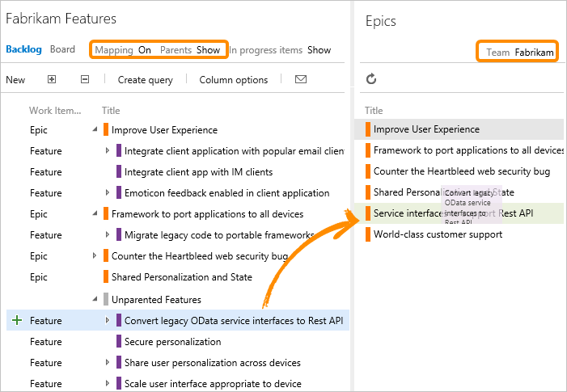
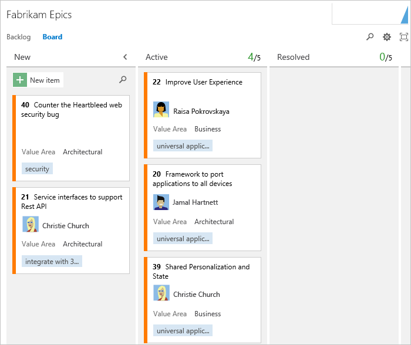
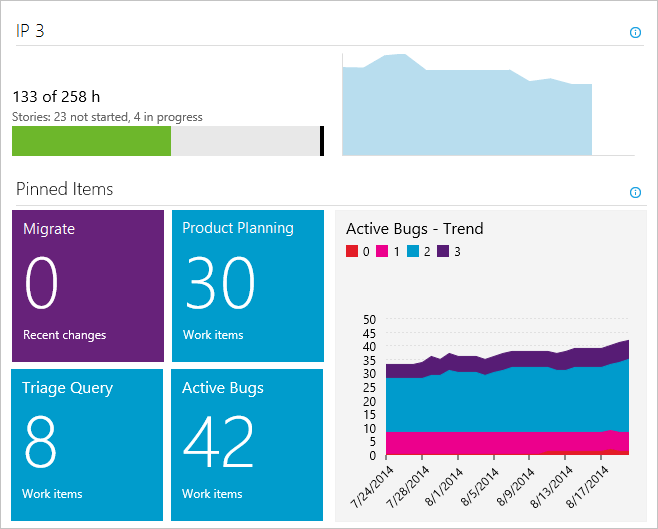
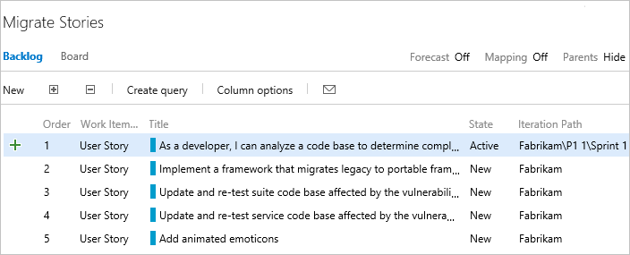
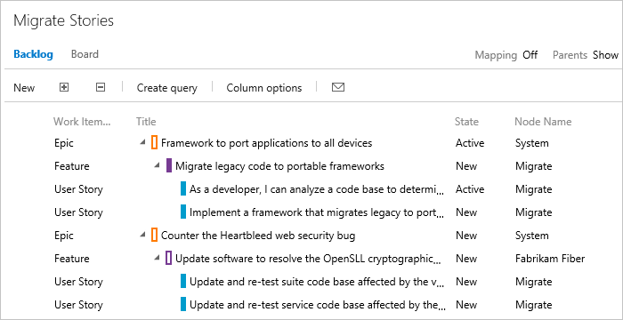
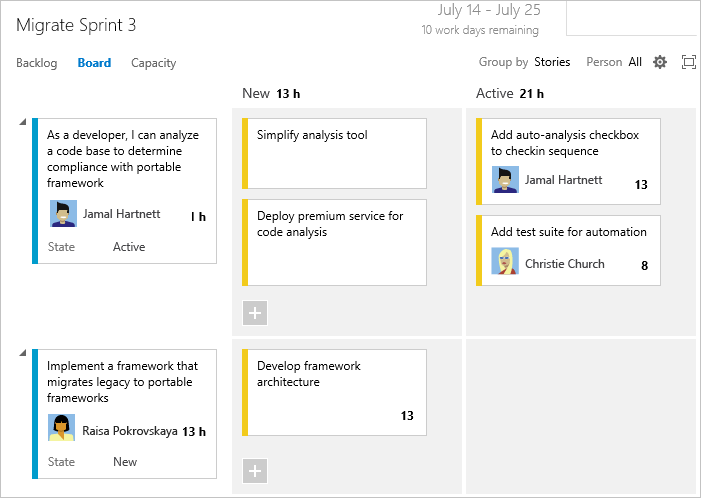
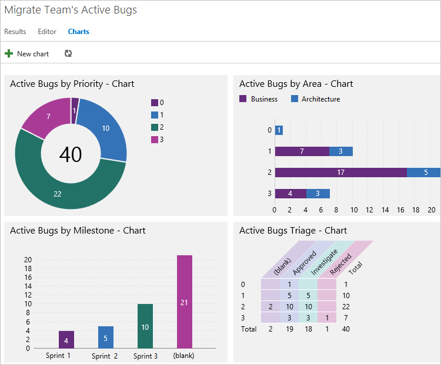

# Plan and track SAFe&reg; programs and portfolios  

[!INCLUDE [temp](../includes/version-vsts-tfs-all-versions.md)]

Once you've configured your Agile tools to support SAFe, trace relationships can be created from stories all the way up to epics. Additionally, you can view progress from the portfolio, program, and feature team levels.  

This article walks you through some of the basic tools you'll use to plan and track your SAFe&reg; programs and portfolios. Specifically, you'll learn how to quickly perform these tasks:

>[!div class="checklist"]      
> - Define epics, features, and stories  
> - Group or map stories to features, and features to epics
> - Assign value streams  
> - Plan a sprint 
> - Review feature team progress
> - Review program features
> - Review portfolio epics 

## Define epics, features, and stories

## Map features to epics, and stories to features

The program team can map features to epics using the mapping pane. Feature teams can use the same experience to map their stories to features.
 

  

## View plan and progress  

### Portfolio team's view 

To track the progress of epics that span Releases, the Portfolio team's backlog shows epics. Each epic can be expanded to show the features and user stories that support it.

  

The Portfolio team can also view the progress of epics on their Kanban board.

  

 
> [!TIP]  
> You can also [customize the card color based on various criteria](../../boards/boards/customize-cards.md#style-rule), such as the Value Area=Architectural, by applying styling rules.  

### View Progress Rollup

<!--- To be provided --> 

### View Feature Timeline

<!--- To be provided --> 

### View Delivery Plans  

<!--- To be provided --> 

## Program teams' progress view 

Program teams, primarily concerned with Release Trains, can see the features in their backlog, along with the PIs with which they're associated.

  

Just like the Portfolio team, they can also toggle their view to see which epics their features support, or the user stories that support their features, or both.  

Another view available to program teams shows query-based graphs of release train progress, backlog items, or active tasks during a shipping sprint. A customizable home page view is available to each team.

  

Since so much of a program team's work revolves around PIs and Release Trains, a custom report showing the scheduled shipping dates and what is projected to be on any given train might be useful. In addition, you can take advantage of the [rich reporting options and built-in reports](../../report/dashboards/overview.md).

### View Feature Timeline

<!--- To be provided --> 

### View Delivery Plans  

<!--- To be provided --> 

## Feature teams' view of progress

For individual feature teams, their backlog view shows the Stories that they're working on.

  

Because feature teams don't own epics or features, epics and features don't appear in their team-level backlog views. However, if the team wants to know which epics and features their stories support, they can turn on those views from their backlog.

  

They can also break down their work into tasks and use the taskboard to keep themselves on track during specific sprints.

The chart view of queries becomes very useful in the Innovation and Planning (IP) sprint, when feature teams work together to stabilize the features scheduled for a Release.  

  

For everything else, it is very much business as usual for individual feature teams. They can sprint in their usual cadences, use their Kanban board and taskboard to track progress and break down work into manageable chunks.  

However, now their progress on individual stories is visible to their program and portfolio management teams. The management view reflects what they do.
  

## Manage dependencies

Best ways to manage dependencies, what flows into what? 

## Related articles

<!--- To be provided --> 

<!---
Filtering tips

--> 