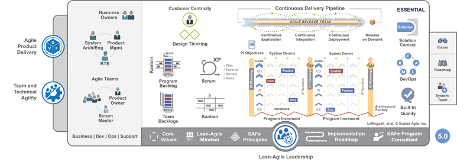
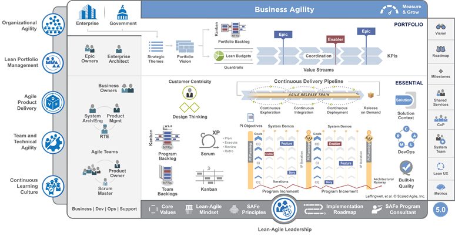
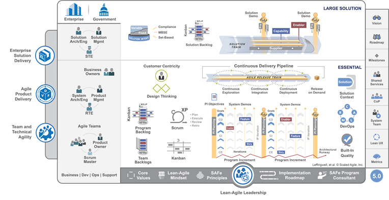

# Implement Scaled Agile Framework&reg; 

[!INCLUDE [temp](../includes/version-vsts-only.md)]

As enterprises are benefiting from individual agile teams, the question now is how do we scale these practices across teams and gain a portfolio view of the progress of agile teams throughout the enterprise? To address these needs, many businesses are using the Scaled Agile Framework&reg; (SAFe&reg;). 

If you're familiar with Scrum but not familiar with SAFe®, [these videos at Scaled Agile](https://www.scaledagileframework.com/videos-and-presentations/) are a good way to orient yourself.  

This article introduces the components of Azure Boards that support SAFe®: 
>[!div class="checklist"]  
> * The Scaled Agile Framework®
> * Essential SAFe®
> * Portfolio SAFe®
> * Large Solution SAFe®
> * Quick reference mapping
> * Azure Boards implementation of SAFe®

[!INCLUDE [temp](../includes/note-safe-articles.md)]

## The Scaled Agile Framework®

The SAFe® big picture addresses how a portfolio vision is met by a hierarchy of teams, all concerned with specific objectives. This framework breaks down epics into features and stories, which teams work on in Sprints and deliver through Program Increments (PIs) and Release Trains. Also, the portfolio backlog can track how deliverables map to value streams and associated budgets.  

### Version 5.0 

 

Reproduced with permission from &#169; 2011-2020  [Scaled Agile Inc.](http://www.scaledagile.com/). All rights reserved.  

SAFe® and Scaled Agile Framework are registered trademarks of [Scaled Agile Inc.](http://www.scaledagile.com/) 

### SAFe® 5.0 Business Agility 

Many SAFe® practices include growing a culture that supports agility, alignment, and autonomy, all while being customer centric.

 

## Essential SAFe®

Essential SAFe&reg; requires support for the artifacts and practices illustrated in the following poster. 

 
 
All of these artifacts and practices are supported by Azure Boards. 

- **Stories, Features**, and **Enablers**: Implemented as work items which capture information and status of work. These work items automatically appear on team backlogs and Kanban boards. 
- **Team Backlogs** and **Program Backlogs**: Implemented as team backlogs which filter work items assigned to a team and support prioritizing and grouping of work.  
- **Scrum** and **Kanban**: These practices are fully supporting using Kanban boards, Sprint backlogs and Taskboards, teams, and sprint cadences. 
- **Iterations**, **Innovation and Planning (IP) Iteration**, **Program Increments (PI)**, **Milestones**, and **Release Trains**: Implemented via a flat-list or a hierarchical configuration of Iteration Paths. 
- **Agile Release Train**: Implemented by a set of Agile teams and Program teams configured to support specific team and program views. 
- **PI Objectives**, **Team Goals**, and  **Solution context**: Teams can use the built-in project wiki to share objectives, goals, customer information, and solution requirements.   

## Portfolio SAFe®

Portfolio SAFe® adds support for managing portfolios through epics, enablers, and value streams.  

 

Azure Boards provides supports for portfolio components includes the following:

- **Epics**: Map to the Epic work item type and allow tracking, grouping, and rollup of child items. 
- **Portfolio backlogs**: Implemented as a portfolio backlog that supports filtering of work based on review of business needs.  
- **Portfolio Vision** and **Strategic Themes**: Business owners and portfolio managers can use the built-in project wiki to share their vision, objectives and goals. 
- **Value Streams**: Value streams can be tracked using tags or custom fields. 
- **Lean budgets**: Budget information can be captured in custom fields and rolled up to gain visibility to the epic level. 
- **KPIs**: Several reports and dashboard widgets provide out-of-the box metrics. Power BI and the Analytics service provide support to create custom reports quickly. 

## Large Solution SAFe®

Large Solutions SAFe® includes support for a Solution Backlog, Solution Trains, and Capabilities.   

 

You can implement large solutions in much the same way as you implement Portfolio SAFe®. However, you can also add custom work item types and custom backlogs to support additional solution requirements.       

### Full SAFe® 

Full SAFe® includes the three levels of Essential SAFe®, Large Solution SAFe®, and Portfolio SAFe®. 

 

## How SAFe® artifacts map to Azure Boards  

The following table maps SAFe® terms or artifacts to the equivalent Azure Boards term or artifact. Choose the link to learn about implementation details. 

:::row:::
   :::column span="":::
      **SAFe® term or artifact**
   :::column-end:::
   :::column span="3":::
      **Azure Boards term or artifact** 
   :::column-end:::
:::row-end:::
:::row:::
   :::column span="":::
      Agile teams
   :::column-end:::
   :::column span="3":::
      [**Teams**](safe-concepts.md#teams). You define a hierarchy of teams to meet the needs of feature or development teams, program and portfolio teams, or solution train teams. 
   :::column-end:::
:::row-end:::
:::row:::
   :::column span="":::
      Agile Release Train (ART) 
   :::column-end:::
   :::column span="3":::
       [**Teams**](safe-concepts.md#teams). Agile teams manage the work of deliverables for a set of features. Each Agile team has a set of Agile tools to support the flow of work and review progress and deliverables. 
   :::column-end:::
:::row-end:::
:::row:::
   :::column span="":::
      Budgets
   :::column-end:::
   :::column span="3":::
      [**Tags, Value Area**](safe-concepts.md#tags). You can use tags or the *Value Area* field to track work associated with a specific budget or value stream. 
   :::column-end:::
:::row-end:::
:::row:::
   :::column span="":::
      Capabilities
   :::column-end:::
   :::column span="3":::
      [**Work item**](safe-concepts.md#work-items). You define, plan, and track Capabilities similar to Epics, Features, and Stories. You capture them in work items and within various team backlogs. 
   :::column-end:::
:::row-end:::
:::row:::
   :::column span="":::
      Enablers
   :::column-end:::
   :::column span="3":::
      [**Work item**](safe-concepts.md#work-items). You define, plan, and track Enablers similar to Epics, Features, and Stories. You capture them in work items and within various team backlogs. 
   :::column-end:::
:::row-end:::
:::row:::
   :::column span="":::
      Epics
   :::column-end:::
   :::column span="3":::
      [**Epic work item**](safe-concepts.md#work-items). You define an Epic using the Epic work item type. Epics are at the top of the work item hierarchy of Epics, Features, and Stories.   
   :::column-end:::
:::row-end:::
:::row:::
   :::column span="":::
      Features
   :::column-end:::
   :::column span="3":::
      [**Feature work item**](safe-concepts.md#work-items). You define a Feature using the Feature work item type. Features are a container for a number of Stories and are represented in their own portfolio backlog.  
   :::column-end:::
:::row-end:::
:::row:::
   :::column span="":::
      Innovation and Planning (IP) Iteration 
   :::column-end:::
   :::column span="3":::
      [**Iteration Path**](safe-concepts.md#iterations). You define Iteration Paths for a project and set their start and end dates. Each team subscribes to the iterations they work with. 
   :::column-end:::
:::row-end:::
:::row:::
   :::column span="":::
      Iteration 
   :::column-end:::
   :::column span="3":::
      [**Iteration Path**](safe-concepts.md#iterations). You define Iteration Paths for a project and set their start and end dates. Each team subscribes to the iterations they work with.   
   :::column-end:::
:::row-end:::
:::row:::
   :::column span="":::
      Milestones
   :::column-end:::
   :::column span="3":::
      [**Milesones and key events**](safe-concepts.md#milestones). Milestones can be configured as a one day event or a work item which acts as a successor to a number of work item deliverables.  (Sanity check on this) 
   :::column-end:::
:::row-end:::
:::row:::
   :::column span="":::
      Portfolio Backlog
   :::column-end:::
   :::column span="3":::
      [**Portfolio backlog**](safe-concepts.md#backlogs-boards). A portfolio backlog lists the epics associated with a portfolio with the option to expand and display the child Features and Stories.  
   :::column-end:::
:::row-end:::
:::row:::
   :::column span="":::
      Portfolio Kanban
   :::column-end:::
   :::column span="3":::
      [**Epic Board**](safe-concepts.md#backlogs-boards). The Epics board displays Epics as cards that supports viisualizing and managing the flow of Epics and Features from concept to completion. 
   :::column-end:::
:::row-end:::
:::row:::
   :::column span="":::
      Portfolio Vision 
   :::column-end:::
   :::column span="3":::
      [**Wiki**](safe-concepts.md#wiki). Use the project wiki to share broadly within the organization information related to strategy, solutions, and how teams will collaborate to produce portfolio and program deliverables.    
   :::column-end:::
:::row-end:::
:::row:::
   :::column span="":::
      Program Backlog
   :::column-end:::
   :::column span="3":::
      [**Feature backlog**](safe-concepts.md#backlogs-boards). A Feature backlog lists the Features associated with a progream with the option to expand and display the child Stories.  
   :::column-end:::
:::row-end:::
:::row:::
   :::column span="":::
      Program Kanban
   :::column-end:::
   :::column span="3":::
      [**Features Board**](safe-concepts.md#backlogs-boards). The Features board displays Features as cards that supports viisualizing and managing the flow of Features and Stories from concept to completion.
   :::column-end:::
:::row-end:::
:::row:::
   :::column span="":::
      Program Increment (PI) 
   :::column-end:::
   :::column span="3":::
      [**Iteration Path**](safe-concepts.md#iterations). Iteration Paths define a timebox for a project with start and end dates. Iteration Paths can be defined from one week to 12 weeks long. 
   :::column-end:::
:::row-end:::
:::row:::
   :::column span="":::
      Retrospectives and reviews 
   :::column-end:::
   :::column span="3":::
      [**Retrospectives**](safe-concepts.md#retrospectives). Each team can add a board to capture, prioritize, and create action items to support their improvement processes. 
   :::column-end:::
:::row-end:::
:::row:::
   :::column span="":::
      Roadmap
   :::column-end:::
   :::column span="3":::
      [**Delivery Plans, Feature Timeline**](safe-review-roadmaps-progress.md#roadmaps). Azure Boards provides configurable views to review roadmaps and team deliverables.
   :::column-end:::
:::row-end:::
:::row:::
   :::column span="":::
      Shared Services
   :::column-end:::
   :::column span="3":::
      TBD. TBD 
   :::column-end:::
:::row-end:::
:::row:::
   :::column span="":::
      Solution
   :::column-end:::
   :::column span="3":::
      TBD. TBD 
   :::column-end:::
:::row-end:::
:::row:::
   :::column span="":::
      Solution Backlog
   :::column-end:::
   :::column span="3":::
      [**Custom portfolio backlog**](safe-customize.md#custom-backlog). You can define a custom work item type and portfolio backlog to capture special business requirements of large solutions, or use Epics and Epic portfolio backlogs to capture solutions. 
   :::column-end:::
:::row-end:::
:::row:::
   :::column span="":::
      Strategic Themes 
   :::column-end:::
   :::column span="3":::
      [**Wiki**](safe-concepts.md#wiki). Strategic Themes, similar to Portfolio Vision, can be captured in a project wiki.  
   :::column-end:::
:::row-end:::
:::row:::
   :::column span="":::
      Stories
   :::column-end:::
   :::column span="3":::
      [**User Story work item**](safe-concepts.md#work-items). User Stories capture the desired functionality to be delivered and are typically sized so as to be completed with a single iteration.    
   :::column-end:::
:::row-end:::
:::row:::
   :::column span="":::
      Team Backlog
   :::column-end:::
   :::column span="3":::
      [**Stories backlog**](safe-concepts.md#backlogs-boards). The Stories backlog lists the User Stories assigned to the area path associated with the team.   
   :::column-end:::
:::row-end:::
:::row:::
   :::column span="":::
      Value Streams
   :::column-end:::
   :::column span="3":::
      [**Tags, Value Area**](safe-concepts.md#tags). You can use tags or the Value Area field to track work associated with a specific budget or value stream. 
   :::column-end:::
:::row-end:::
:::row:::
   :::column span="":::
      Weighted Shortest Job First (WSJF)
   :::column-end:::
   :::column span="3":::
      [**WSJF extension field**](safe-customize.md#wsjf). You can add the WSJF calculated field to work items to compute and store WSJF. 
   :::column-end:::
:::row-end:::

## Azure Boards implementation of SAFe® 

Each of the following articles within this suite of tutorials provide details on how you can configure, customize, and use Azure Boards to implement your SAFe® programs and projects.   

>[!div class="checklist"]  
> * [How SAFe® concepts map to Azure Boards artifacts](safe-concepts.md)  
> * [Configure Azure Boards to support SAFe®](safe-configure-boards.md )  
> * [Customize Azure Boards to support SAFe®](safe-customize.md)   
> * [Plan and track SAFe® programs and portfolios](safe-plan-track-boards.md) 
> * [View SAFe® progress, roadmaps, and metrics](safe-review-roadmaps-progress.md)  

## Try this next

> [!div class="nextstepaction"]
> [How SAFe&reg; concepts map to Azure Boards artifacts](safe-concepts.md)

## Related articles

- [Scale Agile to Large Teams](/azure/devops/learn/agile/scale-agile-large-teams)

## Resources

Resources mentioned earlier in this article and a few more are provided here for convenient reference.  
- SAFe® enabled processes: [Agile](../work-items/guidance/agile-process.md),[Scrum](../work-items/guidance/scrum-process.md), and [CMMI](../work-items/guidance/cmmi-process.md).  
- [Scaled Agile Framework](http://scaledagileframework.com/): SAFe® resource site.  
- [SAFe® in 7 minutes](http://www.youtube.com/watch?feature=player_embedded&v=RXzurBazN-I): video from Inbar Oren, the Lean Samurai.
- [Scaling Agile and SAFe® Metrics with TFS](http://www.incyclesoftware.com/2014/08/scaling-agile-and-safe-metrics-with-tfs/): Blog post that illustrates a SQL Server report developed by InCycle to illustrate how TFS can be used to support scaled agile or SAFe.    
- [Out of the box Reports (SQL Server Reporting Services)](../../report/sql-reports/reporting-services-reports.md): Summarizes the reports TFS provides to monitor progress and code quality.  
- [Track your work when assigned to two or more teams](../sprints/set-capacity.md#track-capacity-per-team): Shows how a developer or tester can track work when they support more than one feature team.  

### About the authors

This article has been updated from the previous white paper developed in collaboration with the following authors:  
- Gordon Beeming is a Software Developer at Derivco in the sunny city of Durban, South Africa. He spends most his time hacking away at the keyboard in Visual Studio or with his family relaxing. His blog is at [31og.com](https://lazy-developer.xyz/) and you can follow him on Twitter at [twitter.com/gordonbeeming](http://twitter.com/gordonbeeming).  
- Brian Blackman is a principal consultant with Microsoft Premier Developer, focusing on affecting ISV partners and Enterprises success in engineering and the marketplace. He has an MBA, and is a CSM, CSP, MCSD (C++), and MCTS and is a Visual Studio ALM Ranger. When he is not Ruck Mastering and contributing to Visual Studio ALM Ranger projects, he spends his time writing code, creating and delivering workshops, and consulting in various concentrations, especially helping organizations in their quest for business agility.  
- Gregg Boer is a principal program manager at Microsoft. Gregg is the product owner for the Agile management experience provided by Azure DevOps and on-premises TFS.
- Kathryn Elliott is a senior technical writer at Microsoft.  
- Susan Ferrell is a senior technical writer and a Visual Studio ALM Ranger.  
- Willy-Peter Schaub is a former program manager with the Visual Studio ALM Rangers at the Microsoft Canada Development Center. Since the mid-'80s, he has been striving for simplicity and maintainability in software engineering. You can follow him on Twitter at [twitter.com/wpschaub](https://twitter.com/wpschaub).  
- Special thanks to the following technical experts for reviewing this article: Mike Douglas (independent consultant, ALM Ranger), Richard Hundhausen (independent consultant, ALM Ranger) and Bill Heys (independent consultant, ALM Ranger), Hosam Kamel (technology solution professional for Microsoft and ALM Ranger).  

<!---
::: moniker range="<= tfs-2018" 

 

### SAFe® 5.0 

 

Business Agility 
Enterprise Solution Delivery
Agile Product Delivery 

::: moniker-end

-->