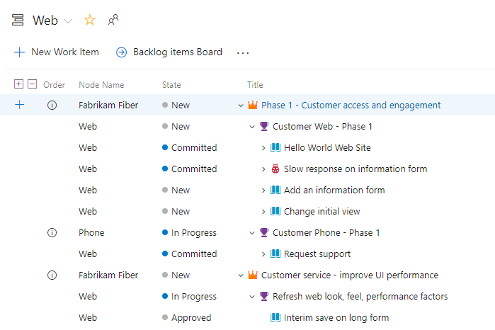
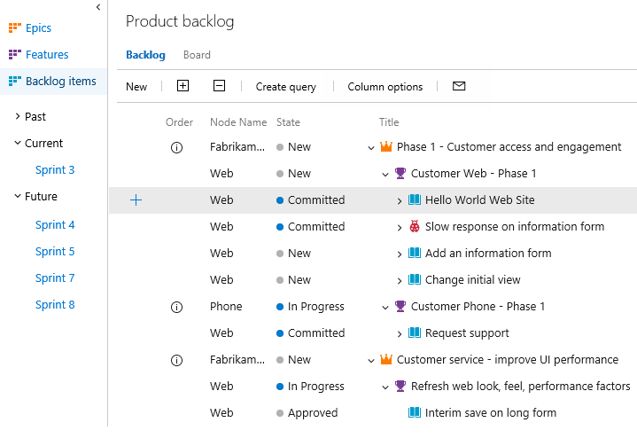

# Manage priorities and gain visibility across teams

[!INCLUDE [version-lt-eq-azure-devops](../../includes/version-lt-eq-azure-devops.md)]

Agile tools provide each team a wealth of ways to gain visibility into their work&mdash;to manage priorities and status and to monitor progress and trends. However, how do you gain visibility across several teams? What tools should you use?

You have three main ways to track progress across several teams.

- Management teams can define [Delivery Plans](#plans) that provide visibility into the deliverables several teams have scheduled
- Each management team can use their Agile tools, and in particular [portfolio backlogs](#portfolio-backlogs), to gain visibility of the feature teams defined under their area path
- Management teams can create [dashboards](#dashboards) that monitor status, progress, and trends across several teams.

For an overview of all team tools, see [Manage teams and configure team tools](../../organizations/settings/manage-teams.md).

::: moniker range=">= tfs-2017"

## Delivery Plans support a view of team backlogs on a calendar timeline

With a Delivery Plan, you gain a tailor-made view across several teams and their development backlogs&mdash;stories, features, or epics. You can use these views to drive alignment across teams by overlaying several backlogs onto your delivery schedule.
::: moniker-end  
::: moniker range="tfs-2017" 
> [!NOTE]
> Delivery Plans, a [Visual Studio Marketplace extension](https://marketplace.visualstudio.com/items?itemName=ms.vss-plans), is available for Azure Boards and TFS 2017.2 and later versions. All users with [basic access](../../organizations/security/change-access-levels.md) can view, add, and configure Delivery Plans. Stakeholders, however, don't have access to Delivery Plans.
::: moniker-end   

::: moniker range="azure-devops"  

When you configure a Delivery Plan, you select the teams and backlog levels of interest. You can then interact with the plan to update it and drill into more details. To learn more about Delivery Plans, see [Review team plans](review-team-plans.md).

:::image type="content" source="media/plans/overview-with-callouts.png " border="false" alt-text="Screenshot with callouts of Delivery Plans, collapsed teams.":::   
::: moniker-end 

::: moniker range=">= tfs-2017 < azure-devops"  

When you configure a Delivery Plan, you select the teams and backlog levels of interest. You can then interact with the plan to update it and drill into more details. To learn more about Delivery Plans, see [Delivery Plans](../extensions/delivery-plans.md).

::: moniker-end 

 

## Use portfolio backlogs to track features and epics

The first level of gaining visibility across several teams is to configure your teams and backlogs to support the views you want.

We recommend that you structure your teams as follows:

- Add a management team for a group of feature teams; these teams own epics and turn on only the Epic portfolio backlog level
- Add feature teams to manage features, stories and tasks, and turn on the stories and features backlog levels

The management team creates the epics. Then, they or their feature teams break down the epics into features and then [map their features to the epics](../backlogs/organize-backlog.md) on the management backlog.

> [!TIP]
> By breaking down large goals, epics, scenarios, or features into smaller ones, teams can make better estimates and identify risks and dependencies.

Limiting the backlog levels for each team&mdash;Epics for management teams and Features and Stories for feature teams&mdash;helps each team to stay focused on monitoring the progress of their work. For details on managing team backlog levels, see [Select backlog navigation levels](../../organizations/settings/select-backlog-navigation-levels.md).

With the multi-team portfolio backlog view, you can:
- Review priorities with your team and reorder features to support current priorities
- You can drill down to see the status of each feature's child user stories or PBIs
- Filter the backlog based on keyword or tag to focus on specific teams or categorized items
- (Optional) You can use the [mapping feature](../backlogs/organize-backlog.md) to map user stories or PBIs to features

### View child items owned by other teams 

Management teams can drill down from their portfolio backlog to see how **Epics** are progressing. Drilling down, you can see all the backlog items and features, even though they belong to one of three different teams: Customer Service, Phone, and Web.

::: moniker range=">= azure-devops-2019"
Items that are owned by other teams appear with an information icon,  :::image type="icon" source="../../media/icons/info.png" border="false"::: .  

> [!div class="mx-imgBorder"]  
>    

> [!TIP]    
> Add the **Node Name** field as a column to identify the area path/team associated with the work items. 

::: moniker-end 

::: moniker range=">= tfs-2017 <= tfs-2018"  
Items that are owned by other teams appear with an information icon,  :::image type="icon" source="../../media/icons/info.png" border="false"::: .  

> [!div class="mx-imgBorder"]  
>   

> [!TIP]    
> Add the **Node Name** field as a column to identify the area path/team associated with the work items. 

::: moniker-end 

::: moniker range="<= tfs-2015" 

Items that are owned by other teams appear with hollow-filled bars.  

 

::: moniker-end 

### View backlog items and parent items owned by other teams

Feature teams can turn **Show parents** on their backlogs to see context and those items owned by other teams. 

::: moniker range=">= azure-devops-2019"

Items that are owned by other teams appear with an information icon,  :::image type="icon" source="../../media/icons/info.png" border="false"::: . 

> [!div class="mx-imgBorder"]  
>    

::: moniker-end 

::: moniker range=">= tfs-2017 <= tfs-2018"  
Items that are owned by other teams appear with an information icon,  :::image type="icon" source="../../media/icons/info.png" border="false"::: . 
   
> [!div class="mx-imgBorder"]  
>    
::: moniker-end 

::: moniker range="<= tfs-2015" 
Items that are owned by other teams appear with hollow-filled bars.  

::: moniker-end 

> [!TIP]
> When estimating stories or product backlog items, start with one story point per person per day. Feature teams can later calibrate and adjust those estimates as needed. For example, the [velocity](../../report/dashboards/team-velocity.md) of a seasoned team will be higher than a new team. The size of the work stays the same, but a seasoned team can just deliver faster.

To learn more about this configuration, see [Portfolio management](portfolio-management.md), [Add teams](../../organizations/settings/add-teams.md), and [Organize your backlog](../backlogs/organize-backlog.md).

::: moniker range=">= tfs-2015"

## Add management dashboards with multi-team views

A second method for gaining visibility across teams is to define multi-team focused dashboards that let you view progress, status, and trends. You do define focused dashboards primarily by defining queries that either capture the progress of a single team or several teams. You can then create charts and view trends for each team or for several teams.

The two areas of most interest to management teams are project health and bug debt. The widget catalog provides 10+ widgets you can add to a dashboard to track the status, progress, and health of your project and teams. Also, you can find other widgets in the [Visual Studio Marketplace](https://marketplace.visualstudio.com/search?term=widgets&target=AzureDevOps&category=All%20categories&sortBy=Relevance), Azure DevOps tab.  

For example, here we've added three query-based charts, one for each team, to a dashboard that shows the active and resolved bugs over the previous four weeks.

    

When defining multi-team dashboards, consider the following questions:
- What are you wanting to learn and how will it drive your organization's actions
- What time frame is of interest.

Review [Agile culture](agile-culture.md) and [Practices that scale](practices-that-scale.md) for guidance on team autonomy and organizational alignment.

::: moniker-end

### Project health and progress against goals dashboard 

Use the [Query Results widget](../../report/dashboards/widget-catalog.md#query-results-widget) to provide a list of features by state: 

- Completed features (Done or Closed)
- New features (New or Proposed)
- Features being actively worked (In Progress or Active)

Use the [Chart for work items widget](../../report/dashboards/widget-catalog.md#chart-wit-widget) to add query-based charts. To learn more about creating query-based charts, see [Charts](../../report/dashboards/charts.md).

### Technical debt, bug debt, and activity dashboard 

Another measure of project health and the health of the teams is to monitor bug activity and bug debt. Consider the charts you can create that will help you answer these questions: 
 
- Are bugs getting fixed? At a rate that's acceptable? 
- How stale are bugs? 
- Is the bug debt per team being maintained? 
- Is the ratio of high priority bugs being kept within organizational goals? 

For tips on creating queries based on counts or numeric fields, see [Query by numeric field](../queries/query-numeric.md).

 
::: moniker range=">= azure-devops-2019"

## Use the Analytics Service to gain visibility across teams   

You can add [Widgets based on the Analytics Service](../../report/dashboards/analytics-widgets.md) to a dashboard that show progress for a team. From one dashboard, you can add widgets for any team within the project. 

::: moniker-end

## Track capacity when working on more than one team 

You can track capacity for individuals that participate on more than one team. To learn how, see [Set sprint capacity, Track capacity when working on more than one team](../sprints/set-capacity.md#track-capacity-per-team).

## Limitations of multi-team Kanban board views 

While the management teams you configure can use the Kanban board to monitor feature progress by turning on the Features backlog, there are limitations inherent within these views. Even if the management team and the feature teams configure their Feature [Kanban board columns](../boards/add-columns.md) with identical workflow mapping, updating the Features on one team's Kanban board won't be reflected on another team's Kanban board. 
Only when the work item state changes does the card column reflect the same on all boards.

> [!IMPORTANT]   
> Work items that appear on more than one team's Kanban board can yield query results that don't meet your expectations. Because each team can customize the Kanban board columns and swimlanes, the values assigned to work items which appear on different boards may not be the same. The primary work around for this issue is to maintain single ownership of work items by [team area path](../../organizations/settings/set-area-paths.md). Another option is to add custom workflow states which all teams can use. For details, see [Customize your work tracking experience](../../reference/customize-work.md). 

## Related articles

As you can see, there are many ways you can monitor progress and trends across several teams. The methods you choose will depend on your focus and organizational goals.

Here are some other articles that address working with multiple teams:

- [Backlogs, boards, and plans](../backlogs/backlogs-boards-plans.md)
- [Review team plans](review-team-plans.md)
- [Add teams](../../organizations/settings/add-teams.md)
- [Portfolio management](portfolio-management.md)

