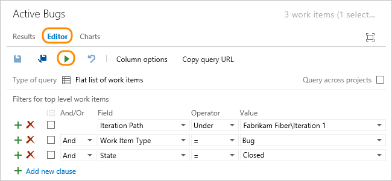
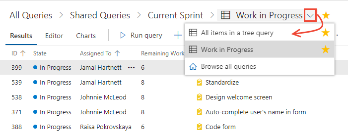

# About managed queries  

[!INCLUDE [temp](../includes/version-all.md)]

List bugs, user stories, or other work items based on field criteria you specify using queries. You can then review these lists with your team, triage work, or perform bulk work item updates. 

If you're just getting started, read [View, run, or email a work item query](view-run-query.md). For a quick reference to query editor tasks and sample queries, see [Query quick reference](query-index-quick-ref.md). 

## Use queries 

A query lists a filtered set of work items. You can initiate a query using the [query editor](using-queries.md). Optionally, you can perform an ad hoc search using the [search box](search-box-queries.md). 

With queries, you can perform these functions: 

- List items to perform bulk updates, assign or reassign    
- Review work that's in progress or recently closed  
- Triage work (set priority, review, update)   
- Create a chart and add it to a dashboard  
- Create a chart to get a count of items or sum a field  
- Create a chart that shows a burndown or burnup over time 
- View a tree of parent-child related work items 

For the mechanics of constructing and saving queries, see [Use the query editor to list and manage queries](using-queries.md). If you find that your queries take too long to return results, review the [Guidance to create high-performing queries](high-performing-queries.md).  

For specific examples, choose one of the following articles listed under [Example queries](#examples).  

## Get started 

If you are looking for a specific work item, use the ad hoc search box. If you want to generate a list of work items to triage, update, chart, or share with others, then use a managed query. 
 
- [View and run a query](view-run-query.md)   
- [Perform an ad hoc search](search-box-queries.md)  
- [Query editor](using-queries.md)    
- [Query operators & macros](query-operators-variables.md)  

For a quick reference to query editor tasks and sample queries, see [Query quick reference](query-index-quick-ref.md). 

### Additional tips for working with queries

- To find work items that are assigned to you, add the **@Me** macros as the value for the **Assigned To** field in one of the query clauses.  
- All valid users with standard access can create queries and folders under the **My Queries** area. To create queries and query folders under **Shared Queries**, you must have the Contribute permission set. For more information, see [Set permissions on queries](../queries/set-query-permissions.md).
- You can modify any query by adding criteria to focus on a product area, an iteration, or another field. To modify a query, [open the query editor](../queries/using-queries.md).   
- You can open any query in [Excel](../backlogs/office/bulk-add-modify-work-items-excel.md), where you can update the fields of one or more work items and publish your changes to the database for tracking work items.  
- You can [visualize status or progress](../../report/dashboards/charts.md) by creating a pie-chart, column chart, or trend chart for flat-list queries. 

::: moniker range=">= azure-devops-2019"
For additional tips when working with the new queries experience or the directory-focused queries views, see [Query FAQs](query-faqs.yml). 
::: moniker-end

## Supported features 

[!INCLUDE [temp](../includes/feature-matrix-filter-queries.md)]

[!INCLUDE [temp](../includes/feature-matrix-query-macros.md)]

[!INCLUDE [temp](../includes/feature-matrix-manage-queries.md)]

<a id="ad-hoc-v-managed" /> 

## Ad hoc vs managed work item queries

You have two ways to perform work item searches: semantic or ad hoc searches and managed queries. 

### Ad hoc search

::: moniker range=">= azure-devops-2019"  

You perform semantic or ad hoc searches using the work item search box (shown below)   

Choose any **Boards** page, enter a keyword or phrase in the search box, and press *Enter* or choose the :::image type="icon" source="../../project/search/media/shared/start-search-icon.png" border="false"::: start search icon.  

> [!div class="mx-imgBorder"]
>     

::: moniker-end   

::: moniker range="<= tfs-2018"  

You perform semantic or ad hoc searches using the work item search box (shown below). 

In the search box, check that the text says _Search work items_. If it doesn't, use the selector to select it. Enter a keyword or phrase in the search box, and press *Enter* or choose the :::image type="icon" source="../../project/search/media/shared/start-search-icon.png" border="false"::: start search icon. 

::: moniker-end   

**Use semantic or ad hoc searches to perform the following tasks:** 
 
- Find a specific work item using its ID or a keyword 
- Find one or more work items across all projects in a fast, flexible manner
- Perform full text search across all work item fields
- Review work items assigned to a specific team member
- Search against specific work item fields to quickly narrow down a list of work items
- Determine what key words will support a managed search

For details about semantic or ad hoc searches, see [Perform a semantic or ad hoc work item search](search-box-queries.md). 

> [!NOTE]    
> With semantic search, you search against a more fully indexed set of fields. With ad hoc search, the number of fields that are indexed are limited.  

### Managed query 

::: moniker range=">= azure-devops-2019"  

You add and run managed queries using the built-in query-editor available from the **Boards>Queries** page.

> [!div class="mx-imgBorder"]
>   

::: moniker-end   

::: moniker range="<= tfs-2018"  
 
You add and run managed queries using the built-in query-editor available from the **Work>Queries** page.
::: moniker-end  

::: moniker range=">= tfs-2015 <= tfs-2018"  

   

::: moniker-end  

::: moniker range="tfs-2013"  

  

::: moniker-end

**Use managed queries to perform the following tasks:** 

- Review or triage a group of work items
- Perform bulk updates on several work items such as change Assign To, Iteration Path, or more
- Review parent-child or dependent links among work items
- Create a status or trend chart from a flat list query
- Create a list of work items that you'll export to [Excel](../backlogs/office/bulk-add-modify-work-items-excel.md) or [Project](../backlogs/office/create-your-backlog-tasks-using-project.md) 

For details about managed queries, see [Define a query](using-queries.md). 

## Query types (flat, tree, direct links)

Azure Boards supports three query types. The icon next to each query indicates the query type. 

> [!div class="mx-imgBorder"]  
> 

Wen exporting a query to Excel, the first two query types, **Flat list of work items** and **Work items and direct links** are imported as flat list queries. Only the **Tree of work items** queries import as a tree list. Direct links queries are imported as a flat list as modifying multiple types of links isn't a supported feature in Excel. 

## Query within or across projects

By default, you query within a single project. However, using the query editor, you can [query across projects](using-queries.md#across-projects). 

<a id="my-shared"/>

## My Queries, Shared Queries, and Favorites

Only you can view and run queries that you save under **My Queries** with the queries directory. Also, you can favorite one of these queries to have it appear within your query selector.

Queries you and others save under **Shared Queries** can be viewed by everyone with access to the project. Shared queries can be organized within folders and favorited by you or for a team. Also, you can set permissions on the folders and queries to prevent others from moving or editing them. 

For details, see:
- [Manage queries & query folders ](organize-queries.md)
- [Set query permissions](set-query-permissions.md)
- [Favorite a query](view-run-query.md) and [Set personal or team favorites](../../project/navigation/set-favorites.md#favorite-a-shared-query)

::: moniker range=">= azure-devops-2019"

## Query directory, query folders, and breadcrumbs 

The **Queries** page  contains a directory-focused view which you can filter to find specific queries of interest. Previously, the **Queries** page presented the queries folders, query editor, and query results all within the same view. 

When working in the **Queries** pages, you can navigate to a subfolder, folder, or page.

Also, you can choose a query that you've favorited from the selector menu, Or, you can choose to browse all queries which returns you to the **All Queries** page. 
  
> [!div class="mx-imgBorder"]  
>  

::: moniker-end

For more information, see [Query FAQs, Navigate and Folders](query-faqs.yml).  

[!INCLUDE [temp](../includes/tip-wiql-extension.md)]
 

## Related articles

- [Query quick reference](query-index-quick-ref.md)
- [Work item field index](../work-items/guidance/work-item-field.md) 
- [Set query permissions](set-query-permissions.md)  
- [Wiql Editor (Marketplace extension)](https://marketplace.visualstudio.com/items?itemName=ottostreifel.wiql-editor)
- [Enhanced Export (Marketplace extension)](https://marketplace.visualstudio.com/items?itemName=mskold.mskold-enhanced-export)
- [Perform work item search](../../project/search/work-item-search.md) 
- [Query fields, operators, and macros](query-operators-variables.md)   
- [Work item field index](../work-items/guidance/work-item-field.md)    
- [Syntax for the Work Item Query Language (WIQL)](wiql-syntax.md)

### Add a custom field to support your queries

To add a custom field to support your query needs, see [Customize your work tracking experience](../../reference/customize-work.md). 

### About query charts and widgets

To learn about query charts and widgets, see these articles:  
- [Chart a flat-list query](../../report/dashboards/charts.md)   
- [Chart for work items widget](../../report/dashboards/widget-catalog.md#chart-wit-widget)  
- [Query results widget](../../report/dashboards/widget-catalog.md#query-results-widget)   
- [Query tile widget](../../report/dashboards/widget-catalog.md#query-tile-widget) 
 

### Visualize related work and other objects 

You can view related work items and object within a work item form by installing the [Work item visualization extension](https://marketplace.visualstudio.com/items?itemName=ms-devlabs.WorkItemVisualization) available from the Visual Studio Marketplace, Azure DevOps tab. 

