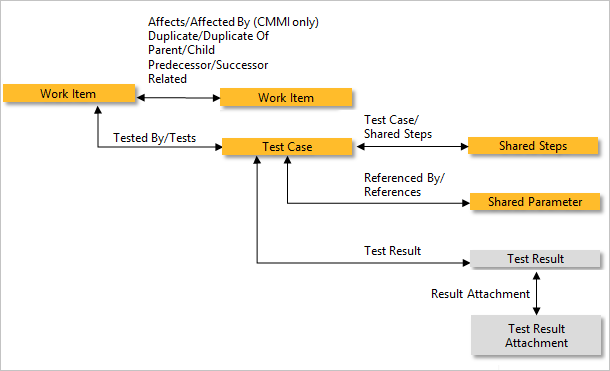
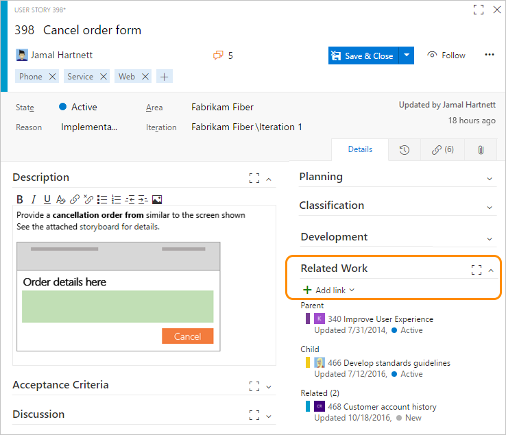
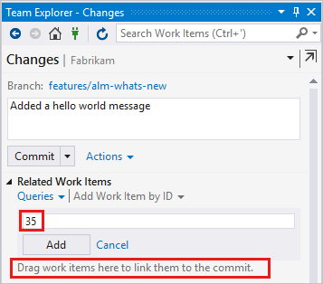
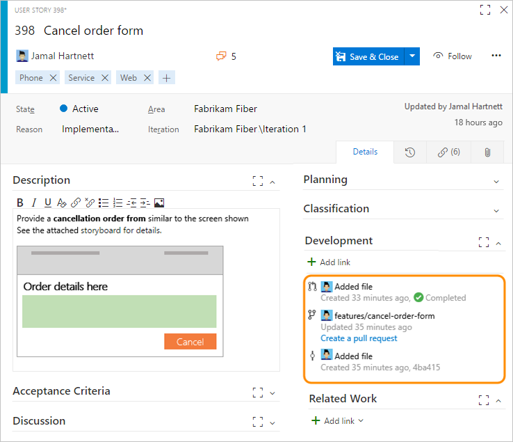

---
title: Link work items to support traceability in Azure Boards
titleSuffix: Azure Boards 
description: Learn how to support an auto trail of changes and enable quick navigation by linking work items together.
ms.service: azure-devops-boards
ms.custom: work-items, cross-project, cross-service, contperf-fy23, engagement-fy23
ms.assetid: eb47069f-e49b-424d-a674-91cb733f3518
ms.author: chcomley
author: chcomley
ms.topic: how-to
monikerRange: '<= azure-devops'
ms.date: 12/16/2022
--- 

# Use links to view dependencies and track related work 

[!INCLUDE [version-lt-eq-azure-devops](../../includes/version-lt-eq-azure-devops.md)]

By linking work items to other work items, you can track related work, view a hierarchy of work, view dependencies, and more. By linking work items to devops and other objects, you support an auto trail of changes and enable quick navigation to work items and linked objects.
 
Different link types are used to link to the various objects. For example, you can use *Parent/Child* links to support a hierarchical tree structure of work items. The *Commit* and *Branch* link types support links between work items and Git commits and branches, respectively.    

Link work items to support the following goals:  

- Track dependencies, related items, and work hierarchies 
- Track which work items are tested by test cases and test results  
- Support an audit trail of code changes and the work items they support
- Support end-to-end traceability 
- Share information by linking work items to a network share, storyboard, or document.

This article describes the link types available for your use. You can link objects from the web portal or Visual Studio Team Explorer. For details on linking work items and deleting links, see [Add link to work items](../backlogs/add-link.md). 

 
> [!TIP]
> You can set up automatic linking and other settings that link work items to Git commits, pull requests, builds, and more. To learn how, see the following resources:   
> - [Configure repositories and branches to integrate with work tracking](../../repos/git/configure-repos-work-tracking.md?toc=/azure/devops/boards/toc.json) 
> - [Configure pipelines to support work tracking](../../pipelines/integrations/configure-pipelines-work-tracking.md?toc=/azure/devops/boards/toc.json) 
> - [Drive Git development from a work item](../backlogs/connect-work-items-to-git-dev-ops.md)
> - [Link and view work items to builds and deployments](../work-items/work-item-deployments-control.md).

[!INCLUDE [temp](../includes/view-linked-objects.md)]

## Work items linked to work items

There are several system link types used to link work items to each other: two tree topology, one dependency topology, and one network. Tree topology links support nested hierarchies, tree queries, and several reports. Dependent links support tracking tasks that must be completed before others can be started. And, the **Related** link type supports connecting work items that are at the same level.

All two-way link types are characterized by a *Forward* and *Reverse* name, such as Parent/Child and Duplicate/Duplicate Of. When you link using one of these names, the linked work item is updated to include a link with the corresponding link type. For example, if you add a Parent link to a work item, the linked work item contains a Child link. 

As a quick reference guide, use the following link types as indicated: 

- Use the **Duplicate** link type when two work items have been created that essentially capture the same information; close one of the work items and keep the other one active  
- Use the **Parent/Child** link types when you want to break down work items into smaller items&mdash;for example, break down features into stories, or stories into tasks
- Use  **Predecessor-Successor** link types when you want to track tasks that must be completed before others can be started; this link type is most often used when you plan work using Project 
- Use the **Related** link type when the work items being linked are at the same level&mdash;such as two user stories that define features that overlap one another&mdash;or to link work items that are defined in different projects or managed by different teams.

For guidance on choosing link types, review the [Link type reference](link-type-reference.md) in the related notes section. 

You can create links from within a work item form, from a work item that appears in a list of query results, in Microsoft Excel, or in Microsoft Project. You can also use any of the client programs for Team Foundation, such as Team Explorer and the web portal, to create links or attach files.

Also, you can use the context menu in the web portal or Team Explorer.

> [!NOTE]
> For each work item, you can add a maximum of 1000 links to other work items.  

::: moniker range="azure-devops" 

## Cross-organization work item linking 

Organizations that use Azure Active Directory can link work items that exist in different projects across organizations. Use the following link types as indicated:

- Use the **Consumes From/Produces For** link types when you want to track dependencies of work items that are defined in different organizations and managed by different teams. 
- Use the **Remote Related** link type when the work items being linked are defined in different organizations and managed by different teams, but don't have strong inter-dependencies.

> [!div class="mx-imgBorder"]  
>   
::: moniker-end    

## Add a work item link 

You can create links between work items by using one of the links control tabs within a work item form. The user interface to link a work item differs based on the platform, version, and client you use. To link several work items to a new or existing item, see [Add link to work items](../backlogs/add-link.md). 

> [!NOTE]    
> Work item forms and features available to you can differ depending on whether you open the form from the web portal or Visual Studio Team Explorer. 

#### [Browser](#tab/browser/)

<a id="team-services-link" /> 

From the work item form, you can add a link using the **Related Work** section or from the **Links** tab.

Open a work item and choose **Add link** or the :::image type="icon" source="../media/icons/add-green-icon.png" border="false"::: plus icon to add a link. 

::: moniker range=">= azure-devops-2020"
:::image type="content" source="media/link-work-items-support-traceability/work-item-form-link-work-items.png" alt-text="Screenshot of work item form, Links tab, and Related work control.":::
::: moniker-end
::: moniker range="< azure-devops-2020"
 
::: moniker-end

Choose **Existing item** to link to a work item or other object using any supported link type. Choose **New item** to start a link and define a new work item at the same time. For more information, see [Add link to work items](../backlogs/add-link.md).

:::image type="content" source="media/link-work-items-support-traceability/related-work-menu.png" alt-text="Screenshot of Related work control, link menu options."::: 

From the **Related Work** or **Links** tab, you can also complete these actions: 

- [View the list of objects linked to the work item](#view-list-links)
- Open an associated item or object: choose the linked item  
- Delete a link: highlight it and choose the :::image type="icon" source="../media/icons/delete_icon.png" border="false"::: delete icon  

From a query results page, you can also complete these actions: 
- Link selected items to a new work item  
- Link selected items to an existing work item   

For more information, see [Add link to work items](../backlogs/add-link.md#link). 

#### [Visual Studio](#tab/visual-studio/)

<a id="team-explorer-link" />

If you primarily work in Visual Studio, and want to link work items, you can do so in many ways. Depending on the work item form and customizations that may have been made to your work item form, you may see several Link tabs. Link tabs can be customized to allow or restrict specific link types.  

Open a work item and choose the **Links** tab. From the links control tab you can link to new or existing work items, open the linked object, edit the link type, delete a link, or open the list of links in a query or Excel or Project.

  

The work item form opens in the web portal for Visual Studio 2017 and later versions. Work items aren't available from Visual Studio 2019 under the following conditions:   
* If you're connected to a GitHub or third-party Git repository. 
* If you're set to use the new Git Tool for Visual Studio 2019 as described in [Git experience in Visual Studio](/visualstudio/ide/git-with-visual-studio).  

* * *

## Parent-child work item links

These features let you quickly link or change links that use the parent-child link type:

-   To link backlog items to portfolio backlog items or to change the link structure among these items, [use the mapping pane to organize your backlog](../backlogs/organize-backlog.md).
-   To create and link tasks to backlog items, [use the sprint backlog page](../sprints/assign-work-sprint.md); from the web portal you can also drag-and-drop items to change the link structure. 
-   To indent (), outdent (), and change the link structure of a tree hierarchy, you can [re-parent and reorder items from a backlog in the web portal](../backlogs/organize-backlog.md) or use a [tree query in Team Explorer](using-queries.md#tree-query).

You can also use Excel to change the link structure. See [Bulk add or modify work items with Excel](../backlogs/office/bulk-add-modify-work-items-excel.md).

## Test work item links

Test related link types link test case management work items to one another, or to other work items. From the web portal or Microsoft Test Manager, you can view which test cases are defined for a test suite, and which test suites are defined for a test plan. However, these objects aren't linked to each other through link types.

You can link work items to test cases using the **Tested/Tested By** link types. You use the same link controls you use to link work items to other work items as [described earlier](#link-work-items). 

The following image shows the full set of link types used in linking test management work item types. most links between test management artifacts occur by executing a task from the **Test** pages or Microsoft Test Manager. 

  

For example, when you add Shared Steps to a Test Case, they are automatically linked using the **Test Case/Shared Steps** link types. See [Share steps between test cases](/previous-versions/azure/devops/test/mtm/share-steps-between-test-cases). 

:::image type="content" source="media/link-work-items-support-traceability/test-case-work-item-form.png" alt-text="Screenshot of test work item form showing steps.":::

:::image type="content" source="media/link-work-items-support-traceability/insert-shared-steps.png" alt-text="Screenshot of Insert Shared Steps dialog. ":::

From **Test** you can add test plans, test suites, and test cases&mdash;which are linked, but not through a specific link type. Also, the test system creates and manages the associations of test results to test cases and test plans. 

## Work items linked to code artifacts and build and release pipelines 

As you develop your software, you can capture which code changes and builds support the completion of a work item. In this way, your team can understand what work was done or how a bug was fixed through the audit trail of changes to the code base.  

::: moniker range=">= azure-devops-2019"
The link types used to construct these links&mdash;as illustrated in the following image&mdash;are: Branch, Build, Changeset, Commit, Found in build, Integrated in build, Pull Request, Versioned Item, and Integrated in release environment. 

:::image type="content" source="media/link-type-reference/conceptual-link-types-devops-objects.png" alt-text="Conceptual image of devops link types.":::
::: moniker-end

::: moniker range="tfs-2018"
The link types used to construct these links&mdash;as illustrated in the following image&mdash;are: Branch, Build, Changeset, Commit, Pull Request, and Versioned Item. 

  

To learn more about the links control or to customize the Development links control, see [LinksControlOptions elements, Development links control](/previous-versions/azure/devops/reference/xml/linkscontroloptions-xml-elements#development-links-control?view=tfs-2017&preserve-view=true). 

::: moniker-end

You can add a link from the work item to the supported artifacts using the method [described earlier for linking work items](#link-work-items). However, an easier method is to add the work item ID to a commit, pull request, changeset, or other supported Git or TFVC operation at the time you create those items. Also, you can link work items from the **Development** control within the work item form as described in [Work items linked to Git code development](#git-code-development). 

::: moniker range=">= azure-devops-2019"
See the following articles for more information: 
::: moniker-end

::: moniker range=">= azure-devops-2020"
- [Configure repositories and branches to integrate with work tracking](../../repos/git/configure-repos-work-tracking.md?toc=/azure/devops/boards/toc.json) 
- [Configure pipelines to support work tracking](../../pipelines/integrations/configure-pipelines-work-tracking.md?toc=/azure/devops/boards/toc.json) 
- [Drive Git development from a work item](../backlogs/connect-work-items-to-git-dev-ops.md)
- [Link and view work items to builds and deployments](../work-items/work-item-deployments-control.md)
- [Link to work items from pull requests, commits, and comments](../../organizations/notifications/add-links-to-work-items.md#link-wit-id)
- [Auto complete work items with pull requests](../work-items/auto-complete-work-items-pull-requests.md).
::: moniker-end

::: moniker range="azure-devops-2019"
- [Configure repositories and branches to integrate with work tracking](../../repos/git/configure-repos-work-tracking.md?toc=/azure/devops/boards/toc.json) 
- [Configure pipelines to support work tracking](../../pipelines/integrations/configure-pipelines-work-tracking.md?toc=/azure/devops/boards/toc.json) 
- [Drive Git development from a work item](../backlogs/connect-work-items-to-git-dev-ops.md)
- [Link to work items from pull requests, commits, and comments](../../organizations/notifications/add-links-to-work-items.md#link-wit-id)
- [Auto complete work items with pull requests](../work-items/auto-complete-work-items-pull-requests.md).
::: moniker-end

<a id="git-code-development" /> 

## Work items linked to Git code development  

The recommended method is to drive development from the work item or add the work item ID when creating branches, commits, and pull requests. 

Git lets you link work items to commits by using the **Commit** link type. You can do this in several ways:

- In Visual Studio Team Explorer, add work item IDs before you commit your changes  
      
- You can use the [git-commit](https://git-scm.com/docs/git-commit) command and include the work item ID in your comment. For example, you apply this comment #35 Catch null exception to your commit. When you push the commit, the system creates a Commit link between the commit and work item #35. 
- And, with the **Development** control, you can [drive your git development from the work item](../backlogs/connect-work-items-to-git-dev-ops.md) as shown in the following image.  

::: moniker range=">= azure-devops-2020"  
:::image type="content" source="../backlogs/media/git/development-control.png" alt-text="Screenshot of work item form, Development control.":::
::: moniker-end

::: moniker range="azure-devops-2019"  
:::image type="content" source="../backlogs/media/git/development-control-2019.png" alt-text="Screenshot of work item form, Development control, Azure DevOps Server 2019.":::
::: moniker-end

::: moniker range="tfs-2018"  
  
::: moniker-end

::: moniker range=">= azure-devops-2019" 

<a id="link-github" />

## Work items linked to GitHub artifacts    

By connecting Azure Boards with GitHub repositories, you enable linking between GitHub commits and pull requests to work items. You can use GitHub for software development while using Azure Boards to plan and track your work. 

::: moniker-end 

::: moniker range=">= azure-devops-2020"

The link types supported include **GitHub Commit**, **GitHub Issue**, and **GitHub Pull Request**.

::: moniker-end

::: moniker range="azure-devops-2019"

The link types supported include **GitHub Commit** and **GitHub Pull Request**.

::: moniker-end

::: moniker range=">= azure-devops-2019"
> [!IMPORTANT]  
> You can only link to GitHub artifacts whose repositories you have connected to Azure Boards. To create that connection, see [Connect Azure Boards to GitHub](../github/connect-to-github.md). To learn more about linking to GitHub artifacts, see [Link GitHub commits, pull requests, and issues to work items](../github/link-to-from-github.md).

::: moniker-end

## Work items linked to TFVC code development  

Team Foundation version control (TFVC) lets you link work items to version control changesets or versioned source code files by using the **Changeset** and **Versioned Item** link types. When you check in pending changes or use My Work to check in changes, [work items are automatically linked to your changes](../../repos/tfvc/check-your-work-team-codebase.md).

  

## Work items linked to a Web site, network share, storyboard, or document 

You can use the Hyperlinks or Storyboard link type to link a work item to a Web site, network share, or document located on a network share. Both of these link types are one-way links. To add links of this type, you can use the same links controls [described earlier for linking work items](#link-work-items). 

  

By using the Storyboard link type, you differentiate the link you're adding to specify a storyboard or document that provides work item specifications. Use this link type to provide your team access to the shared file where they can add their comments. 

## Query for linked work items 

To filter items based on hierarchical links, use the **Tree of work items** query type. To filter items based on all link types, use **Work items and direct links**. 

You can search for work items that not only meet criteria for field values but also that are linked to other work items with specific types of links. This kind of query displays a primary set of work items, which meet the field criteria, and a secondary set, which is linked to items in the primary set.

For query examples, see [Link and attachment queries](linking-attachments.md).

> [!NOTE]  
> You can't construct a query that shows a hierarchical view of Test Plans, Test Suites, and Test Cases. These items aren't linked together using Parent/Child or any other link type. You can only view the hierarchy through the [**Test>Test Plans** page](../../test/create-a-test-plan.md). 

## Related articles 

You should now have a broad understanding of the various link relationships you can create to track dependencies and create an audit trail for your code development.

Once you've formed a link relationship, you can't edit the link type of that relationship from the web portal, but you can do it from Team Explorer. 

For more information, see these articles: 

- [Add link to multiple work items](../backlogs/add-link.md)  
- [Track dependencies using Delivery Plans](../plans/track-dependencies.md)
- [Use mapping to link backlog items to features and epics](../backlogs/organize-backlog.md)
- [Bulk modify links using Excel](../backlogs/office/bulk-add-modify-work-items-excel.md)
- [Link types reference](link-type-reference.md)

### Visualize related work and other objects 

You can view related work items and object within a work item form by installing the [Work item visualization extension](https://marketplace.visualstudio.com/items?itemName=ms-devlabs.WorkItemVisualization) available from the Visual Studio Marketplace, Azure DevOps tab. 
