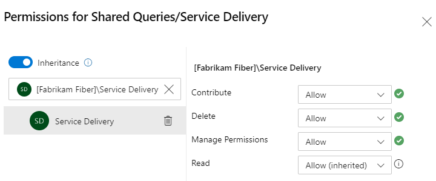
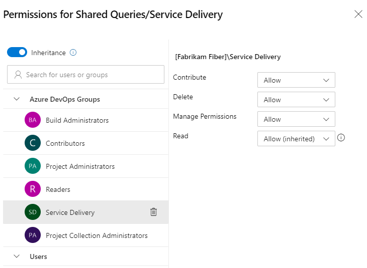
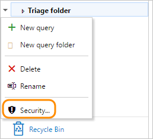
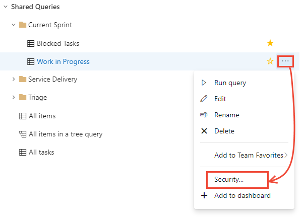

# Set permissions on queries and query folders in Azure Boards and Azure DevOps

[!INCLUDE [temp](../includes/version-all.md)]

As with most project objects, you can control access by setting permissions. With queries, you can configure users and groups to create, delete, view, and manage permissions of shared queries and shared query folders. 

All users, except those users assigned to the Readers group, can create and edit their own queries and save them under **My Queries**. Only the signed in user can view queries saved under their **My Queries** space.

By default, only members of the Project Administrators group can create and edit queries and folders under **Shared Queries**, or change the permissions for a query or folder. 

By creating folders under Shared Queries, you can grant permissions to users for each folder. For example, if you have several teams contributing to a project, then you might want to create a folder under Shared Queries for each team to manage their own set of shared queries.  

## Prerequisites

- To create or edit a shared query or manage permissions, you must be a member of the Project Collection Administrators or Project Administrators groups with **Basic** or higher access level. 
- Or, to create a query or folder under a shared query folder, you must have the **Contribute** permission set explicitly to **Allow**  and be granted **Basic** or higher access level. 
- Or, to change permissions of a query or query folder, you must have the **Manage Permissions** permission set explicitly to **Allow** and be granted **Basic** or higher access level. 

Users with Stakeholder access can't create or save queries in a Shared folder. To learn more about access levels, see [Stakeholder access quick reference](../../organizations/security/stakeholder-access.md). 

> [!TIP]    
> Consider creating a query folder for each team and give the team administrators or the team group query permissions to manage their folder. 

## Default query permissions

A ✔️ in the following table indicates that the corresponding access level or security group has access to a feature by default. 

[!INCLUDE [temp](../../organizations/security/includes/boards-queries.md)]

## Set permissions on a new query folder

You set permissions from the web portal. To open **Queries**, see [View, run, or email a query](view-run-query.md).

If you're not a member of the project administrators group, [get added](../../organizations/security/set-project-collection-level-permissions.md), or have your **Contribute** permission set to **Allow** for the Shared query folder.  

> [!TIP]   
> You need **Delete** permissions to rename or move a shared query or folder, and **Contribute** permissions for the folder where you move the query to.

::: moniker range=">= azure-devops-2020"

1. Choose **All**. Expand **Shared Queries**. 
 
1. To add a folder, choose the  :::image type="icon" source="../media/icons/actions-icon.png" border="false"::: actions icon for an existing folder or the top container folder, and choose **New folder**. 

	> [!div class="mx-imgBorder"]  
	> 

2. Enter the name for the folder. If you want to change the location of the folder, select **Rename** from the folder drop-down menu.  

	Here we name the folder *Service Delivery* with the intention that it will be used by the Service Delivery team.

	> [!div class="mx-imgBorder"]  
	> 

3. To set permissions for the folder you just added, choose the  :::image type="icon" source="../media/icons/actions-icon.png" border="false"::: actions icon and select **Security**.

4. Change the permissions so that the team member or group can contribute and manage permissions for the folder. Enter the name of a user or group within the search box.   

   Here we add the Service Delivery team and grant them permissions to create and manage permissions to all queries and folders under the Service Delivery folder.  

   > [!div class="mx-imgBorder"]  
   >  

   **Contribute** allows team members to create and edit queries and folders under the folder where the permissions were granted. And, **Manage Permissions** allows team members to manage the permission settings on queries and subfolders.

5. (Optional) Turn off inheritance. Default is **On**. By turning off inheritance for a folder, you disallow inheritance of permissions that exist up the chain of query folders. To learn more, see [Permissions, Inheritance](../../organizations/security/about-permissions.md#inheritance).  

6. Close the dialog when done.

7. Reopen the Security dialog and choose Service Delivery to verify that the permissions are set. 

   > [!div class="mx-imgBorder"]  
   >  
  
::: moniker-end

::: moniker range="azure-devops-2019"

1. Choose **All**. Expand **Shared Queries**. 
 
1. To add a folder, choose the  :::image type="icon" source="../media/icons/actions-icon.png" border="false"::: actions icon for an existing folder or the top container folder, and choose **New folder**. 

	> [!div class="mx-imgBorder"]  
	> 

2. Enter the name for the folder. If you want to change the location of the folder, select it from the Folder drop down menu.  

	Here we name the folder *Service Delivery* with the intention that it will be used by the Service Delivery team.

	> [!div class="mx-imgBorder"]  
	> 

3. To set permissions for the folder you just added, choose the  :::image type="icon" source="../media/icons/actions-icon.png" border="false"::: actions icon and select **Security**.

4. Change the permissions so that the team member or group can contribute and manage permissions for the folder. Choose the **Add...** menu to add a user identity or group. 

   Here we add the Service Delivery team and grant them permissions to create and manage permissions to all queries and folders under the Service Delivery folder.  

   > [!div class="mx-imgBorder"]  
   >  

   **Contribute** allows team members to create and edit queries and folders under the folder where the permissions were granted. And, **Manage Permissions** allows team members to manage the permission settings on queries and subfolders.

5. (Optional) Turn off inheritance. Default is **On**. By turning off inheritance for a folder, you disallow inheritance of permissions that exist up the chain of query folders. To learn more, see [Permissions, Inheritance](../../organizations/security/about-permissions.md#inheritance).  
  
::: moniker-end

::: moniker range="<= tfs-2018"

1. Add a query folder under **Shared queries** or a subfolder. Choose the :::image type="icon" source="../media/icons/context_menu.png" border="false"::: context menu icon for the folder and choose **New query folder**.  

	  

1. To set permissions for the folder, choose the :::image type="icon" source="../media/icons/context_menu.png" border="false"::: context menu icon for the folder you just added and choose **Security**.

   

2. Change the permissions so that the team member or group can contribute and manage permissions for the folder.  

   Here we add the Web team and grant them permissions to create and manage permissions to all queries and folders under the Triage folder.  

       

   Choose the **Add...** menu to add a user identity or group.

   **Contribute** allows team members to create and edit queries and folders under the folder where the permissions were granted. And, **Manage Permissions** allows team members to manage the permission settings on queries and subfolders.

3. (Optional) Turn off inheritance. Default is On. By turning off inheritance for a folder, you disallow inheritance of permissions that exist up the chain of query folders. To learn more, see [Permissions, Inheritance](../../organizations/security/about-permissions.md#inheritance).  

::: moniker-end

## Set permissions on a shared query 

To keep anyone else from modifying a shared query that you create, you may want to set permissions on a specific query. You can set permissions by opening the permissions dialog for the specific query.  

::: moniker range=">= azure-devops-2019"

1. Choose  the  :::image type="icon" source="../media/icons/actions-icon.png" border="false"::: actions icon and select **Security**.  

   > [!div class="mx-imgBorder"]  
   > 

1. Change the permissions so that the team member or group can't edit, delete, or change permissions for the query.  

   Here we deny permissions for project admins.  

   > [!div class="mx-imgBorder"]  
   > 

::: moniker-end

::: moniker range="<= tfs-2018"

1. Choose the :::image type="icon" source="../media/icons/context_menu.png" border="false"::: context menu icon and select **Security**. 

   

1. Change the permissions so that the team member or group can't edit, delete, or change permissions for the query.  

   Here we deny permissions for project admins.  

   

::: moniker-end
 

## Related articles  

With queries, you cannot only list work items, you can create status and trend charts and add them to dashboards. You can learn more about permissions and working with queries from these resources: 

- [Manage queries and query folders](organize-queries.md)  
- [Permissions and access for work tracking](../../organizations/security/permissions-access-work-tracking.md)  
- [Add a chart to a dashboard](../../report/dashboards/add-charts-to-dashboard.md)
- [Dashboards](../../report/dashboards/dashboards.md) 