# Add tasks to backlog items to support sprint planning

[!INCLUDE [temp](../includes/version-all.md)] 

Add tasks to backlog items when you want to track the work required to implement those tasks. You can also use tasks to estimate work that is assigned to individual team members and the team. The capacity tool tells you how much work your team can commit to. However, to compare capacity with planned work, you need to define and estimate tasks for each backlog item.

In this article you'll learn how to:  

> [!div class="checklist"]
> * Select a sprint backlog for a team
> * Add tasks to backlog items from the sprint backlog or taskboard
> * Estimate work, set *Remaining Work*  

<!---Address how to parent unparented items --> 

Add as many tasks as needed to capture the work required to complete each item. Tasks can represent different work to be completed, such as design, code, test, content, or sign out. Usually, each team member adds their own tasks and sets estimates for the work. However, a development lead could define the initial tasks for a story or requirement.

[!INCLUDE [temp](../includes/prerequisites.md)]

## Open a sprint backlog for a team 

::: moniker range=">= azure-devops-2020"

1. From your web browser, open your team's sprint backlog. (1) Check that you've selected the right project, (2) choose **Boards>Sprints**, (3) select the correct team from the team selector menu, and lastly (4), choose **Backlog**. 

    > [!div class="mx-imgBorder"]  
    > 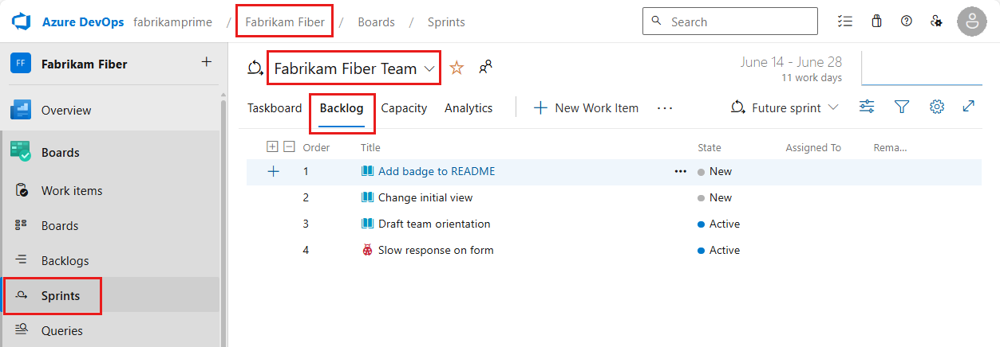

    To choose another team, open the selector and select a different team or choose the :::image type="icon" source="../../media/icons/home-icon.png" border="false"::: **Browse all sprints** option. Or, you can enter a keyword in the search box to filter the list of team backlogs for the project.

    > [!div class="mx-imgBorder"]  
    >  

2. To choose a different sprint than the one shown, open the sprint selector and choose the sprint you want. 

    > [!div class="mx-imgBorder"]  
    > 

    The system lists only those sprints that have been selected for the current team focus. If you don't see the sprints you want listed, then choose **New Sprint** from the menu, and then choose **Select existing iteration**. For details, see [Define iteration (sprint) paths](../../organizations/settings/set-iteration-paths-sprints.md). 

::: moniker-end

::: moniker range="azure-devops-2019"

1. From your web browser, open your team's sprint backlog. (1) Check that you've selected the right project, (2) choose **Boards>Sprints**, (3) select the correct team from the team selector menu, and lastly (4), choose **Backlog**. 

    

    To choose another team, open the selector and select a different team or choose the :::image type="icon" source="../../media/icons/home-icon.png" border="false"::: **Browse all sprints** option. Or, you can enter a keyword in the search box to filter the list of team backlogs for the project.

    > [!div class="mx-imgBorder"]  
    >  

2. To choose a different sprint than the one shown, open the sprint selector and choose the sprint you want. 

    > [!div class="mx-imgBorder"]  
    > 

    The system lists only those sprints that have been selected for the current team focus. If you don't see the sprints you want listed, then choose **New Sprint** from the menu, and then choose **Select existing iteration**. For details, see [Define iteration (sprint) paths](../../organizations/settings/set-iteration-paths-sprints.md). 

::: moniker-end

::: moniker range=">= tfs-2013 <= tfs-2018"

1. From your web browser, open your team's sprint backlog. (1) Select the team from the project/team selector, choose (2) **Work**, (3) **Backlogs**, and then (4) the product backlog, which is **Backlog items** (for Scrum), **Stories** (for Agile), or **Requirements** (for CMMI). 

	> [!div class="mx-imgBorder"]
	>  

	To choose another team, open the project/team selector and select a different team or choose the **Browse** option. 

	> [!div class="mx-imgBorder"]  
	>  

	The set of sprints selected for your team appears in the left pane. If you don't see any sprints listed, you can add sprints or select existing sprints for your team's use. To learn how, see [Define sprints](define-sprints.md). 

1. Choose the sprint you want to plan. 

	> [!div class="mx-imgBorder"]  
	> 

	The system lists only those sprints that have been selected for the current team focus. If you don't see the sprints you want listed, then see [Define iteration (sprint) paths](../../organizations/settings/set-iteration-paths-sprints.md). 

::: moniker-end

## Add existing work items to a sprint

If you haven't yet assigned work items to a sprint, see [1. Assign backlog items to a sprint](assign-work-sprint.md).

If you have added work items and they don't appear in your sprint backlog, check their area and iteration paths. 
- The Area Path must match one of the areas assigned to the team
- The Iteration Path must match the iteration of the sprint that you've selected. 

For details on assigning iteration paths to teams, see [Define Iteration Paths and configure team iterations](../../organizations/settings/set-iteration-paths-sprints.md). 
 
If you have added task work items, but they don't appear as a child of a product backlog item, you can parent them from the sprint backlog.  

Unparented tasks assigned to the selected sprint appear at the top of the backlog under the Unparented group. Drag and drop the task on top of the work item you want to parent it to. 

> [!div class="mx-imgBorder"]
> 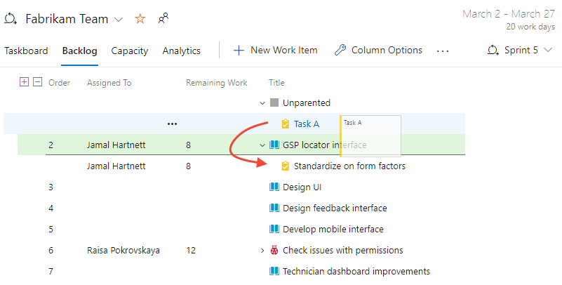

<a id="define-tasks" />

## Add tasks to backlog items

If you haven't yet assigned backlog items to your sprint, [do that now](assign-work-sprint.md). Also, you'll want to have [set the start and end dates for your sprint](define-sprints.md#quick-start-schedule). 

For each sprint backlog item, add a task. Adding tasks from the sprint backlog or board automatically links the task to its parent backlog item. 

> [!TIP]    
> You can quickly add several tasks on the taskboard by simply entering a title. You can then later bulk edit items to assign them or add additional details. You can also enter *Remaining Work* onto the card by making sure you [add that field to display on the taskboard](customize-taskboard.md). 

::: moniker range=">= azure-devops-2019"

You can add tasks from the sprint **Backlog** or **Taskboard**. 

From the **Backlog** view, choose the plus sign to open the work item form for a task.

> [!div class="mx-imgBorder"]
> 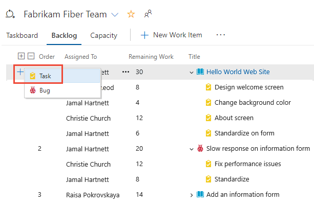

Fill out the form as described in the next section. 

Another option, is to open the **Taskboard**, and add tasks as cards. Select the :::image type="icon" source="../../media/icons/add-icon.png" border="false"::: plus icon, enter a title for the item, and then press Enter on your keyboard.   

> [!div class="mx-imgBorder"]
> 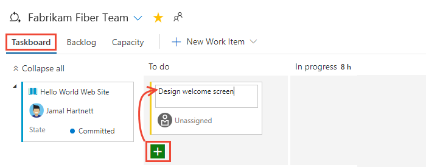

> [!TIP]    
> You can quickly add tasks through the **Taskboard** by just specifying the title of the work item. To show fields on the card, see [Customize a sprint Taskboard](customize-taskboard.md).   

::: moniker-end

::: moniker range=">= tfs-2013 <= tfs-2018"

You can add tasks from the sprint **Backlog** or **Taskboard**. 

From the **Backlog** view, choose the :::image type="icon" source="../../media/icons/blue-add-icon.png" border="false"::: plus icon to add a new task.  

> [!div class="mx-imgBorder"]
> 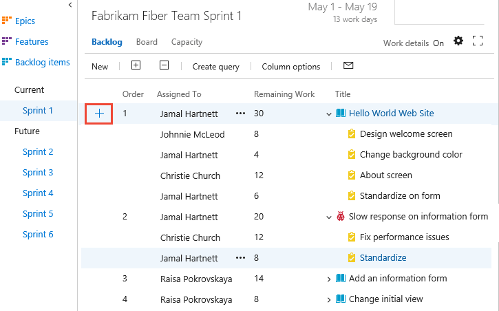

Fill out the form as described in the next section. 

Another option, is to open **Taskboard**, and add tasks as cards. Select the :::image type="icon" source="../../media/icons/add-icon.png" border="false"::: plus icon, enter a title for the item, and then press Enter on your keyboard.    

> [!div class="mx-imgBorder"]
> 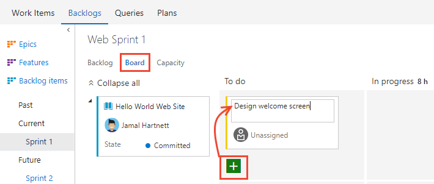

> [!TIP]    
> You can quickly add tasks by just specifying the title of the work item. To show fields on the card, see [Customize a sprint Taskboard](customize-taskboard.md).  

::: moniker-end

To interactively filter sprint views, choose **Filter** :::image type="icon" source="../../media/icons/filter-icon.png" border="false":::, and then specify a keyword or select a value for a field or tag. To learn more, see [Interactively filter backlogs, boards, queries, and plans](../backlogs/filter-backlogs-boards-plans.md).

## Fill out the task form 

Name the task and enter an estimate for *Remaining Work*. Also, if you know who will do the work, go ahead and assign the task to that team member.  

::: moniker range=">= azure-devops-2019"
> [!div class="mx-imgBorder"]  
> 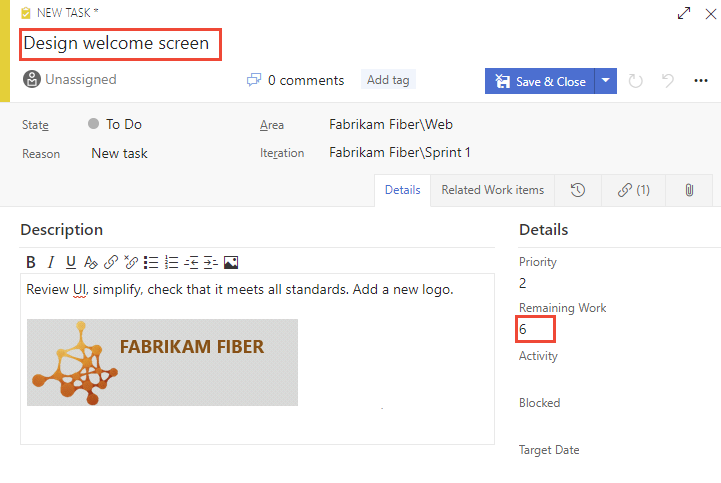
::: moniker-end 

::: moniker range=">= tfs-2017 <= tfs-2018"
<a id="task-form-team-services" /> 
<!--- Task form, new form -->
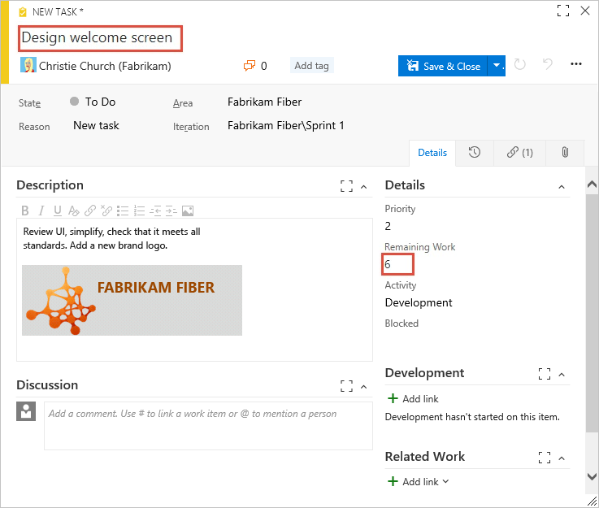  
::: moniker-end

::: moniker range=">= tfs-2013 <= tfs-2015"

<a id="task-form-tfs-2015-13" /> 

<!--- Task form, old form -->

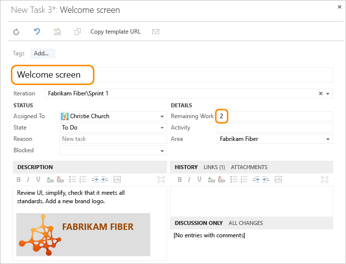  	

::: moniker-end

At the planning stage, *Remaining Work* corresponds to an estimate of how long it will take to complete the task.  

A good rule of thumb is to size tasks to take no more than a day to complete. If a task is too large, the team should break it down. In some cases, you might not estimate some tasks effectively until other tasks have been completed. Create the task now, but estimate it when you have enough information.  

During the sprint, team members update remaining work to continually reflect the time required to complete the task. This value can actually increase after work begins. For example, after working 4 hours on a task that was estimated to take 8 hours, you realize you need 16 hours over what you estimated. You would update the *Remaining Work* field with 20 (8-4+16).  As you complete a task, you might find that more time is required. Always update the task with your best estimate of remaining work. That way, you help accurately reflect the total amount of work remaining in the sprint.  

:::row:::
   :::column span="1":::
   **Field**
   :::column-end:::
   :::column span="3":::
   **Usage**
   :::column-end:::
:::row-end:::

:::row:::
   :::column span="1":::
   [Original Estimate](../queries/query-numeric.md)

   :::column-end:::
   :::column span="3":::
   The amount of approximate work required to complete a task. Typically, this field doesn&#39;t change after it's assigned.

   You can specify work in hours or in days. There are no inherent time units associated with this field.

   :::column-end:::
:::row-end:::
:::row:::
   :::column span="1":::
   [Remaining Work](../queries/query-numeric.md)

   :::column-end:::
   :::column span="3":::
   The amount of work remaining to complete a task. As work progresses, update this field. It's used to calculate [capacity charts](set-capacity.md) and the [sprint burndown chart](../../report/dashboards/configure-sprint-burndown.md). You can specify work in any unit of measurement your team chooses.

   :::column-end:::
:::row-end:::
:::row:::
   :::column span="1":::
   [Completed Work](../queries/query-numeric.md) 

   :::column-end:::
   :::column span="3":::
   The amount of work spent implementing a task.

   :::column-end:::
:::row-end:::
:::row:::
   :::column span="1":::
   [Activity](../queries/query-numeric.md) 

   :::column-end:::
   :::column span="3":::
   Select the type of activity this task represents when your team plans sprint capacity by activity.

   :::column-end:::
:::row-end:::

## Unparented tasks

Tasks without links to parent backlog items or user stories appear at the top of the taskboard. You can track unparented tasks in similar ways to other tasks. You can also drag them to an existing backlog item to parent them. The unparented card tracks the total of remaining work defined for all unparented tasks. However, it isn't associated with any work item.

::: moniker range=">= azure-devops-2019"
> [!div class="mx-imgBorder"]  
> 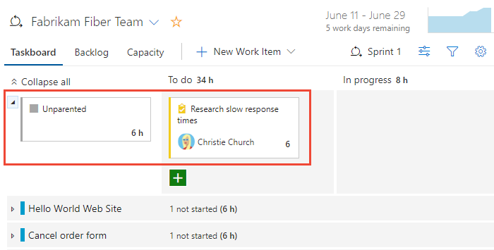 
::: moniker-end

::: moniker range=">= tfs-2013 <= tfs-2018"

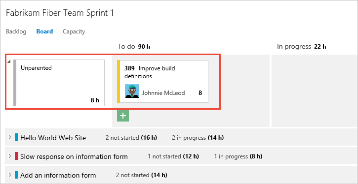

::: moniker-end

## Next step

> [!div class="nextstepaction"]
> [3. Set sprint capacity](set-capacity.md) 

## Related articles

- [Assign backlog items to a sprint](assign-work-sprint.md)  
- [Setup your Backlogs & Boards](../backlogs/set-up-your-backlog.md)  
- [Define iteration (sprint) paths and configure team iterations](../../organizations/settings/set-iteration-paths-sprints.md)   
- [Interactively filter backlogs, boards, queries, and plans](../backlogs/filter-backlogs-boards-plans.md)
